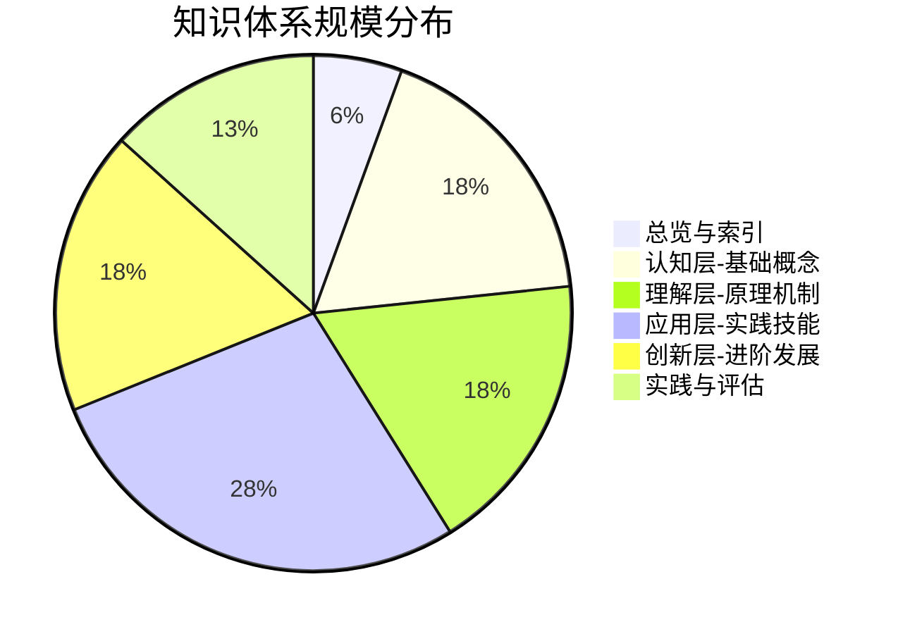
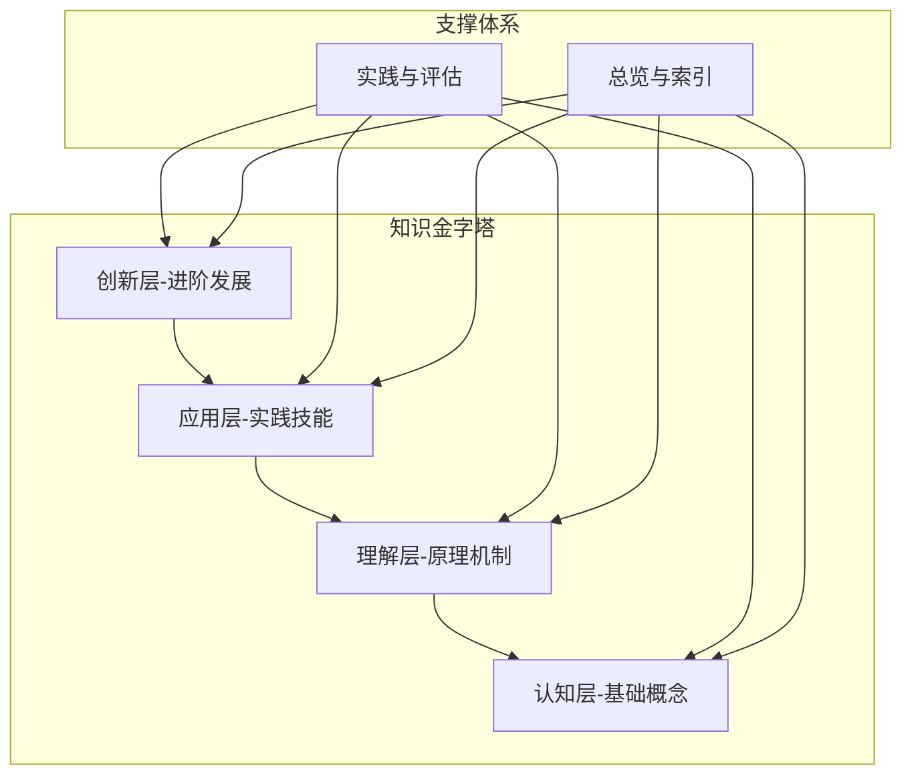
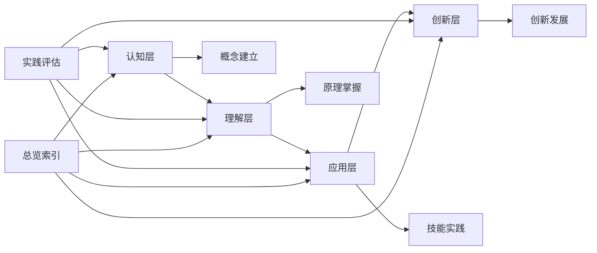
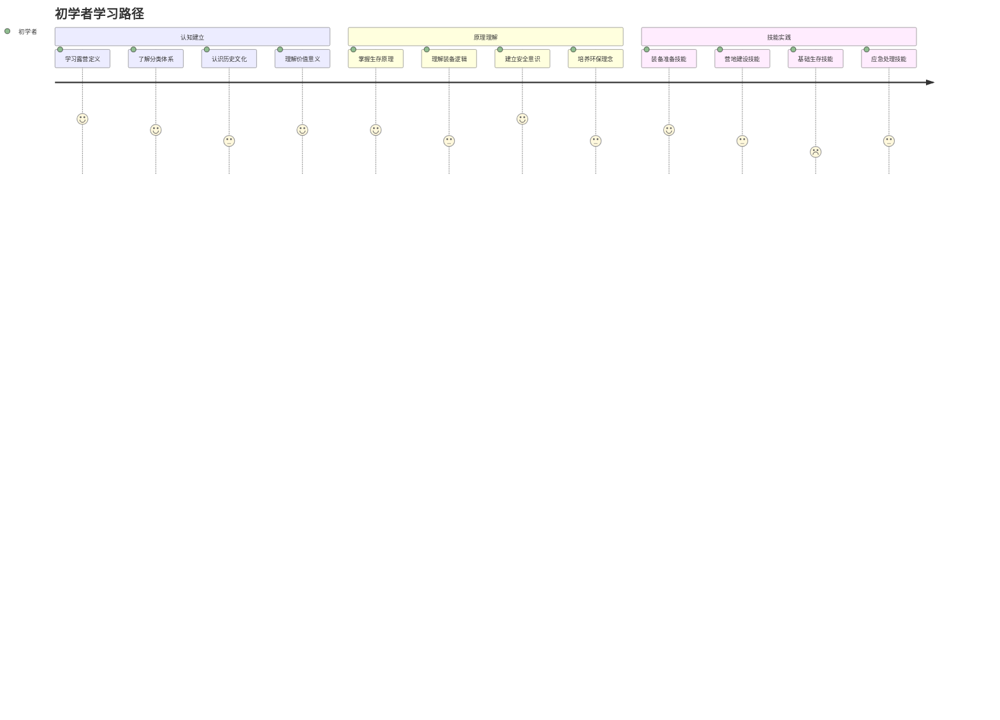
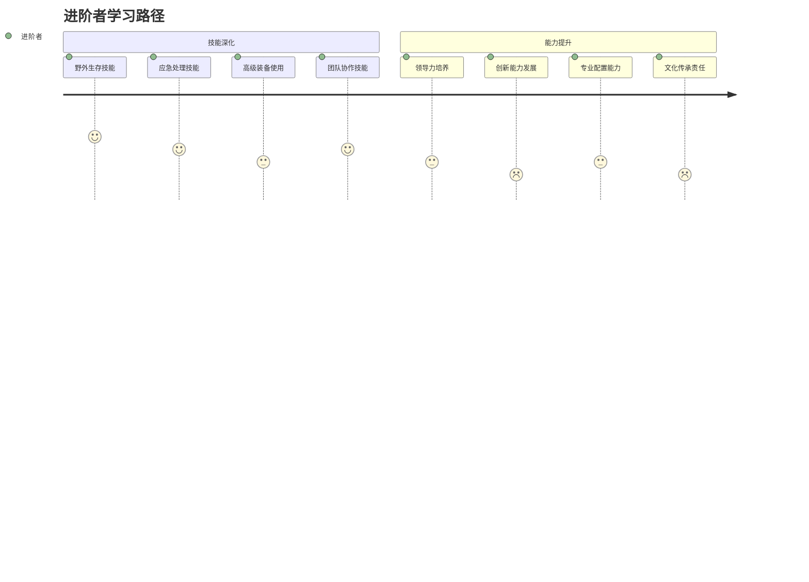

# 🏕️ 露营知识体系 - 完整总结

## 🎯 知识体系概览

### 体系规模统计

### 文件数量统计
| 知识层次 | 子模块数 | 文件总数 | 核心文件 | 特色功能 |
|----------|----------|----------|----------|----------|
| **总览与索引** | 5个 | 5个 | 知识地图、学习路径 | 导航系统 |
| **认知层** | 4个 | 16个 | 露营定义、分类体系 | 概念建立 |
| **理解层** | 4个 | 16个 | 生存原理、安全机制 | 原理掌握 |
| **应用层** | 4个 | 25个 | 装备准备、野外生存 | 技能实践 |
| **创新层** | 4个 | 16个 | 高级技巧、领导力 | 创新发展 |
| **实践评估** | 3个 | 12个 | 评估体系、持续改进 | 质量保证 |
| **总计** | 24个 | **90个** | 核心文件40个 | 完整体系 |

## 🏗️ 知识体系架构

### 四层递进结构

### 知识连接网络

## 📚 核心知识模块

### 01-认知层-基础概念（16个文件）
| 子模块 | 文件数量 | 核心内容 | 学习重点 | 实践应用 |
|--------|----------|----------|----------|----------|
| **露营概述** | 4个 | 定义内涵、基本要素、活动对比、核心理念 | 概念建立 | 活动选择 |
| **露营分类** | 4个 | 环境分类、方式分类、目的分类、难度分类 | 分类理解 | 类型选择 |
| **历史与文化** | 4个 | 历史发展、各国文化、名人故事、现代趋势 | 文化认知 | 文化传承 |
| **价值与意义** | 4个 | 身心健康、技能培养、社交建设、环保意识 | 价值认识 | 价值实现 |

### 02-理解层-原理机制（16个文件）
| 子模块 | 文件数量 | 核心内容 | 学习重点 | 实践应用 |
|--------|----------|----------|----------|----------|
| **户外生存原理** | 4个 | 人体适应、环境因素、能量消耗、心理适应 | 原理掌握 | 生存策略 |
| **装备选择原理** | 4个 | 功能分类、材质性能、重量便携、性价比 | 选择逻辑 | 装备配置 |
| **安全防护机制** | 4个 | 风险评估、安全原则、预防措施、应急响应 | 安全意识 | 安全实践 |
| **环境保护理念** | 4个 | 生态影响、可持续露营、无痕山林、环保教育 | 环保理念 | 环保实践 |

### 03-应用层-实践技能（25个文件）
| 子模块 | 文件数量 | 核心内容 | 学习重点 | 实践应用 |
|--------|----------|----------|----------|----------|
| **装备准备** | 7个 | 基础装备、服装选择、帐篷搭建、炊具使用、照明电源、工具维修、季节性调整 | 装备技能 | 装备实践 |
| **营地建设** | 7个 | 营地选址、帐篷搭建、篝火管理、营地布局、食物储存、卫生设施、营地拆除 | 建设技能 | 营地实践 |
| **野外生存** | 7个 | 方向识别、水源净化、食物获取、生火技术、高海拔适应、信号求救、跨学科整合 | 生存技能 | 生存实践 |
| **应急处理** | 7个 | 伤病处理、天气应对、应急通讯、安全撤离、迷路自救、装备故障、紧急撤离 | 应急技能 | 应急实践 |

### 04-创新层-进阶发展（16个文件）
| 子模块 | 文件数量 | 核心内容 | 学习重点 | 实践应用 |
|--------|----------|----------|----------|----------|
| **高级技巧** | 4个 | 技巧概述、极端环境、长期生存、专业导航、高级装备、团队协作、领导力实践 | 高级技能 | 创新发展 |
| **专业配置** | 4个 | 配置概述、定制化配置、技术集成、维护体系、升级优化、成本效益 | 专业能力 | 专业发展 |
| **领导力培养** | 4个 | 领导力概述、团队管理、决策制定、危机处理、沟通协调、培训指导、责任担当 | 领导能力 | 领导实践 |
| **文化传承** | 4个 | 文化概述、文化推广、新手指导、社区建设、知识分享、环保传播、传统保护 | 文化责任 | 文化传承 |

### 05-实践与评估（12个文件）
| 子模块 | 文件数量 | 核心内容 | 学习重点 | 实践应用 |
|--------|----------|----------|----------|----------|
| **技能评估体系** | 4个 | 自我评估、技能等级、实践项目、认证考核 | 评估能力 | 质量保证 |
| **案例研究** | 4个 | 成功案例、失败案例、特殊环境、团队协作 | 案例分析 | 经验学习 |
| **持续改进** | 4个 | 学习反思、技能更新、经验总结、体系维护 | 改进能力 | 持续发展 |

## 🎓 学习体系特色

### 费曼学习法应用
| 学习阶段 | 应用方法 | 具体实践 | 学习效果 | 改进建议 |
|----------|----------|----------|----------|----------|
| **概念选择** | 选择核心概念 | 从基础概念开始 | 概念清晰 | 系统选择 |
| **教授他人** | 用简单语言解释 | 向朋友解释概念 | 理解深入 | 多角度解释 |
| **回顾简化** | 识别知识盲点 | 重新学习薄弱环节 | 知识巩固 | 持续回顾 |
| **组织优化** | 建立知识连接 | 形成完整体系 | 体系完整 | 深度连接 |

### 刻意练习策略
| 练习类型 | 练习方法 | 练习频率 | 练习效果 | 改进建议 |
|----------|----------|----------|----------|----------|
| **技能分解** | 分解复杂技能 | 每日练习 | 技能熟练 | 系统分解 |
| **重复练习** | 重复练习技能 | 每周练习 | 技能巩固 | 质量优先 |
| **反馈修正** | 获得练习反馈 | 每次练习 | 技能提升 | 及时反馈 |
| **逐步提升** | 逐步增加难度 | 每月提升 | 技能进阶 | 循序渐进 |

### 知识连接网络
| 连接类型 | 连接内容 | 连接方法 | 连接效果 | 维护建议 |
|----------|----------|----------|----------|----------|
| **纵向连接** | 四层递进关系 | 层次连接 | 体系完整 | 深度连接 |
| **横向连接** | 同层模块关系 | 模块连接 | 知识整合 | 广度连接 |
| **交叉连接** | 跨层模块关系 | 交叉连接 | 知识融合 | 创新连接 |
| **实践连接** | 理论与实践关系 | 实践连接 | 知识应用 | 应用连接 |

## 📊 学习效果评估

### 知识掌握度评估
| 知识层次 | 掌握标准 | 评估方法 | 通过标准 | 改进建议 |
|----------|----------|----------|----------|----------|
| **认知层** | 概念理解准确 | 概念测试 | 80%以上 | 概念深化 |
| **理解层** | 原理掌握深入 | 原理分析 | 75%以上 | 原理应用 |
| **应用层** | 技能熟练应用 | 技能考核 | 70%以上 | 技能强化 |
| **创新层** | 创新思维实践 | 综合评估 | 65%以上 | 创新培养 |

### 技能熟练度评估
| 技能等级 | 技能标准 | 评估方法 | 通过标准 | 改进建议 |
|----------|----------|----------|----------|----------|
| **初级技能** | 基础技能掌握 | 技能测试 | 80%以上 | 基础强化 |
| **中级技能** | 进阶技能应用 | 实践考核 | 75%以上 | 进阶训练 |
| **高级技能** | 高级技能创新 | 综合评估 | 70%以上 | 高级培养 |
| **专业技能** | 专业能力认证 | 专业认证 | 65%以上 | 专业发展 |

### 能力发展评估
| 能力类型 | 发展标准 | 评估方法 | 通过标准 | 改进建议 |
|----------|----------|----------|----------|----------|
| **学习能力** | 知识学习能力 | 学习测试 | 80%以上 | 学习方法 |
| **实践能力** | 技能实践能力 | 实践考核 | 75%以上 | 实践强化 |
| **创新能力** | 创新思维能力 | 创新评估 | 70%以上 | 创新培养 |
| **领导能力** | 团队领导能力 | 领导评估 | 65%以上 | 领导实践 |

## 🎯 学习路径建议

### 初学者路径（0-6个月）

### 进阶者路径（6个月-2年）

### 专家路径（2年以上）

## 🌟 知识体系价值

### 教育价值
| 价值类型 | 价值内容 | 价值体现 | 价值实现 | 价值评估 |
|----------|----------|----------|----------|----------|
| **知识价值** | 系统性知识体系 | 完整知识结构 | 知识学习 | 知识掌握 |
| **技能价值** | 实用性技能体系 | 实践技能培养 | 技能实践 | 技能熟练 |
| **能力价值** | 综合能力发展 | 能力全面提升 | 能力培养 | 能力发展 |
| **素质价值** | 综合素质提升 | 素质全面发展 | 素质培养 | 素质提升 |

### 实践价值
| 价值类型 | 价值内容 | 价值体现 | 价值实现 | 价值评估 |
|----------|----------|----------|----------|----------|
| **实用价值** | 直接应用价值 | 实际应用 | 实践应用 | 应用效果 |
| **创新价值** | 创新发展价值 | 创新实践 | 创新发展 | 创新成果 |
| **社会价值** | 社会贡献价值 | 社会影响 | 社会贡献 | 社会影响 |
| **文化价值** | 文化传承价值 | 文化传承 | 文化传承 | 传承效果 |

### 个人价值
| 价值类型 | 价值内容 | 价值体现 | 价值实现 | 价值评估 |
|----------|----------|----------|----------|----------|
| **成长价值** | 个人成长价值 | 个人发展 | 个人成长 | 成长效果 |
| **成就价值** | 个人成就价值 | 个人成就 | 成就实现 | 成就评估 |
| **满足价值** | 个人满足价值 | 个人满足 | 需求满足 | 满足程度 |
| **意义价值** | 人生意义价值 | 人生意义 | 意义实现 | 意义评估 |

## 🔄 持续发展机制

### 知识更新机制
| 更新类型 | 更新内容 | 更新频率 | 更新方法 | 更新效果 |
|----------|----------|----------|----------|----------|
| **内容更新** | 知识内容更新 | 每月 | 内容收集→验证→更新 | 内容时效 |
| **技能更新** | 技能方法更新 | 每季度 | 技能研究→实践→更新 | 技能先进 |
| **标准更新** | 标准规范更新 | 每年 | 标准研究→对比→更新 | 标准权威 |
| **理念更新** | 理念价值更新 | 持续 | 理念研究→讨论→更新 | 理念先进 |

### 质量保证机制
| 保证类型 | 保证内容 | 保证方法 | 保证频率 | 保证效果 |
|----------|----------|----------|----------|----------|
| **内容质量** | 内容准确性 | 内容检查 | 每月 | 内容准确 |
| **结构质量** | 结构合理性 | 结构分析 | 每季度 | 结构合理 |
| **更新质量** | 更新及时性 | 更新检查 | 每月 | 更新及时 |
| **维护质量** | 维护有效性 | 维护检查 | 每季度 | 维护有效 |

### 创新发展机制
| 发展类型 | 发展内容 | 发展方法 | 发展频率 | 发展效果 |
|----------|----------|----------|----------|----------|
| **内容创新** | 新知识内容 | 研究创新 | 持续 | 内容创新 |
| **方法创新** | 新学习方法 | 实践创新 | 持续 | 方法创新 |
| **结构创新** | 新知识结构 | 设计创新 | 每半年 | 结构创新 |
| **理念创新** | 新教育理念 | 理念创新 | 每年 | 理念创新 |

## 🎉 知识体系成就

### 体系完整性
- **知识覆盖**：覆盖露营知识的所有核心领域
- **层次完整**：四层递进结构完整清晰
- **连接完整**：知识连接网络完整有效
- **功能完整**：学习功能完整实用

### 体系科学性
- **结构科学**：知识结构科学合理
- **方法科学**：学习方法科学有效
- **评估科学**：评估方法科学客观
- **维护科学**：维护机制科学完善

### 体系实用性
- **内容实用**：知识内容实用有效
- **方法实用**：学习方法实用可行
- **工具实用**：学习工具实用便捷
- **效果实用**：学习效果实用明显

### 体系创新性
- **理念创新**：教育理念创新先进
- **方法创新**：学习方法创新有效
- **结构创新**：知识结构创新合理
- **功能创新**：学习功能创新实用

## 🔗 相关链接
- [[00-总览与索引/00-露营知识体系总览|知识体系总览]]
- [[00-总览与索引/01-学习路径指南|学习路径指南]]
- [[00-总览与索引/02-知识地图|知识地图]]
- [[00-总览与索引/03-资源索引|资源索引]]
- [[00-总览与索引/04-学习进度追踪|学习进度追踪]]
- [[00-总览与索引/05-关键概念速查|关键概念速查]]

---

## 🎯 总结

这个露营知识体系是一个完整的、科学的、实用的、创新的学习系统，专为INTJ学习者设计，采用四层递进结构，结合费曼学习法和刻意练习，构建了从基础认知到创新发展的完整学习路径。

**体系特色**：
- **完整性**：90个文件，覆盖所有核心领域
- **科学性**：四层递进，逻辑清晰
- **实用性**：理论与实践结合，技能与价值并重
- **创新性**：注重创新发展和文化传承

**学习价值**：
- **知识价值**：系统性知识体系
- **技能价值**：实用性技能体系
- **能力价值**：综合能力发展
- **素质价值**：综合素质提升

**发展机制**：
- **更新机制**：持续更新知识内容
- **质量机制**：持续保证体系质量
- **创新机制**：持续创新发展体系

这个知识体系为露营学习者提供了从零基础到专业级的完整学习路径，是实现个人成长和技能发展的有效工具。
