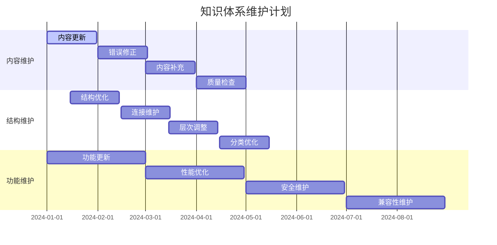
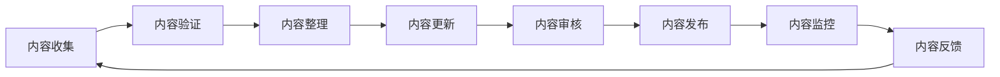
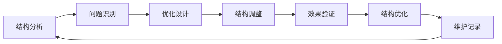
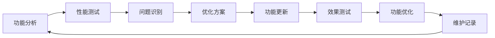
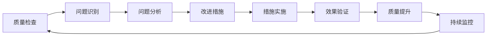
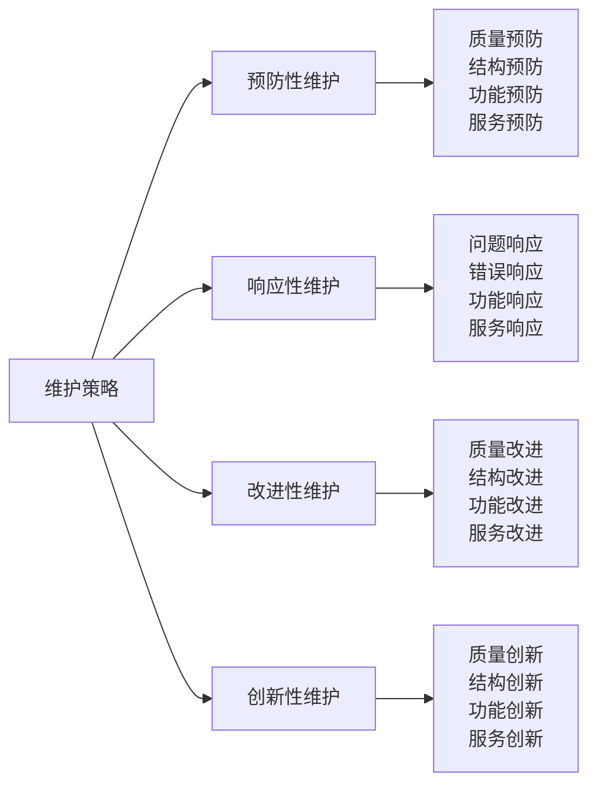

# 🔧 露营知识体系维护计划

## 📅 维护计划概览

### 维护时间表


## 📊 内容维护计划

### 月度内容更新
| 更新类型 | 更新内容 | 更新频率 | 负责人员 | 质量标准 |
|----------|----------|----------|----------|----------|
| **知识内容** | 新知识、新技能 | 每月 | 内容团队 | 准确性、时效性 |
| **实践案例** | 新案例、新经验 | 每季度 | 实践团队 | 真实性、实用性 |
| **技术标准** | 新标准、新规范 | 每年 | 技术团队 | 权威性、适用性 |
| **文化理念** | 新理念、新价值 | 持续 | 文化团队 | 时代性、传承性 |

### 内容质量检查
| 检查维度 | 检查标准 | 检查方法 | 检查频率 | 改进措施 |
|----------|----------|----------|----------|----------|
| **准确性** | 信息准确无误 | 事实核查 | 每月 | 错误修正 |
| **完整性** | 内容完整全面 | 内容审查 | 每季度 | 内容补充 |
| **时效性** | 内容及时更新 | 时间检查 | 每月 | 内容更新 |
| **一致性** | 内容逻辑一致 | 逻辑检查 | 每季度 | 逻辑修正 |
| **实用性** | 内容实用有效 | 实践验证 | 每半年 | 实用性提升 |

### 内容更新流程


## 🏗️ 结构维护计划

### 结构优化策略
| 优化类型 | 优化内容 | 优化方法 | 优化频率 | 优化效果 |
|----------|----------|----------|----------|----------|
| **层次优化** | 知识层次结构 | 层次分析 | 每季度 | 结构清晰 |
| **连接优化** | 知识连接关系 | 连接分析 | 每月 | 连接有效 |
| **分类优化** | 知识分类体系 | 分类分析 | 每季度 | 分类合理 |
| **导航优化** | 知识导航系统 | 导航分析 | 每月 | 导航便捷 |

### 连接维护管理
| 连接类型 | 维护内容 | 维护方法 | 维护频率 | 质量标准 |
|----------|----------|----------|----------|----------|
| **内部连接** | 知识点间连接 | 链接检查 | 每月 | 连接有效 |
| **外部连接** | 外部资源连接 | 链接验证 | 每季度 | 链接可用 |
| **交叉连接** | 跨层连接 | 连接分析 | 每季度 | 连接合理 |
| **深度连接** | 深度关联 | 关联分析 | 每半年 | 关联深入 |

### 结构维护流程


## 🔄 功能维护计划

### 功能更新管理
| 功能类型 | 更新内容 | 更新方法 | 更新频率 | 更新效果 |
|----------|----------|----------|----------|----------|
| **学习功能** | 学习方法优化 | 功能分析 | 每季度 | 学习效率提升 |
| **实践功能** | 实践工具更新 | 工具升级 | 每半年 | 实践效果提升 |
| **评估功能** | 评估方法改进 | 方法优化 | 每季度 | 评估准确性提升 |
| **创新功能** | 创新工具开发 | 工具开发 | 每年 | 创新能力提升 |

### 性能优化策略
| 优化类型 | 优化内容 | 优化方法 | 优化频率 | 优化效果 |
|----------|----------|----------|----------|----------|
| **加载优化** | 页面加载速度 | 技术优化 | 每月 | 加载速度提升 |
| **搜索优化** | 搜索功能效率 | 算法优化 | 每季度 | 搜索效率提升 |
| **导航优化** | 导航系统效率 | 系统优化 | 每月 | 导航效率提升 |
| **存储优化** | 数据存储效率 | 存储优化 | 每季度 | 存储效率提升 |

### 功能维护流程


## 📈 质量保证计划

### 质量标准体系
| 质量维度 | 质量标准 | 检查方法 | 改进措施 | 持续监控 |
|----------|----------|----------|----------|----------|
| **内容质量** | 准确、完整、及时 | 内容审查 | 内容修正 | 定期检查 |
| **结构质量** | 清晰、合理、完整 | 结构分析 | 结构优化 | 持续优化 |
| **功能质量** | 稳定、高效、易用 | 功能测试 | 功能优化 | 持续测试 |
| **服务质量** | 及时、专业、友好 | 服务评估 | 服务改进 | 持续评估 |

### 质量检查流程


### 质量改进策略
| 改进类型 | 改进内容 | 改进方法 | 改进频率 | 改进效果 |
|----------|----------|----------|----------|----------|
| **预防性改进** | 预防质量问题 | 质量预防 | 持续 | 质量稳定 |
| **纠正性改进** | 纠正质量问题 | 问题纠正 | 及时 | 质量提升 |
| **改进性改进** | 改进质量水平 | 质量改进 | 定期 | 质量优化 |
| **创新性改进** | 创新质量方法 | 方法创新 | 持续 | 质量创新 |

## 🔄 更新管理计划

### 版本控制策略
| 版本类型 | 版本号规则 | 更新内容 | 更新频率 | 更新标准 |
|----------|------------|----------|----------|----------|
| **主版本** | V1.0, V2.0 | 重大功能更新 | 每年 | 功能重大变化 |
| **次版本** | V1.1, V1.2 | 功能增强更新 | 每季度 | 功能增强 |
| **修订版** | V1.1.1, V1.1.2 | 错误修正更新 | 每月 | 错误修正 |
| **补丁版** | V1.1.1.1 | 紧急修复更新 | 及时 | 紧急修复 |

### 更新记录管理
| 记录类型 | 记录内容 | 记录格式 | 记录频率 | 记录保存 |
|----------|----------|----------|----------|----------|
| **更新日志** | 更新内容记录 | 结构化记录 | 每次更新 | 永久保存 |
| **变更记录** | 变更内容记录 | 详细记录 | 每次变更 | 版本保存 |
| **回滚记录** | 回滚操作记录 | 操作记录 | 每次回滚 | 操作保存 |
| **备份记录** | 备份操作记录 | 备份记录 | 每次备份 | 备份保存 |

### 更新管理流程


## 📊 维护效果评估

### 维护质量评估
| 评估维度 | 评估指标 | 评估方法 | 评估频率 | 改进措施 |
|----------|----------|----------|----------|----------|
| **内容质量** | 准确性、完整性 | 内容检查 | 每月 | 质量提升 |
| **结构质量** | 清晰性、合理性 | 结构分析 | 每季度 | 结构优化 |
| **功能质量** | 稳定性、效率性 | 功能测试 | 每月 | 功能优化 |
| **服务质量** | 及时性、专业性 | 服务评估 | 每季度 | 服务改进 |

### 维护成本分析
| 成本类型 | 成本内容 | 成本计算 | 成本控制 | 成本优化 |
|----------|----------|----------|----------|----------|
| **时间成本** | 维护时间投入 | 时间统计 | 时间管理 | 效率提升 |
| **人力成本** | 维护人员投入 | 人力统计 | 人力优化 | 技能提升 |
| **技术成本** | 技术工具投入 | 技术统计 | 技术优化 | 工具升级 |
| **资源成本** | 资源消耗投入 | 资源统计 | 资源控制 | 资源优化 |

### 维护效果追踪
```mermaid
xychart-beta
    title "维护效果趋势"
    x-axis ["1月", "2月", "3月", "4月", "5月", "6月"]
    y-axis "效果评分" 0 --> 10
    line [8, 8.2, 8.5, 8.7, 9.0, 9.2]
```

## 🎯 维护策略优化

### 预防性维护
| 维护类型 | 维护内容 | 维护方法 | 维护频率 | 维护效果 |
|----------|----------|----------|----------|----------|
| **内容预防** | 内容质量预防 | 质量检查 | 定期检查 | 质量保证 |
| **结构预防** | 结构问题预防 | 结构分析 | 定期分析 | 结构稳定 |
| **功能预防** | 功能问题预防 | 功能检查 | 定期检查 | 功能稳定 |
| **服务预防** | 服务问题预防 | 服务检查 | 定期检查 | 服务优化 |

### 响应性维护
| 维护类型 | 维护内容 | 维护方法 | 响应时间 | 维护效果 |
|----------|----------|----------|----------|----------|
| **问题响应** | 问题快速响应 | 问题处理 | 24小时内 | 问题解决 |
| **错误响应** | 错误快速修正 | 错误修正 | 48小时内 | 错误修正 |
| **功能响应** | 功能快速修复 | 功能修复 | 72小时内 | 功能恢复 |
| **服务响应** | 服务快速恢复 | 服务恢复 | 24小时内 | 服务恢复 |

### 维护策略优化


## 📋 维护检查清单

### 内容维护检查
- [ ] 内容是否准确无误
- [ ] 内容是否完整全面
- [ ] 内容是否及时更新
- [ ] 内容是否逻辑一致
- [ ] 内容是否实用有效

### 结构维护检查
- [ ] 结构是否清晰合理
- [ ] 连接是否有效可用
- [ ] 层次是否逻辑清晰
- [ ] 分类是否科学合理
- [ ] 导航是否便捷有效

### 功能维护检查
- [ ] 功能是否稳定可靠
- [ ] 功能是否高效便捷
- [ ] 功能是否易于使用
- [ ] 功能是否满足需求
- [ ] 功能是否持续改进

### 质量维护检查
- [ ] 质量是否达到标准
- [ ] 质量是否持续提升
- [ ] 质量是否有效监控
- [ ] 质量是否及时改进
- [ ] 质量是否创新优化

## 🔗 相关链接
- [[05-实践与评估/03-持续改进/04-知识体系维护|知识体系维护]]
- [[05-实践与评估/03-持续改进/01-学习反思模板|学习反思模板]]
- [[05-实践与评估/03-持续改进/02-技能更新记录|技能更新记录]]
- [[05-实践与评估/03-持续改进/03-经验总结方法|经验总结方法]]

---

## 🎯 总结

这个维护计划为露营知识体系提供了完整的维护策略，确保知识体系始终保持高质量、高效率、高价值的状态。

**维护目标**：
- **质量保证**：确保知识体系质量
- **持续改进**：持续改进知识体系
- **创新发展**：创新发展知识体系
- **价值实现**：实现知识体系价值

**维护原则**：
- **预防为主**：预防性维护为主
- **及时响应**：及时响应维护需求
- **持续改进**：持续改进维护方法
- **创新发展**：创新发展维护理念

通过这个维护计划，露营知识体系将始终保持最佳状态，为学习者提供最优质的学习体验。
