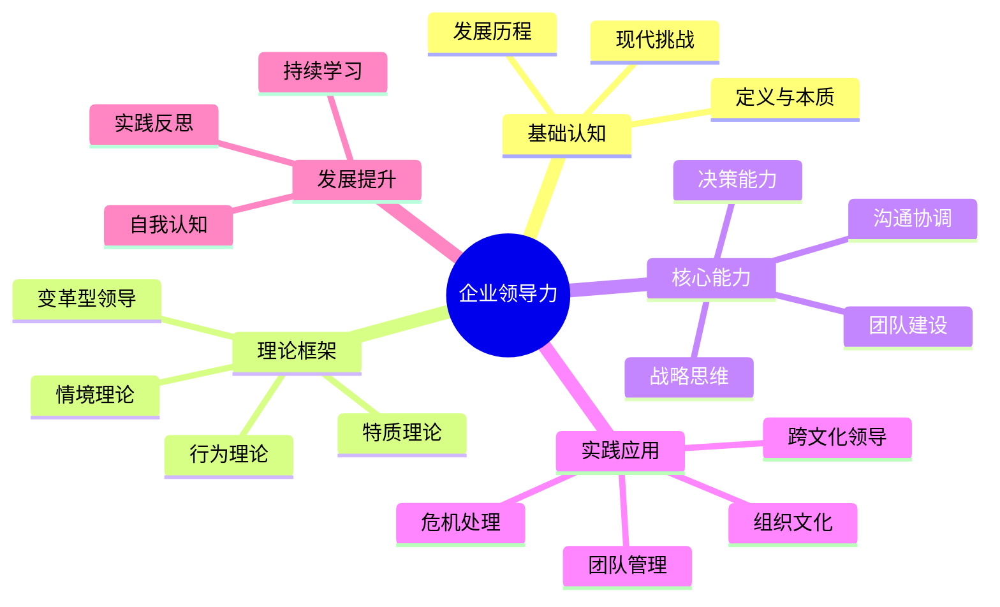

# 企业领导力知识地图

## 🗺️ 金字塔式知识体系总览

```mermaid
graph TD
    A[企业领导力金字塔] --> B[基础认知层<br/>WHAT-是什么]
    A --> C[理论理解层<br/>WHY-为什么]
    A --> D[能力构建层<br/>HOW-怎么做]
    A --> E[实践应用层<br/>WHERE-在哪里用]
    A --> F[发展提升层<br/>WHEN-何时提升]
    A --> G[案例分析层<br/>EXAMPLE-案例验证]
    A --> H[工具资源层<br/>TOOLS-用什么工具]
    
    B --> B1[领导力本质]
    B --> B2[管理者vs领导者]
    B --> B3[发展历程]
    B --> B4[现代挑战]
    B --> B5[伦理价值观]
    
    C --> C1[经典理论]
    C --> C2[现代理论]
    C --> C3[理论对比]
    
    D --> D1[战略思维]
    D --> D2[决策能力]
    D --> D3[沟通协调]
    D --> D4[团队建设]
    D --> D5[变革管理]
    D --> D6[情商管理]
    
    E --> E1[管理实践]
    E --> E2[特殊情境]
    E --> E3[实践工具]
    
    F --> F1[自我发展]
    F --> F2[持续改进]
    F --> F3[发展计划]
    
    G --> G1[成功案例]
    G --> G2[失败案例]
    G --> G3[危机处理]
    
    H --> H1[评估工具]
    H --> H2[学习资源]
    H --> H3[实用模板]
    
    style A fill:#ff6b6b,stroke:#333,stroke-width:3px,color:#fff
    style B fill:#4ecdc4,stroke:#333,stroke-width:2px,color:#fff
    style C fill:#45b7d1,stroke:#333,stroke-width:2px,color:#fff
    style D fill:#96ceb4,stroke:#333,stroke-width:2px,color:#fff
    style E fill:#feca57,stroke:#333,stroke-width:2px,color:#fff
    style F fill:#ff9ff3,stroke:#333,stroke-width:2px,color:#fff
    style G fill:#54a0ff,stroke:#333,stroke-width:2px,color:#fff
    style H fill:#5f27cd,stroke:#333,stroke-width:2px,color:#fff
```

## 📚 费曼学习法路径规划

### 🎯 第一阶段：认知建立（1-2周）- WHAT
**目标**：理解领导力本质，建立基础认知框架

#### 核心学习内容
- [[01-基础认知层/01-领导力概述|领导力概述]] - 本质理解
- [[01-基础认知层/02-管理者vs领导者|管理者vs领导者]] - 概念区分
- [[01-基础认知层/03-领导力发展历程|发展历程]] - 历史脉络
- [[01-基础认知层/04-现代领导力挑战|现代挑战]] - 时代背景
- [[01-基础认知层/05-领导力伦理与价值观|伦理价值观]] - 价值基础

#### 费曼学习法应用
1. **选择概念**：选择"领导力"核心概念
2. **教授他人**：用简单语言解释领导力定义
3. **识别盲点**：发现理解不足的地方
4. **重新学习**：回到资料重新学习盲点
5. **简化表达**：用一句话总结领导力本质

### 🧠 第二阶段：理论理解（2-3周）- WHY
**目标**：掌握理论框架，理解领导力原理

#### 核心学习内容
- [[02-理论理解层/经典领导理论/01-特质理论|特质理论]] - 个人特质
- [[02-理论理解层/经典领导理论/02-行为理论|行为理论]] - 行为模式
- [[02-理论理解层/经典领导理论/03-情境理论|情境理论]] - 环境适应
- [[02-理论理解层/现代领导理论/01-变革型领导|变革型领导]] - 现代趋势
- [[02-理论理解层/04-理论对比分析|理论对比]] - 综合分析

#### 费曼学习法应用
1. **选择概念**：选择"变革型领导"理论
2. **教授他人**：解释变革型领导的核心特征
3. **识别盲点**：发现理论应用的难点
4. **重新学习**：深入研究理论细节
5. **简化表达**：用图表总结理论要点

### 🛠️ 第三阶段：能力构建（3-4周）- HOW
**目标**：掌握核心技能，构建领导能力

#### 核心学习内容
- [[03-能力构建层/核心领导能力/01-战略思维|战略思维]] - 顶层设计
- [[03-能力构建层/核心领导能力/02-决策能力|决策能力]] - 关键决策
- [[03-能力构建层/核心领导能力/03-沟通协调|沟通协调]] - 人际技能
- [[03-能力构建层/核心领导能力/04-团队建设|团队建设]] - 团队管理
- [[03-能力构建层/07-能力发展路径|能力发展路径]] - 发展策略

#### 费曼学习法应用
1. **选择概念**：选择"战略思维"能力
2. **教授他人**：解释战略思维的具体方法
3. **识别盲点**：发现能力提升的难点
4. **重新学习**：深入研究能力提升技巧
5. **简化表达**：用步骤图总结能力发展

### 🎯 第四阶段：实践应用（4-6周）- WHERE
**目标**：应用所学知识，解决实际问题

#### 核心学习内容
- [[04-实践应用层/管理实践/01-团队管理|团队管理]] - 日常管理
- [[04-实践应用层/特殊情境/01-跨文化领导|跨文化领导]] - 特殊情境
- [[04-实践应用层/05-实践工具箱|实践工具]] - 实用工具
- [[06-案例分析层/成功案例/01-成功领导者案例|成功案例]] - 案例学习

#### 费曼学习法应用
1. **选择概念**：选择"团队管理"实践
2. **教授他人**：解释团队管理的关键步骤
3. **识别盲点**：发现实践中的困难
4. **重新学习**：深入研究实践技巧
5. **简化表达**：用流程图总结实践步骤

### 📈 第五阶段：持续提升（持续进行）- WHEN
**目标**：建立持续学习机制，实现长期发展

#### 核心学习内容
- [[05-发展提升层/自我发展/01-自我认知与评估|自我认知]] - 自我了解
- [[05-发展提升层/03-个人领导力发展计划|发展计划]] - 规划制定
- [[05-发展提升层/持续改进/01-实践反思|实践反思]] - 反思总结
- [[07-工具资源层/评估工具/01-领导力评估量表|评估工具]] - 效果评估

#### 费曼学习法应用
1. **选择概念**：选择"持续改进"机制
2. **教授他人**：解释持续改进的方法
3. **识别盲点**：发现改进的难点
4. **重新学习**：深入研究改进策略
5. **简化表达**：用循环图总结改进过程

## 🎯 学习目标设定

| 层级 | 目标 | 评估标准 |
|------|------|----------|
| **认知** | 理解领导力基本概念 | 能解释领导力定义和特征 |
| **理解** | 掌握核心理论框架 | 能对比不同理论优缺点 |
| **应用** | 运用领导技能 | 能在实际工作中应用 |
| **分析** | 分析领导情境 | 能识别问题并提出解决方案 |
| **综合** | 整合领导能力 | 能制定个人发展计划 |
| **评价** | 评估领导效果 | 能反思和改进领导行为 |

## 🔗 核心概念关系

## 📈 学习进度追踪

- [ ] 完成基础认知层学习
- [ ] 掌握核心理论框架
- [ ] 构建个人能力体系
- [ ] 完成实践案例分析
- [ ] 制定个人发展计划
- [ ] 建立持续改进机制

## 🎓 费曼学习法应用

### 第一步：选择概念
选择当前学习的领导力概念

### 第二步：教授他人
用简单语言向他人解释概念

### 第三步：识别盲点
发现理解不足的地方

### 第四步：重新学习
回到资料重新学习盲点

### 第五步：简化表达
用更简洁的方式表达概念

## 💡 刻意练习要点

1. **明确目标**：设定具体的学习目标
2. **专注练习**：集中注意力在关键技能上
3. **即时反馈**：及时获得练习结果反馈
4. **走出舒适区**：挑战更高难度的任务
5. **持续改进**：基于反馈不断调整

---

**下一步**：[[02-学习路径指南|学习路径指南]] | [[03-快速参考索引|快速参考索引]]

