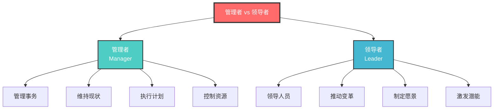
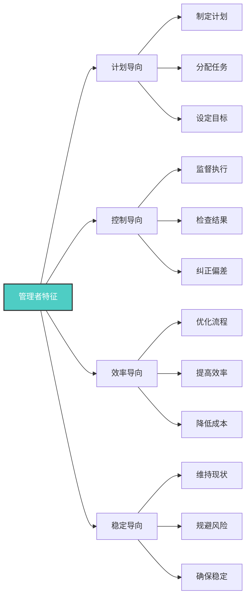
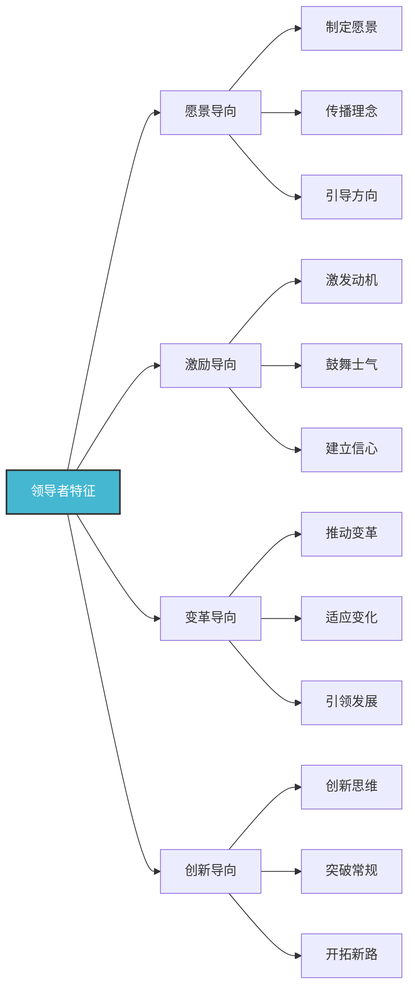
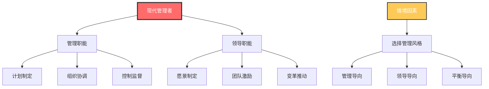

# 管理者vs领导者

## 🎯 核心概念对比

### 基本定义对比

| 维度 | 管理者 | 领导者 |
|------|--------|--------|
| **核心职能** | 管理事务，维持秩序 | 领导人员，推动变革 |
| **关注重点** | 效率、控制、稳定 | 愿景、激励、创新 |
| **权力来源** | 职位权力、制度权力 | 个人魅力、影响力 |
| **工作方式** | 计划、组织、控制 | 愿景、激励、授权 |
| **时间导向** | 短期目标、当前任务 | 长期愿景、未来发展 |
| **风险态度** | 规避风险、稳定运行 | 承担风险、开拓创新 |

## 📊 详细特征分析

### 管理者特征

#### 核心能力
| 能力类型 | 具体能力 | 重要性 | 发展方法 |
|----------|----------|--------|----------|
| **计划能力** | 制定计划、分配资源 | 高 | 项目管理培训 |
| **组织能力** | 组织结构、人员配置 | 高 | 组织设计学习 |
| **控制能力** | 监督执行、质量控制 | 高 | 质量管理培训 |
| **协调能力** | 部门协调、资源整合 | 中 | 沟通技巧培训 |

### 领导者特征

#### 核心能力
| 能力类型 | 具体能力 | 重要性 | 发展方法 |
|----------|----------|--------|----------|
| **愿景能力** | 制定愿景、传播理念 | 高 | 战略思维训练 |
| **激励能力** | 激发动机、鼓舞士气 | 高 | 心理学学习 |
| **变革能力** | 推动变革、适应变化 | 高 | 变革管理培训 |
| **创新能力** | 创新思维、突破常规 | 中 | 创新方法学习 |

## 🔄 角色转换与融合

### 现代管理者的双重角色

### 情境适应性
| 情境类型 | 管理风格 | 领导风格 | 适用条件 |
|----------|----------|----------|----------|
| **稳定环境** | 管理导向 | 维持现状 | 成熟业务、稳定团队 |
| **变革环境** | 领导导向 | 推动变革 | 组织变革、创新发展 |
| **危机环境** | 管理导向 | 快速决策 | 紧急情况、危机处理 |
| **发展环境** | 平衡导向 | 综合运用 | 成长期、多元化发展 |

## 🎓 费曼学习法应用

### 第一步：选择概念
选择"管理者与领导者的区别"这一核心概念

### 第二步：教授他人
用简单语言向他人解释：
- **管理者**：像园丁，负责维护花园的秩序和效率
- **领导者**：像建筑师，负责设计未来的蓝图和方向

### 第三步：识别盲点
发现理解不足的地方：
- 什么时候需要管理，什么时候需要领导？
- 如何在不同情境下切换角色？

### 第四步：重新学习
回到资料重新学习盲点：
- 情境领导理论
- 管理-领导平衡模型

### 第五步：简化表达
用更简洁的方式表达概念：
- 管理 = 把事情做对（Do things right）
- 领导 = 做对的事情（Do right things）

## 💡 刻意练习要点

### 练习目标
1. **明确目标**：区分管理行为和领导行为
2. **专注练习**：集中练习薄弱环节
3. **即时反馈**：获得行为效果反馈
4. **走出舒适区**：挑战新的角色要求
5. **持续改进**：基于反馈不断调整

### 练习方法
| 练习类型 | 具体方法 | 实施步骤 | 评估标准 |
|----------|----------|----------|----------|
| **角色扮演** | 模拟不同情境 | 1.设定情境 2.选择角色 3.执行行为 4.反思总结 | 行为准确性 |
| **案例分析** | 分析实际案例 | 1.阅读案例 2.识别行为 3.分析效果 4.总结规律 | 分析深度 |
| **行为观察** | 观察他人行为 | 1.选择对象 2.记录行为 3.分类分析 4.对比学习 | 观察敏锐度 |
| **自我反思** | 反思自身行为 | 1.记录行为 2.分析动机 3.评估效果 4.制定改进 | 反思质量 |

## 🔗 相关概念链接

### 基础概念
- [[01-领导力概述|领导力概述]] - 理解领导力本质
- [[03-领导力发展历程|发展历程]] - 了解历史脉络
- [[04-现代领导力挑战|现代挑战]] - 认识时代背景

### 理论概念
- [[02-理论理解层/经典领导理论/02-行为理论|行为理论]] - 行为模式研究
- [[02-理论理解层/经典领导理论/03-情境理论|情境理论]] - 情境适应性
- [[02-理论理解层/现代领导理论/01-变革型领导|变革型领导]] - 现代领导趋势

### 能力概念
- [[03-能力构建层/核心领导能力/02-决策能力|决策能力]] - 决策技能
- [[03-能力构建层/核心领导能力/03-沟通协调|沟通协调]] - 沟通技能
- [[03-能力构建层/核心领导能力/04-团队建设|团队建设]] - 团队管理

### 实践概念
- [[04-实践应用层/管理实践/01-团队管理|团队管理]] - 管理实践
- [[05-发展提升层/自我发展/01-自我认知与评估|自我认知]] - 自我评估

## 💡 学习要点总结

### 关键理解
1. **角色差异**：管理者关注效率，领导者关注效果
2. **能力要求**：管理者需要执行能力，领导者需要影响力
3. **情境适应**：需要根据情境选择合适的角色
4. **角色融合**：现代管理者需要兼具两种角色

### 实践应用
1. **自我评估**：评估自身的管理和领导倾向
2. **情境分析**：分析当前工作情境的需求
3. **角色调整**：根据情境调整管理风格
4. **能力发展**：发展薄弱的管理或领导能力

### 思考问题
1. 你更倾向于管理者还是领导者角色？
2. 在什么情况下需要更多管理，什么情况下需要更多领导？
3. 如何平衡管理效率和领导效果？
4. 如何发展自身的管理和领导能力？

---

**下一步**：[[03-领导力发展历程|发展历程]] | [[04-现代领导力挑战|现代挑战]]