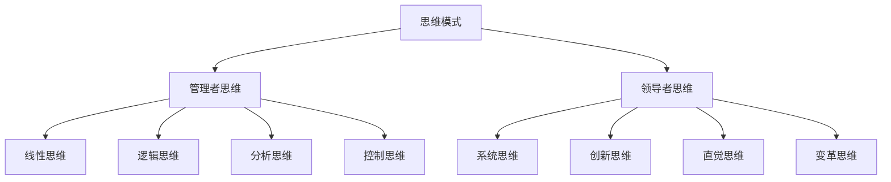
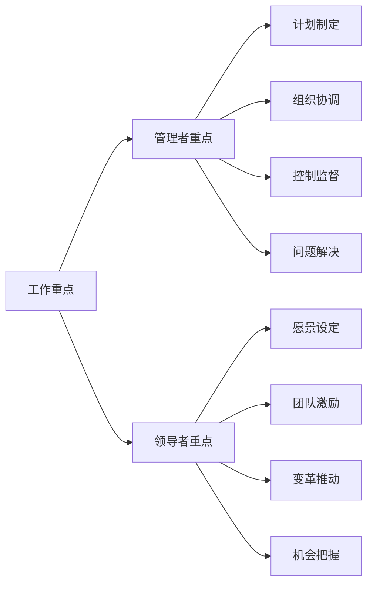
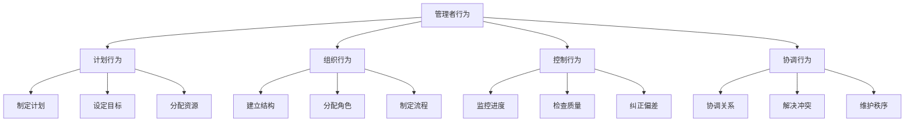
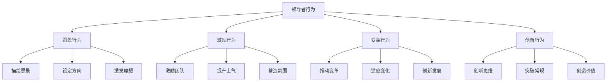
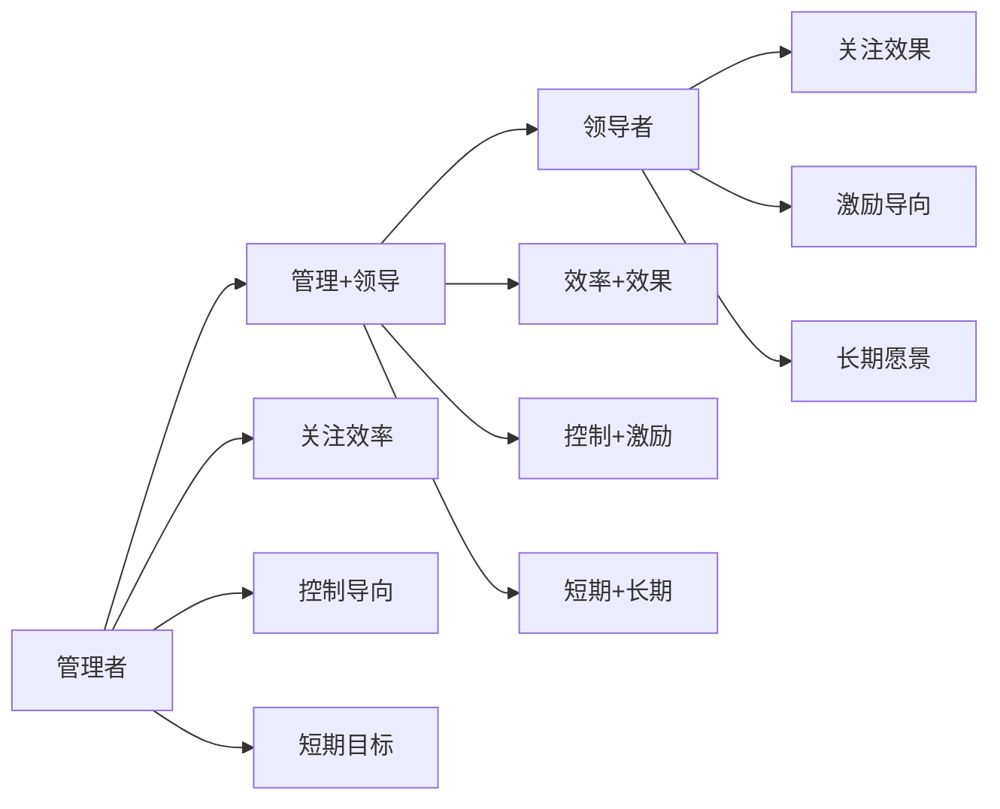

# 管理者vs领导者

## 🎯 核心区别

### 基本定义对比
| 维度 | 管理者 | 领导者 |
|------|--------|--------|
| **定义** | 通过计划、组织、控制实现目标 | 通过愿景、激励、变革影响他人 |
| **关注点** | 效率、秩序、稳定 | 创新、变革、发展 |
| **权力来源** | 职位权力、制度权力 | 个人魅力、专业能力 |
| **工作方式** | 控制、监督、执行 | 激励、引导、变革 |
| **时间导向** | 短期目标、当前任务 | 长期愿景、未来发展 |

## 🔍 详细特征对比

### 思维模式对比

### 行为特征对比
| 行为维度 | 管理者 | 领导者 |
|----------|--------|--------|
| **决策方式** | 基于数据和程序 | 基于直觉和愿景 |
| **沟通风格** | 指令性、正式性 | 激励性、非正式性 |
| **冲突处理** | 避免冲突、维持秩序 | 直面冲突、寻求变革 |
| **风险态度** | 规避风险、稳定优先 | 承担风险、创新优先 |
| **学习方式** | 经验学习、程序学习 | 反思学习、创新学习 |

### 工作重点对比

## 📊 角色职责对比

### 管理者的核心职责
1. **计划制定**
   - 制定具体的工作计划
   - 设定明确的目标和指标
   - 制定详细的执行方案

2. **组织协调**
   - 分配任务和资源
   - 协调各部门工作
   - 建立工作流程

3. **控制监督**
   - 监控工作进度
   - 确保质量标准
   - 纠正偏差行为

4. **问题解决**
   - 识别和解决问题
   - 处理日常事务
   - 维护系统稳定

### 领导者的核心职责
1. **愿景设定**
   - 制定组织愿景
   - 描绘未来发展
   - 激发共同理想

2. **团队激励**
   - 激发团队潜能
   - 营造积极氛围
   - 提升团队士气

3. **变革推动**
   - 推动组织变革
   - 适应环境变化
   - 创新发展模式

4. **机会把握**
   - 识别市场机会
   - 抓住发展机遇
   - 创造竞争优势

## 🎭 典型行为模式

### 管理者的典型行为

### 领导者的典型行为

## 🌟 成功要素对比

### 管理者成功要素
| 要素 | 重要性 | 具体表现 |
|------|--------|----------|
| **专业能力** | 高 | 专业技能、行业知识 |
| **执行能力** | 高 | 计划执行、目标达成 |
| **协调能力** | 中 | 团队协调、资源整合 |
| **沟通能力** | 中 | 信息传递、问题解决 |
| **学习能力** | 中 | 经验积累、技能提升 |

### 领导者成功要素
| 要素 | 重要性 | 具体表现 |
|------|--------|----------|
| **愿景能力** | 高 | 战略眼光、未来规划 |
| **激励能力** | 高 | 团队激励、士气提升 |
| **变革能力** | 高 | 推动变革、适应变化 |
| **创新能力** | 中 | 创新思维、突破常规 |
| **影响力** | 中 | 个人魅力、专业权威 |

## 🔄 角色转换与融合

### 从管理者到领导者

### 角色融合的必要性
1. **现代组织需求**：需要既懂管理又懂领导的人才
2. **复杂环境挑战**：需要灵活应对各种情况
3. **团队发展需要**：需要平衡效率与创新
4. **个人成长要求**：需要全面发展个人能力

### 融合策略
1. **思维融合**：结合管理思维和领导思维
2. **技能融合**：掌握管理和领导技能
3. **行为融合**：在不同情境下灵活调整
4. **角色融合**：根据需求切换角色

## 📈 发展阶段分析

### 管理者发展阶段
| 阶段 | 特征 | 重点 | 挑战 |
|------|------|------|------|
| **初级管理者** | 执行导向 | 任务完成 | 技能不足 |
| **中级管理者** | 协调导向 | 团队管理 | 平衡能力 |
| **高级管理者** | 战略导向 | 组织管理 | 变革能力 |

### 领导者发展阶段
| 阶段 | 特征 | 重点 | 挑战 |
|------|------|------|------|
| **初级领导者** | 个人导向 | 自我提升 | 影响力不足 |
| **中级领导者** | 团队导向 | 团队建设 | 协调能力 |
| **高级领导者** | 组织导向 | 组织变革 | 战略能力 |

## 🎯 实践应用指南

### 如何成为优秀管理者
1. **提升专业能力**：掌握行业知识和专业技能
2. **强化执行能力**：确保计划的有效执行
3. **改善协调能力**：提高团队协作效率
4. **增强沟通能力**：建立有效沟通机制
5. **持续学习改进**：不断学习和提升

### 如何成为优秀领导者
1. **培养愿景能力**：制定清晰的愿景和目标
2. **提升激励能力**：激发团队潜能和积极性
3. **增强变革能力**：推动组织变革和创新
4. **发展创新能力**：突破常规思维和模式
5. **建立影响力**：提升个人魅力和专业权威

### 如何实现角色融合
1. **自我认知**：了解自身优势和不足
2. **目标设定**：设定角色融合的发展目标
3. **技能发展**：同时发展管理和领导技能
4. **实践应用**：在不同情境下灵活应用
5. **持续改进**：基于反馈不断调整

## 🔗 相关概念链接

### 基础概念
- [[01-领导力概述|领导力概述]]
- [[03-领导力发展历程|发展历程]]
- [[04-现代领导力挑战|现代挑战]]

### 理论概念
- [[02-理论理解层/经典领导理论/02-行为理论|行为理论]]
- [[02-理论理解层/现代领导理论/01-变革型领导|变革型领导]]

### 能力概念
- [[03-能力构建层/核心领导能力/02-决策能力|决策能力]]
- [[03-能力构建层/核心领导能力/03-沟通协调|沟通协调]]

## 💡 学习要点总结

### 关键理解
1. **管理者关注效率**：通过计划、组织、控制实现目标
2. **领导者关注效果**：通过愿景、激励、变革影响他人
3. **角色可以融合**：现代组织需要复合型人才
4. **发展需要平衡**：既要管理技能也要领导能力

### 实践应用
1. **自我评估**：评估自身管理和领导能力
2. **目标设定**：设定角色融合的发展目标
3. **技能发展**：同时发展两种角色技能
4. **灵活应用**：根据情境调整角色行为

### 思考问题
1. 你更倾向于管理者还是领导者角色？
2. 如何平衡管理效率和领导效果？
3. 在不同情境下如何调整角色？
4. 如何实现从管理者到领导者的转换？

---

**下一步**：[[03-领导力发展历程|发展历程]] | [[04-现代领导力挑战|现代挑战]]
