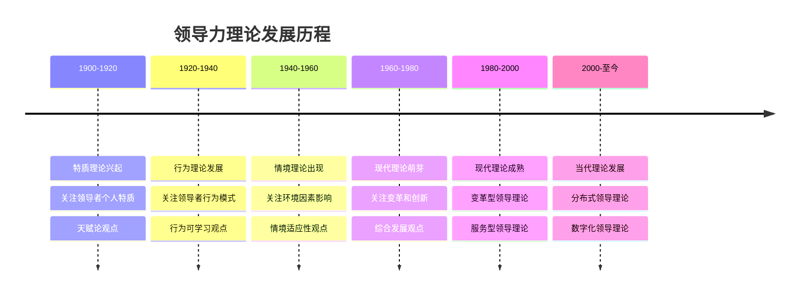
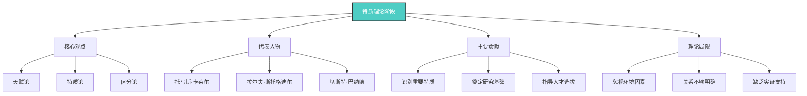
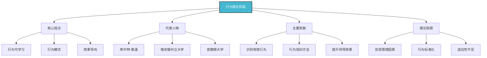
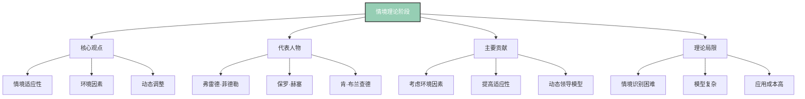
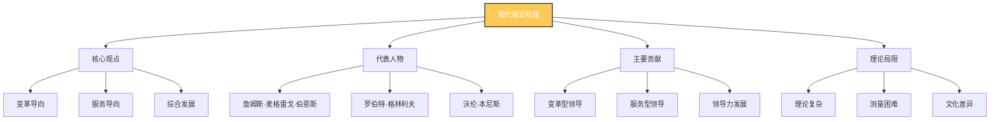
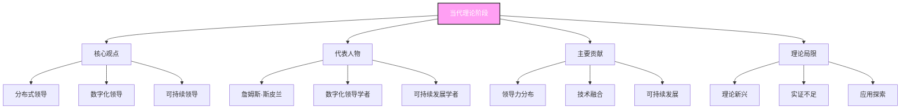
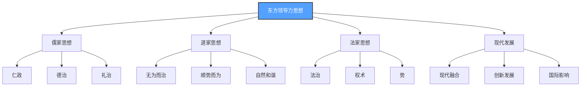
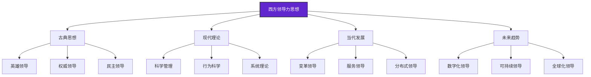
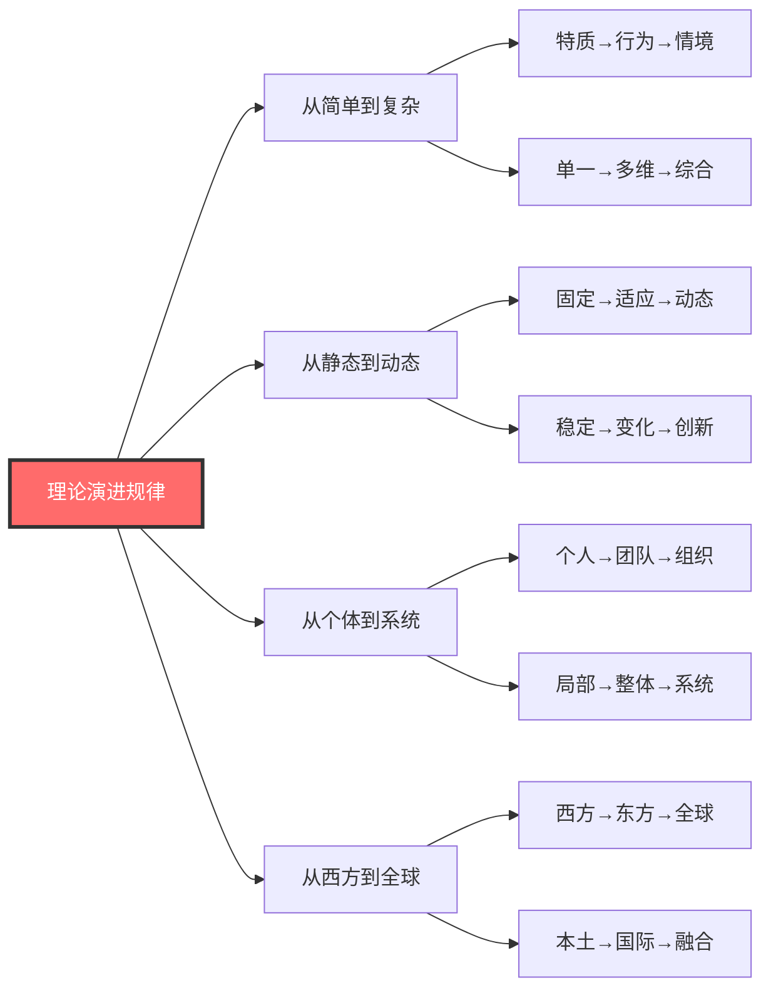

# 领导力发展历程

## 🎯 历史发展脉络

### 总体发展时间线

## 📚 各阶段详细分析

### 第一阶段：特质理论（1900-1940）

#### 核心特征
| 特征维度 | 具体表现 | 历史意义 | 现代价值 |
|----------|----------|----------|----------|
| **理论基础** | 天赋论、特质论 | 开创性贡献 | 人才选拔参考 |
| **研究重点** | 个人特质识别 | 奠定研究基础 | 个性评估工具 |
| **应用领域** | 人才选拔 | 提高选拔效果 | 现代HR应用 |
| **理论局限** | 忽视环境因素 | 理论不完整 | 需要结合其他理论 |

### 第二阶段：行为理论（1940-1960）

#### 核心特征
| 特征维度 | 具体表现 | 历史意义 | 现代价值 |
|----------|----------|----------|----------|
| **理论基础** | 行为可学习论 | 突破天赋论 | 领导培训基础 |
| **研究重点** | 行为模式识别 | 行为研究开创 | 行为评估工具 |
| **应用领域** | 领导培训 | 提升培训效果 | 现代培训应用 |
| **理论局限** | 忽视情境因素 | 理论不完整 | 需要情境化应用 |

### 第三阶段：情境理论（1960-1980）

#### 核心特征
| 特征维度 | 具体表现 | 历史意义 | 现代价值 |
|----------|----------|----------|----------|
| **理论基础** | 情境适应性论 | 理论重大突破 | 现代领导基础 |
| **研究重点** | 环境因素影响 | 环境研究开创 | 环境分析工具 |
| **应用领域** | 情境领导 | 提高领导效果 | 现代领导应用 |
| **理论局限** | 情境识别困难 | 应用复杂 | 需要简化模型 |

### 第四阶段：现代理论（1980-2000）

#### 核心特征
| 特征维度 | 具体表现 | 历史意义 | 现代价值 |
|----------|----------|----------|----------|
| **理论基础** | 变革服务论 | 理论重大发展 | 现代领导主流 |
| **研究重点** | 变革和服务 | 领导研究深化 | 现代领导实践 |
| **应用领域** | 组织变革 | 推动组织发展 | 现代组织应用 |
| **理论局限** | 理论复杂 | 应用困难 | 需要简化应用 |

### 第五阶段：当代理论（2000-至今）

#### 核心特征
| 特征维度 | 具体表现 | 历史意义 | 现代价值 |
|----------|----------|----------|----------|
| **理论基础** | 分布式数字化论 | 理论最新发展 | 未来领导趋势 |
| **研究重点** | 技术融合分布 | 领导研究前沿 | 未来领导实践 |
| **应用领域** | 数字化组织 | 适应技术发展 | 现代组织应用 |
| **理论局限** | 理论新兴 | 需要更多实证 | 需要持续发展 |

## 🌍 东西方领导力思想对比

### 东方领导力思想

### 西方领导力思想

## 📊 理论发展规律分析

### 发展驱动因素
| 驱动因素 | 具体表现 | 影响程度 | 发展趋势 |
|----------|----------|----------|----------|
| **社会变革** | 工业革命、信息革命 | 高 | 持续影响 |
| **经济发展** | 市场经济、全球化 | 高 | 深化影响 |
| **技术进步** | 信息技术、人工智能 | 中 | 加速影响 |
| **文化融合** | 东西方文化交融 | 中 | 增强影响 |
| **环境变化** | 可持续发展要求 | 低 | 新兴影响 |

### 理论演进规律

## 🎓 费曼学习法应用

### 第一步：选择概念
选择"领导力发展历程"这一核心概念

### 第二步：教授他人
用简单语言向他人解释：
- 领导力理论就像人的成长，从关注外在特质到内在行为，再到环境适应

### 第三步：识别盲点
发现理解不足的地方：
- 为什么理论会这样发展？
- 各阶段理论之间有什么联系？

### 第四步：重新学习
回到资料重新学习盲点：
- 社会历史背景分析
- 理论演进逻辑分析

### 第五步：简化表达
用更简洁的方式表达概念：
- 特质→行为→情境→变革→分布，五个阶段层层递进

## 💡 刻意练习要点

### 练习目标
1. **明确目标**：理解各阶段理论特点
2. **专注练习**：重点掌握现代理论
3. **即时反馈**：获得理解程度反馈
4. **走出舒适区**：挑战复杂理论理解
5. **持续改进**：基于反馈不断深化

### 练习方法
| 练习类型 | 具体方法 | 实施步骤 | 评估标准 |
|----------|----------|----------|----------|
| **时间线梳理** | 制作发展时间线 | 1.列出阶段 2.标注时间 3.总结特点 4.分析规律 | 时间准确性 |
| **理论对比** | 对比不同理论 | 1.选择理论 2.对比分析 3.总结差异 4.分析原因 | 对比深度 |
| **案例分析** | 分析历史案例 | 1.选择案例 2.分析背景 3.应用理论 4.总结规律 | 分析质量 |
| **趋势预测** | 预测发展趋势 | 1.分析现状 2.识别趋势 3.预测未来 4.验证预测 | 预测准确性 |

## 🔗 相关概念链接

### 基础概念
- [[01-领导力概述|领导力概述]] - 理解领导力本质
- [[02-管理者vs领导者|管理者vs领导者]] - 角色区分
- [[04-现代领导力挑战|现代挑战]] - 当代背景

### 理论概念
- [[02-理论理解层/经典领导理论/01-特质理论|特质理论]] - 早期理论
- [[02-理论理解层/经典领导理论/02-行为理论|行为理论]] - 行为研究
- [[02-理论理解层/经典领导理论/03-情境理论|情境理论]] - 情境适应
- [[02-理论理解层/现代领导理论/01-变革型领导|变革型领导]] - 现代理论
- [[02-理论理解层/04-理论对比分析|理论对比]] - 综合分析

### 能力概念
- [[03-能力构建层/核心领导能力/05-变革管理|变革管理]] - 变革能力
- [[03-能力构建层/07-能力发展路径|能力发展路径]] - 发展策略

### 实践概念
- [[04-实践应用层/特殊情境/02-数字化转型领导|数字化转型]] - 现代实践
- [[06-案例分析层/成功案例/01-成功领导者案例|成功案例]] - 案例学习

## 💡 学习要点总结

### 关键理解
1. **发展规律**：从简单到复杂，从静态到动态
2. **时代背景**：理论发展反映时代需求
3. **理论联系**：各阶段理论相互补充
4. **发展趋势**：向综合化、全球化发展

### 实践应用
1. **理论选择**：根据情境选择合适的理论
2. **历史借鉴**：从历史中学习经验教训
3. **趋势把握**：把握理论发展趋势
4. **创新发展**：在理论基础上创新发展

### 思考问题
1. 为什么领导力理论会这样发展？
2. 各阶段理论有什么优缺点？
3. 如何预测领导力理论的发展趋势？
4. 如何在实践中综合运用不同理论？

---

**下一步**：[[04-现代领导力挑战|现代挑战]] | [[05-领导力伦理与价值观|伦理价值观]]