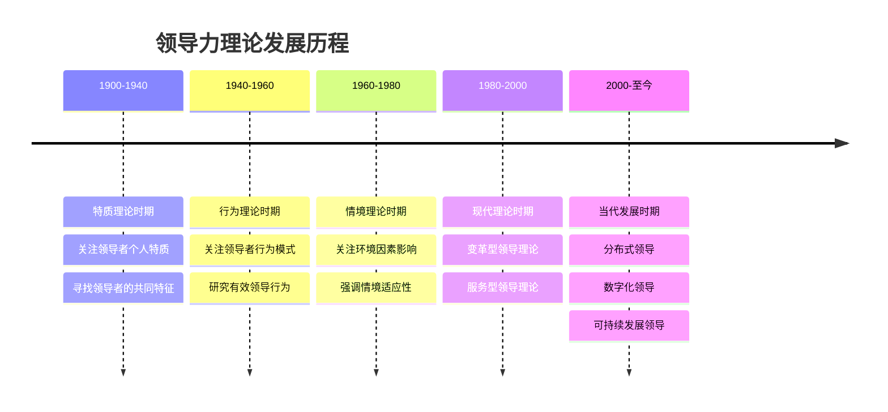
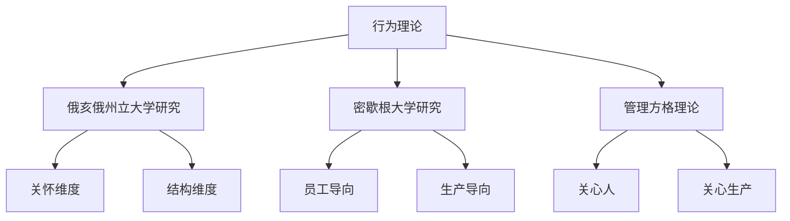
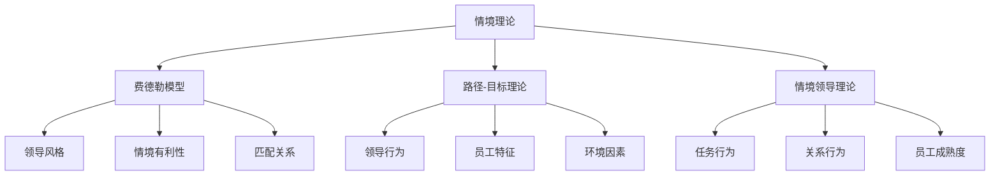
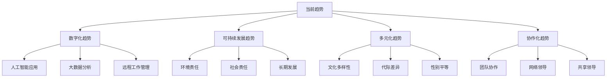

# 领导力发展历程

## 🕰️ 历史发展脉络

### 整体发展时间线

## 📚 各时期理论特点

### 第一时期：特质理论（1900-1940）

#### 核心观点
- **基本假设**：领导者具有与生俱来的特质
- **研究重点**：寻找领导者的共同特征
- **主要方法**：对比领导者与非领导者

#### 主要特质
| 特质类别 | 具体特质 | 说明 |
|----------|----------|------|
| **身体特质** | 身高、外貌、体力 | 外在形象特征 |
| **智力特质** | 智商、判断力、创造力 | 认知能力特征 |
| **性格特质** | 自信、果断、坚韧 | 个性特征 |
| **社会特质** | 沟通能力、人际技巧 | 社交能力特征 |

#### 代表人物
- **托马斯·卡莱尔**：英雄领导理论
- **拉尔夫·斯托格迪尔**：领导特质研究
- **切斯特·巴纳德**：领导权威理论

#### 理论贡献
- 确立了领导力研究的基础
- 识别了重要的领导特质
- 为后续研究提供了方向

#### 理论局限
- 忽视环境因素影响
- 特质与效果关系不明确
- 缺乏实证支持

### 第二时期：行为理论（1940-1960）

#### 核心观点
- **基本假设**：领导行为可以学习和改变
- **研究重点**：有效领导的行为模式
- **主要方法**：观察和记录领导行为

#### 主要理论

#### 俄亥俄州立大学研究
- **关怀维度**：关心员工福利和感受
- **结构维度**：关注任务完成和效率
- **四种风格**：高关怀高结构、高关怀低结构、低关怀高结构、低关怀低结构

#### 密歇根大学研究
- **员工导向**：关注员工需求和满意度
- **生产导向**：关注任务完成和效率
- **结论**：员工导向更有效

#### 管理方格理论
- **9.9型**：高关心人高关心生产（理想型）
- **1.9型**：高关心人低关心生产（乡村俱乐部型）
- **9.1型**：低关心人高关心生产（任务型）
- **1.1型**：低关心人低关心生产（贫乏型）
- **5.5型**：中等关心人中等关心生产（中庸型）

#### 理论贡献
- 强调行为可学习性
- 提供了行为分类框架
- 为领导培训提供基础

#### 理论局限
- 忽视情境因素
- 行为与效果关系复杂
- 缺乏统一标准

### 第三时期：情境理论（1960-1980）

#### 核心观点
- **基本假设**：领导效果取决于情境
- **研究重点**：情境因素对领导的影响
- **主要方法**：情境分析和匹配

#### 主要理论

#### 费德勒模型
- **领导风格**：任务导向vs关系导向
- **情境因素**：领导者-成员关系、任务结构、职位权力
- **匹配原则**：不同情境需要不同风格

#### 路径-目标理论
- **指导型**：明确目标和路径
- **支持型**：关心员工需求
- **参与型**：让员工参与决策
- **成就导向型**：设定挑战性目标

#### 情境领导理论
- **员工成熟度**：能力×意愿
- **领导行为**：任务行为×关系行为
- **匹配原则**：根据成熟度调整行为

#### 理论贡献
- 强调情境的重要性
- 提供了匹配框架
- 解释了领导效果的差异

#### 理论局限
- 情境因素复杂
- 匹配关系难以确定
- 缺乏动态考虑

### 第四时期：现代理论（1980-2000）

#### 核心观点
- **基本假设**：领导是变革和创新的过程
- **研究重点**：变革型领导和服务型领导
- **主要方法**：案例研究和实证分析

#### 变革型领导理论
- **理想化影响**：树立榜样和愿景
- **鼓舞性激励**：激发员工潜能
- **智力激发**：鼓励创新思维
- **个性化关怀**：关注员工发展

#### 服务型领导理论
- **服务优先**：服务他人为先
- **倾听能力**：倾听员工声音
- **同理心**：理解员工感受
- **治愈能力**：帮助员工成长

#### 理论贡献
- 强调道德和价值观
- 关注员工发展
- 推动组织变革

#### 理论局限
- 实施难度较大
- 效果难以衡量
- 文化适应性有限

### 第五时期：当代发展（2000-至今）

#### 核心观点
- **基本假设**：领导是分布式和协作的过程
- **研究重点**：数字化领导、可持续发展领导
- **主要方法**：大数据分析和案例研究

#### 分布式领导
- **领导力分布**：领导力在组织中分布
- **协作领导**：多人共同领导
- **网络领导**：基于网络的领导

#### 数字化领导
- **技术驱动**：利用技术提升效率
- **数据决策**：基于数据做决策
- **远程领导**：管理远程团队

#### 可持续发展领导
- **环境责任**：关注环境保护
- **社会责任**：承担社会责任
- **长期发展**：关注长期可持续性

## 🌍 不同文化背景下的发展

### 西方领导力发展
- **个人主义**：强调个人能力和成就
- **竞争导向**：注重竞争和胜利
- **创新驱动**：鼓励创新和变革
- **结果导向**：关注结果和绩效

### 东方领导力发展
- **集体主义**：强调团队和集体
- **和谐导向**：注重和谐和稳定
- **传统尊重**：尊重传统和经验
- **过程导向**：关注过程和关系

### 文化融合趋势
- **全球化影响**：不同文化相互影响
- **混合模式**：结合不同文化优势
- **适应性领导**：根据文化调整风格
- **跨文化领导**：管理多元文化团队

## 📈 发展趋势分析

### 当前发展趋势

### 未来发展方向
1. **技术融合**：人工智能与领导力结合
2. **可持续发展**：关注环境和社会责任
3. **多元化管理**：管理多样化团队
4. **协作领导**：分布式和共享领导
5. **个性化发展**：根据个人特点发展

## 🎯 对现代领导者的启示

### 历史经验总结
1. **特质重要但可发展**：个人特质重要，但可以通过学习提升
2. **行为可以改变**：领导行为可以通过培训改善
3. **情境需要适应**：根据情境调整领导风格
4. **变革是常态**：适应变革是领导者的基本能力
5. **服务他人**：领导的核心是服务他人

### 现代应用建议
1. **综合发展**：结合不同理论优势
2. **情境适应**：根据环境调整策略
3. **持续学习**：不断学习新理论和方法
4. **实践应用**：在实践中验证理论
5. **反思改进**：基于反馈持续改进

## 🔗 相关概念链接

### 基础概念
- [[01-领导力概述|领导力概述]]
- [[02-管理者vs领导者|管理者vs领导者]]
- [[04-现代领导力挑战|现代挑战]]

### 理论概念
- [[02-理论理解层/经典领导理论/01-特质理论|特质理论]]
- [[02-理论理解层/现代领导理论/01-变革型领导|变革型领导]]

### 能力概念
- [[03-能力构建层/核心领导能力/05-变革管理|变革管理]]
- [[03-能力构建层/核心领导能力/06-情商与自我管理|情商管理]]

## 💡 学习要点总结

### 关键理解
1. **发展是渐进过程**：领导力理论不断发展完善
2. **理论各有优势**：不同理论适用于不同情境
3. **文化影响显著**：文化背景影响领导力发展
4. **趋势需要关注**：关注当前和未来发展趋势

### 实践应用
1. **理论选择**：根据情境选择合适的理论
2. **综合应用**：结合多个理论的优势
3. **持续学习**：关注理论发展动态
4. **文化适应**：根据文化背景调整应用

### 思考问题
1. 你认为哪个时期的理论最有价值？
2. 如何结合不同理论的优势？
3. 文化背景如何影响领导力发展？
4. 未来领导力发展会有什么新趋势？

---

**下一步**：[[04-现代领导力挑战|现代挑战]] | [[05-领导力伦理与价值观|伦理价值观]]
