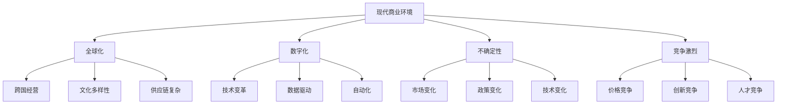
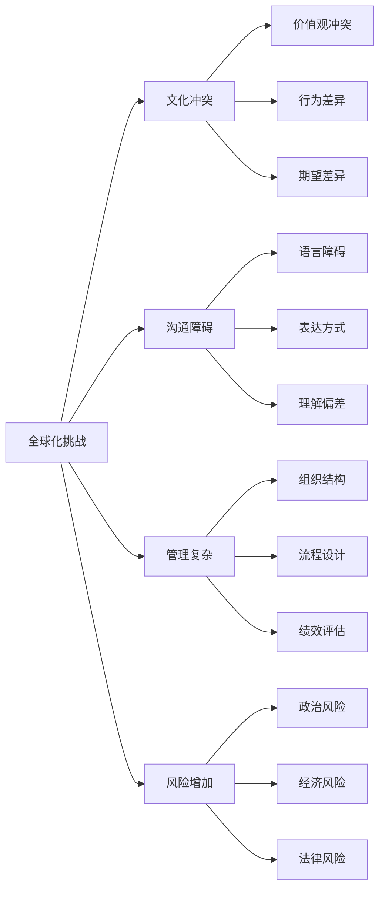
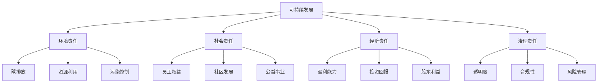
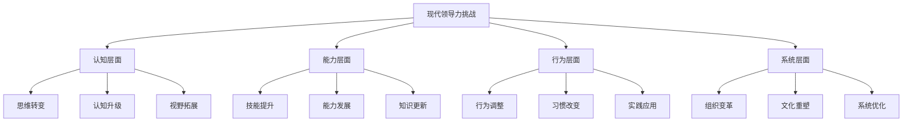

# 现代领导力挑战

## 🌍 时代背景分析

### 现代商业环境特征

### 社会文化变化
- **价值观多元化**：不同价值观并存
- **代际差异**：不同代际的价值观差异
- **性别平等**：性别平等意识增强
- **社会责任**：企业社会责任要求提高

## 🎯 核心挑战分析

### 1. 数字化转型挑战

#### 挑战特征
- **技术快速迭代**：新技术不断涌现
- **数据驱动决策**：基于数据的决策模式
- **自动化替代**：人工智能替代部分工作
- **远程工作管理**：管理远程分散团队

#### 具体表现
| 方面 | 传统模式 | 数字化模式 | 挑战 |
|------|----------|------------|------|
| **沟通方式** | 面对面 | 数字化工具 | 缺乏情感连接 |
| **决策模式** | 经验驱动 | 数据驱动 | 数据解读能力 |
| **工作方式** | 集中办公 | 远程办公 | 团队协作困难 |
| **管理模式** | 层级管理 | 扁平管理 | 控制力减弱 |

#### 应对策略
1. **技术素养提升**：学习新技术和工具
2. **数据思维培养**：建立数据驱动思维
3. **远程管理技能**：掌握远程管理方法
4. **数字化文化**：建立数字化企业文化

### 2. 全球化挑战

#### 挑战特征
- **文化差异**：不同文化背景的团队
- **时区差异**：跨时区协作困难
- **法律差异**：不同国家的法律法规
- **市场差异**：不同市场的需求差异

#### 具体表现

#### 应对策略
1. **跨文化培训**：提升跨文化理解能力
2. **沟通技能**：掌握跨文化沟通技巧
3. **本地化策略**：适应本地市场和文化
4. **风险管理**：建立全球风险管理体系

### 3. 人才管理挑战

#### 挑战特征
- **人才短缺**：优质人才供不应求
- **代际差异**：不同代际的工作方式
- **离职率高**：员工忠诚度下降
- **技能更新**：技能要求快速变化

#### 具体表现
| 代际 | 特征 | 需求 | 挑战 |
|------|------|------|------|
| **60后** | 传统、稳定 | 尊重、保障 | 适应变化 |
| **70后** | 务实、责任 | 发展、平衡 | 创新思维 |
| **80后** | 独立、竞争 | 成长、认可 | 团队协作 |
| **90后** | 创新、自由 | 意义、体验 | 传统管理 |
| **00后** | 多元、个性 | 价值、发展 | 个性化管理 |

#### 应对策略
1. **人才吸引**：建立有吸引力的雇主品牌
2. **个性化管理**：根据员工特点个性化管理
3. **技能发展**：提供持续学习机会
4. **文化建设**：建立包容性企业文化

### 4. 可持续发展挑战

#### 挑战特征
- **环境责任**：环境保护要求提高
- **社会责任**：企业社会责任要求
- **长期发展**：关注长期可持续性
- **利益相关者**：平衡多方利益

#### 具体表现

#### 应对策略
1. **战略整合**：将可持续发展融入战略
2. **文化建设**：建立可持续发展文化
3. **绩效评估**：建立可持续发展指标体系
4. **利益相关者管理**：平衡多方利益

### 5. 不确定性挑战

#### 挑战特征
- **市场变化**：市场需求快速变化
- **技术变化**：技术发展日新月异
- **政策变化**：政策环境不断调整
- **竞争变化**：竞争格局持续演变

#### 具体表现
| 不确定性类型 | 特征 | 影响 | 应对 |
|--------------|------|------|------|
| **市场不确定性** | 需求变化 | 销售波动 | 市场调研 |
| **技术不确定性** | 技术迭代 | 产品过时 | 技术跟踪 |
| **政策不确定性** | 政策调整 | 合规风险 | 政策监控 |
| **竞争不确定性** | 竞争加剧 | 市场份额 | 竞争分析 |

#### 应对策略
1. **敏捷管理**：建立敏捷响应机制
2. **风险管理**：建立风险管理体系
3. **创新驱动**：持续创新和变革
4. **学习型组织**：建立学习型组织

## 🛠️ 应对策略框架

### 综合应对模型

### 具体应对策略

#### 1. 思维转变策略
- **系统思维**：从局部思维转向系统思维
- **创新思维**：从传统思维转向创新思维
- **用户思维**：从产品思维转向用户思维
- **数据思维**：从经验思维转向数据思维

#### 2. 能力发展策略
- **数字化能力**：提升数字化应用能力
- **跨文化能力**：发展跨文化管理能力
- **创新能力**：培养创新和变革能力
- **学习能力**：建立持续学习能力

#### 3. 行为调整策略
- **敏捷响应**：快速响应环境变化
- **协作管理**：加强团队协作管理
- **个性化管理**：根据员工特点管理
- **持续改进**：建立持续改进机制

#### 4. 系统优化策略
- **组织变革**：推动组织结构变革
- **文化重塑**：重塑企业文化
- **流程优化**：优化管理流程
- **技术应用**：应用新技术工具

## 📊 挑战优先级分析

### 挑战影响矩阵
| 挑战类型 | 影响程度 | 紧迫程度 | 优先级 | 应对难度 |
|----------|----------|----------|--------|----------|
| **数字化转型** | 高 | 高 | 高 | 中 |
| **全球化** | 高 | 中 | 高 | 高 |
| **人才管理** | 高 | 高 | 高 | 中 |
| **可持续发展** | 中 | 中 | 中 | 高 |
| **不确定性** | 高 | 高 | 高 | 高 |

### 应对策略优先级
1. **数字化转型**：技术能力提升、数字化文化建设
2. **人才管理**：人才吸引、个性化管理、技能发展
3. **不确定性管理**：风险管理、敏捷管理、创新驱动
4. **全球化管理**：跨文化培训、本地化策略、风险管理
5. **可持续发展**：战略整合、文化建设、绩效评估

## 🎯 成功案例分析

### 数字化转型成功案例
**案例**：某科技公司数字化转型
- **挑战**：传统业务模式面临数字化冲击
- **策略**：全面数字化转型，建立数字化文化
- **结果**：业务效率提升30%，客户满意度提高

### 全球化管理成功案例
**案例**：某跨国企业全球化管理
- **挑战**：管理不同文化背景的团队
- **策略**：跨文化培训，本地化策略
- **结果**：全球团队协作效率提升，文化冲突减少

### 人才管理成功案例
**案例**：某互联网公司人才管理
- **挑战**：人才流失率高，代际差异大
- **策略**：个性化管理，文化建设
- **结果**：员工满意度提升，离职率下降

## 🔗 相关概念链接

### 基础概念
- [[01-领导力概述|领导力概述]]
- [[02-管理者vs领导者|管理者vs领导者]]
- [[03-领导力发展历程|发展历程]]

### 理论概念
- [[02-理论理解层/现代领导理论/01-变革型领导|变革型领导]]
- [[02-理论理解层/现代领导理论/03-分布式领导|分布式领导]]

### 能力概念
- [[03-能力构建层/核心领导能力/05-变革管理|变革管理]]
- [[03-能力构建层/核心领导能力/06-情商与自我管理|情商管理]]

### 实践概念
- [[04-实践应用层/特殊情境/01-跨文化领导|跨文化领导]]
- [[04-实践应用层/特殊情境/02-数字化转型领导|数字化转型]]

## 💡 学习要点总结

### 关键理解
1. **挑战是常态**：现代领导者面临多重挑战
2. **适应是关键**：适应能力是核心能力
3. **综合应对**：需要综合多种策略应对
4. **持续学习**：持续学习是应对挑战的基础

### 实践应用
1. **挑战识别**：识别当前面临的主要挑战
2. **策略制定**：制定针对性的应对策略
3. **能力发展**：发展应对挑战的能力
4. **持续改进**：基于反馈持续改进

### 思考问题
1. 你当前面临的主要领导力挑战是什么？
2. 如何提升应对挑战的能力？
3. 如何平衡不同挑战的优先级？
4. 如何建立持续应对挑战的机制？

---

**下一步**：[[05-领导力伦理与价值观|伦理价值观]] | [[02-理论理解层/经典领导理论/01-特质理论|特质理论]]
