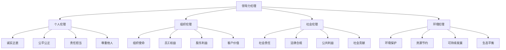
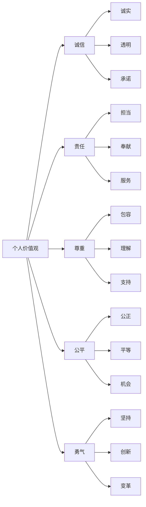
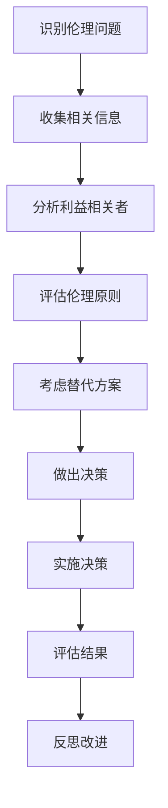
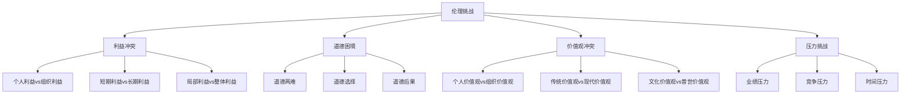
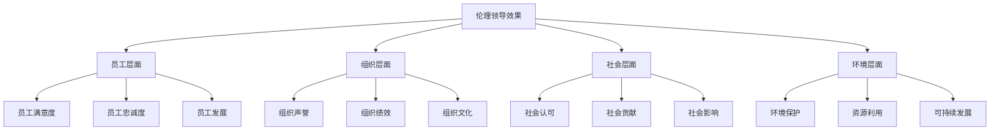

# 领导力伦理与价值观

## 🎯 核心概念

### 领导力伦理的定义
**领导力伦理**是指领导者在行使领导职能过程中应当遵循的道德准则和价值标准，包括对员工、组织、社会和环境承担的道德责任。

### 价值观的定义
**价值观**是指个人或组织对事物重要性的判断标准，是指导行为和决策的基本信念和原则。

## 🏛️ 伦理框架体系

### 伦理层次结构

### 伦理决策框架
| 维度 | 问题 | 考虑因素 |
|------|------|----------|
| **合法性** | 行为是否合法？ | 法律法规、行业规范 |
| **公平性** | 行为是否公平？ | 利益分配、机会均等 |
| **责任性** | 行为是否负责？ | 对各方的影响和责任 |
| **诚实性** | 行为是否诚实？ | 信息透明、承诺履行 |
| **尊重性** | 行为是否尊重？ | 人格尊严、文化差异 |

## 📊 核心价值观体系

### 个人价值观

### 组织价值观
| 价值观类别 | 核心内容 | 具体表现 |
|------------|----------|----------|
| **使命导向** | 明确组织使命 | 愿景清晰、目标明确 |
| **客户至上** | 以客户为中心 | 服务优质、需求满足 |
| **员工发展** | 关注员工成长 | 培训机会、职业发展 |
| **创新驱动** | 持续创新发展 | 技术创新、管理创新 |
| **合作共赢** | 多方利益平衡 | 合作伙伴、利益相关者 |

### 社会价值观
- **社会责任**：承担社会责任，关注社会问题
- **法律合规**：遵守法律法规，维护法律尊严
- **公共利益**：维护公共利益，服务社会大众
- **社会贡献**：为社会创造价值，推动社会进步

## 🎭 伦理领导类型

### 服务型领导
#### 核心特征
- **服务优先**：服务他人为先
- **倾听能力**：倾听员工声音
- **同理心**：理解员工感受
- **治愈能力**：帮助员工成长

#### 行为表现
| 行为维度 | 具体表现 | 影响效果 |
|----------|----------|----------|
| **服务他人** | 优先考虑员工需求 | 员工满意度提升 |
| **倾听理解** | 主动倾听员工意见 | 沟通效果改善 |
| **同理关怀** | 理解员工困难 | 员工忠诚度提高 |
| **成长支持** | 支持员工发展 | 员工能力提升 |

### 变革型领导
#### 核心特征
- **理想化影响**：树立榜样和愿景
- **鼓舞性激励**：激发员工潜能
- **智力激发**：鼓励创新思维
- **个性化关怀**：关注员工发展

#### 伦理要求
- **道德榜样**：以身作则，树立道德榜样
- **价值观引导**：引导员工树立正确价值观
- **公平公正**：公平对待所有员工
- **责任担当**：承担领导责任

### 真实型领导
#### 核心特征
- **自我认知**：了解自己的价值观
- **关系透明**：建立透明的关系
- **平衡处理**：平衡多方利益
- **道德行为**：坚持道德行为

#### 伦理要求
- **诚实透明**：保持诚实和透明
- **一致性**：言行一致
- **道德勇气**：坚持道德原则
- **持续改进**：持续改进道德行为

## ⚖️ 伦理决策模型

### 伦理决策流程

### 伦理决策工具

#### 1. 利益相关者分析
| 利益相关者 | 利益诉求 | 影响程度 | 应对策略 |
|------------|----------|----------|----------|
| **员工** | 工作保障、发展机会 | 高 | 优先考虑 |
| **客户** | 产品质量、服务质量 | 高 | 重点关注 |
| **股东** | 投资回报、风险控制 | 中 | 平衡考虑 |
| **社会** | 社会责任、环境保护 | 中 | 积极承担 |
| **政府** | 法律合规、税收贡献 | 低 | 严格遵守 |

#### 2. 伦理原则评估
| 伦理原则 | 权重 | 评估标准 | 得分 |
|----------|------|----------|------|
| **诚实** | 30% | 信息真实、承诺履行 | |
| **公平** | 25% | 机会均等、利益公平 | |
| **责任** | 25% | 承担责任、后果承担 | |
| **尊重** | 20% | 人格尊严、文化尊重 | |

#### 3. 决策矩阵
| 方案 | 诚实 | 公平 | 责任 | 尊重 | 总分 | 排名 |
|------|------|------|------|------|------|------|
| 方案A | 8 | 7 | 9 | 8 | 7.8 | 1 |
| 方案B | 7 | 8 | 7 | 7 | 7.2 | 2 |
| 方案C | 6 | 6 | 8 | 9 | 6.8 | 3 |

## 🚨 伦理挑战与困境

### 常见伦理挑战

### 典型伦理困境

#### 1. 业绩压力与伦理原则
- **困境**：业绩目标与伦理原则冲突
- **表现**：为完成目标而忽视伦理
- **应对**：坚持伦理原则，寻找平衡

#### 2. 员工利益与组织利益
- **困境**：员工个人利益与组织整体利益冲突
- **表现**：难以平衡员工需求与组织目标
- **应对**：寻求双赢解决方案

#### 3. 短期利益与长期发展
- **困境**：短期业绩与长期可持续发展冲突
- **表现**：为短期利益牺牲长期发展
- **应对**：平衡短期与长期利益

#### 4. 文化差异与伦理标准
- **困境**：不同文化背景下的伦理标准差异
- **表现**：难以确定统一的伦理标准
- **应对**：尊重文化差异，寻求共同标准

## 🛠️ 伦理建设策略

### 个人伦理建设

```mermaid
graph LR
    A[个人伦理建设] --> B[自我认知]
    A --> C[价值观澄清]
    A --> D[道德修养]
    A --> E[实践应用]
    
    B --> B1[价值观识别]
    B --> B2[道德标准]
    B --> B3[行为模式]
    
    C --> C1[核心价值观]
    C --> C2[伦理原则]
    C --> C3[行为准则]
    
    D --> D1[道德学习]
    D --> D2[道德实践]
    D --> D3[道德反思]
    
    E --> E1[伦理决策]
    E --> E2[伦理行为]
    E --> E3[伦理影响]
```

### 组织伦理建设
| 建设维度 | 具体措施 | 实施方法 | 评估标准 |
|----------|----------|----------|----------|
| **伦理文化** | 建立伦理文化 | 价值观传播、行为规范 | 员工认同度 |
| **伦理制度** | 制定伦理制度 | 伦理准则、奖惩机制 | 制度执行率 |
| **伦理培训** | 开展伦理培训 | 伦理教育、案例分析 | 培训效果 |
| **伦理监督** | 建立监督机制 | 伦理审查、举报机制 | 违规处理率 |

### 伦理建设工具

#### 1. 伦理准则制定
- **明确原则**：制定明确的伦理原则
- **具体标准**：设定具体的伦理标准
- **行为规范**：建立行为规范
- **奖惩机制**：建立奖惩机制

#### 2. 伦理培训体系
- **基础培训**：伦理基础知识培训
- **案例培训**：伦理案例分析培训
- **实践培训**：伦理实践应用培训
- **持续培训**：持续伦理教育

#### 3. 伦理监督机制
- **内部监督**：建立内部监督机制
- **外部监督**：接受外部监督
- **举报机制**：建立举报机制
- **审查机制**：建立审查机制

## 📈 伦理领导效果评估

### 评估维度

### 评估指标
| 评估层面 | 具体指标 | 测量方法 | 目标值 |
|----------|----------|----------|--------|
| **员工层面** | 员工满意度、离职率 | 问卷调查、数据分析 | >85% |
| **组织层面** | 组织声誉、绩效指标 | 外部评价、内部数据 | 行业领先 |
| **社会层面** | 社会认可、贡献度 | 社会评价、公益数据 | 积极正面 |
| **环境层面** | 环保指标、可持续性 | 环境数据、可持续发展 | 持续改善 |

## 🔗 相关概念链接

### 基础概念
- [[01-领导力概述|领导力概述]]
- [[02-管理者vs领导者|管理者vs领导者]]
- [[03-领导力发展历程|发展历程]]

### 理论概念
- [[02-理论理解层/现代领导理论/02-服务型领导|服务型领导]]
- [[02-理论理解层/现代领导理论/01-变革型领导|变革型领导]]

### 能力概念
- [[03-能力构建层/核心领导能力/06-情商与自我管理|情商管理]]
- [[03-能力构建层/核心领导能力/02-决策能力|决策能力]]

### 实践概念
- [[04-实践应用层/管理实践/02-组织文化建设|组织文化]]
- [[05-发展提升层/自我发展/01-自我认知与评估|自我认知]]

## 💡 学习要点总结

### 关键理解
1. **伦理是基础**：伦理是领导力的基础
2. **价值观指导**：价值观指导领导行为
3. **利益平衡**：平衡多方利益
4. **持续建设**：持续建设伦理文化

### 实践应用
1. **伦理决策**：运用伦理决策模型
2. **价值观澄清**：明确个人价值观
3. **伦理建设**：参与组织伦理建设
4. **伦理监督**：建立伦理监督机制

### 思考问题
1. 你的核心价值观是什么？
2. 如何平衡不同利益相关者的利益？
3. 如何处理伦理困境？
4. 如何建设组织伦理文化？

---

**下一步**：[[02-理论理解层/经典领导理论/01-特质理论|特质理论]] | [[02-理论理解层/现代领导理论/02-服务型领导|服务型领导]]
