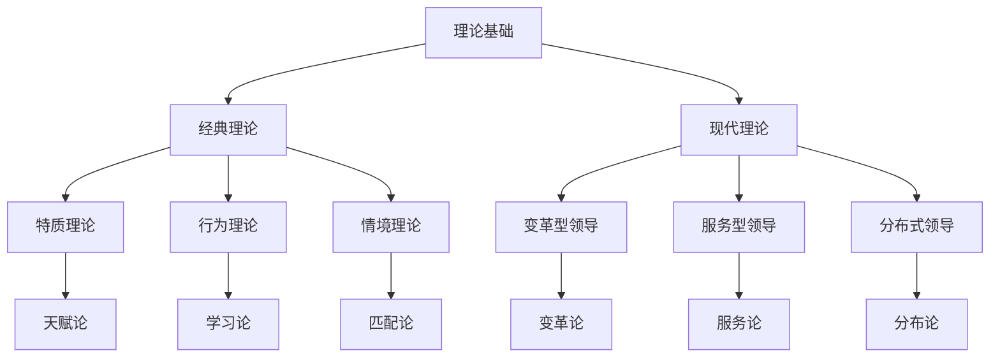
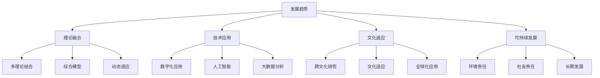

# 领导力模型对比表

## 📊 综合对比矩阵

### 经典理论模型对比
| 模型 | 理论基础 | 核心维度 | 主要特征 | 适用情境 | 优势 | 劣势 | 现代价值 |
|------|----------|----------|----------|----------|------|------|----------|
| **特质理论** | 天赋论 | 个人特质 | 天生特质 | 传统组织 | 理论基础扎实 | 忽视环境因素 | 人才选拔指导 |
| **行为理论** | 学习论 | 行为模式 | 可学习行为 | 现代组织 | 可操作性强 | 忽视情境因素 | 领导培训基础 |
| **情境理论** | 匹配论 | 情境因素 | 情境适应 | 复杂组织 | 情境意识强 | 情境分析复杂 | 风格选择指导 |

### 现代理论模型对比
| 模型 | 理论基础 | 核心维度 | 主要特征 | 适用情境 | 优势 | 劣势 | 现代价值 |
|------|----------|----------|----------|----------|------|------|----------|
| **变革型领导** | 变革论 | 四维度模型 | 变革导向 | 变革组织 | 变革能力强 | 实施难度大 | 变革管理指导 |
| **服务型领导** | 服务论 | 十项特征 | 服务导向 | 服务组织 | 道德导向强 | 效率较低 | 文化建设指导 |
| **分布式领导** | 分布论 | 分布模式 | 分布协作 | 网络组织 | 适应性强 | 管理复杂 | 组织设计指导 |

## 🔍 详细维度对比

### 理论基础对比

### 核心维度对比
| 理论模型 | 维度1 | 维度2 | 维度3 | 维度4 | 维度5 |
|----------|-------|-------|-------|-------|-------|
| **特质理论** | 智力特质 | 性格特质 | 社会特质 | 身体特质 | - |
| **行为理论** | 关怀维度 | 结构维度 | - | - | - |
| **情境理论** | 领导风格 | 情境有利性 | 匹配关系 | - | - |
| **变革型领导** | 理想化影响 | 鼓舞性激励 | 智力激发 | 个性化关怀 | - |
| **服务型领导** | 倾听 | 同理心 | 治愈 | 觉察 | 说服 |
| **分布式领导** | 水平分布 | 垂直分布 | 功能分布 | 协作机制 | 网络连接 |

### 主要特征对比
| 理论模型 | 领导定义 | 领导特征 | 领导过程 | 领导效果 |
|----------|----------|----------|----------|----------|
| **特质理论** | 具有特定特质的个人 | 个人特质特征 | 特质发挥作用 | 基于特质的效果 |
| **行为理论** | 特定行为模式的个人 | 行为模式特征 | 行为产生效果 | 基于行为的效果 |
| **情境理论** | 适应情境的个人 | 情境适应特征 | 情境匹配过程 | 基于匹配的效果 |
| **变革型领导** | 推动变革的个人 | 变革导向特征 | 变革影响过程 | 基于变革的效果 |
| **服务型领导** | 服务他人的个人 | 服务导向特征 | 服务影响过程 | 基于服务的效果 |
| **分布式领导** | 分布领导的系统 | 分布导向特征 | 分布协作过程 | 基于协作的效果 |

## 📈 适用情境对比

### 组织类型适用性
| 理论模型 | 传统组织 | 现代组织 | 变革组织 | 服务组织 | 网络组织 |
|----------|----------|----------|----------|----------|----------|
| **特质理论** | ⭐⭐⭐⭐⭐ | ⭐⭐⭐ | ⭐⭐ | ⭐⭐ | ⭐ |
| **行为理论** | ⭐⭐⭐⭐ | ⭐⭐⭐⭐⭐ | ⭐⭐⭐ | ⭐⭐⭐ | ⭐⭐ |
| **情境理论** | ⭐⭐⭐ | ⭐⭐⭐⭐ | ⭐⭐⭐⭐ | ⭐⭐⭐ | ⭐⭐⭐ |
| **变革型领导** | ⭐⭐ | ⭐⭐⭐⭐ | ⭐⭐⭐⭐⭐ | ⭐⭐⭐ | ⭐⭐⭐⭐ |
| **服务型领导** | ⭐⭐⭐ | ⭐⭐⭐ | ⭐⭐ | ⭐⭐⭐⭐⭐ | ⭐⭐⭐ |
| **分布式领导** | ⭐ | ⭐⭐⭐ | ⭐⭐⭐⭐ | ⭐⭐⭐ | ⭐⭐⭐⭐⭐ |

### 环境特征适用性
| 理论模型 | 稳定环境 | 变化环境 | 复杂环境 | 竞争环境 | 合作环境 |
|----------|----------|----------|----------|----------|----------|
| **特质理论** | ⭐⭐⭐⭐⭐ | ⭐⭐ | ⭐⭐ | ⭐⭐⭐ | ⭐⭐⭐ |
| **行为理论** | ⭐⭐⭐⭐ | ⭐⭐⭐ | ⭐⭐⭐ | ⭐⭐⭐⭐ | ⭐⭐⭐ |
| **情境理论** | ⭐⭐⭐ | ⭐⭐⭐⭐ | ⭐⭐⭐⭐⭐ | ⭐⭐⭐⭐ | ⭐⭐⭐ |
| **变革型领导** | ⭐⭐ | ⭐⭐⭐⭐⭐ | ⭐⭐⭐⭐ | ⭐⭐⭐ | ⭐⭐⭐⭐ |
| **服务型领导** | ⭐⭐⭐⭐ | ⭐⭐⭐ | ⭐⭐⭐ | ⭐⭐ | ⭐⭐⭐⭐⭐ |
| **分布式领导** | ⭐⭐ | ⭐⭐⭐⭐ | ⭐⭐⭐⭐⭐ | ⭐⭐⭐ | ⭐⭐⭐⭐⭐ |

### 员工特征适用性
| 理论模型 | 被动员工 | 主动员工 | 变革员工 | 服务员工 | 协作员工 |
|----------|----------|----------|----------|----------|----------|
| **特质理论** | ⭐⭐⭐⭐⭐ | ⭐⭐⭐ | ⭐⭐ | ⭐⭐ | ⭐⭐ |
| **行为理论** | ⭐⭐⭐⭐ | ⭐⭐⭐⭐ | ⭐⭐⭐ | ⭐⭐⭐ | ⭐⭐⭐ |
| **情境理论** | ⭐⭐⭐ | ⭐⭐⭐⭐ | ⭐⭐⭐⭐ | ⭐⭐⭐ | ⭐⭐⭐ |
| **变革型领导** | ⭐⭐ | ⭐⭐⭐⭐ | ⭐⭐⭐⭐⭐ | ⭐⭐⭐ | ⭐⭐⭐⭐ |
| **服务型领导** | ⭐⭐⭐ | ⭐⭐⭐ | ⭐⭐ | ⭐⭐⭐⭐⭐ | ⭐⭐⭐ |
| **分布式领导** | ⭐⭐ | ⭐⭐⭐⭐ | ⭐⭐⭐⭐ | ⭐⭐⭐ | ⭐⭐⭐⭐⭐ |

## ⚖️ 优势劣势对比

### 理论优势对比
| 理论模型 | 优势1 | 优势2 | 优势3 | 优势4 | 优势5 |
|----------|-------|-------|-------|-------|-------|
| **特质理论** | 理论基础扎实 | 特质识别清晰 | 人才选拔指导 | 研究历史悠久 | 概念简单易懂 |
| **行为理论** | 可操作性强 | 行为分类明确 | 领导培训基础 | 效果可观察 | 实施相对简单 |
| **情境理论** | 情境意识强 | 适应性强 | 风格选择指导 | 考虑环境因素 | 匹配关系清晰 |
| **变革型领导** | 变革能力强 | 内在激励强 | 创新促进 | 员工发展 | 长期效果 |
| **服务型领导** | 道德导向强 | 员工中心 | 文化建设 | 长期发展 | 社会价值 |
| **分布式领导** | 适应性强 | 创新促进 | 资源整合 | 员工发展 | 网络效应 |

### 理论劣势对比
| 理论模型 | 劣势1 | 劣势2 | 劣势3 | 劣势4 | 劣势5 |
|----------|-------|-------|-------|-------|-------|
| **特质理论** | 忽视环境因素 | 关系不清 | 缺乏实证 | 静态观点 | 应用困难 |
| **行为理论** | 忽视情境因素 | 静态观点 | 效果复杂 | 文化差异 | 适用性有限 |
| **情境理论** | 情境分析复杂 | 主观性强 | 动态性挑战 | 文化差异 | 应用困难 |
| **变革型领导** | 实施难度大 | 效果缓慢 | 成本较高 | 文化依赖 | 短期效果差 |
| **服务型领导** | 效率较低 | 实施困难 | 成本较高 | 文化依赖 | 短期效果差 |
| **分布式领导** | 管理复杂 | 协调困难 | 责任模糊 | 文化依赖 | 实施困难 |

## 🎯 现代价值评估

### 现代价值评分
| 理论模型 | 理论完整性 | 实践适用性 | 实证支持度 | 现代适应性 | 文化适应性 | 总分 | 排名 |
|----------|------------|------------|------------|------------|------------|------|------|
| **特质理论** | 3 | 2 | 3 | 2 | 3 | 2.6 | 6 |
| **行为理论** | 4 | 4 | 4 | 3 | 3 | 3.6 | 4 |
| **情境理论** | 4 | 4 | 4 | 4 | 3 | 3.8 | 3 |
| **变革型领导** | 5 | 4 | 5 | 5 | 3 | 4.4 | 1 |
| **服务型领导** | 4 | 3 | 4 | 4 | 4 | 3.8 | 2 |
| **分布式领导** | 3 | 5 | 3 | 5 | 3 | 3.6 | 5 |

### 现代应用价值
| 理论模型 | 人才选拔 | 领导培训 | 组织设计 | 文化建设 | 变革管理 | 综合价值 |
|----------|----------|----------|----------|----------|----------|----------|
| **特质理论** | ⭐⭐⭐⭐⭐ | ⭐⭐ | ⭐⭐ | ⭐⭐ | ⭐⭐ | ⭐⭐ |
| **行为理论** | ⭐⭐⭐ | ⭐⭐⭐⭐⭐ | ⭐⭐⭐ | ⭐⭐⭐ | ⭐⭐⭐ | ⭐⭐⭐ |
| **情境理论** | ⭐⭐⭐ | ⭐⭐⭐⭐ | ⭐⭐⭐ | ⭐⭐⭐ | ⭐⭐⭐ | ⭐⭐⭐ |
| **变革型领导** | ⭐⭐⭐ | ⭐⭐⭐⭐ | ⭐⭐⭐ | ⭐⭐⭐⭐ | ⭐⭐⭐⭐⭐ | ⭐⭐⭐⭐ |
| **服务型领导** | ⭐⭐⭐ | ⭐⭐⭐ | ⭐⭐⭐ | ⭐⭐⭐⭐⭐ | ⭐⭐ | ⭐⭐⭐ |
| **分布式领导** | ⭐⭐ | ⭐⭐⭐ | ⭐⭐⭐⭐⭐ | ⭐⭐⭐ | ⭐⭐⭐⭐ | ⭐⭐⭐⭐ |

## 📊 发展趋势分析

### 理论发展趋势

### 应用发展趋势
| 理论模型 | 发展趋势 | 发展方向 | 发展重点 | 发展挑战 |
|----------|----------|----------|----------|----------|
| **特质理论** | 特质发展 | 可发展特质 | 特质测量 | 环境适应 |
| **行为理论** | 行为细化 | 情境行为 | 行为培训 | 文化适应 |
| **情境理论** | 情境简化 | 动态情境 | 情境分析 | 复杂性管理 |
| **变革型领导** | 变革深化 | 数字化变革 | 变革管理 | 实施难度 |
| **服务型领导** | 服务扩展 | 数字化服务 | 服务文化 | 效率平衡 |
| **分布式领导** | 分布深化 | 网络分布 | 组织设计 | 管理复杂 |

## 🔗 相关概念链接

### 基础概念
- [[01-基础认知层/01-领导力概述|领导力概述]]
- [[01-基础认知层/03-领导力发展历程|发展历程]]
- [[01-基础认知层/04-现代领导力挑战|现代挑战]]

### 理论概念
- [[01-特质理论|特质理论]]
- [[02-行为理论|行为理论]]
- [[03-情境理论|情境理论]]
- [[01-变革型领导|变革型领导]]
- [[02-服务型领导|服务型领导]]
- [[03-分布式领导|分布式领导]]

### 能力概念
- [[03-能力构建层/核心领导能力/01-战略思维|战略思维]]
- [[03-能力构建层/核心领导能力/05-变革管理|变革管理]]

### 实践概念
- [[04-实践应用层/管理实践/01-团队管理|团队管理]]
- [[04-实践应用层/特殊情境/02-数字化转型领导|数字化转型]]

## 💡 学习要点总结

### 关键理解
1. **模型对比**：不同模型各有特点和适用性
2. **情境选择**：根据情境选择合适的模型
3. **模型融合**：可以结合多个模型的优势
4. **发展趋势**：模型不断发展和完善

### 实践应用
1. **模型选择**：根据组织特点选择模型
2. **模型应用**：在实践中应用模型
3. **模型融合**：结合多个模型的优势
4. **模型发展**：关注模型发展趋势

### 思考问题
1. 你认为哪个模型最有价值？
2. 如何根据情境选择模型？
3. 模型融合的可能性？
4. 未来领导力模型会如何发展？

---

**下一步**：[[03-能力构建层/核心领导能力/01-战略思维|战略思维]] | [[03-能力构建层/核心领导能力/02-决策能力|决策能力]]
