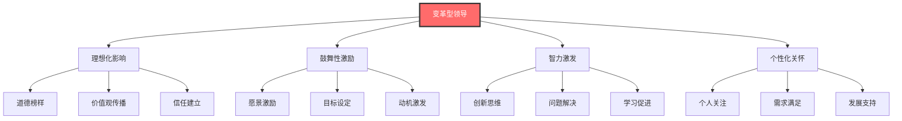
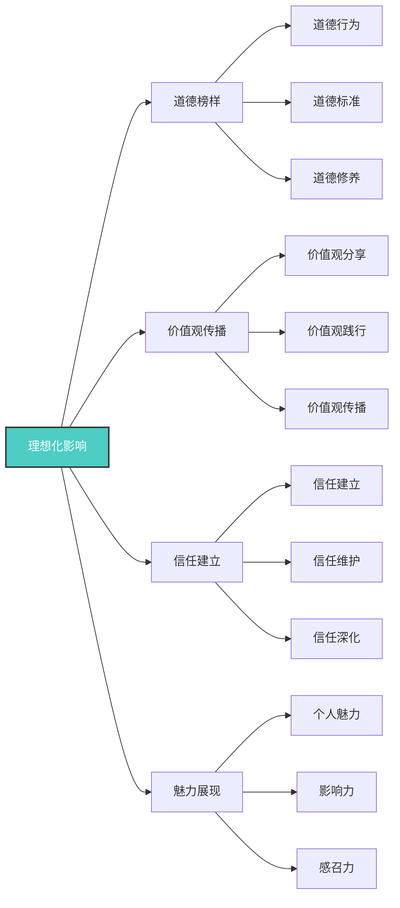
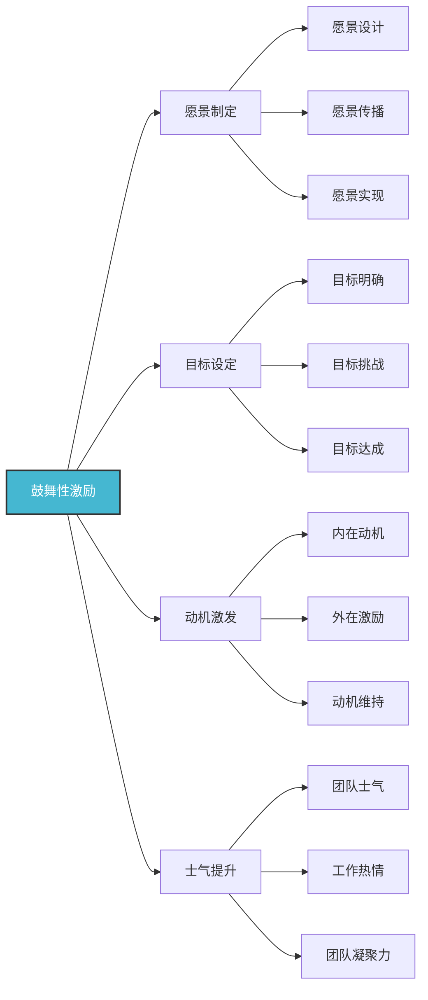
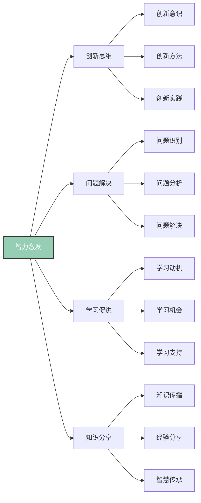
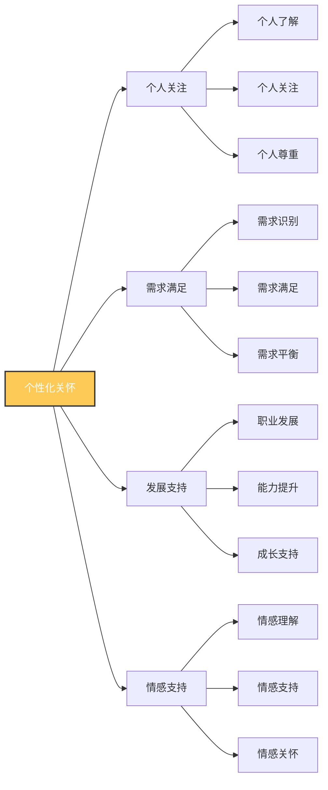
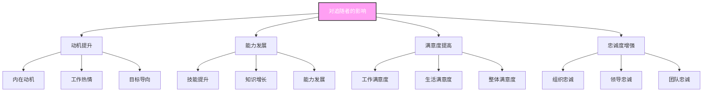
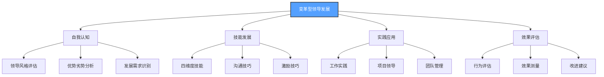

# 变革型领导

## 🎯 理论概述

### 基本定义
**变革型领导**（Transformational Leadership）是现代领导理论的核心，强调领导者通过激发追随者的内在动机，提升其道德水平和能力，实现超越个人利益的共同目标。

### 核心特征

## 📚 理论发展历程

### 历史发展脉络

### 代表人物及贡献
| 学者 | 时期 | 主要贡献 | 核心观点 |
|------|------|----------|----------|
| **詹姆斯·麦格雷戈·伯恩斯** | 1970s | 变革型领导概念 | 变革vs交易领导区分 |
| **伯纳德·巴斯** | 1980s | 四维度模型 | 理想化影响、鼓舞激励、智力激发、个性化关怀 |
| **肯尼思·勒温** | 1990s | 测量工具开发 | MLQ量表开发 |
| **现代学者** | 2000s | 理论扩展 | 跨文化、数字化适应 |

## 🔍 四维度详细分析

### 1. 理想化影响（Idealized Influence）

#### 具体行为表现
| 行为类型 | 具体表现 | 实施方法 | 预期效果 |
|----------|----------|----------|----------|
| **道德榜样** | 以身作则、言行一致 | 道德行为示范 | 建立道德标准 |
| **价值观传播** | 分享价值观、践行理念 | 价值观沟通 | 统一价值观念 |
| **信任建立** | 诚实守信、承诺履行 | 信任行为 | 建立信任关系 |
| **魅力展现** | 个人魅力、影响力 | 魅力培养 | 增强感召力 |

### 2. 鼓舞性激励（Inspirational Motivation）

#### 具体行为表现
| 行为类型 | 具体表现 | 实施方法 | 预期效果 |
|----------|----------|----------|----------|
| **愿景制定** | 制定清晰愿景 | 愿景规划 | 提供方向指引 |
| **目标设定** | 设定挑战目标 | 目标管理 | 激发挑战动机 |
| **动机激发** | 激发内在动机 | 激励技巧 | 提升工作动机 |
| **士气提升** | 提升团队士气 | 士气管理 | 增强团队凝聚力 |

### 3. 智力激发（Intellectual Stimulation）

#### 具体行为表现
| 行为类型 | 具体表现 | 实施方法 | 预期效果 |
|----------|----------|----------|----------|
| **创新思维** | 鼓励创新、突破常规 | 创新文化 | 激发创新潜能 |
| **问题解决** | 引导思考、解决问题 | 问题解决技巧 | 提升解决问题能力 |
| **学习促进** | 促进学习、支持发展 | 学习支持 | 提升学习能力 |
| **知识分享** | 分享知识、传播智慧 | 知识管理 | 促进知识传播 |

### 4. 个性化关怀（Individualized Consideration）

#### 具体行为表现
| 行为类型 | 具体表现 | 实施方法 | 预期效果 |
|----------|----------|----------|----------|
| **个人关注** | 关注个人、了解需求 | 个人沟通 | 建立个人关系 |
| **需求满足** | 满足需求、提供支持 | 需求管理 | 提升满意度 |
| **发展支持** | 支持发展、提供机会 | 发展计划 | 促进个人成长 |
| **情感支持** | 情感理解、情感支持 | 情感管理 | 增强归属感 |

## 📊 变革型领导效果

### 对追随者的影响

### 对组织的影响
| 影响维度 | 具体表现 | 测量指标 | 影响程度 |
|----------|----------|----------|----------|
| **绩效提升** | 工作绩效、组织绩效 | 绩效指标 | 高 |
| **创新促进** | 创新行为、创新成果 | 创新指标 | 高 |
| **文化塑造** | 组织文化、价值观 | 文化指标 | 中 |
| **变革推动** | 变革接受、变革效果 | 变革指标 | 高 |

## 🎯 理论应用

### 领导发展
#### 发展策略

### 组织应用
| 应用领域 | 具体应用 | 实施方法 | 预期效果 |
|----------|----------|----------|----------|
| **领导选拔** | 选拔变革型领导者 | 评估工具、面试方法 | 提高领导质量 |
| **领导培训** | 培训变革型领导技能 | 培训项目、实践指导 | 提升领导能力 |
| **团队建设** | 建设变革型团队 | 团队活动、文化建设 | 增强团队凝聚力 |
| **组织变革** | 推动组织变革 | 变革管理、文化变革 | 提高变革成功率 |

## ⚖️ 理论评价

### 理论优势
| 优势 | 具体表现 | 价值意义 | 应用价值 |
|------|----------|----------|----------|
| **效果显著** | 提升绩效和满意度 | 提高组织效果 | 高 |
| **理论完整** | 四维度模型完整 | 理论体系完整 | 高 |
| **测量工具** | MLQ量表成熟 | 便于评估应用 | 高 |
| **实证支持** | 大量实证研究 | 理论可信度高 | 高 |

### 理论局限
| 局限 | 具体表现 | 影响 | 改进方向 |
|------|----------|------|----------|
| **文化差异** | 跨文化适用性 | 应用受限 | 本土化研究 |
| **情境因素** | 忽视情境影响 | 理论不完整 | 结合情境理论 |
| **测量复杂** | 测量工具复杂 | 应用困难 | 简化测量工具 |
| **成本较高** | 实施成本高 | 应用受限 | 降低成本 |

### 现代发展
#### 理论扩展
- **数字化适应**：适应数字化时代
- **跨文化研究**：跨文化适用性
- **情境整合**：结合情境因素
- **神经科学**：神经科学研究

#### 现代应用
- **数字化转型**：推动数字化转型
- **创新管理**：促进创新管理
- **可持续发展**：推动可持续发展
- **全球化领导**：适应全球化需求

## 🎓 费曼学习法应用

### 第一步：选择概念
选择"变革型领导"这一核心概念

### 第二步：教授他人
用简单语言向他人解释：
- 变革型领导就像优秀的教练，不仅教技术，更重要的是激发运动员的内在潜能和斗志

### 第三步：识别盲点
发现理解不足的地方：
- 如何平衡四个维度？
- 如何在不同情境下应用？

### 第四步：重新学习
回到资料重新学习盲点：
- 四维度平衡方法
- 情境适应性应用

### 第五步：简化表达
用更简洁的方式表达概念：
- 变革型领导 = 理想化影响 + 鼓舞激励 + 智力激发 + 个性化关怀

## 💡 刻意练习要点

### 练习目标
1. **明确目标**：掌握四维度技能
2. **专注练习**：重点练习薄弱维度
3. **即时反馈**：获得行为效果反馈
4. **走出舒适区**：挑战新的领导方式
5. **持续改进**：基于反馈不断优化

### 练习方法
| 练习类型 | 具体方法 | 实施步骤 | 评估标准 |
|----------|----------|----------|----------|
| **维度练习** | 练习四维度技能 | 1.选择维度 2.设定目标 3.练习行为 4.评估效果 | 技能掌握度 |
| **情境应用** | 在不同情境应用 | 1.识别情境 2.选择维度 3.应用行为 4.评估效果 | 应用适应性 |
| **团队实践** | 在团队中实践 | 1.选择团队 2.应用技能 3.观察效果 4.调整改进 | 实践效果 |
| **案例分析** | 分析成功案例 | 1.选择案例 2.分析维度 3.总结规律 4.应用实践 | 分析深度 |

## 🔗 相关概念链接

### 基础概念
- [[01-基础认知层/01-领导力概述|领导力概述]] - 理解领导力本质
- [[01-基础认知层/04-现代领导力挑战|现代挑战]] - 现代背景
- [[01-基础认知层/05-领导力伦理与价值观|伦理价值观]] - 价值基础

### 理论概念
- [[02-理论理解层/经典领导理论/01-特质理论|特质理论]] - 早期理论
- [[02-理论理解层/经典领导理论/02-行为理论|行为理论]] - 行为理论
- [[02-理论理解层/经典领导理论/03-情境理论|情境理论]] - 情境理论
- [[02-理论理解层/04-理论对比分析|理论对比]] - 综合分析

### 能力概念
- [[03-能力构建层/核心领导能力/01-战略思维|战略思维]] - 战略能力
- [[03-能力构建层/核心领导能力/05-变革管理|变革管理]] - 变革能力
- [[03-能力构建层/核心领导能力/06-情商与自我管理|情商管理]] - 情商能力

### 实践概念
- [[04-实践应用层/管理实践/02-组织文化建设|组织文化]] - 文化建设
- [[04-实践应用层/特殊情境/02-数字化转型领导|数字化转型]] - 数字化实践
- [[06-案例分析层/成功案例/01-成功领导者案例|成功案例]] - 案例学习

## 💡 学习要点总结

### 关键理解
1. **四维度模型**：理想化影响、鼓舞激励、智力激发、个性化关怀
2. **内在动机**：激发追随者内在动机
3. **超越利益**：实现超越个人利益的共同目标
4. **持续发展**：促进追随者持续发展

### 实践应用
1. **自我发展**：发展变革型领导技能
2. **团队建设**：建设变革型团队
3. **组织变革**：推动组织变革
4. **效果评估**：评估变革效果

### 思考问题
1. 你如何理解变革型领导的四个维度？
2. 如何发展变革型领导技能？
3. 如何在不同情境下应用变革型领导？
4. 如何评估变革型领导的效果？

---

**下一步**：[[02-服务型领导|服务型领导]] | [[03-分布式领导|分布式领导]]