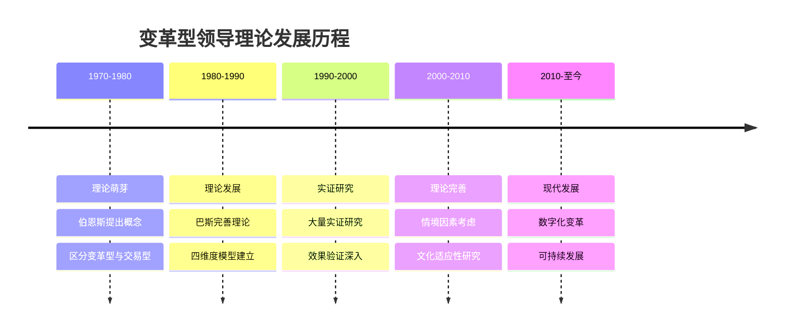
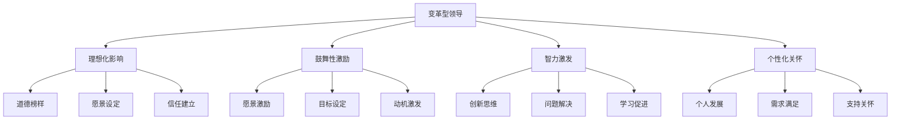
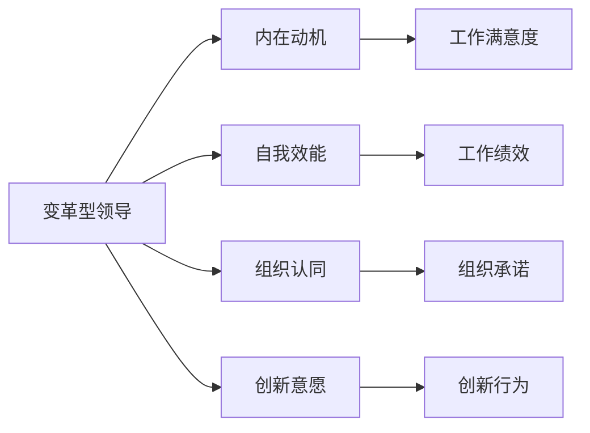
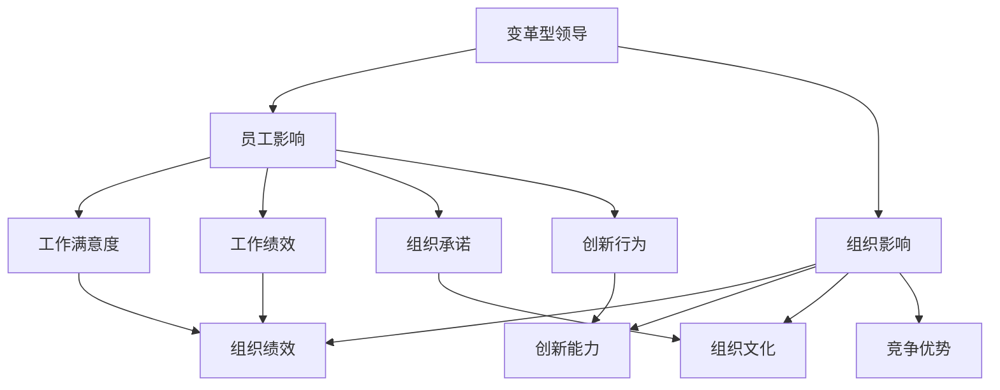
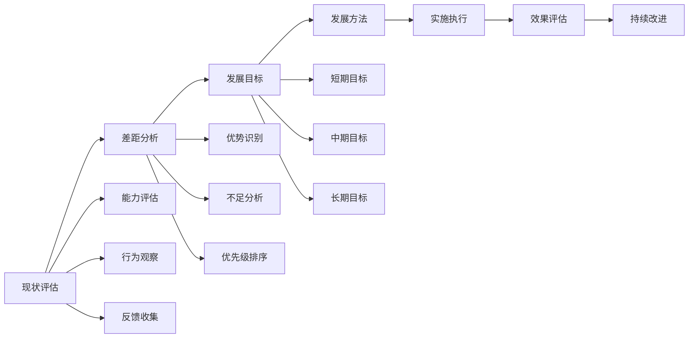
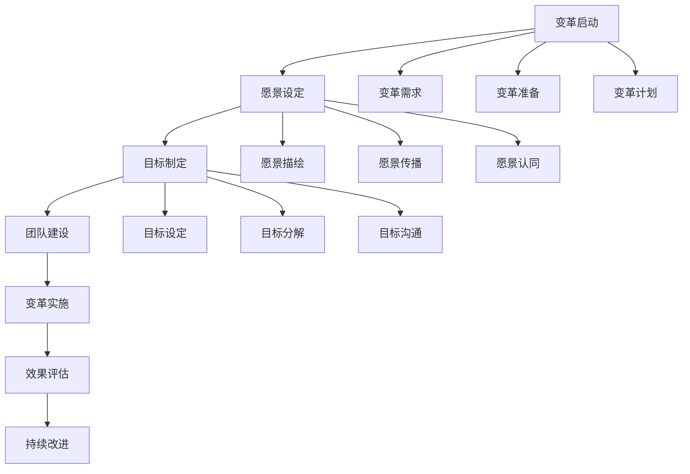

# 变革型领导

## 🎯 理论概述

### 基本定义
**变革型领导**（Transformational Leadership）是现代领导力理论的核心概念，指领导者通过个人魅力、愿景激励、智力激发和个性化关怀，激发追随者的内在动机，实现超越期望的组织变革和绩效提升。

### 核心特征
- **变革导向**：推动组织变革和创新
- **愿景驱动**：通过愿景激励追随者
- **内在激励**：激发追随者内在动机
- **超越期望**：实现超越期望的绩效

## 📚 理论发展历程

### 历史发展脉络

### 主要代表人物
| 学者 | 时期 | 主要贡献 | 核心观点 |
|------|------|----------|----------|
| **詹姆斯·伯恩斯** | 1970s | 变革型领导概念 | 区分变革型与交易型领导 |
| **伯纳德·巴斯** | 1980s | 四维度模型 | 建立变革型领导理论框架 |
| **肯尼斯·帕里** | 1990s | 实证研究 | 验证变革型领导效果 |
| **布鲁斯·阿沃利奥** | 2000s | 理论完善 | 完善变革型领导理论 |

## 🔍 四维度模型

### 理论框架

### 理想化影响（Idealized Influence）
#### 核心内容
- **道德榜样**：以身作则，树立道德榜样
- **愿景设定**：设定清晰的组织愿景
- **信任建立**：建立与追随者的信任关系

#### 具体表现
| 行为维度 | 具体表现 | 影响效果 | 实施要点 |
|----------|----------|----------|----------|
| **道德行为** | 诚实、正直、公平 | 建立信任 | 言行一致 |
| **愿景传播** | 清晰表达愿景 | 激发动力 | 反复强调 |
| **榜样作用** | 以身作则 | 影响行为 | 持续示范 |

#### 实施策略
1. **树立榜样**：通过行为树立道德榜样
2. **传播愿景**：清晰表达组织愿景
3. **建立信任**：通过一致性建立信任
4. **持续示范**：持续展示理想行为

### 鼓舞性激励（Inspirational Motivation）
#### 核心内容
- **愿景激励**：通过愿景激发追随者
- **目标设定**：设定挑战性目标
- **动机激发**：激发内在动机

#### 具体表现
| 行为维度 | 具体表现 | 影响效果 | 实施要点 |
|----------|----------|----------|----------|
| **愿景激励** | 描绘美好未来 | 激发热情 | 生动描述 |
| **目标挑战** | 设定挑战目标 | 激发潜能 | 适度挑战 |
| **动机激发** | 激发内在动机 | 持续动力 | 需求满足 |

#### 实施策略
1. **愿景描绘**：生动描绘组织愿景
2. **目标设定**：设定挑战性目标
3. **动机激发**：激发内在动机
4. **持续激励**：持续提供激励

### 智力激发（Intellectual Stimulation）
#### 核心内容
- **创新思维**：鼓励创新思维
- **问题解决**：促进问题解决
- **学习促进**：促进持续学习

#### 具体表现
| 行为维度 | 具体表现 | 影响效果 | 实施要点 |
|----------|----------|----------|----------|
| **创新鼓励** | 鼓励新想法 | 促进创新 | 容忍失败 |
| **问题解决** | 促进问题解决 | 提升能力 | 提供支持 |
| **学习促进** | 促进持续学习 | 能力提升 | 学习机会 |

#### 实施策略
1. **创新鼓励**：鼓励新想法和创新
2. **问题解决**：促进问题解决能力
3. **学习促进**：提供学习机会
4. **能力提升**：支持能力发展

### 个性化关怀（Individualized Consideration）
#### 核心内容
- **个人发展**：关注个人发展
- **需求满足**：满足个人需求
- **支持关怀**：提供支持关怀

#### 具体表现
| 行为维度 | 具体表现 | 影响效果 | 实施要点 |
|----------|----------|----------|----------|
| **个人发展** | 关注个人成长 | 能力提升 | 发展计划 |
| **需求满足** | 满足个人需求 | 满意度提升 | 需求识别 |
| **支持关怀** | 提供支持关怀 | 忠诚度提升 | 情感支持 |

#### 实施策略
1. **个人关注**：关注每个员工
2. **需求满足**：满足个人需求
3. **支持关怀**：提供支持关怀
4. **发展支持**：支持个人发展

## 📊 变革型领导效果

### 对员工的影响
#### 积极影响
| 影响维度 | 具体表现 | 测量指标 | 影响程度 |
|----------|----------|----------|----------|
| **工作满意度** | 工作满意度提升 | 满意度调查 | 高 |
| **工作绩效** | 工作绩效改善 | 绩效评估 | 高 |
| **组织承诺** | 组织承诺增强 | 承诺量表 | 高 |
| **创新行为** | 创新行为增加 | 创新指标 | 中 |

#### 影响机制

### 对组织的影响
#### 积极影响
| 影响维度 | 具体表现 | 测量指标 | 影响程度 |
|----------|----------|----------|----------|
| **组织绩效** | 组织绩效提升 | 财务指标 | 高 |
| **创新能力** | 创新能力增强 | 创新指标 | 高 |
| **组织文化** | 组织文化改善 | 文化评估 | 中 |
| **竞争优势** | 竞争优势提升 | 竞争指标 | 中 |

#### 影响路径

## 🎯 变革型领导应用

### 领导发展
#### 发展策略
| 发展维度 | 具体内容 | 发展方法 | 评估标准 |
|----------|----------|----------|----------|
| **理想化影响** | 道德榜样、愿景设定 | 道德培训、愿景训练 | 信任度评估 |
| **鼓舞性激励** | 愿景激励、目标设定 | 激励培训、目标管理 | 动机水平评估 |
| **智力激发** | 创新思维、问题解决 | 创新培训、问题解决 | 创新能力评估 |
| **个性化关怀** | 个人发展、需求满足 | 关怀培训、需求分析 | 关怀效果评估 |

#### 发展计划

### 组织变革
#### 变革策略
| 变革阶段 | 领导行为 | 具体措施 | 预期效果 |
|----------|----------|----------|----------|
| **变革准备** | 理想化影响 | 愿景设定、信任建立 | 变革准备就绪 |
| **变革实施** | 鼓舞性激励 | 目标设定、动机激发 | 变革顺利实施 |
| **变革推进** | 智力激发 | 创新鼓励、问题解决 | 变革持续推进 |
| **变革巩固** | 个性化关怀 | 个人发展、需求满足 | 变革成果巩固 |

#### 变革流程

## 📈 情境适应性

### 适用情境
#### 高适用情境
| 情境特征 | 具体表现 | 适用原因 | 实施要点 |
|----------|----------|----------|----------|
| **变革需求** | 组织需要变革 | 变革型领导擅长变革 | 强调变革重要性 |
| **创新要求** | 需要创新突破 | 智力激发促进创新 | 鼓励创新思维 |
| **团队建设** | 需要团队建设 | 个性化关怀促进团队 | 关注个人发展 |
| **长期发展** | 关注长期发展 | 愿景激励促进发展 | 设定长期愿景 |

#### 低适用情境
| 情境特征 | 具体表现 | 不适用原因 | 替代方案 |
|----------|----------|------------|----------|
| **紧急任务** | 时间紧迫 | 变革型领导见效慢 | 交易型领导 |
| **简单任务** | 任务简单 | 变革型领导过于复杂 | 任务型领导 |
| **稳定环境** | 环境稳定 | 变革型领导不必要 | 维持型领导 |
| **资源有限** | 资源不足 | 变革型领导成本高 | 效率型领导 |

### 文化适应性
#### 文化因素影响
| 文化维度 | 影响程度 | 具体表现 | 适应策略 |
|----------|----------|----------|----------|
| **权力距离** | 高 | 影响理想化影响效果 | 调整权力距离 |
| **个人主义** | 中 | 影响个性化关怀效果 | 平衡个人集体 |
| **不确定性规避** | 中 | 影响智力激发效果 | 降低不确定性 |
| **长期导向** | 高 | 影响愿景激励效果 | 强调长期价值 |

## ⚖️ 理论评价

### 理论优势
| 优势 | 具体表现 | 价值意义 |
|------|----------|----------|
| **内在激励** | 激发内在动机 | 提升工作动力 |
| **变革能力** | 推动组织变革 | 适应环境变化 |
| **创新促进** | 促进创新发展 | 提升竞争优势 |
| **员工发展** | 关注员工发展 | 提升员工能力 |

### 理论局限
| 局限 | 具体表现 | 影响 |
|------|----------|------|
| **实施难度** | 实施要求高 | 应用困难 |
| **效果缓慢** | 效果显现慢 | 短期效果差 |
| **成本较高** | 实施成本高 | 资源需求大 |
| **文化依赖** | 依赖文化背景 | 跨文化适用性差 |

### 现代发展
#### 理论修正
- **情境适应**：考虑情境因素影响
- **文化适应**：适应不同文化背景
- **数字化应用**：结合数字化技术
- **可持续发展**：关注可持续发展

#### 现代应用
- **数字化转型**：推动数字化转型
- **可持续发展**：促进可持续发展
- **创新管理**：管理创新过程
- **人才发展**：发展人才能力

## 🔗 相关概念链接

### 基础概念
- [[01-基础认知层/01-领导力概述|领导力概述]]
- [[01-基础认知层/03-领导力发展历程|发展历程]]
- [[01-基础认知层/04-现代领导力挑战|现代挑战]]

### 理论概念
- [[02-理论理解层/经典领导理论/01-特质理论|特质理论]]
- [[02-理论理解层/现代领导理论/02-服务型领导|服务型领导]]
- [[04-理论对比分析|理论对比]]

### 能力概念
- [[03-能力构建层/核心领导能力/01-战略思维|战略思维]]
- [[03-能力构建层/核心领导能力/05-变革管理|变革管理]]

### 实践概念
- [[04-实践应用层/管理实践/02-组织文化建设|组织文化]]
- [[04-实践应用层/特殊情境/02-数字化转型领导|数字化转型]]

## 💡 学习要点总结

### 关键理解
1. **变革是核心**：变革型领导的核心是推动变革
2. **内在激励**：通过内在激励激发追随者
3. **四维度模型**：理想化影响、鼓舞性激励、智力激发、个性化关怀
4. **情境适应**：需要根据情境调整应用

### 实践应用
1. **维度发展**：发展四个维度的能力
2. **情境分析**：分析适用情境
3. **变革推动**：推动组织变革
4. **效果评估**：评估变革效果

### 思考问题
1. 变革型领导的四个维度哪个最重要？
2. 如何在不同情境下应用变革型领导？
3. 变革型领导在数字化转型中的作用？
4. 如何平衡变革型领导与交易型领导？

---

**下一步**：[[02-服务型领导|服务型领导]] | [[03-分布式领导|分布式领导]]
