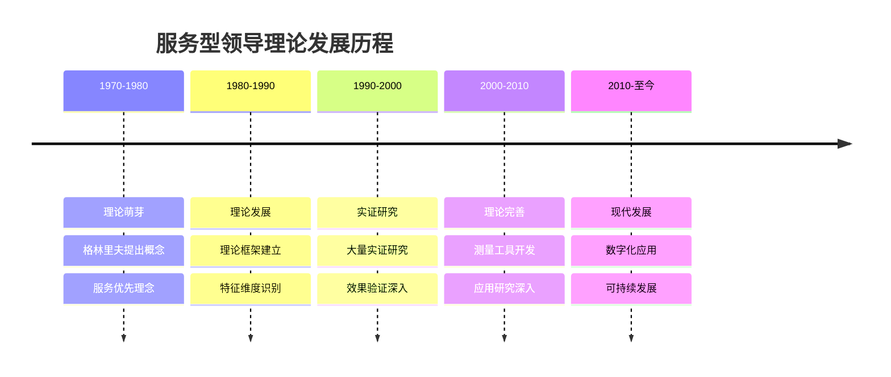
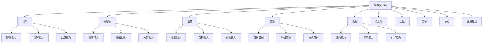
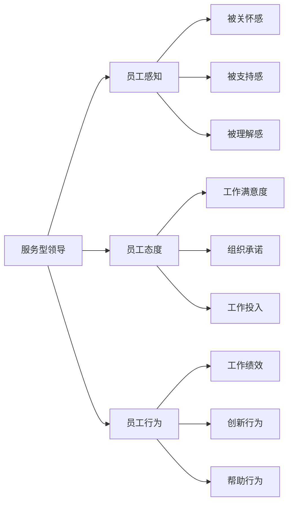
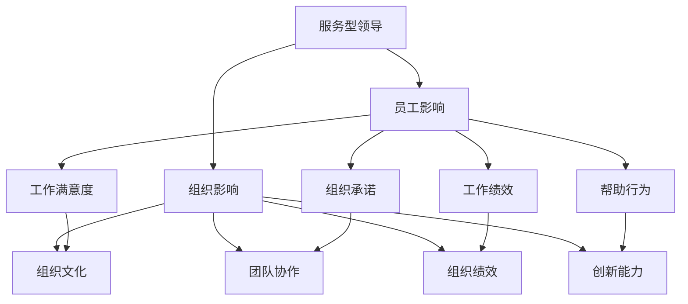
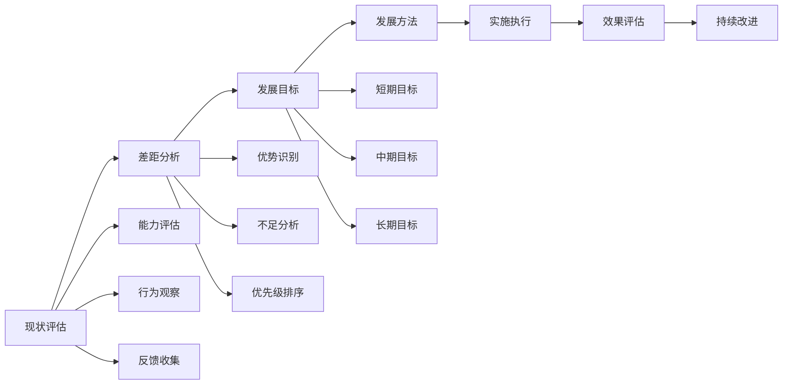
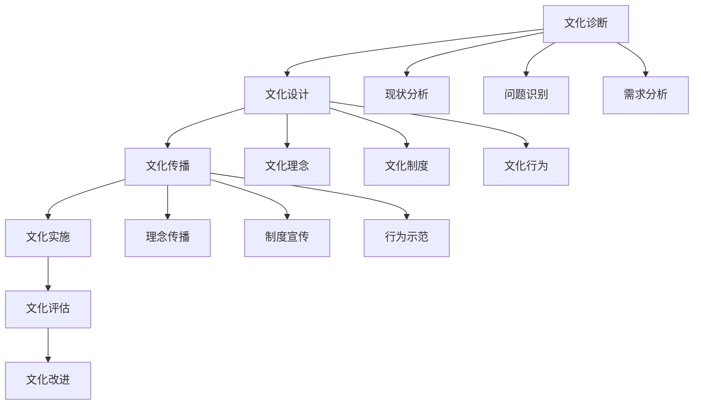

# 服务型领导

## 🎯 理论概述

### 基本定义
**服务型领导**（Servant Leadership）是一种以服务他人为核心的领导理念，强调领导者首先应该服务他人，通过服务来影响和激励追随者，实现组织目标和员工发展的双重价值。

### 核心特征
- **服务优先**：服务他人为先
- **道德导向**：以道德为基础
- **员工中心**：以员工为中心
- **长期发展**：关注长期发展

## 📚 理论发展历程

### 历史发展脉络

### 主要代表人物
| 学者 | 时期 | 主要贡献 | 核心观点 |
|------|------|----------|----------|
| **罗伯特·格林里夫** | 1970s | 服务型领导概念 | 服务优先的领导理念 |
| **拉里·斯皮尔斯** | 1990s | 十项特征 | 识别服务型领导特征 |
| **詹姆斯·亨特** | 2000s | 理论完善 | 完善服务型领导理论 |
| **布鲁斯·温斯顿** | 2010s | 现代应用 | 数字化时代应用 |

## 🔍 核心特征维度

### 十项特征模型

### 倾听（Listening）
#### 核心内容
- **倾听能力**：主动倾听他人声音
- **理解能力**：理解他人需求和感受
- **回应能力**：及时回应他人关切

#### 具体表现
| 行为维度 | 具体表现 | 影响效果 | 实施要点 |
|----------|----------|----------|----------|
| **主动倾听** | 主动倾听员工意见 | 员工参与度提升 | 创造倾听机会 |
| **深度理解** | 深度理解员工需求 | 员工满意度提升 | 换位思考 |
| **及时回应** | 及时回应员工关切 | 员工信任度提升 | 快速响应 |

#### 实施策略
1. **创造机会**：创造倾听的机会
2. **深度倾听**：深度倾听员工声音
3. **理解需求**：理解员工真实需求
4. **及时回应**：及时回应员工关切

### 同理心（Empathy）
#### 核心内容
- **理解他人**：理解他人的处境
- **感受他人**：感受他人的情感
- **关怀他人**：关怀他人的需求

#### 具体表现
| 行为维度 | 具体表现 | 影响效果 | 实施要点 |
|----------|----------|----------|----------|
| **情感理解** | 理解员工情感 | 情感连接增强 | 情感共鸣 |
| **处境理解** | 理解员工处境 | 支持度提升 | 换位思考 |
| **需求理解** | 理解员工需求 | 需求满足度提升 | 需求识别 |

#### 实施策略
1. **情感共鸣**：与员工情感共鸣
2. **换位思考**：站在员工角度思考
3. **需求识别**：识别员工真实需求
4. **关怀支持**：提供关怀和支持

### 治愈（Healing）
#### 核心内容
- **治愈他人**：帮助他人治愈创伤
- **支持他人**：支持他人度过困难
- **帮助他人**：帮助他人成长发展

#### 具体表现
| 行为维度 | 具体表现 | 影响效果 | 实施要点 |
|----------|----------|----------|----------|
| **创伤治愈** | 帮助治愈心理创伤 | 心理健康改善 | 专业支持 |
| **困难支持** | 支持度过困难时期 | 抗压能力提升 | 持续支持 |
| **成长帮助** | 帮助个人成长发展 | 能力提升 | 发展机会 |

#### 实施策略
1. **专业支持**：提供专业心理支持
2. **持续关怀**：持续关怀员工
3. **发展机会**：提供发展机会
4. **成长支持**：支持员工成长

### 觉察（Awareness）
#### 核心内容
- **自我觉察**：了解自己的状态
- **环境觉察**：了解环境的变化
- **关系觉察**：了解关系的状态

#### 具体表现
| 行为维度 | 具体表现 | 影响效果 | 实施要点 |
|----------|----------|----------|----------|
| **自我认知** | 了解自己的优势不足 | 自我改进 | 定期反思 |
| **环境感知** | 感知环境变化 | 适应能力提升 | 环境监控 |
| **关系感知** | 感知关系状态 | 关系改善 | 关系维护 |

#### 实施策略
1. **定期反思**：定期进行自我反思
2. **环境监控**：监控环境变化
3. **关系维护**：维护良好关系
4. **持续改进**：持续改进自己

### 说服（Persuasion）
#### 核心内容
- **说服能力**：通过说服影响他人
- **影响能力**：通过影响改变他人
- **引导能力**：通过引导帮助他人

#### 具体表现
| 行为维度 | 具体表现 | 影响效果 | 实施要点 |
|----------|----------|----------|----------|
| **理性说服** | 通过理性说服他人 | 接受度提升 | 逻辑清晰 |
| **情感影响** | 通过情感影响他人 | 认同度提升 | 情感共鸣 |
| **行为引导** | 通过引导改变行为 | 行为改善 | 持续引导 |

#### 实施策略
1. **逻辑清晰**：用清晰的逻辑说服
2. **情感共鸣**：用情感共鸣影响
3. **持续引导**：持续引导行为改变
4. **效果评估**：评估说服效果

## 📊 服务型领导效果

### 对员工的影响
#### 积极影响
| 影响维度 | 具体表现 | 测量指标 | 影响程度 |
|----------|----------|----------|----------|
| **工作满意度** | 工作满意度提升 | 满意度调查 | 高 |
| **组织承诺** | 组织承诺增强 | 承诺量表 | 高 |
| **工作绩效** | 工作绩效改善 | 绩效评估 | 中 |
| **离职意愿** | 离职意愿降低 | 离职率统计 | 高 |

#### 影响机制

### 对组织的影响
#### 积极影响
| 影响维度 | 具体表现 | 测量指标 | 影响程度 |
|----------|----------|----------|----------|
| **组织文化** | 组织文化改善 | 文化评估 | 高 |
| **团队协作** | 团队协作增强 | 协作指标 | 高 |
| **创新能力** | 创新能力提升 | 创新指标 | 中 |
| **组织绩效** | 组织绩效改善 | 绩效指标 | 中 |

#### 影响路径

## 🎯 服务型领导应用

### 领导发展
#### 发展策略
| 发展维度 | 具体内容 | 发展方法 | 评估标准 |
|----------|----------|----------|----------|
| **倾听能力** | 主动倾听、深度理解 | 倾听培训、实践练习 | 倾听效果评估 |
| **同理心** | 情感理解、换位思考 | 同理心培训、角色扮演 | 同理心水平评估 |
| **治愈能力** | 支持他人、帮助成长 | 心理培训、支持技能 | 支持效果评估 |
| **觉察能力** | 自我觉察、环境感知 | 觉察培训、反思练习 | 觉察水平评估 |

#### 发展计划

### 组织文化建设
#### 文化建设策略
| 建设维度 | 具体内容 | 实施方法 | 预期效果 |
|----------|----------|----------|----------|
| **服务文化** | 服务优先、员工中心 | 文化传播、行为示范 | 服务文化形成 |
| **关怀文化** | 关怀员工、支持发展 | 关怀制度、支持体系 | 关怀文化建立 |
| **合作文化** | 团队协作、共同发展 | 合作机制、团队建设 | 合作文化强化 |
| **发展文化** | 持续发展、共同成长 | 发展机会、成长支持 | 发展文化深化 |

#### 文化建设流程

## 📈 情境适应性

### 适用情境
#### 高适用情境
| 情境特征 | 具体表现 | 适用原因 | 实施要点 |
|----------|----------|----------|----------|
| **员工发展** | 关注员工发展 | 服务型领导擅长发展 | 强调发展重要性 |
| **团队建设** | 需要团队建设 | 服务型领导促进团队 | 加强团队协作 |
| **文化变革** | 需要文化变革 | 服务型领导推动文化 | 推动文化变革 |
| **长期发展** | 关注长期发展 | 服务型领导关注长期 | 设定长期目标 |

#### 低适用情境
| 情境特征 | 具体表现 | 不适用原因 | 替代方案 |
|----------|----------|------------|----------|
| **紧急任务** | 时间紧迫 | 服务型领导见效慢 | 任务型领导 |
| **竞争激烈** | 竞争激烈 | 服务型领导效率低 | 竞争型领导 |
| **资源有限** | 资源不足 | 服务型领导成本高 | 效率型领导 |
| **短期目标** | 短期目标 | 服务型领导关注长期 | 目标型领导 |

### 文化适应性
#### 文化因素影响
| 文化维度 | 影响程度 | 具体表现 | 适应策略 |
|----------|----------|----------|----------|
| **集体主义** | 高 | 影响团队协作效果 | 强化集体意识 |
| **权力距离** | 中 | 影响服务关系建立 | 降低权力距离 |
| **长期导向** | 高 | 影响长期发展关注 | 强调长期价值 |
| **不确定性规避** | 中 | 影响创新支持效果 | 降低不确定性 |

## ⚖️ 理论评价

### 理论优势
| 优势 | 具体表现 | 价值意义 |
|------|----------|----------|
| **道德导向** | 以道德为基础 | 提升领导道德水平 |
| **员工中心** | 以员工为中心 | 提升员工满意度 |
| **长期发展** | 关注长期发展 | 促进可持续发展 |
| **文化改善** | 改善组织文化 | 提升组织文化质量 |

### 理论局限
| 局限 | 具体表现 | 影响 |
|------|----------|------|
| **效率较低** | 服务过程效率低 | 短期效果差 |
| **实施困难** | 实施要求高 | 应用困难 |
| **成本较高** | 实施成本高 | 资源需求大 |
| **文化依赖** | 依赖文化背景 | 跨文化适用性差 |

### 现代发展
#### 理论修正
- **效率平衡**：平衡服务与效率
- **数字化应用**：结合数字化技术
- **可持续发展**：关注可持续发展
- **文化适应**：适应不同文化背景

#### 现代应用
- **员工体验**：提升员工体验
- **文化建设**：建设服务文化
- **可持续发展**：促进可持续发展
- **数字化转型**：推动数字化转型

## 🔗 相关概念链接

### 基础概念
- [[01-基础认知层/01-领导力概述|领导力概述]]
- [[01-基础认知层/05-领导力伦理与价值观|伦理价值观]]
- [[01-基础认知层/04-现代领导力挑战|现代挑战]]

### 理论概念
- [[01-变革型领导|变革型领导]]
- [[03-分布式领导|分布式领导]]
- [[04-理论对比分析|理论对比]]

### 能力概念
- [[03-能力构建层/核心领导能力/06-情商与自我管理|情商管理]]
- [[03-能力构建层/核心领导能力/03-沟通协调|沟通协调]]

### 实践概念
- [[04-实践应用层/管理实践/02-组织文化建设|组织文化]]
- [[05-发展提升层/自我发展/01-自我认知与评估|自我认知]]

## 💡 学习要点总结

### 关键理解
1. **服务是核心**：服务型领导的核心是服务他人
2. **十项特征**：倾听、同理心、治愈、觉察、说服等
3. **道德基础**：以道德为基础的领导理念
4. **长期发展**：关注长期发展和可持续发展

### 实践应用
1. **特征发展**：发展十项特征能力
2. **服务实践**：在实践中服务他人
3. **文化建设**：建设服务型文化
4. **效果评估**：评估服务效果

### 思考问题
1. 服务型领导的十项特征哪个最重要？
2. 如何平衡服务与效率？
3. 服务型领导在文化建设中的作用？
4. 如何在不同文化背景下应用服务型领导？

---

**下一步**：[[03-分布式领导|分布式领导]] | [[04-理论对比分析|理论对比]]
