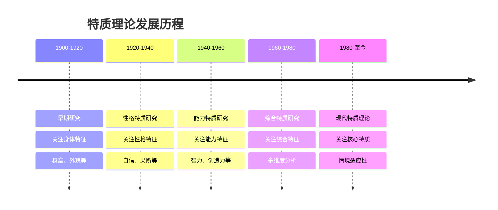
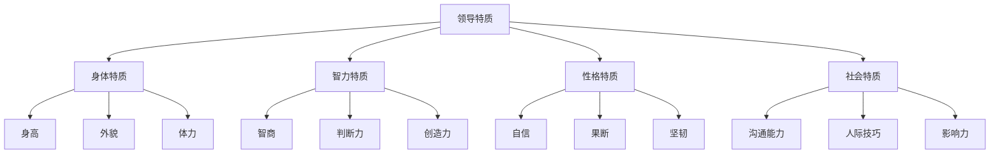
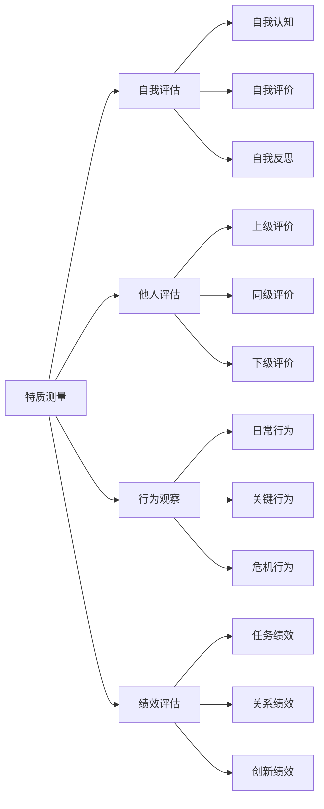
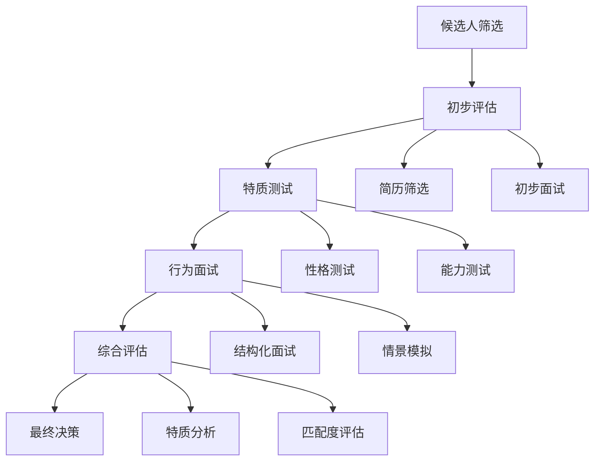
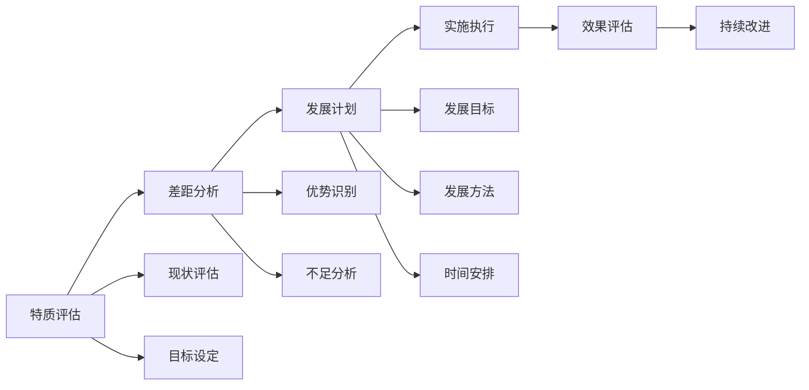

# 特质理论

## 🎯 理论概述

### 基本定义
**特质理论**（Trait Theory）是领导力研究的早期理论，认为领导者具有与生俱来的个人特质，这些特质使他们能够有效地领导他人。

### 核心假设
- **天赋论**：领导能力是天生的，不是后天培养的
- **特质论**：领导者具有共同的特质特征
- **区分论**：领导者与非领导者在特质上存在显著差异

## 📚 理论发展历程

### 历史发展脉络

### 代表人物及贡献
| 学者 | 时期 | 主要贡献 | 核心观点 |
|------|------|----------|----------|
| **托马斯·卡莱尔** | 1840s | 英雄领导理论 | 领导者是天生的英雄 |
| **拉尔夫·斯托格迪尔** | 1940s | 领导特质研究 | 识别重要领导特质 |
| **切斯特·巴纳德** | 1930s | 领导权威理论 | 权威来自个人特质 |
| **沃伦·本尼斯** | 1980s | 现代特质理论 | 四大核心特质 |

## 🔍 核心特质分析

### 传统特质分类

### 现代核心特质
#### 1. 智力特质
| 特质 | 定义 | 表现 | 重要性 |
|------|------|------|--------|
| **智商** | 认知能力 | 逻辑思维、分析能力 | 高 |
| **判断力** | 决策能力 | 准确判断、明智决策 | 高 |
| **创造力** | 创新能力 | 创新思维、突破常规 | 中 |
| **学习能力** | 适应能力 | 快速学习、持续改进 | 高 |

#### 2. 性格特质
| 特质 | 定义 | 表现 | 重要性 |
|------|------|------|--------|
| **自信** | 自我信念 | 相信自己、敢于决策 | 高 |
| **果断** | 决策速度 | 快速决策、勇于承担 | 高 |
| **坚韧** | 毅力品质 | 坚持不懈、克服困难 | 中 |
| **情绪稳定** | 情绪控制 | 情绪稳定、压力承受 | 高 |

#### 3. 社会特质
| 特质 | 定义 | 表现 | 重要性 |
|------|------|------|--------|
| **沟通能力** | 表达交流 | 清晰表达、有效沟通 | 高 |
| **人际技巧** | 关系建立 | 建立关系、维护关系 | 高 |
| **影响力** | 影响他人 | 说服他人、改变行为 | 高 |
| **团队合作** | 协作能力 | 团队协作、共同目标 | 中 |

### 现代特质理论（本尼斯）
#### 四大核心特质
1. **管理注意力**
   - **定义**：吸引和保持他人注意的能力
   - **表现**：愿景清晰、目标明确
   - **作用**：引导团队方向

2. **管理意义**
   - **定义**：创造和传达意义的能力
   - **表现**：价值观传播、文化塑造
   - **作用**：激发团队动力

3. **管理信任**
   - **定义**：建立和维护信任的能力
   - **表现**：言行一致、承诺履行
   - **作用**：建立团队基础

4. **管理自我**
   - **定义**：自我认知和自我管理的能力
   - **表现**：自我反思、持续改进
   - **作用**：提升领导效果

## 📊 特质测量方法

### 测量工具
| 工具类型 | 具体工具 | 测量内容 | 适用对象 |
|----------|----------|----------|----------|
| **性格测试** | 大五人格测试 | 性格特质 | 个人评估 |
| **能力测试** | 智力测试 | 认知能力 | 能力评估 |
| **行为观察** | 360度反馈 | 行为表现 | 综合评估 |
| **面试评估** | 结构化面试 | 综合特质 | 选拔评估 |

### 测量维度

## 🎯 特质理论应用

### 领导选拔
#### 选拔标准
| 职位层级 | 核心特质 | 权重 | 评估方法 |
|----------|----------|------|----------|
| **基层管理者** | 执行力、沟通能力 | 40% | 行为面试 |
| **中层管理者** | 协调能力、判断力 | 35% | 360度反馈 |
| **高层管理者** | 战略思维、影响力 | 25% | 综合评估 |

#### 选拔流程

### 领导发展
#### 发展策略
| 特质类型 | 发展方法 | 实施策略 | 评估标准 |
|----------|----------|----------|----------|
| **智力特质** | 学习培训 | 专业知识、技能培训 | 知识测试 |
| **性格特质** | 心理辅导 | 心理咨询、行为训练 | 行为观察 |
| **社会特质** | 实践锻炼 | 项目实践、角色扮演 | 360度反馈 |

#### 发展计划

## ⚖️ 理论评价

### 理论优势
| 优势 | 具体表现 | 价值意义 |
|------|----------|----------|
| **理论基础** | 为领导力研究奠定基础 | 开创性贡献 |
| **特质识别** | 识别重要领导特质 | 指导实践应用 |
| **选拔指导** | 为领导选拔提供依据 | 提高选拔效果 |
| **发展指导** | 为领导发展提供方向 | 促进能力提升 |

### 理论局限
| 局限 | 具体表现 | 影响 |
|------|----------|------|
| **忽视环境** | 忽视环境因素影响 | 理论不完整 |
| **关系不清** | 特质与效果关系不清 | 应用困难 |
| **缺乏实证** | 缺乏充分实证支持 | 可信度低 |
| **静态观点** | 忽视特质发展变化 | 适应性差 |

### 现代发展
#### 理论修正
- **情境因素**：考虑环境因素影响
- **动态发展**：关注特质发展变化
- **实证研究**：加强实证研究支持
- **综合应用**：与其他理论结合

#### 现代应用
- **人才选拔**：用于人才选拔评估
- **领导发展**：指导领导能力发展
- **团队建设**：优化团队特质配置
- **组织发展**：促进组织能力提升

## 🔗 相关概念链接

### 基础概念
- [[01-基础认知层/01-领导力概述|领导力概述]]
- [[01-基础认知层/02-管理者vs领导者|管理者vs领导者]]
- [[01-基础认知层/03-领导力发展历程|发展历程]]

### 理论概念
- [[02-行为理论|行为理论]]
- [[03-情境理论|情境理论]]
- [[04-理论对比分析|理论对比]]

### 能力概念
- [[03-能力构建层/核心领导能力/01-战略思维|战略思维]]
- [[03-能力构建层/核心领导能力/06-情商与自我管理|情商管理]]

### 实践概念
- [[07-工具资源层/评估工具/01-领导力评估量表|评估量表]]
- [[05-发展提升层/自我发展/01-自我认知与评估|自我认知]]

## 💡 学习要点总结

### 关键理解
1. **特质是基础**：个人特质是领导力的基础
2. **特质可发展**：特质可以通过学习提升
3. **特质有差异**：不同特质适用于不同情境
4. **特质需平衡**：需要平衡各种特质

### 实践应用
1. **特质评估**：评估自身特质水平
2. **特质发展**：制定特质发展计划
3. **特质应用**：在工作中应用特质
4. **特质平衡**：平衡不同特质发展

### 思考问题
1. 你认为哪些特质对领导力最重要？
2. 如何评估和发展个人特质？
3. 特质理论在现代还有价值吗？
4. 如何平衡不同特质的发展？

---

**下一步**：[[02-行为理论|行为理论]] | [[03-情境理论|情境理论]]
