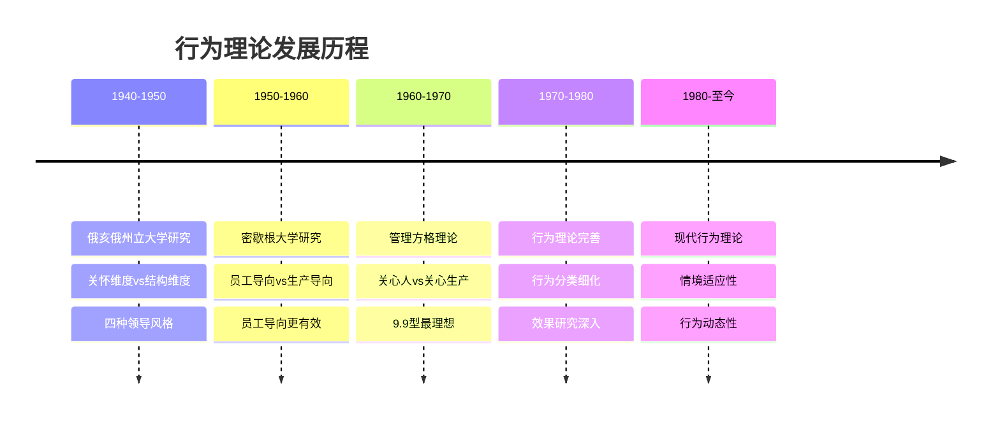
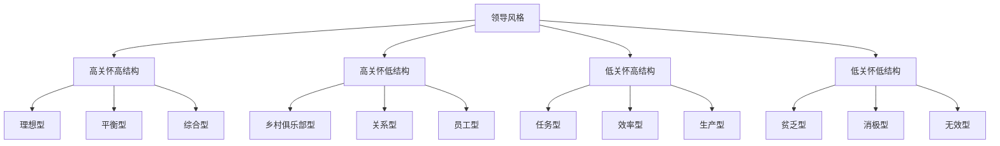
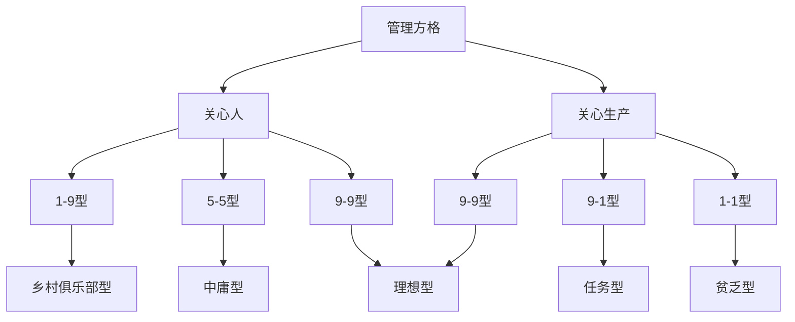
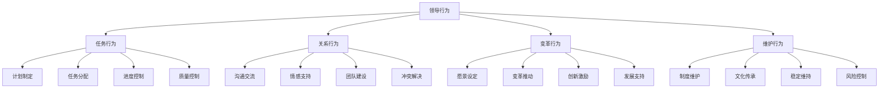
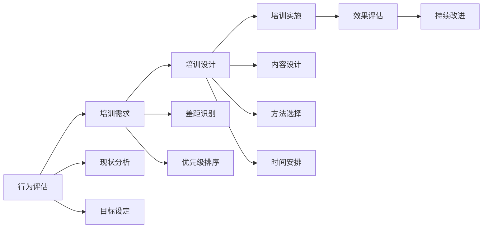
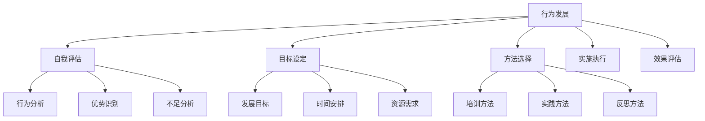

# 行为理论

## 🎯 理论概述

### 基本定义
**行为理论**（Behavioral Theory）是领导力研究的重要理论，认为领导效果取决于领导者的行为模式，而不是个人特质，强调领导行为可以通过学习和培训来改变。

### 核心假设
- **行为论**：领导效果取决于行为模式
- **可学习性**：领导行为可以学习和改变
- **行为分类**：领导行为可以分类和研究
- **效果导向**：关注行为与效果的关系

## 📚 理论发展历程

### 历史发展脉络

### 主要研究机构
| 机构 | 时期 | 主要贡献 | 核心观点 |
|------|------|----------|----------|
| **俄亥俄州立大学** | 1940s | 关怀-结构维度 | 两个独立维度 |
| **密歇根大学** | 1950s | 员工-生产导向 | 员工导向更有效 |
| **布莱克-莫顿** | 1960s | 管理方格理论 | 9.9型最理想 |
| **哈佛商学院** | 1970s | 行为分类研究 | 行为细化分类 |

## 🔍 核心行为维度

### 俄亥俄州立大学研究
#### 关怀维度（Consideration）
- **定义**：关心员工福利和感受的程度
- **表现**：倾听员工、关心员工、支持员工
- **特点**：人际关系导向、员工中心

#### 结构维度（Initiating Structure）
- **定义**：关注任务完成和效率的程度
- **表现**：明确目标、分配任务、监督执行
- **特点**：任务导向、效率中心

#### 四种领导风格

### 密歇根大学研究
#### 员工导向（Employee-Oriented）
- **定义**：关注员工需求和满意度
- **表现**：关心员工、支持员工、发展员工
- **效果**：员工满意度高、离职率低

#### 生产导向（Production-Oriented）
- **定义**：关注任务完成和效率
- **表现**：强调效率、控制质量、追求产量
- **效果**：生产效率高、质量稳定

#### 研究结论
- **员工导向更有效**：员工导向的领导效果更好
- **长期效果**：员工导向的长期效果更佳
- **综合效果**：平衡两种导向效果最佳

### 管理方格理论
#### 理论框架

#### 五种领导风格
| 风格类型 | 坐标 | 特征 | 优势 | 劣势 |
|----------|------|------|------|------|
| **9.9型** | (9,9) | 高关心人高关心生产 | 理想效果 | 要求较高 |
| **1.9型** | (1,9) | 高关心人低关心生产 | 员工满意 | 效率较低 |
| **9.1型** | (9,1) | 低关心人高关心生产 | 效率较高 | 员工不满 |
| **1.1型** | (1,1) | 低关心人低关心生产 | 压力较小 | 效果最差 |
| **5.5型** | (5,5) | 中等关心人中等关心生产 | 平衡发展 | 缺乏突破 |

## 📊 行为分类体系

### 任务行为vs关系行为
#### 任务行为（Task Behavior）
- **定义**：关注任务完成的行为
- **表现**：计划制定、任务分配、进度控制
- **作用**：确保任务完成、提高效率

#### 关系行为（Relationship Behavior）
- **定义**：关注人际关系的行为
- **表现**：沟通交流、情感支持、团队建设
- **作用**：建立关系、提升满意度

### 具体行为分类

## 🎯 行为理论应用

### 领导培训
#### 培训内容
| 培训模块 | 具体内容 | 培训方法 | 评估标准 |
|----------|----------|----------|----------|
| **任务行为** | 计划制定、任务分配 | 案例分析、角色扮演 | 行为观察 |
| **关系行为** | 沟通技巧、团队建设 | 情景模拟、实践练习 | 360度反馈 |
| **综合行为** | 行为平衡、情境适应 | 综合训练、反思总结 | 综合评估 |

#### 培训流程

### 领导发展
#### 发展策略
| 发展阶段 | 重点行为 | 发展方法 | 评估指标 |
|----------|----------|----------|----------|
| **初级阶段** | 任务行为 | 技能培训、实践锻炼 | 任务完成率 |
| **中级阶段** | 关系行为 | 沟通培训、团队建设 | 团队满意度 |
| **高级阶段** | 综合行为 | 综合训练、反思总结 | 综合效果 |

#### 发展计划

## 📈 行为效果研究

### 行为与效果关系
#### 任务行为效果
| 行为类型 | 积极效果 | 消极效果 | 适用情境 |
|----------|----------|----------|----------|
| **计划制定** | 目标明确、效率提升 | 过于详细、缺乏灵活性 | 复杂任务 |
| **任务分配** | 责任明确、协调有序 | 分配不均、缺乏参与 | 团队任务 |
| **进度控制** | 按时完成、质量保证 | 压力过大、创新受限 | 紧急任务 |

#### 关系行为效果
| 行为类型 | 积极效果 | 消极效果 | 适用情境 |
|----------|----------|----------|----------|
| **沟通交流** | 信息畅通、理解一致 | 时间消耗、效率降低 | 复杂项目 |
| **情感支持** | 员工满意、忠诚度高 | 依赖性强、独立性差 | 压力情境 |
| **团队建设** | 凝聚力强、协作良好 | 成本较高、时间较长 | 长期项目 |

### 行为组合效果
#### 高任务高关系
- **效果**：最佳效果
- **适用**：成熟团队、复杂任务
- **要求**：领导者能力要求高

#### 高任务低关系
- **效果**：效率高但满意度低
- **适用**：紧急任务、简单任务
- **要求**：任务导向能力强

#### 低任务高关系
- **效果**：满意度高但效率低
- **适用**：创新任务、团队建设
- **要求**：关系导向能力强

#### 低任务低关系
- **效果**：效果最差
- **适用**：不推荐使用
- **要求**：需要改进

## ⚖️ 理论评价

### 理论优势
| 优势 | 具体表现 | 价值意义 |
|------|----------|----------|
| **可操作性** | 行为具体可观察 | 便于培训发展 |
| **可学习性** | 行为可以学习改变 | 提升领导能力 |
| **分类清晰** | 行为分类明确 | 便于研究应用 |
| **效果导向** | 关注行为效果 | 指导实践应用 |

### 理论局限
| 局限 | 具体表现 | 影响 |
|------|----------|------|
| **忽视情境** | 忽视环境因素 | 适用性有限 |
| **静态观点** | 忽视行为动态性 | 适应性差 |
| **效果复杂** | 行为效果关系复杂 | 应用困难 |
| **文化差异** | 忽视文化差异 | 跨文化适用性差 |

### 现代发展
#### 理论修正
- **情境因素**：考虑环境因素影响
- **动态发展**：关注行为发展变化
- **文化适应**：适应不同文化背景
- **综合应用**：与其他理论结合

#### 现代应用
- **领导培训**：用于领导培训发展
- **行为评估**：用于行为评估改进
- **团队建设**：指导团队建设实践
- **组织发展**：促进组织能力提升

## 🔗 相关概念链接

### 基础概念
- [[01-基础认知层/01-领导力概述|领导力概述]]
- [[01-基础认知层/02-管理者vs领导者|管理者vs领导者]]
- [[01-基础认知层/03-领导力发展历程|发展历程]]

### 理论概念
- [[01-特质理论|特质理论]]
- [[03-情境理论|情境理论]]
- [[04-理论对比分析|理论对比]]

### 能力概念
- [[03-能力构建层/核心领导能力/03-沟通协调|沟通协调]]
- [[03-能力构建层/核心领导能力/04-团队建设|团队建设]]

### 实践概念
- [[04-实践应用层/管理实践/01-团队管理|团队管理]]
- [[07-工具资源层/实用模板/02-团队建设模板|团队模板]]

## 💡 学习要点总结

### 关键理解
1. **行为是关键**：领导行为决定领导效果
2. **行为可学习**：领导行为可以通过培训提升
3. **行为需平衡**：需要平衡任务行为和关系行为
4. **行为要适应**：根据情境调整行为模式

### 实践应用
1. **行为评估**：评估自身领导行为
2. **行为发展**：制定行为发展计划
3. **行为应用**：在工作中应用有效行为
4. **行为改进**：基于反馈持续改进

### 思考问题
1. 你认为哪些领导行为最有效？
2. 如何平衡任务行为和关系行为？
3. 行为理论在现代还有价值吗？
4. 如何根据情境调整领导行为？

---

**下一步**：[[03-情境理论|情境理论]] | [[04-理论对比分析|理论对比]]
