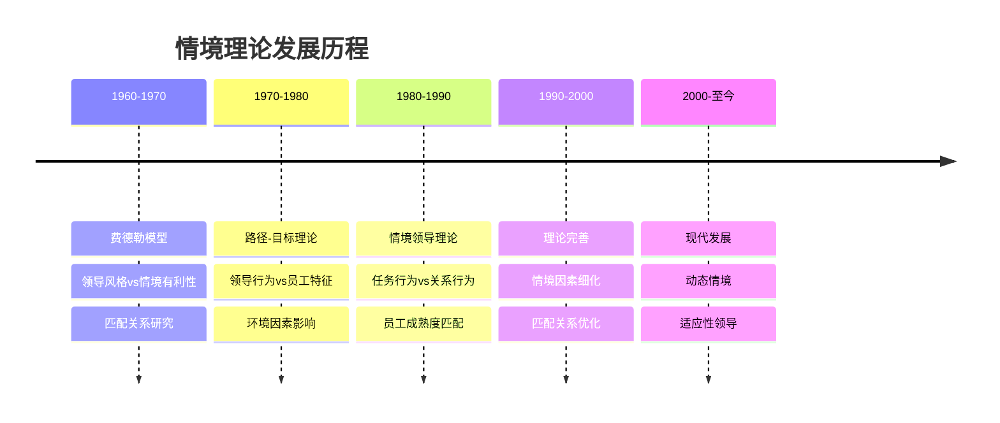
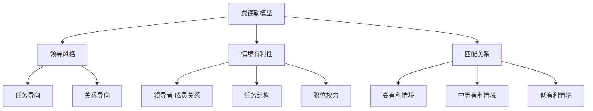
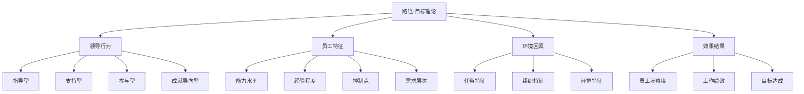
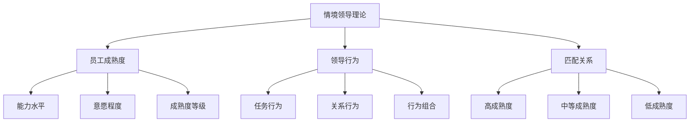
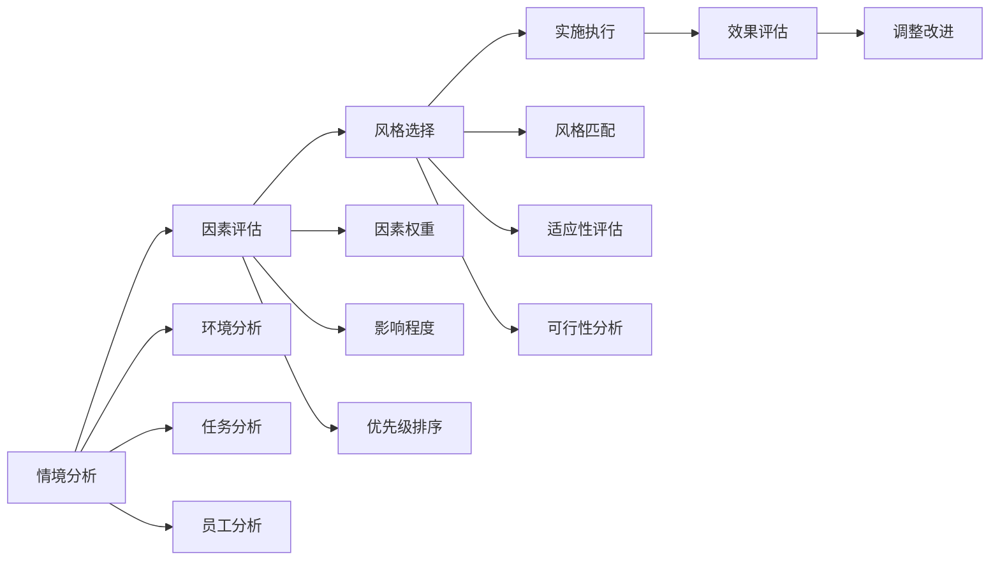
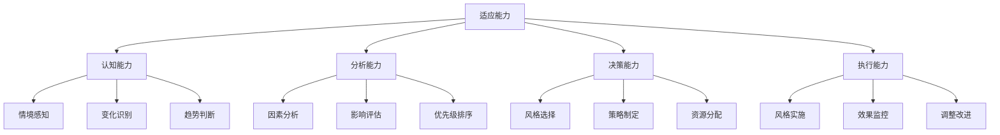

# 情境理论

## 🎯 理论概述

### 基本定义
**情境理论**（Situational Theory）是领导力研究的重要理论，认为领导效果取决于领导者、追随者和情境三者的匹配程度，强调领导者需要根据不同的情境调整领导风格。

### 核心假设
- **情境论**：领导效果取决于情境因素
- **匹配论**：领导者与情境需要匹配
- **适应性**：领导者需要适应不同情境
- **动态性**：情境是动态变化的

## 📚 理论发展历程

### 历史发展脉络

### 主要代表人物
| 学者 | 时期 | 主要贡献 | 核心观点 |
|------|------|----------|----------|
| **弗雷德·费德勒** | 1960s | 费德勒模型 | 领导风格与情境匹配 |
| **罗伯特·豪斯** | 1970s | 路径-目标理论 | 领导行为与员工特征匹配 |
| **保罗·赫塞** | 1980s | 情境领导理论 | 领导行为与员工成熟度匹配 |
| **肯·布兰查德** | 1980s | 情境领导理论 | 领导行为与员工成熟度匹配 |

## 🔍 核心理论模型

### 费德勒模型
#### 理论框架

#### 情境因素分析
| 情境因素 | 定义 | 影响程度 | 评估标准 |
|----------|------|----------|----------|
| **领导者-成员关系** | 领导者与成员的关系质量 | 高 | 信任、支持、合作 |
| **任务结构** | 任务的明确性和结构化程度 | 中 | 目标清晰、程序明确 |
| **职位权力** | 领导者的正式权力大小 | 低 | 奖惩权、决策权 |

#### 情境有利性等级
| 等级 | 领导者-成员关系 | 任务结构 | 职位权力 | 有利性 | 推荐风格 |
|------|------------------|----------|----------|--------|----------|
| **1** | 好 | 高 | 强 | 高 | 任务导向 |
| **2** | 好 | 高 | 弱 | 高 | 任务导向 |
| **3** | 好 | 低 | 强 | 高 | 任务导向 |
| **4** | 好 | 低 | 弱 | 中 | 关系导向 |
| **5** | 差 | 高 | 强 | 中 | 关系导向 |
| **6** | 差 | 高 | 弱 | 中 | 关系导向 |
| **7** | 差 | 低 | 强 | 低 | 关系导向 |
| **8** | 差 | 低 | 弱 | 低 | 任务导向 |

### 路径-目标理论
#### 理论框架

#### 四种领导行为
| 行为类型 | 定义 | 特点 | 适用情境 |
|----------|------|------|----------|
| **指导型** | 明确目标和路径 | 指令性、结构化 | 任务复杂、员工经验不足 |
| **支持型** | 关心员工需求 | 关怀性、支持性 | 工作压力大、员工需要支持 |
| **参与型** | 让员工参与决策 | 民主性、参与性 | 员工能力强、需要参与 |
| **成就导向型** | 设定挑战性目标 | 激励性、挑战性 | 员工能力强、需要激励 |

### 情境领导理论
#### 理论框架

#### 员工成熟度等级
| 等级 | 能力 | 意愿 | 特征 | 推荐风格 |
|------|------|------|------|----------|
| **R1** | 低 | 低 | 新手、缺乏经验 | 指导型 |
| **R2** | 低 | 高 | 有热情、缺乏技能 | 教练型 |
| **R3** | 高 | 低 | 有技能、缺乏动机 | 支持型 |
| **R4** | 高 | 高 | 成熟、自主 | 授权型 |

#### 四种领导风格
| 风格类型 | 任务行为 | 关系行为 | 适用成熟度 | 特点 |
|----------|----------|----------|------------|------|
| **指导型** | 高 | 低 | R1 | 明确指令、密切监督 |
| **教练型** | 高 | 高 | R2 | 指导支持、解释说明 |
| **支持型** | 低 | 高 | R3 | 倾听支持、鼓励参与 |
| **授权型** | 低 | 低 | R4 | 授权决策、自主管理 |

## 📊 情境因素分析

### 环境因素
#### 外部环境
| 因素类型 | 具体内容 | 影响程度 | 应对策略 |
|----------|----------|----------|----------|
| **市场环境** | 竞争激烈程度、变化速度 | 高 | 灵活适应、快速响应 |
| **技术环境** | 技术发展水平、创新程度 | 中 | 技术跟踪、创新驱动 |
| **政策环境** | 政策变化、法规要求 | 中 | 政策监控、合规管理 |
| **文化环境** | 文化背景、价值观念 | 高 | 文化适应、价值融合 |

#### 内部环境
| 因素类型 | 具体内容 | 影响程度 | 应对策略 |
|----------|----------|----------|----------|
| **组织文化** | 价值观、行为规范 | 高 | 文化塑造、价值传播 |
| **组织结构** | 层级结构、沟通渠道 | 中 | 结构优化、流程改进 |
| **资源状况** | 人力资源、财务资源 | 中 | 资源配置、效率提升 |
| **技术条件** | 技术水平、设备状况 | 低 | 技术升级、设备更新 |

### 任务因素
#### 任务特征
| 特征维度 | 具体内容 | 影响程度 | 领导策略 |
|----------|----------|----------|----------|
| **复杂性** | 任务难度、技术要求 | 高 | 提供指导、技术支持 |
| **结构化** | 程序明确、标准清晰 | 中 | 标准化管理、质量控制 |
| **紧急性** | 时间要求、压力程度 | 高 | 快速决策、资源集中 |
| **创新性** | 创新要求、突破程度 | 中 | 鼓励创新、风险承担 |

### 员工因素
#### 员工特征
| 特征维度 | 具体内容 | 影响程度 | 领导策略 |
|----------|----------|----------|----------|
| **能力水平** | 技能水平、经验程度 | 高 | 能力评估、培训发展 |
| **动机水平** | 工作动机、成就需求 | 高 | 动机激发、需求满足 |
| **个性特征** | 性格特点、行为风格 | 中 | 个性适应、风格匹配 |
| **团队关系** | 人际关系、合作程度 | 中 | 关系建设、团队协作 |

## 🎯 情境理论应用

### 领导风格选择
#### 选择流程

#### 选择标准
| 情境类型 | 主要特征 | 推荐风格 | 实施要点 |
|----------|----------|----------|----------|
| **稳定环境** | 变化少、可预测 | 任务导向 | 标准化、效率优先 |
| **变化环境** | 变化多、不确定 | 关系导向 | 灵活性、适应性 |
| **复杂任务** | 难度高、要求高 | 指导型 | 提供支持、详细指导 |
| **简单任务** | 难度低、要求低 | 授权型 | 自主管理、结果导向 |

### 情境适应策略
#### 适应机制
| 适应类型 | 具体内容 | 实施方法 | 评估标准 |
|----------|----------|----------|----------|
| **主动适应** | 主动调整领导风格 | 情境监控、风格调整 | 适应速度 |
| **被动适应** | 根据反馈调整风格 | 反馈收集、效果评估 | 调整效果 |
| **预防适应** | 提前预测情境变化 | 趋势分析、预案制定 | 预测准确性 |
| **持续适应** | 持续监控和调整 | 动态监控、持续改进 | 持续效果 |

#### 适应能力

## 📈 理论效果研究

### 匹配效果
#### 高匹配效果
- **特征**：领导风格与情境高度匹配
- **表现**：员工满意度高、绩效优秀
- **条件**：情境分析准确、风格选择恰当

#### 低匹配效果
- **特征**：领导风格与情境不匹配
- **表现**：员工满意度低、绩效较差
- **原因**：情境分析错误、风格选择不当

### 适应效果
#### 适应成功
- **特征**：能够根据情境调整风格
- **表现**：领导效果持续改善
- **条件**：适应能力强、调整及时

#### 适应失败
- **特征**：无法根据情境调整风格
- **表现**：领导效果持续下降
- **原因**：适应能力弱、调整滞后

## ⚖️ 理论评价

### 理论优势
| 优势 | 具体表现 | 价值意义 |
|------|----------|----------|
| **情境意识** | 强调情境因素重要性 | 提高领导适应性 |
| **匹配理论** | 提供匹配框架 | 指导风格选择 |
| **动态观点** | 考虑情境动态变化 | 增强理论适用性 |
| **实践指导** | 提供具体应用方法 | 便于实践应用 |

### 理论局限
| 局限 | 具体表现 | 影响 |
|------|----------|------|
| **复杂性** | 情境因素复杂多样 | 应用困难 |
| **主观性** | 情境评估主观性强 | 准确性有限 |
| **动态性** | 情境变化难以预测 | 适应性挑战 |
| **文化差异** | 忽视文化差异影响 | 跨文化适用性差 |

### 现代发展
#### 理论修正
- **简化模型**：简化情境因素分析
- **动态适应**：增强动态适应能力
- **文化适应**：考虑文化差异影响
- **技术应用**：利用技术辅助分析

#### 现代应用
- **领导培训**：用于领导培训发展
- **情境分析**：用于情境分析工具
- **风格选择**：指导风格选择决策
- **适应能力**：提升领导适应能力

## 🔗 相关概念链接

### 基础概念
- [[01-基础认知层/01-领导力概述|领导力概述]]
- [[01-基础认知层/02-管理者vs领导者|管理者vs领导者]]
- [[01-基础认知层/04-现代领导力挑战|现代挑战]]

### 理论概念
- [[01-特质理论|特质理论]]
- [[02-行为理论|行为理论]]
- [[04-理论对比分析|理论对比]]

### 能力概念
- [[03-能力构建层/核心领导能力/05-变革管理|变革管理]]
- [[03-能力构建层/核心领导能力/06-情商与自我管理|情商管理]]

### 实践概念
- [[04-实践应用层/特殊情境/01-跨文化领导|跨文化领导]]
- [[04-实践应用层/特殊情境/03-不同组织形态的领导力应用|组织形态]]

## 💡 学习要点总结

### 关键理解
1. **情境是关键**：情境因素决定领导效果
2. **匹配是核心**：领导风格与情境需要匹配
3. **适应是能力**：适应能力是核心能力
4. **动态是特征**：情境是动态变化的

### 实践应用
1. **情境分析**：准确分析当前情境
2. **风格选择**：根据情境选择合适风格
3. **适应调整**：根据变化调整风格
4. **效果评估**：评估匹配效果

### 思考问题
1. 如何准确分析领导情境？
2. 如何选择最适合的领导风格？
3. 如何提升情境适应能力？
4. 情境理论在现代还有价值吗？

---

**下一步**：[[04-理论对比分析|理论对比]] | [[02-理论理解层/现代领导理论/01-变革型领导|变革型领导]]
