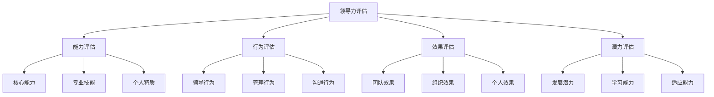
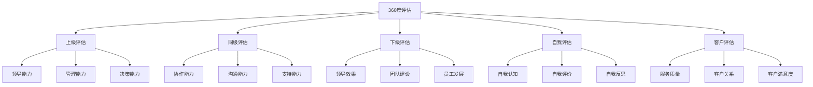
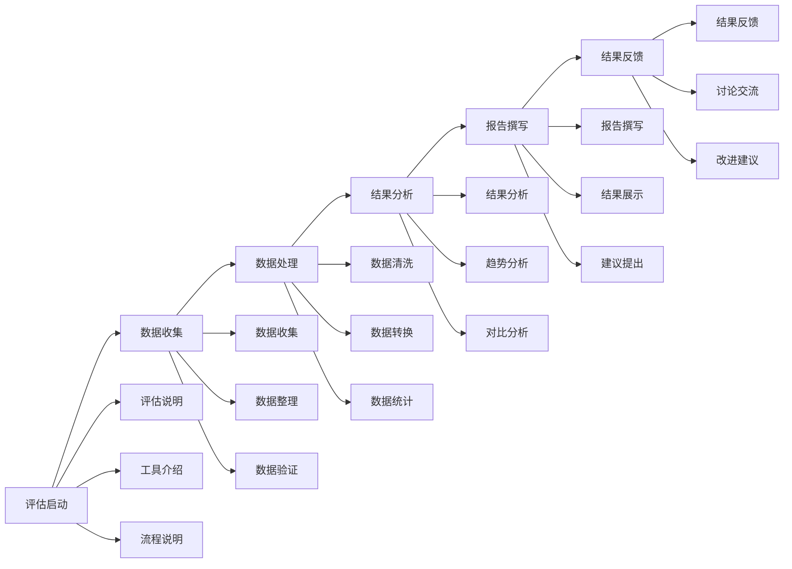
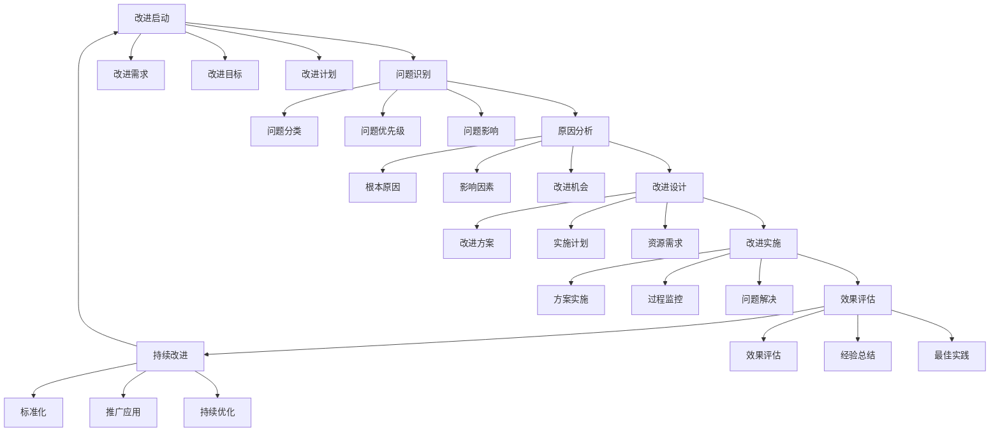

# 领导力测量与评估

## 🎯 核心概念

### 领导力测量定义
**领导力测量**是指运用科学的方法和工具，对领导者的领导能力、领导行为、领导效果进行量化分析和评估的过程。

### 领导力评估定义
**领导力评估**是指通过系统性的方法，对领导者的领导能力、领导行为、领导效果进行全面、客观、准确的分析和评价的过程。

### 核心特征
- **科学性**：运用科学方法
- **客观性**：客观公正评估
- **系统性**：系统全面评估
- **实用性**：指导实践应用

## 📚 评估理论框架

### 评估模型

### 评估维度
| 评估维度 | 具体内容 | 评估方法 | 权重 |
|----------|----------|----------|------|
| **能力维度** | 领导能力、管理能力 | 能力测试 | 30% |
| **行为维度** | 领导行为、管理行为 | 行为观察 | 25% |
| **效果维度** | 团队效果、组织效果 | 效果评估 | 25% |
| **潜力维度** | 发展潜力、学习能力 | 潜力评估 | 20% |

## 🔍 评估方法

### 定量评估
#### 能力测试
| 测试类型 | 具体内容 | 测试方法 | 评估标准 |
|----------|----------|----------|----------|
| **认知测试** | 智力、判断力、分析能力 | 标准化测试 | 标准分数 |
| **技能测试** | 专业技能、管理技能 | 技能测试 | 技能水平 |
| **人格测试** | 性格特质、行为风格 | 人格量表 | 人格特征 |
| **情商测试** | 情绪智力、社交能力 | 情商量表 | 情商水平 |

#### 绩效评估
| 评估类型 | 具体内容 | 评估方法 | 评估标准 |
|----------|----------|----------|----------|
| **任务绩效** | 任务完成、质量水平 | 结果评估 | 完成率 |
| **关系绩效** | 团队协作、关系质量 | 关系评估 | 协作度 |
| **创新绩效** | 创新贡献、改进建议 | 创新评估 | 创新度 |
| **发展绩效** | 能力提升、学习成长 | 发展评估 | 成长度 |

### 定性评估
#### 行为观察
| 观察类型 | 具体内容 | 观察方法 | 观察标准 |
|----------|----------|----------|----------|
| **日常观察** | 日常行为、工作表现 | 持续观察 | 行为频率 |
| **情境观察** | 特定情境下的行为 | 情境测试 | 行为适应性 |
| **危机观察** | 危机情况下的行为 | 危机模拟 | 危机处理能力 |
| **团队观察** | 团队环境下的行为 | 团队观察 | 团队协作能力 |

#### 访谈评估
| 访谈类型 | 具体内容 | 访谈方法 | 访谈标准 |
|----------|----------|----------|----------|
| **结构化访谈** | 标准化问题、统一评估 | 结构化访谈 | 一致性 |
| **半结构化访谈** | 灵活问题、深度探讨 | 半结构化访谈 | 深度性 |
| **非结构化访谈** | 自由交流、开放讨论 | 非结构化访谈 | 开放性 |
| **焦点小组** | 群体讨论、集体评估 | 焦点小组 | 集体性 |

### 综合评估
#### 360度评估

#### 评估中心
| 中心类型 | 具体内容 | 评估方法 | 评估标准 |
|----------|----------|----------|----------|
| **管理评估中心** | 管理能力、领导能力 | 情境模拟 | 管理效果 |
| **领导评估中心** | 领导能力、影响力 | 领导情境 | 领导效果 |
| **发展评估中心** | 发展潜力、学习能力 | 发展测试 | 发展潜力 |
| **综合评估中心** | 综合能力、全面评估 | 综合测试 | 综合水平 |

## 📊 评估工具

### 标准化工具
#### 领导力量表
| 量表类型 | 具体内容 | 适用对象 | 评估维度 |
|----------|----------|----------|----------|
| **MLQ量表** | 变革型领导量表 | 中高层管理者 | 四维度模型 |
| **LPI量表** | 领导实践量表 | 各级管理者 | 五项实践 |
| **EQ-i量表** | 情商量表 | 所有员工 | 情商四维度 |
| **MBTI量表** | 性格类型量表 | 所有员工 | 性格类型 |

#### 评估问卷
| 问卷类型 | 具体内容 | 使用场景 | 评估重点 |
|----------|----------|----------|----------|
| **能力问卷** | 领导能力评估 | 能力评估 | 能力水平 |
| **行为问卷** | 领导行为评估 | 行为评估 | 行为模式 |
| **效果问卷** | 领导效果评估 | 效果评估 | 效果水平 |
| **潜力问卷** | 发展潜力评估 | 潜力评估 | 发展潜力 |

### 定制化工具
#### 组织定制
| 定制类型 | 具体内容 | 定制方法 | 定制标准 |
|----------|----------|----------|----------|
| **文化定制** | 适应组织文化 | 文化分析 | 文化匹配度 |
| **行业定制** | 适应行业特点 | 行业分析 | 行业适应性 |
| **岗位定制** | 适应岗位要求 | 岗位分析 | 岗位匹配度 |
| **层级定制** | 适应管理层级 | 层级分析 | 层级适应性 |

#### 个性化定制
| 定制类型 | 具体内容 | 定制方法 | 定制标准 |
|----------|----------|----------|----------|
| **个人定制** | 适应个人特点 | 个人分析 | 个人匹配度 |
| **团队定制** | 适应团队特点 | 团队分析 | 团队匹配度 |
| **项目定制** | 适应项目需求 | 项目分析 | 项目匹配度 |
| **情境定制** | 适应特定情境 | 情境分析 | 情境适应性 |

## 🎯 评估实施

### 实施流程
#### 评估准备
| 准备要素 | 具体内容 | 准备方法 | 准备标准 |
|----------|----------|----------|----------|
| **评估计划** | 评估目标、评估范围 | 计划制定 | 计划完整性 |
| **评估标准** | 评估标准、评估指标 | 标准制定 | 标准科学性 |
| **评估工具** | 评估工具、评估方法 | 工具选择 | 工具适用性 |
| **评估人员** | 评估人员、评估培训 | 人员培训 | 人员专业性 |

#### 评估执行

### 质量控制
#### 质量要素
| 质量要素 | 具体内容 | 控制方法 | 质量标准 |
|----------|----------|----------|----------|
| **数据质量** | 数据准确性、完整性 | 数据验证 | 数据质量 |
| **评估质量** | 评估客观性、准确性 | 评估控制 | 评估质量 |
| **分析质量** | 分析科学性、合理性 | 分析控制 | 分析质量 |
| **报告质量** | 报告完整性、准确性 | 报告控制 | 报告质量 |

#### 质量控制
| 控制类型 | 具体内容 | 控制方法 | 控制标准 |
|----------|----------|----------|----------|
| **过程控制** | 评估过程质量控制 | 过程监控 | 过程质量 |
| **结果控制** | 评估结果质量控制 | 结果验证 | 结果质量 |
| **人员控制** | 评估人员质量控制 | 人员培训 | 人员质量 |
| **工具控制** | 评估工具质量控制 | 工具验证 | 工具质量 |

## 📈 评估结果应用

### 结果分析
#### 分析维度
| 分析维度 | 具体内容 | 分析方法 | 分析标准 |
|----------|----------|----------|----------|
| **现状分析** | 当前能力水平 | 现状分析 | 现状水平 |
| **差距分析** | 目标与现状差距 | 差距分析 | 差距程度 |
| **优势分析** | 优势能力识别 | 优势分析 | 优势程度 |
| **劣势分析** | 劣势能力识别 | 劣势分析 | 劣势程度 |

#### 分析工具
| 工具类型 | 具体工具 | 使用场景 | 使用要点 |
|----------|----------|----------|----------|
| **统计分析** | 描述统计、推断统计 | 数据分析 | 统计方法 |
| **趋势分析** | 时间序列、趋势预测 | 趋势分析 | 趋势识别 |
| **对比分析** | 横向对比、纵向对比 | 对比分析 | 对比标准 |
| **综合分析** | 多维度综合分析 | 综合分析 | 综合指标 |

### 结果应用
#### 应用领域
| 应用领域 | 具体内容 | 应用方法 | 应用效果 |
|----------|----------|----------|----------|
| **人才选拔** | 选拔标准、选拔决策 | 选拔应用 | 选拔效果 |
| **人才发展** | 发展计划、培训计划 | 发展应用 | 发展效果 |
| **绩效管理** | 绩效评估、绩效改进 | 绩效应用 | 绩效效果 |
| **组织发展** | 组织诊断、组织改进 | 组织应用 | 组织效果 |

#### 应用策略
| 策略类型 | 具体内容 | 实施方法 | 预期效果 |
|----------|----------|----------|----------|
| **个性化应用** | 根据个人特点应用 | 个性化策略 | 个人效果 |
| **团队化应用** | 根据团队特点应用 | 团队化策略 | 团队效果 |
| **组织化应用** | 根据组织特点应用 | 组织化策略 | 组织效果 |
| **系统化应用** | 系统化应用评估结果 | 系统化策略 | 系统效果 |

## 📊 评估效果评估

### 效果评估
#### 评估维度
| 评估维度 | 具体内容 | 评估方法 | 评估标准 |
|----------|----------|----------|----------|
| **评估准确性** | 评估结果准确性 | 准确性评估 | 准确度 |
| **评估有效性** | 评估结果有效性 | 有效性评估 | 有效度 |
| **评估可靠性** | 评估结果可靠性 | 可靠性评估 | 可靠度 |
| **评估实用性** | 评估结果实用性 | 实用性评估 | 实用度 |

#### 评估方法
| 方法类型 | 具体方法 | 使用场景 | 评估标准 |
|----------|----------|----------|----------|
| **对比评估** | 前后对比、横向对比 | 效果对比 | 对比效果 |
| **跟踪评估** | 长期跟踪、持续评估 | 长期效果 | 持续效果 |
| **反馈评估** | 用户反馈、效果反馈 | 用户满意度 | 满意度 |
| **实证评估** | 实证研究、效果验证 | 科学验证 | 科学有效性 |

### 持续改进
#### 改进策略
| 策略类型 | 具体内容 | 实施方法 | 预期效果 |
|----------|----------|----------|----------|
| **工具改进** | 改进评估工具 | 工具优化 | 工具效果 |
| **方法改进** | 改进评估方法 | 方法优化 | 方法效果 |
| **流程改进** | 改进评估流程 | 流程优化 | 流程效果 |
| **应用改进** | 改进结果应用 | 应用优化 | 应用效果 |

#### 改进流程

## 🔗 相关概念链接

### 基础概念
- [[01-基础认知层/01-领导力概述|领导力概述]]
- [[01-基础认知层/04-现代领导力挑战|现代挑战]]
- [[02-理论理解层/经典领导理论/01-特质理论|特质理论]]

### 理论概念
- [[02-理论理解层/现代领导理论/01-变革型领导|变革型领导]]
- [[02-理论理解层/现代领导理论/02-服务型领导|服务型领导]]

### 能力概念
- [[01-战略思维|战略思维]]
- [[02-决策能力|决策能力]]
- [[03-沟通协调|沟通协调]]

### 实践概念
- [[07-工具资源层/评估工具/01-领导力评估量表|评估量表]]
- [[07-工具资源层/评估工具/02-360度反馈工具|360度反馈]]

## 💡 学习要点总结

### 关键理解
1. **科学评估**：运用科学方法进行评估
2. **多维评估**：从多个维度进行评估
3. **工具应用**：运用各种评估工具
4. **结果应用**：有效应用评估结果

### 实践应用
1. **评估设计**：设计科学的评估方案
2. **评估实施**：实施评估过程
3. **结果分析**：分析评估结果
4. **结果应用**：应用评估结果

### 思考问题
1. 如何设计科学的领导力评估方案？
2. 如何选择合适的评估工具？
3. 如何提高评估的准确性和有效性？
4. 如何有效应用评估结果？

---

**下一步**：[[04-实践应用层/管理实践/01-团队管理|团队管理]] | [[04-实践应用层/管理实践/02-组织文化建设|组织文化]]
