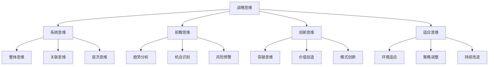
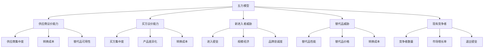
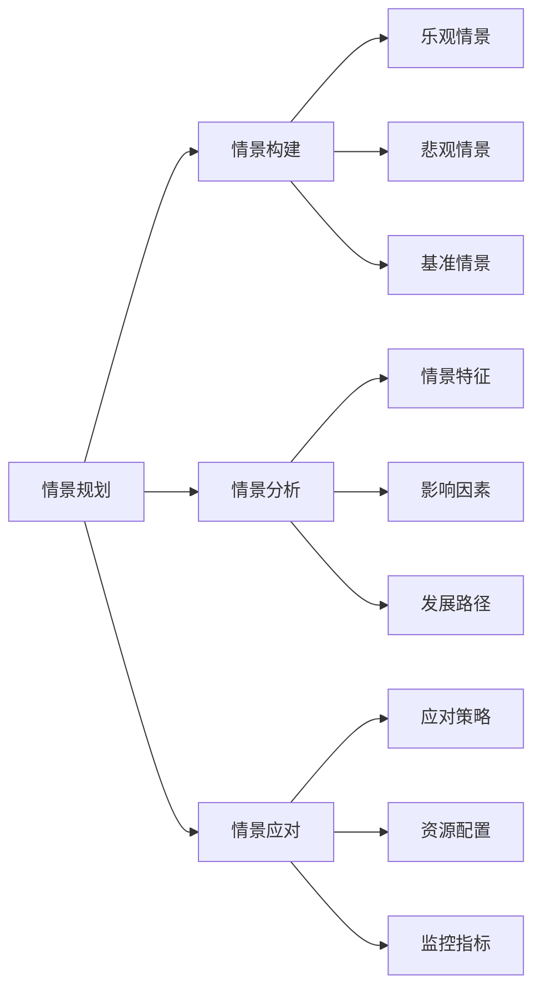
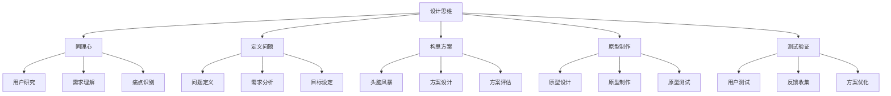
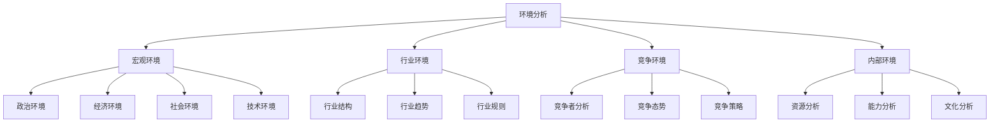
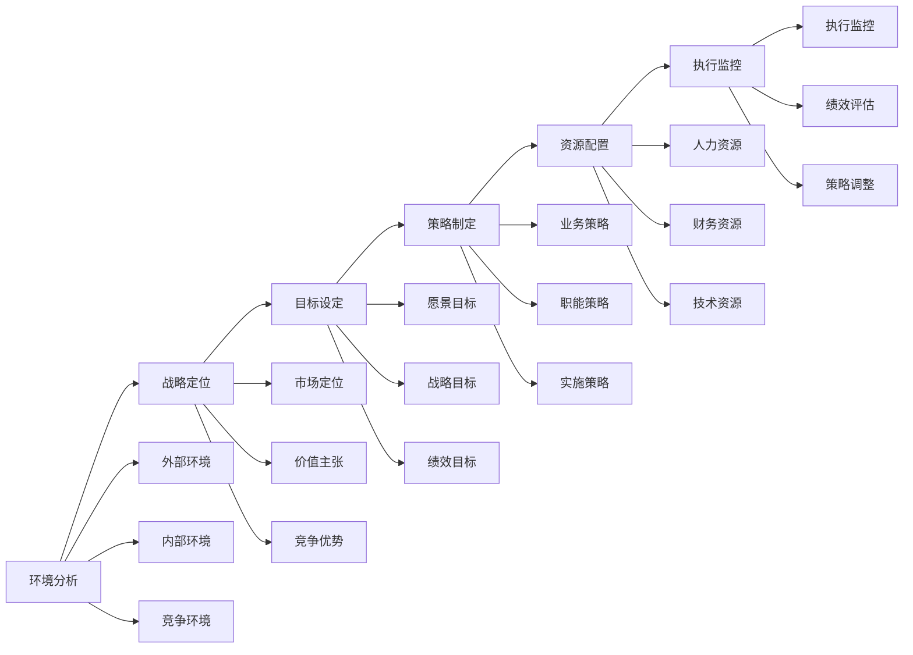

# 战略思维

## 🎯 核心概念

### 战略思维定义
**战略思维**是指领导者运用系统性、前瞻性、创新性的思维方式，分析复杂环境，制定长远目标，统筹资源配置，实现组织可持续发展的综合思维能力。

### 核心特征
- **系统性**：整体性思考，统筹全局
- **前瞻性**：预见未来，把握趋势
- **创新性**：突破常规，创造价值
- **适应性**：灵活应变，持续调整

## 📚 战略思维框架

### 思维层次结构

### 战略思维维度
| 维度 | 定义 | 核心内容 | 应用方法 |
|------|------|----------|----------|
| **系统思维** | 整体性思考 | 全局视角、系统分析 | 系统分析工具 |
| **前瞻思维** | 预见性思考 | 趋势预测、机会把握 | 趋势分析工具 |
| **创新思维** | 突破性思考 | 创新突破、价值创造 | 创新思维工具 |
| **适应思维** | 灵活性思考 | 环境适应、策略调整 | 适应分析工具 |

## 🔍 系统思维

### 系统思维特征
#### 整体性思维
- **定义**：从整体角度思考问题
- **特点**：关注整体效果，避免局部优化
- **应用**：组织战略制定、资源配置决策

#### 关联性思维
- **定义**：关注要素间的相互关系
- **特点**：理解因果关系，把握影响链条
- **应用**：问题分析、解决方案设计

#### 层次性思维
- **定义**：从不同层次分析问题
- **特点**：宏观与微观结合，战略与战术统一
- **应用**：战略规划、执行计划

### 系统分析工具
#### SWOT分析
| 分析维度 | 具体内容 | 分析要点 | 应用价值 |
|----------|----------|----------|----------|
| **优势(S)** | 内部优势 | 资源、能力、经验 | 发挥优势 |
| **劣势(W)** | 内部劣势 | 不足、缺陷、限制 | 弥补劣势 |
| **机会(O)** | 外部机会 | 市场、技术、政策 | 抓住机会 |
| **威胁(T)** | 外部威胁 | 竞争、风险、挑战 | 应对威胁 |

#### 五力模型

## 🔮 前瞻思维

### 前瞻思维特征
#### 趋势分析
- **定义**：分析未来发展趋势
- **方法**：趋势识别、趋势预测
- **应用**：战略规划、投资决策

#### 机会识别
- **定义**：识别未来发展机会
- **方法**：机会扫描、机会评估
- **应用**：市场拓展、产品创新

#### 风险预警
- **定义**：预警未来潜在风险
- **方法**：风险识别、风险评估
- **应用**：风险管理、危机预防

### 前瞻分析工具
#### 趋势分析矩阵
| 趋势类型 | 影响程度 | 发生概率 | 时间框架 | 应对策略 |
|----------|----------|----------|----------|----------|
| **技术趋势** | 高 | 高 | 短期 | 积极应对 |
| **市场趋势** | 中 | 高 | 中期 | 密切关注 |
| **社会趋势** | 高 | 中 | 长期 | 提前布局 |
| **政策趋势** | 中 | 中 | 中期 | 政策跟踪 |

#### 情景规划

## 💡 创新思维

### 创新思维特征
#### 突破思维
- **定义**：突破传统思维模式
- **方法**：思维转换、视角改变
- **应用**：产品创新、模式创新

#### 价值创造
- **定义**：创造新的价值
- **方法**：价值分析、价值设计
- **应用**：商业模式、服务创新

#### 模式创新
- **定义**：创新商业模式
- **方法**：模式分析、模式设计
- **应用**：业务模式、运营模式

### 创新思维工具
#### 设计思维

#### 蓝海战略
| 战略要素 | 红海战略 | 蓝海战略 | 创新要点 |
|----------|----------|----------|----------|
| **竞争范围** | 现有市场 | 创造市场 | 市场创新 |
| **竞争方式** | 价格竞争 | 价值创新 | 价值创新 |
| **竞争焦点** | 成本效率 | 差异化 | 差异化 |
| **竞争结果** | 零和游戏 | 价值增长 | 价值增长 |

## 🔄 适应思维

### 适应思维特征
#### 环境适应
- **定义**：适应环境变化
- **方法**：环境监测、策略调整
- **应用**：战略调整、组织变革

#### 策略调整
- **定义**：调整战略策略
- **方法**：策略评估、策略优化
- **应用**：战略执行、绩效改进

#### 持续改进
- **定义**：持续改进提升
- **方法**：问题识别、改进实施
- **应用**：流程优化、能力提升

### 适应分析工具
#### 环境分析框架

## 🎯 战略思维应用

### 战略制定
#### 战略制定流程

#### 战略制定工具
| 工具类型 | 具体工具 | 应用场景 | 使用要点 |
|----------|----------|----------|----------|
| **分析工具** | SWOT分析、五力模型 | 环境分析 | 全面分析 |
| **规划工具** | 情景规划、路线图 | 战略规划 | 多方案比较 |
| **评估工具** | 平衡计分卡、KPI | 绩效评估 | 量化指标 |
| **监控工具** | 仪表板、预警系统 | 执行监控 | 实时监控 |

### 决策制定
#### 决策制定框架
| 决策阶段 | 具体内容 | 思维要点 | 实施方法 |
|----------|----------|----------|----------|
| **问题识别** | 识别决策问题 | 系统思维 | 问题分析 |
| **信息收集** | 收集相关信息 | 前瞻思维 | 信息调研 |
| **方案设计** | 设计解决方案 | 创新思维 | 方案设计 |
| **方案评估** | 评估方案优劣 | 系统思维 | 方案比较 |
| **方案选择** | 选择最优方案 | 适应思维 | 决策实施 |
| **效果监控** | 监控决策效果 | 适应思维 | 效果评估 |

## 📈 战略思维发展

### 发展路径
#### 基础阶段
- **目标**：建立系统思维基础
- **内容**：学习系统分析工具
- **方法**：理论学习、案例分析
- **评估**：工具应用能力

#### 进阶阶段
- **目标**：提升前瞻思维能力
- **内容**：学习趋势分析方法
- **方法**：趋势研究、情景规划
- **评估**：趋势预测准确性

#### 高级阶段
- **目标**：发展创新思维能力
- **内容**：学习创新思维方法
- **方法**：创新实践、模式创新
- **评估**：创新能力水平

### 发展方法
#### 理论学习
| 学习内容 | 学习方法 | 学习资源 | 评估标准 |
|----------|----------|----------|----------|
| **战略理论** | 阅读经典著作 | 战略管理书籍 | 理论理解度 |
| **案例分析** | 分析成功案例 | 企业案例库 | 分析能力 |
| **工具应用** | 实践应用工具 | 分析工具 | 应用熟练度 |

#### 实践锻炼
| 实践内容 | 实践方法 | 实践机会 | 评估标准 |
|----------|----------|----------|----------|
| **项目实践** | 参与战略项目 | 工作项目 | 项目贡献度 |
| **决策实践** | 参与决策过程 | 管理决策 | 决策质量 |
| **创新实践** | 推动创新项目 | 创新项目 | 创新成果 |

## ⚖️ 战略思维评价

### 评价维度
| 评价维度 | 具体内容 | 评价方法 | 评价标准 |
|----------|----------|----------|----------|
| **系统思维** | 整体性、关联性 | 案例分析 | 分析深度 |
| **前瞻思维** | 趋势分析、机会识别 | 预测准确性 | 预测准确度 |
| **创新思维** | 突破性、价值创造 | 创新成果 | 创新价值 |
| **适应思维** | 环境适应、策略调整 | 适应效果 | 适应速度 |

### 评价工具
#### 战略思维评估量表
| 评估项目 | 评估内容 | 评分标准 | 权重 |
|----------|----------|----------|------|
| **系统分析能力** | 整体分析、关联分析 | 1-5分 | 25% |
| **趋势预测能力** | 趋势识别、机会把握 | 1-5分 | 25% |
| **创新思维能力** | 突破思维、价值创造 | 1-5分 | 25% |
| **适应调整能力** | 环境适应、策略调整 | 1-5分 | 25% |

## 🔗 相关概念链接

### 基础概念
- [[01-基础认知层/01-领导力概述|领导力概述]]
- [[01-基础认知层/04-现代领导力挑战|现代挑战]]
- [[02-理论理解层/现代领导理论/01-变革型领导|变革型领导]]

### 理论概念
- [[02-理论理解层/经典领导理论/01-特质理论|特质理论]]
- [[02-理论理解层/现代领导理论/03-分布式领导|分布式领导]]

### 能力概念
- [[02-决策能力|决策能力]]
- [[03-沟通协调|沟通协调]]
- [[05-变革管理|变革管理]]

### 实践概念
- [[04-实践应用层/管理实践/02-组织文化建设|组织文化]]
- [[04-实践应用层/特殊情境/02-数字化转型领导|数字化转型]]

## 💡 学习要点总结

### 关键理解
1. **系统思维**：从整体角度思考问题
2. **前瞻思维**：预见未来发展趋势
3. **创新思维**：突破常规创造价值
4. **适应思维**：灵活应变持续调整

### 实践应用
1. **战略制定**：运用战略思维制定战略
2. **决策制定**：运用战略思维做决策
3. **问题解决**：运用战略思维解决问题
4. **创新发展**：运用战略思维推动创新

### 思考问题
1. 如何提升战略思维能力？
2. 战略思维在数字化转型中的作用？
3. 如何平衡战略思维的不同维度？
4. 战略思维如何与执行能力结合？

---

**下一步**：[[02-决策能力|决策能力]] | [[03-沟通协调|沟通协调]]
