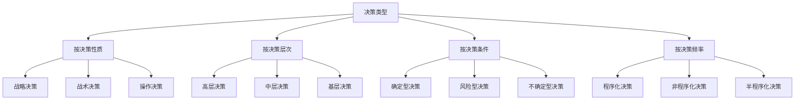
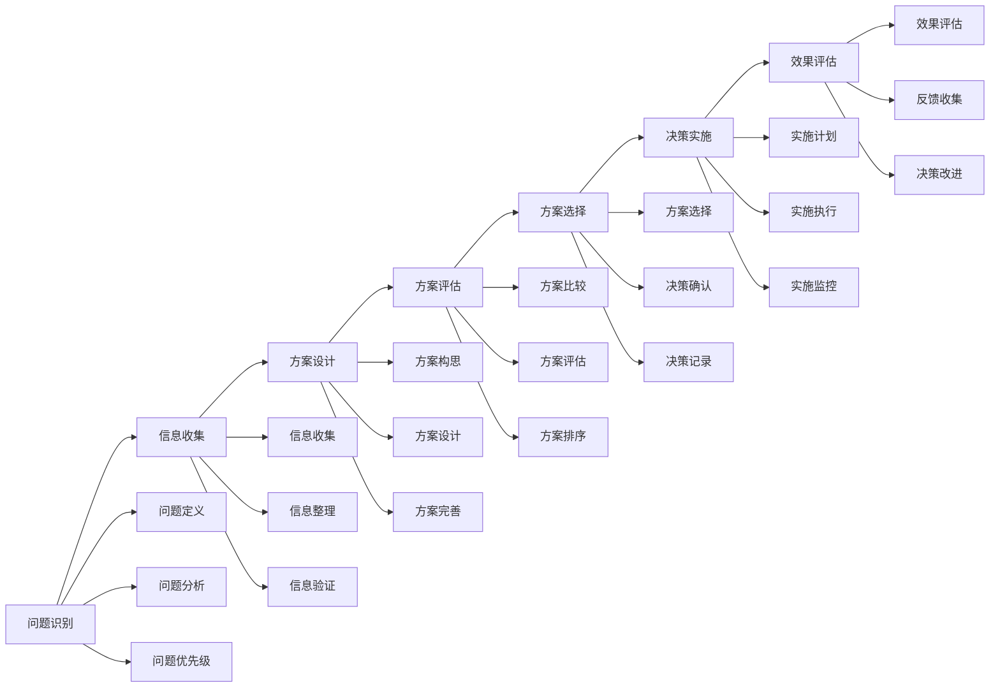
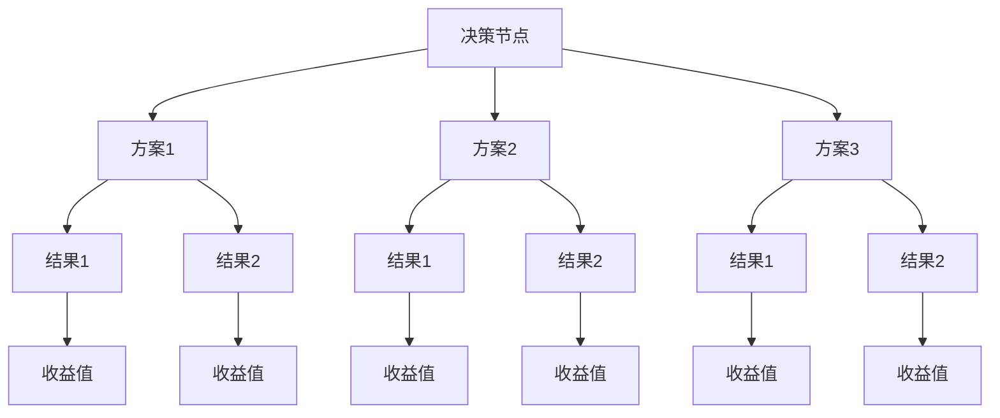
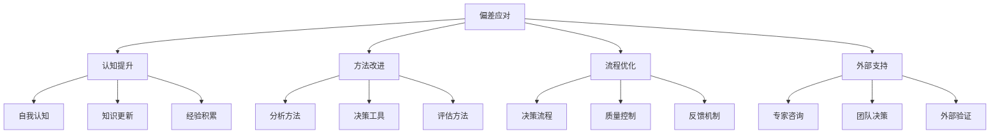

# 决策能力

## 🎯 核心概念

### 决策能力定义
**决策能力**是指领导者在复杂环境中，运用科学方法和理性思维，收集信息、分析问题、评估方案、选择最优解决方案，并承担决策后果的综合能力。

### 核心特征
- **科学性**：运用科学方法决策
- **理性性**：基于理性分析决策
- **时效性**：在合适时机决策
- **责任性**：承担决策后果

## 📚 决策理论框架

### 决策类型分类

### 决策过程模型
#### 经典决策模型

## 🔍 决策分析方法

### 确定型决策
#### 决策树分析

#### 决策矩阵
| 方案 | 标准1 | 标准2 | 标准3 | 标准4 | 加权总分 | 排名 |
|------|-------|-------|-------|-------|----------|------|
| 方案A | 8 | 7 | 9 | 6 | 7.5 | 1 |
| 方案B | 7 | 8 | 7 | 8 | 7.5 | 2 |
| 方案C | 6 | 9 | 6 | 9 | 7.5 | 3 |

### 风险型决策
#### 期望值分析
| 方案 | 状态1(P=0.3) | 状态2(P=0.5) | 状态3(P=0.2) | 期望值 | 排名 |
|------|---------------|---------------|---------------|--------|------|
| 方案A | 100 | 50 | 20 | 56 | 1 |
| 方案B | 80 | 60 | 30 | 58 | 2 |
| 方案C | 60 | 70 | 40 | 60 | 3 |

#### 风险分析
| 方案 | 期望值 | 标准差 | 变异系数 | 风险等级 |
|------|--------|--------|----------|----------|
| 方案A | 56 | 15 | 0.27 | 低风险 |
| 方案B | 58 | 20 | 0.34 | 中风险 |
| 方案C | 60 | 25 | 0.42 | 高风险 |

### 不确定型决策
#### 乐观准则
- **定义**：选择最大收益方案
- **方法**：比较各方案最大收益
- **适用**：风险偏好型决策者

#### 悲观准则
- **定义**：选择最小损失方案
- **方法**：比较各方案最小收益
- **适用**：风险规避型决策者

#### 等概率准则
- **定义**：假设各状态概率相等
- **方法**：计算期望值选择方案
- **适用**：风险中性型决策者

## 🎯 决策质量提升

### 决策质量要素
#### 信息质量
| 质量维度 | 具体内容 | 提升方法 | 评估标准 |
|----------|----------|----------|----------|
| **准确性** | 信息真实可靠 | 信息验证 | 准确率 |
| **完整性** | 信息全面完整 | 信息收集 | 完整度 |
| **时效性** | 信息及时有效 | 信息更新 | 时效性 |
| **相关性** | 信息相关有用 | 信息筛选 | 相关度 |

#### 分析方法
| 方法类型 | 具体方法 | 适用场景 | 使用要点 |
|----------|----------|----------|----------|
| **定量分析** | 数据分析、模型分析 | 数据充足 | 数据质量 |
| **定性分析** | 专家判断、经验分析 | 数据不足 | 专家水平 |
| **综合分析** | 定量定性结合 | 复杂决策 | 方法结合 |

#### 决策标准
| 标准类型 | 具体内容 | 设定方法 | 应用要点 |
|----------|----------|----------|----------|
| **效率标准** | 成本效益、时间效率 | 量化指标 | 可测量性 |
| **效果标准** | 目标达成、质量水平 | 质量指标 | 可达成性 |
| **公平标准** | 利益分配、机会均等 | 公平原则 | 可接受性 |

### 决策偏差识别
#### 常见偏差类型
| 偏差类型 | 具体表现 | 产生原因 | 应对方法 |
|----------|----------|----------|----------|
| **确认偏差** | 选择性信息收集 | 认知偏好 | 多角度分析 |
| **锚定偏差** | 过度依赖初始信息 | 认知局限 | 信息更新 |
| **过度自信** | 高估决策准确性 | 自我认知 | 外部验证 |
| **损失厌恶** | 过度规避损失 | 心理因素 | 理性分析 |

#### 偏差应对策略

## 📊 决策工具应用

### 决策支持工具
#### 决策树
- **用途**：结构化决策分析
- **优点**：直观清晰、逻辑性强
- **缺点**：复杂决策难以应用
- **适用**：中等复杂度决策

#### 决策矩阵
- **用途**：多标准决策分析
- **优点**：综合考虑多个因素
- **缺点**：权重设定主观性强
- **适用**：多标准决策

#### 敏感性分析
- **用途**：分析参数变化影响
- **优点**：识别关键因素
- **缺点**：分析过程复杂
- **适用**：风险分析

### 决策技术工具
#### 大数据分析
| 技术类型 | 具体应用 | 优势 | 挑战 |
|----------|----------|------|------|
| **数据挖掘** | 模式识别、趋势分析 | 发现隐藏规律 | 数据质量要求高 |
| **机器学习** | 预测分析、分类分析 | 自动化分析 | 模型解释性差 |
| **人工智能** | 智能决策、优化分析 | 处理复杂问题 | 技术门槛高 |

#### 决策支持系统
| 系统类型 | 功能特点 | 适用场景 | 实施要点 |
|----------|----------|----------|----------|
| **专家系统** | 知识推理、经验应用 | 专业决策 | 知识库建设 |
| **决策支持系统** | 数据分析、方案比较 | 管理决策 | 系统集成 |
| **智能决策系统** | 自动分析、智能推荐 | 复杂决策 | 技术集成 |

## 🎯 决策能力发展

### 发展路径
#### 基础阶段
- **目标**：掌握基本决策方法
- **内容**：学习决策理论、掌握决策工具
- **方法**：理论学习、案例分析
- **评估**：方法应用能力

#### 进阶阶段
- **目标**：提升决策质量
- **内容**：学习高级分析方法、提升决策技能
- **方法**：实践锻炼、经验积累
- **评估**：决策质量水平

#### 高级阶段
- **目标**：发展战略决策能力
- **内容**：学习战略决策、发展领导决策
- **方法**：战略实践、领导锻炼
- **评估**：战略决策能力

### 发展方法
#### 理论学习
| 学习内容 | 学习方法 | 学习资源 | 评估标准 |
|----------|----------|----------|----------|
| **决策理论** | 阅读经典著作 | 决策科学书籍 | 理论理解度 |
| **分析方法** | 学习分析工具 | 分析工具培训 | 工具应用能力 |
| **案例研究** | 分析决策案例 | 企业案例库 | 案例分析能力 |

#### 实践锻炼
| 实践内容 | 实践方法 | 实践机会 | 评估标准 |
|----------|----------|----------|----------|
| **决策实践** | 参与决策过程 | 工作决策 | 决策质量 |
| **项目实践** | 参与项目决策 | 项目决策 | 项目贡献度 |
| **团队决策** | 参与团队决策 | 团队决策 | 团队协作能力 |

## 📈 决策效果评估

### 评估维度
| 评估维度 | 具体内容 | 评估方法 | 评估标准 |
|----------|----------|----------|----------|
| **决策质量** | 准确性、完整性 | 结果评估 | 目标达成度 |
| **决策效率** | 时间效率、成本效率 | 过程评估 | 效率指标 |
| **决策影响** | 短期影响、长期影响 | 影响评估 | 影响程度 |
| **决策学习** | 经验积累、能力提升 | 学习评估 | 学习效果 |

### 评估工具
#### 决策效果评估表
| 评估项目 | 评估内容 | 评分标准 | 权重 |
|----------|----------|----------|------|
| **决策准确性** | 目标达成程度 | 1-5分 | 30% |
| **决策效率** | 时间成本效率 | 1-5分 | 25% |
| **决策影响** | 短期长期影响 | 1-5分 | 25% |
| **决策学习** | 经验能力提升 | 1-5分 | 20% |

## 🔗 相关概念链接

### 基础概念
- [[01-基础认知层/01-领导力概述|领导力概述]]
- [[01-基础认知层/04-现代领导力挑战|现代挑战]]
- [[02-理论理解层/经典领导理论/02-行为理论|行为理论]]

### 理论概念
- [[02-理论理解层/经典领导理论/03-情境理论|情境理论]]
- [[02-理论理解层/现代领导理论/01-变革型领导|变革型领导]]

### 能力概念
- [[01-战略思维|战略思维]]
- [[03-沟通协调|沟通协调]]
- [[06-情商与自我管理|情商管理]]

### 实践概念
- [[04-实践应用层/管理实践/03-绩效管理|绩效管理]]
- [[07-工具资源层/实用模板/03-决策分析模板|决策模板]]

## 💡 学习要点总结

### 关键理解
1. **决策过程**：问题识别到效果评估的完整过程
2. **决策方法**：确定型、风险型、不确定型决策方法
3. **决策质量**：信息质量、分析方法、决策标准
4. **决策偏差**：常见偏差类型及应对方法

### 实践应用
1. **决策制定**：运用科学方法制定决策
2. **决策分析**：运用分析工具分析问题
3. **决策评估**：评估决策质量和效果
4. **决策改进**：基于反馈改进决策能力

### 思考问题
1. 如何提升决策质量和效率？
2. 决策偏差如何识别和应对？
3. 大数据时代如何改进决策方法？
4. 如何平衡决策速度和质量？

---

**下一步**：[[03-沟通协调|沟通协调]] | [[04-团队建设|团队建设]]
