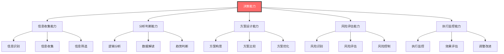
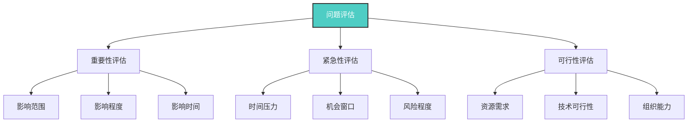
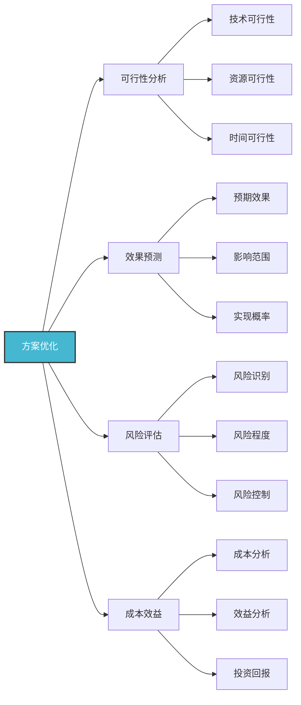
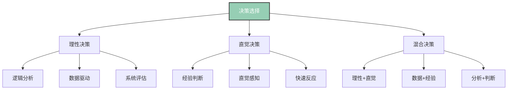
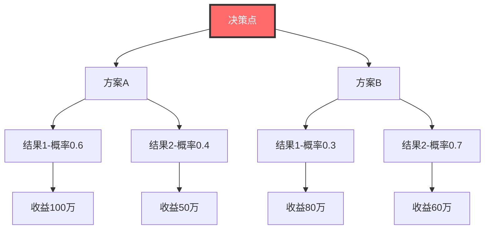
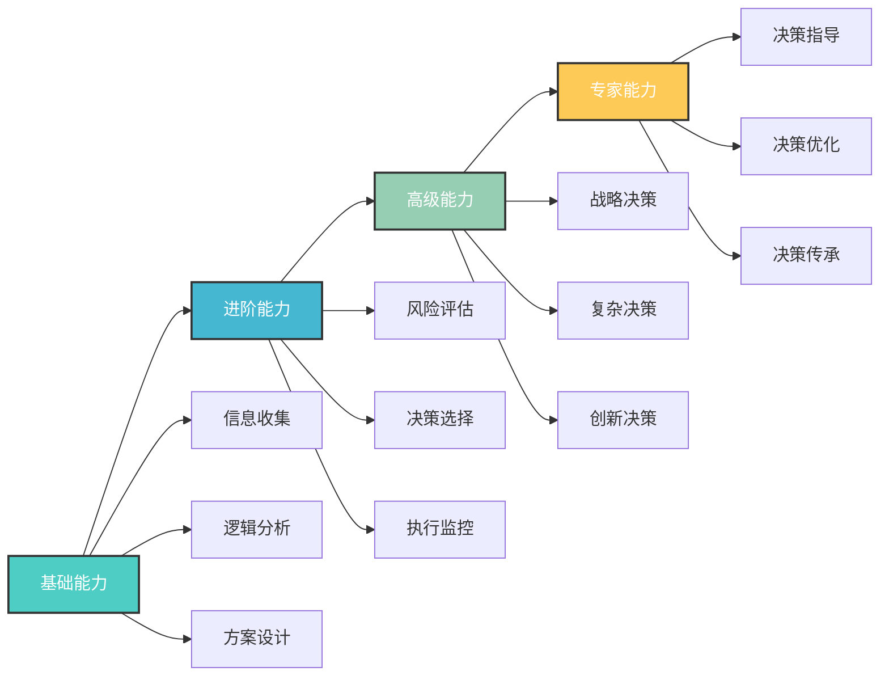
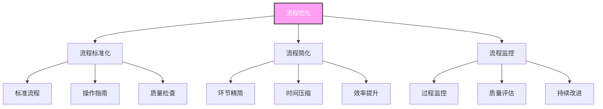

# 决策能力

## 🎯 核心概念理解

### 基本定义
**决策能力**（Decision-Making Ability）是领导者在复杂环境中，运用科学方法和逻辑思维，收集信息、分析问题、评估方案、做出选择并承担后果的综合能力。

### 核心特征

## 📚 决策理论框架

### 决策类型分类
#### 按决策性质分类
| 决策类型 | 特征 | 适用情境 | 决策方法 |
|----------|------|----------|----------|
| **程序化决策** | 重复性、常规性 | 日常管理 | 标准化流程 |
| **非程序化决策** | 创新性、复杂性 | 战略决策 | 创造性思维 |
| **半程序化决策** | 部分程序化 | 管理决策 | 混合方法 |

#### 按决策条件分类
| 决策类型 | 信息条件 | 风险程度 | 决策方法 |
|----------|----------|----------|----------|
| **确定型决策** | 信息充分 | 风险低 | 数学优化 |
| **风险型决策** | 信息部分 | 风险中 | 概率分析 |
| **不确定型决策** | 信息不足 | 风险高 | 情景分析 |

### 决策过程模型

## 🔍 决策过程详解

### 1. 问题识别阶段
#### 问题识别方法
| 方法类型 | 具体方法 | 适用情境 | 实施要点 |
|----------|----------|----------|----------|
| **问题清单法** | 系统性问题清单 | 复杂问题 | 全面覆盖、分类整理 |
| **鱼骨图法** | 因果分析图 | 问题分析 | 多维度分析、根因识别 |
| **5W1H法** | 六个维度分析 | 问题澄清 | 全面分析、清晰定义 |

#### 问题优先级评估

### 2. 信息收集阶段
#### 信息收集方法
| 收集方法 | 信息类型 | 收集渠道 | 质量要求 |
|----------|----------|----------|----------|
| **内部信息** | 组织内部信息 | 内部系统、员工反馈 | 准确性、及时性 |
| **外部信息** | 市场环境信息 | 市场调研、行业报告 | 全面性、客观性 |
| **专家信息** | 专业领域信息 | 专家咨询、专业机构 | 专业性、权威性 |

#### 信息质量评估
| 评估维度 | 评估标准 | 评估方法 | 改进措施 |
|----------|----------|----------|----------|
| **准确性** | 信息真实可靠 | 交叉验证 | 多源验证 |
| **完整性** | 信息全面充分 | 完整性检查 | 补充收集 |
| **及时性** | 信息时效性强 | 时间检查 | 实时更新 |
| **相关性** | 信息与决策相关 | 相关性分析 | 筛选过滤 |

### 3. 方案设计阶段
#### 方案设计方法
| 设计方法 | 适用情境 | 设计要点 | 预期效果 |
|----------|----------|----------|----------|
| **头脑风暴** | 创新性方案 | 开放思维、数量优先 | 创新方案多 |
| **德尔菲法** | 专家意见 | 匿名讨论、多轮反馈 | 专家共识 |
| **情景规划** | 不确定性高 | 多情景设计 | 适应性强 |
| **标杆学习** | 有成功案例 | 学习借鉴、改进创新 | 风险较低 |

#### 方案优化方法

### 4. 方案评估阶段
#### 评估标准体系
| 评估维度 | 具体指标 | 权重 | 评估方法 |
|----------|----------|------|----------|
| **效果性** | 目标达成度 | 30% | 目标对比分析 |
| **可行性** | 实施可能性 | 25% | 可行性分析 |
| **风险性** | 风险可控性 | 20% | 风险评估 |
| **经济性** | 成本效益比 | 15% | 成本效益分析 |
| **时效性** | 实施时间 | 10% | 时间分析 |

#### 评估工具
| 工具类型 | 适用情境 | 工具特点 | 使用要点 |
|----------|----------|----------|----------|
| **决策矩阵** | 多方案比较 | 量化评估 | 权重设定 |
| **决策树** | 风险决策 | 概率分析 | 概率估算 |
| **敏感性分析** | 参数变化 | 影响分析 | 参数选择 |
| **蒙特卡洛模拟** | 复杂决策 | 随机模拟 | 模型建立 |

### 5. 方案选择阶段
#### 选择方法
| 选择方法 | 适用情境 | 选择标准 | 实施要点 |
|----------|----------|----------|----------|
| **最优选择** | 目标明确 | 效益最大化 | 目标函数 |
| **满意选择** | 时间紧迫 | 满足基本要求 | 最低标准 |
| **折中选择** | 多目标冲突 | 平衡各方利益 | 权重平衡 |
| **渐进选择** | 信息不足 | 逐步完善 | 分步实施 |

#### 选择决策模型

## 🎯 决策工具与方法

### 定量决策工具
#### 决策树分析

#### 决策矩阵
| 方案 | 效果性(30%) | 可行性(25%) | 风险性(20%) | 经济性(15%) | 时效性(10%) | 总分 | 排名 |
|------|-------------|-------------|-------------|-------------|-------------|------|------|
| **方案A** | 8 | 7 | 6 | 8 | 7 | 7.1 | 1 |
| **方案B** | 7 | 8 | 7 | 7 | 8 | 7.3 | 2 |
| **方案C** | 6 | 6 | 8 | 6 | 6 | 6.4 | 3 |

### 定性决策工具
#### SWOT分析
| 内部因素 | 优势(S) | 劣势(W) |
|----------|----------|----------|
| **外部因素** | | |
| **机会(O)** | SO策略 | WO策略 |
| **威胁(T)** | ST策略 | WT策略 |

#### 情景分析
| 情景 | 概率 | 关键假设 | 应对策略 |
|------|------|----------|----------|
| **乐观情景** | 30% | 市场增长10% | 积极扩张 |
| **基准情景** | 50% | 市场增长5% | 稳步发展 |
| **悲观情景** | 20% | 市场下降5% | 保守策略 |

## 📊 决策能力发展

### 能力发展模型

### 发展策略
#### 1. 知识学习
| 学习内容 | 学习方法 | 学习时间 | 评估方式 |
|----------|----------|----------|----------|
| **决策理论** | 理论学习 | 1个月 | 理论测试 |
| **决策工具** | 工具学习 | 2个月 | 工具应用 |
| **案例分析** | 案例研究 | 3个月 | 案例分析 |

#### 2. 技能训练
| 训练内容 | 训练方法 | 训练时间 | 评估方式 |
|----------|----------|----------|----------|
| **信息收集** | 实践练习 | 1个月 | 收集质量 |
| **分析判断** | 案例分析 | 2个月 | 分析深度 |
| **方案设计** | 项目实践 | 3个月 | 方案质量 |

#### 3. 经验积累
| 积累方式 | 具体方法 | 积累时间 | 评估方式 |
|----------|----------|----------|----------|
| **决策实践** | 实际决策 | 持续 | 决策效果 |
| **反思总结** | 定期反思 | 持续 | 反思质量 |
| **经验分享** | 经验交流 | 持续 | 分享效果 |

## 🎯 决策质量提升

### 质量提升策略
#### 1. 决策流程优化

#### 2. 决策支持系统
| 系统类型 | 功能特点 | 应用价值 | 实施要点 |
|----------|----------|----------|----------|
| **信息系统** | 信息收集、处理 | 提高信息质量 | 系统建设、数据质量 |
| **分析系统** | 数据分析、建模 | 提高分析效率 | 工具选择、模型建立 |
| **决策系统** | 决策支持、优化 | 提高决策质量 | 系统集成、用户培训 |

#### 3. 决策文化建设
| 文化要素 | 具体内容 | 建设方法 | 预期效果 |
|----------|----------|----------|----------|
| **科学决策** | 基于数据、逻辑 | 培训教育、制度约束 | 决策科学性提升 |
| **民主决策** | 参与决策、集体智慧 | 参与机制、沟通平台 | 决策质量提升 |
| **责任决策** | 承担责任、后果自负 | 责任制度、考核机制 | 决策责任感增强 |

## 🎓 费曼学习法应用

### 第一步：选择概念
选择"决策能力"这一核心概念

### 第二步：教授他人
用简单语言向他人解释：
- 决策能力就像医生诊断病情，需要收集信息、分析问题、制定方案、选择治疗

### 第三步：识别盲点
发现理解不足的地方：
- 如何平衡决策速度与决策质量？
- 如何在不同情境下调整决策方法？

### 第四步：重新学习
回到资料重新学习盲点：
- 决策平衡方法
- 情境适应性理论

### 第五步：简化表达
用更简洁的方式表达概念：
- 决策能力 = 信息收集 + 分析判断 + 方案设计 + 风险评估 + 执行监控

## 💡 刻意练习要点

### 练习目标
1. **明确目标**：掌握决策核心要素
2. **专注练习**：重点练习薄弱环节
3. **即时反馈**：获得决策效果反馈
4. **走出舒适区**：挑战复杂决策问题
5. **持续改进**：基于反馈不断优化

### 练习方法
| 练习类型 | 具体方法 | 实施步骤 | 评估标准 |
|----------|----------|----------|----------|
| **案例分析** | 分析决策案例 | 1.选择案例 2.问题分析 3.方案设计 4.效果评估 | 分析深度 |
| **情景模拟** | 模拟决策情境 | 1.设定情境 2.信息收集 3.方案制定 4.决策选择 | 决策质量 |
| **工具应用** | 应用决策工具 | 1.选择工具 2.数据收集 3.工具应用 4.结果分析 | 工具熟练度 |
| **决策实践** | 实际决策练习 | 1.识别问题 2.收集信息 3.制定方案 4.实施决策 | 实践效果 |

## 🔗 相关概念链接

### 基础概念
- [[01-基础认知层/01-领导力概述|领导力概述]] - 理解领导力本质
- [[01-基础认知层/04-现代领导力挑战|现代挑战]] - 现代背景
- [[01-基础认知层/05-领导力伦理与价值观|伦理价值观]] - 价值基础

### 理论概念
- [[02-理论理解层/经典领导理论/02-行为理论|行为理论]] - 行为理论
- [[02-理论理解层/经典领导理论/03-情境理论|情境理论]] - 情境理论

### 能力概念
- [[01-战略思维|战略思维]] - 战略能力
- [[03-沟通协调|沟通协调]] - 沟通能力
- [[06-情商与自我管理|情商管理]] - 情商能力

### 实践概念
- [[04-实践应用层/管理实践/03-绩效管理|绩效管理]] - 绩效实践
- [[04-实践应用层/管理实践/04-危机领导|危机领导]] - 危机实践

## 💡 学习要点总结

### 关键理解
1. **过程导向**：决策是一个完整的过程
2. **信息基础**：决策基于充分的信息
3. **方法科学**：运用科学的决策方法
4. **责任承担**：承担决策的后果

### 实践应用
1. **流程规范**：建立规范的决策流程
2. **工具应用**：熟练运用决策工具
3. **质量提升**：持续提升决策质量
4. **经验积累**：积累决策经验

### 思考问题
1. 如何提高决策的速度和质量？
2. 决策能力在领导力中的作用？
3. 如何在不同情境下调整决策方法？
4. 如何建立有效的决策支持系统？

---

**下一步**：[[03-沟通协调|沟通协调]] | [[04-团队建设|团队建设]]