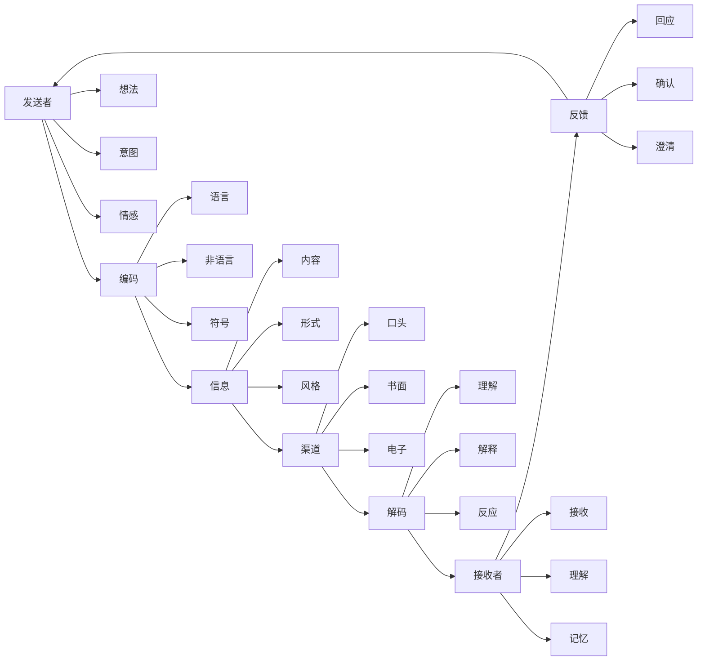
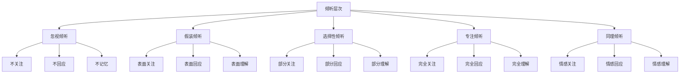
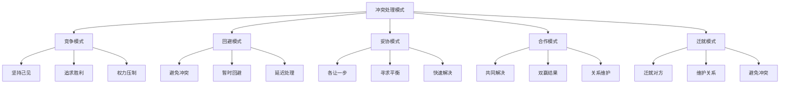
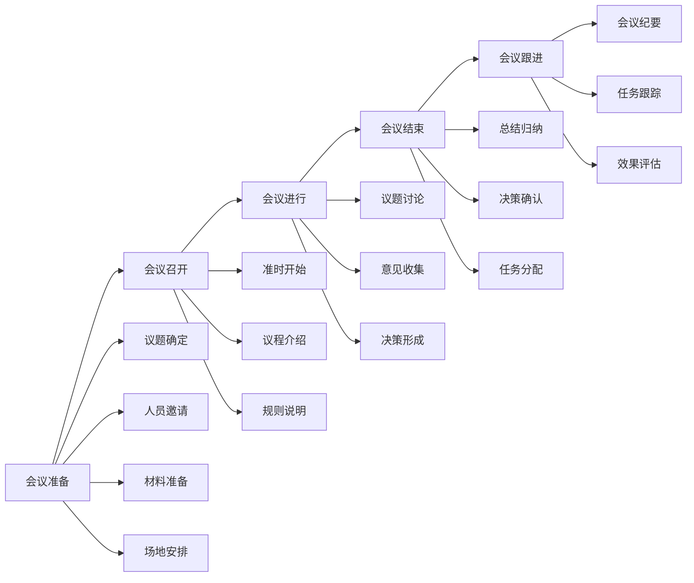

# 沟通协调

## 🎯 核心概念

### 沟通协调定义
**沟通协调**是指领导者通过有效的信息传递、情感交流和利益协调，建立良好的人际关系，促进团队协作，实现组织目标的核心领导能力。

### 核心特征
- **双向性**：信息双向流动
- **目的性**：有明确的沟通目标
- **情境性**：根据情境调整方式
- **效果性**：注重沟通效果

## 📚 沟通理论框架

### 沟通模型

### 沟通类型分类
| 分类维度 | 类型 | 特征 | 适用场景 |
|----------|------|------|----------|
| **按方向** | 上行沟通 | 下级向上级 | 汇报工作、请示问题 |
| | 下行沟通 | 上级向下级 | 传达指令、指导工作 |
| | 平行沟通 | 同级之间 | 协调配合、信息共享 |
| **按方式** | 正式沟通 | 正式渠道 | 重要信息、正式场合 |
| | 非正式沟通 | 非正式渠道 | 日常交流、情感沟通 |
| **按媒介** | 口头沟通 | 语言交流 | 即时反馈、情感表达 |
| | 书面沟通 | 文字交流 | 准确记录、正式传达 |
| | 电子沟通 | 电子媒介 | 快速便捷、跨地域 |

## 🔍 沟通技能要素

### 表达技能
#### 语言表达
| 技能要素 | 具体内容 | 提升方法 | 评估标准 |
|----------|----------|----------|----------|
| **清晰性** | 表达清晰明确 | 逻辑训练 | 理解准确度 |
| **准确性** | 用词准确恰当 | 词汇积累 | 表达准确度 |
| **生动性** | 表达生动有趣 | 修辞训练 | 吸引力程度 |
| **适应性** | 适应听众特点 | 情境分析 | 适应程度 |

#### 非语言表达
| 技能要素 | 具体内容 | 提升方法 | 评估标准 |
|----------|----------|----------|----------|
| **肢体语言** | 手势、姿态 | 肢体训练 | 自然程度 |
| **面部表情** | 表情、眼神 | 表情训练 | 真诚程度 |
| **声音语调** | 音量、语调 | 声音训练 | 感染力 |
| **空间距离** | 距离、位置 | 空间意识 | 舒适程度 |

### 倾听技能
#### 倾听层次

#### 倾听技巧
| 技巧类型 | 具体方法 | 应用要点 | 效果评估 |
|----------|----------|----------|----------|
| **主动倾听** | 积极关注、主动回应 | 全神贯注 | 理解准确度 |
| **反馈倾听** | 及时反馈、确认理解 | 双向交流 | 沟通效果 |
| **同理倾听** | 情感理解、换位思考 | 情感共鸣 | 关系质量 |
| **批判倾听** | 理性分析、客观评价 | 独立思考 | 判断准确性 |

### 反馈技能
#### 反馈类型
| 反馈类型 | 具体内容 | 适用场景 | 实施要点 |
|----------|----------|----------|----------|
| **积极反馈** | 肯定、赞扬 | 表现优秀 | 及时具体 |
| **建设性反馈** | 建议、改进 | 需要改进 | 客观友善 |
| **负面反馈** | 批评、纠正 | 问题严重 | 冷静客观 |
| **无反馈** | 不回应 | 无关紧要 | 避免过度 |

#### 反馈技巧
| 技巧要素 | 具体内容 | 实施方法 | 效果评估 |
|----------|----------|----------|----------|
| **及时性** | 及时反馈 | 快速回应 | 时效性 |
| **具体性** | 具体明确 | 详细描述 | 清晰度 |
| **建设性** | 建设性建议 | 积极导向 | 改进效果 |
| **平衡性** | 平衡正负 | 客观公正 | 接受度 |

## 🎯 协调技能要素

### 冲突管理
#### 冲突类型
| 冲突类型 | 具体表现 | 产生原因 | 应对策略 |
|----------|----------|----------|----------|
| **任务冲突** | 目标不一致 | 目标差异 | 目标协调 |
| **关系冲突** | 人际关系紧张 | 个性差异 | 关系改善 |
| **过程冲突** | 方法程序分歧 | 方法差异 | 流程统一 |
| **价值观冲突** | 价值观念不同 | 文化差异 | 价值融合 |

#### 冲突处理模式

### 团队协调
#### 协调机制
| 协调类型 | 具体内容 | 实施方法 | 适用场景 |
|----------|----------|----------|----------|
| **目标协调** | 统一目标方向 | 目标设定、目标沟通 | 目标分歧 |
| **资源协调** | 合理配置资源 | 资源分配、资源共享 | 资源冲突 |
| **流程协调** | 优化工作流程 | 流程设计、流程优化 | 流程问题 |
| **关系协调** | 改善人际关系 | 关系建设、关系维护 | 关系紧张 |

#### 协调技巧
| 技巧要素 | 具体内容 | 实施方法 | 效果评估 |
|----------|----------|----------|----------|
| **沟通协调** | 通过沟通协调 | 有效沟通 | 协调效果 |
| **利益协调** | 平衡各方利益 | 利益分析 | 满意度 |
| **时间协调** | 合理安排时间 | 时间管理 | 效率提升 |
| **空间协调** | 优化空间布局 | 空间设计 | 工作环境 |

## 📊 沟通协调应用

### 会议管理
#### 会议类型
| 会议类型 | 特征 | 目的 | 管理要点 |
|----------|------|------|----------|
| **决策会议** | 重要决策 | 做出决策 | 充分讨论 |
| **信息会议** | 信息传达 | 信息共享 | 清晰传达 |
| **协调会议** | 协调配合 | 协调工作 | 达成共识 |
| **培训会议** | 知识技能 | 能力提升 | 有效学习 |

#### 会议管理流程

### 跨部门协调
#### 协调策略
| 策略类型 | 具体内容 | 实施方法 | 适用场景 |
|----------|----------|----------|----------|
| **正式协调** | 正式渠道协调 | 制度流程 | 重要事项 |
| **非正式协调** | 非正式渠道协调 | 人际关系 | 日常事项 |
| **项目协调** | 项目团队协调 | 项目管理 | 项目事项 |
| **矩阵协调** | 矩阵结构协调 | 双重领导 | 复杂事项 |

#### 协调工具
| 工具类型 | 具体工具 | 使用场景 | 使用要点 |
|----------|----------|----------|----------|
| **沟通工具** | 会议、邮件、电话 | 信息交流 | 及时有效 |
| **协调工具** | 协调会、工作坊 | 问题解决 | 充分讨论 |
| **管理工具** | 项目管理、流程管理 | 系统协调 | 规范管理 |
| **技术工具** | 协作平台、管理系统 | 技术支撑 | 便捷高效 |

## 📈 沟通协调效果评估

### 评估维度
| 评估维度 | 具体内容 | 评估方法 | 评估标准 |
|----------|----------|----------|----------|
| **沟通效果** | 信息传递准确性 | 反馈收集 | 理解准确度 |
| **协调效果** | 问题解决程度 | 结果评估 | 解决程度 |
| **关系质量** | 人际关系改善 | 关系评估 | 关系满意度 |
| **工作效率** | 工作效率提升 | 绩效评估 | 效率指标 |

### 评估工具
#### 沟通效果评估表
| 评估项目 | 评估内容 | 评分标准 | 权重 |
|----------|----------|----------|------|
| **信息准确性** | 信息传递准确度 | 1-5分 | 25% |
| **理解程度** | 信息理解程度 | 1-5分 | 25% |
| **反馈质量** | 反馈及时性质量 | 1-5分 | 25% |
| **关系改善** | 人际关系改善 | 1-5分 | 25% |

## 🎯 沟通协调能力发展

### 发展路径
#### 基础阶段
- **目标**：掌握基本沟通技能
- **内容**：学习沟通理论、掌握基本技能
- **方法**：理论学习、技能训练
- **评估**：技能应用能力

#### 进阶阶段
- **目标**：提升沟通协调效果
- **内容**：学习高级技能、提升协调能力
- **方法**：实践锻炼、经验积累
- **评估**：协调效果水平

#### 高级阶段
- **目标**：发展战略沟通能力
- **内容**：学习战略沟通、发展领导沟通
- **方法**：战略实践、领导锻炼
- **评估**：战略沟通能力

### 发展方法
#### 技能训练
| 训练内容 | 训练方法 | 训练资源 | 评估标准 |
|----------|----------|----------|----------|
| **表达训练** | 演讲训练、写作训练 | 培训课程 | 表达能力 |
| **倾听训练** | 倾听练习、反馈练习 | 实践练习 | 倾听能力 |
| **协调训练** | 协调练习、冲突处理 | 案例分析 | 协调能力 |

#### 实践锻炼
| 实践内容 | 实践方法 | 实践机会 | 评估标准 |
|----------|----------|----------|----------|
| **沟通实践** | 日常沟通、会议沟通 | 工作沟通 | 沟通效果 |
| **协调实践** | 团队协调、跨部门协调 | 项目协调 | 协调效果 |
| **领导实践** | 领导沟通、战略沟通 | 领导工作 | 领导效果 |

## 🔗 相关概念链接

### 基础概念
- [[01-基础认知层/01-领导力概述|领导力概述]]
- [[01-基础认知层/02-管理者vs领导者|管理者vs领导者]]
- [[02-理论理解层/经典领导理论/02-行为理论|行为理论]]

### 理论概念
- [[02-理论理解层/现代领导理论/02-服务型领导|服务型领导]]
- [[02-理论理解层/现代领导理论/03-分布式领导|分布式领导]]

### 能力概念
- [[01-战略思维|战略思维]]
- [[02-决策能力|决策能力]]
- [[04-团队建设|团队建设]]

### 实践概念
- [[04-实践应用层/管理实践/01-团队管理|团队管理]]
- [[07-工具资源层/实用模板/01-会议管理模板|会议模板]]

## 💡 学习要点总结

### 关键理解
1. **双向沟通**：信息双向流动，注重反馈
2. **情境适应**：根据情境调整沟通方式
3. **冲突管理**：有效处理各种冲突
4. **团队协调**：促进团队协作配合

### 实践应用
1. **有效沟通**：运用沟通技能有效沟通
2. **冲突处理**：运用冲突管理技能处理冲突
3. **团队协调**：运用协调技能促进团队协作
4. **关系建设**：通过沟通协调建设良好关系

### 思考问题
1. 如何提升沟通协调能力？
2. 如何处理不同类型的冲突？
3. 如何提高会议管理效果？
4. 如何改善跨部门协调？

---

**下一步**：[[04-团队建设|团队建设]] | [[05-变革管理|变革管理]]
