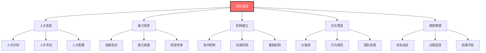
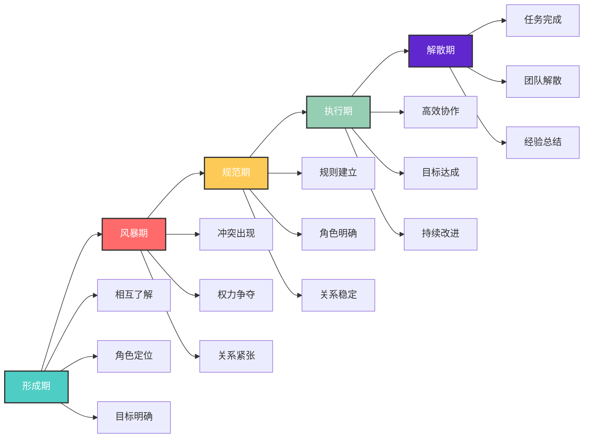
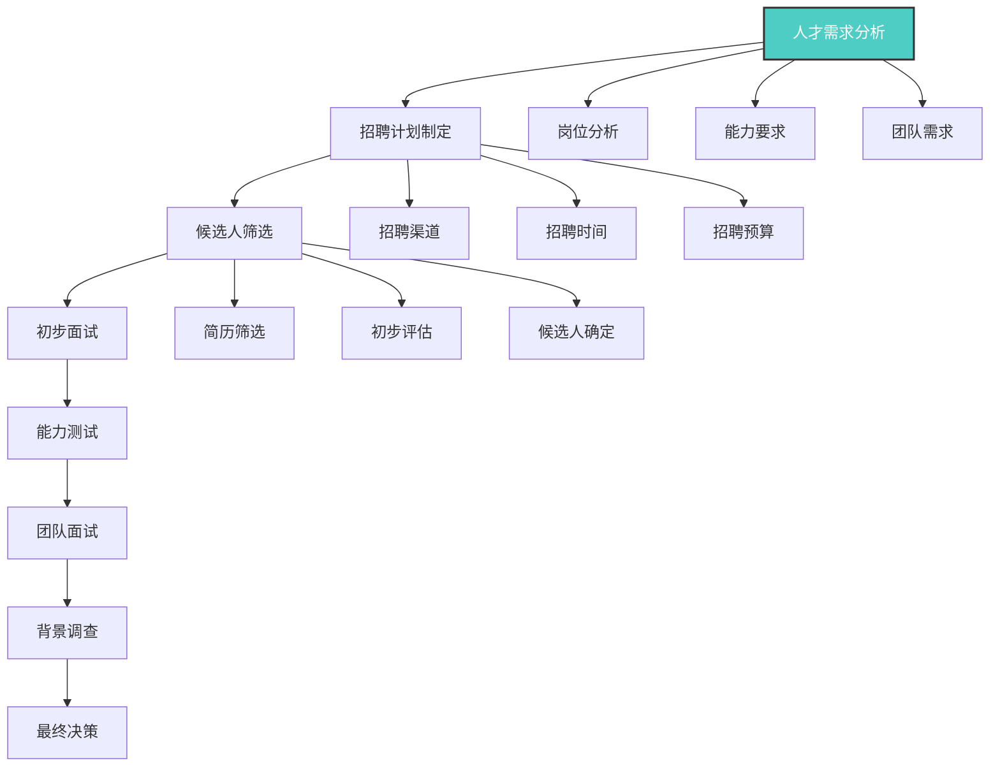
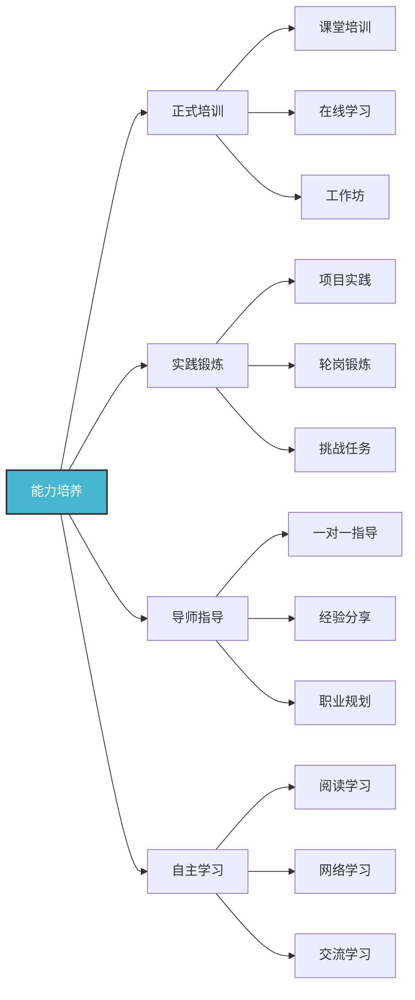
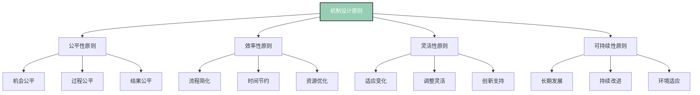
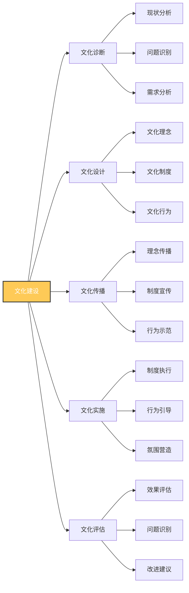
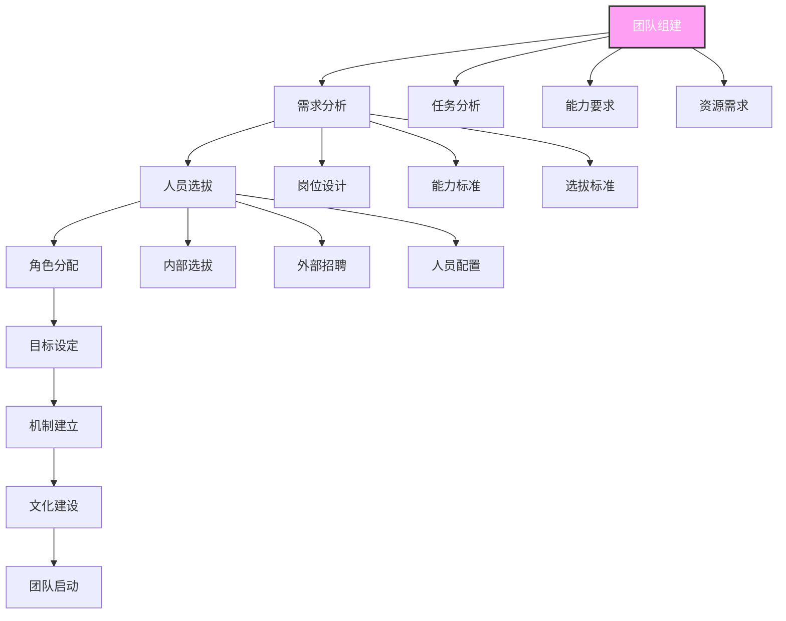
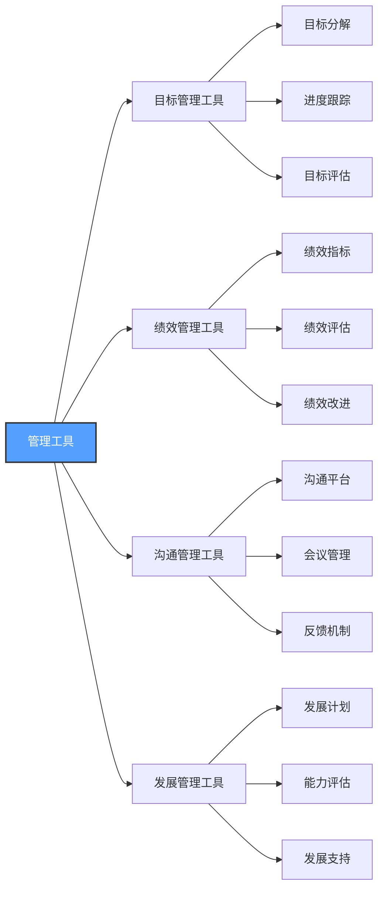
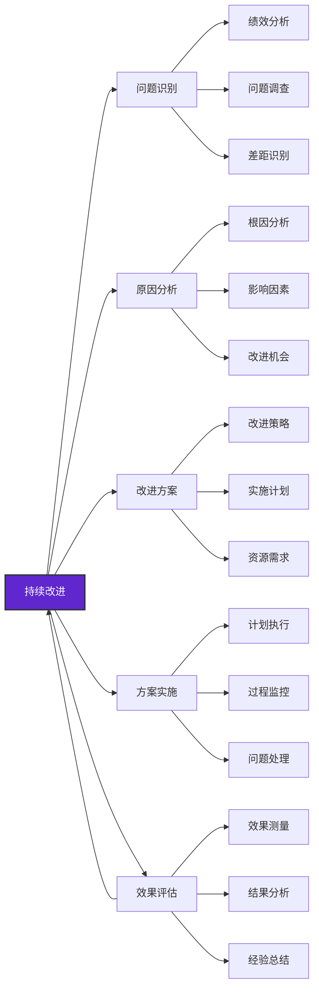

# 团队建设

## 🎯 核心概念理解

### 基本定义
**团队建设**（Team Building）是领导者通过选拔人才、培养能力、建立机制、营造文化等方式，构建高效协作团队，实现组织目标的核心能力。

### 核心特征

## 📚 团队理论框架

### 团队发展阶段
#### 塔克曼团队发展模型

#### 各阶段特征分析
| 发展阶段 | 主要特征 | 团队表现 | 领导策略 | 关键任务 |
|----------|----------|----------|----------|----------|
| **形成期** | 相互了解、角色定位 | 效率低、关系浅 | 指导型领导 | 明确目标、建立关系 |
| **风暴期** | 冲突出现、权力争夺 | 冲突多、效率低 | 教练型领导 | 化解冲突、建立规则 |
| **规范期** | 规则建立、关系稳定 | 关系好、效率中 | 支持型领导 | 巩固规则、提升能力 |
| **执行期** | 高效协作、目标达成 | 效率高、关系好 | 授权型领导 | 持续改进、创新发展 |
| **解散期** | 任务完成、团队解散 | 效率下降 | 关怀型领导 | 经验总结、关系维护 |

### 团队类型分类
#### 按功能分类
| 团队类型 | 特征 | 优势 | 劣势 | 适用情境 |
|----------|------|------|------|----------|
| **功能团队** | 同部门、同专业 | 专业性强 | 视野局限 | 专业工作 |
| **跨功能团队** | 跨部门、跨专业 | 视野开阔 | 协调困难 | 复杂项目 |
| **项目团队** | 临时性、目标导向 | 灵活性强 | 稳定性差 | 项目执行 |
| **虚拟团队** | 远程协作、技术支撑 | 成本低 | 沟通困难 | 远程工作 |

#### 按结构分类
| 团队结构 | 特征 | 优势 | 劣势 | 适用情境 |
|----------|------|------|------|----------|
| **层级团队** | 等级分明、权力集中 | 效率高 | 创新不足 | 传统组织 |
| **扁平团队** | 等级较少、权力分散 | 创新强 | 协调困难 | 现代组织 |
| **网络团队** | 节点连接、灵活协作 | 适应性强 | 管理复杂 | 复杂环境 |
| **矩阵团队** | 双重领导、项目导向 | 资源整合 | 冲突较多 | 复杂项目 |

## 🔍 团队建设要素

### 1. 人才选拔
#### 选拔标准
| 选拔维度 | 具体标准 | 评估方法 | 权重 |
|----------|----------|----------|------|
| **专业能力** | 专业技能、工作经验 | 技能测试、经验评估 | 40% |
| **团队协作** | 协作能力、沟通能力 | 团队测试、沟通评估 | 30% |
| **学习能力** | 学习意愿、适应能力 | 学习测试、适应评估 | 20% |
| **价值观匹配** | 价值观、文化适应 | 价值观测试、文化评估 | 10% |

#### 选拔流程

### 2. 能力培养
#### 培养体系
| 培养层次 | 培养内容 | 培养方法 | 培养时间 | 评估方式 |
|----------|----------|----------|----------|----------|
| **基础培训** | 岗位技能、团队规范 | 集中培训、在线学习 | 1个月 | 技能测试 |
| **进阶培训** | 专业技能、管理技能 | 专业培训、实践练习 | 3个月 | 能力评估 |
| **高级培训** | 领导技能、创新技能 | 领导培训、创新训练 | 6个月 | 综合评估 |
| **持续发展** | 终身学习、能力提升 | 自主学习、导师指导 | 持续 | 绩效评估 |

#### 培养方法

### 3. 机制建立
#### 协作机制
| 机制类型 | 具体内容 | 实施方法 | 预期效果 |
|----------|----------|----------|----------|
| **沟通机制** | 定期沟通、信息共享 | 会议制度、沟通平台 | 信息透明 |
| **决策机制** | 集体决策、民主参与 | 决策流程、参与制度 | 决策质量 |
| **协调机制** | 资源协调、冲突解决 | 协调流程、冲突处理 | 协作效率 |
| **激励机制** | 绩效激励、发展激励 | 激励制度、奖励机制 | 工作积极性 |

#### 机制设计原则

### 4. 文化营造
#### 团队文化要素
| 文化要素 | 具体内容 | 建设方法 | 预期效果 |
|----------|----------|----------|----------|
| **价值观** | 共同价值观、价值追求 | 价值观传播、价值践行 | 价值统一 |
| **行为规范** | 行为标准、行为准则 | 规范制定、行为引导 | 行为一致 |
| **团队氛围** | 工作氛围、人际关系 | 氛围营造、关系建设 | 氛围和谐 |
| **团队精神** | 团队意识、团队荣誉 | 精神培养、荣誉建设 | 团队凝聚力 |

#### 文化建设策略

## 🎯 团队建设方法

### 1. 团队组建
#### 组建原则
| 组建原则 | 具体内容 | 实施要点 | 预期效果 |
|----------|----------|----------|----------|
| **目标导向** | 明确目标、目标一致 | 目标沟通、目标确认 | 目标统一 |
| **能力互补** | 能力互补、优势互补 | 能力分析、优势匹配 | 能力整合 |
| **角色明确** | 角色清晰、责任明确 | 角色定义、责任分配 | 责任清晰 |
| **规模适中** | 规模合理、管理有效 | 规模控制、管理优化 | 管理效率 |

#### 组建流程

### 2. 团队发展
#### 发展阶段策略
| 发展阶段 | 主要挑战 | 发展策略 | 关键活动 |
|----------|----------|----------|----------|
| **形成期** | 相互了解、角色定位 | 指导型领导、明确目标 | 团队介绍、目标设定 |
| **风暴期** | 冲突处理、规则建立 | 教练型领导、化解冲突 | 冲突调解、规则制定 |
| **规范期** | 能力提升、关系稳定 | 支持型领导、能力发展 | 技能培训、关系建设 |
| **执行期** | 持续改进、创新发展 | 授权型领导、创新支持 | 持续改进、创新发展 |

#### 发展活动设计
| 活动类型 | 活动内容 | 活动目标 | 实施要点 |
|----------|----------|----------|----------|
| **团队建设活动** | 团队游戏、户外拓展 | 增强凝聚力 | 趣味性、参与性 |
| **技能培训活动** | 专业培训、技能竞赛 | 提升能力 | 实用性、针对性 |
| **沟通交流活动** | 团队会议、经验分享 | 促进沟通 | 开放性、互动性 |
| **创新活动** | 头脑风暴、创新竞赛 | 激发创新 | 创造性、挑战性 |

### 3. 团队管理
#### 管理要素
| 管理要素 | 具体内容 | 管理方法 | 管理目标 |
|----------|----------|----------|----------|
| **目标管理** | 目标设定、目标跟踪 | 目标分解、进度监控 | 目标达成 |
| **绩效管理** | 绩效评估、绩效改进 | 绩效指标、绩效反馈 | 绩效提升 |
| **关系管理** | 人际关系、团队关系 | 关系建设、冲突处理 | 关系和谐 |
| **发展管理** | 能力发展、职业发展 | 发展计划、发展支持 | 持续发展 |

#### 管理工具

## 📊 团队建设效果

### 效果评估指标
#### 团队绩效指标
| 评估维度 | 具体指标 | 测量方法 | 目标值 |
|----------|----------|----------|--------|
| **任务完成** | 任务完成率、质量达标率 | 任务统计、质量检查 | >95% |
| **效率提升** | 工作效率、时间效率 | 效率统计、时间分析 | >20% |
| **创新能力** | 创新数量、创新质量 | 创新统计、创新评估 | >10% |
| **客户满意度** | 客户满意度、服务质量 | 客户调查、服务评估 | >4.0分 |

#### 团队健康指标
| 评估维度 | 具体指标 | 测量方法 | 目标值 |
|----------|----------|----------|--------|
| **团队凝聚力** | 团队认同度、归属感 | 团队调查、氛围评估 | >4.0分 |
| **沟通效果** | 沟通满意度、信息透明度 | 沟通调查、信息评估 | >4.0分 |
| **协作效率** | 协作满意度、冲突处理 | 协作调查、冲突统计 | >4.0分 |
| **发展水平** | 能力提升、职业发展 | 能力评估、发展统计 | >80% |

### 效果提升策略
#### 1. 持续改进

#### 2. 创新发展
| 创新方向 | 具体内容 | 实施方法 | 预期效果 |
|----------|----------|----------|----------|
| **管理创新** | 管理模式、管理方法 | 管理实验、方法改进 | 管理效率提升 |
| **技术创新** | 技术应用、技术改进 | 技术引进、技术研发 | 技术水平提升 |
| **文化创新** | 文化理念、文化实践 | 文化探索、文化实践 | 文化活力增强 |
| **服务创新** | 服务模式、服务质量 | 服务设计、服务改进 | 服务质量提升 |

## 🎓 费曼学习法应用

### 第一步：选择概念
选择"团队建设"这一核心概念

### 第二步：教授他人
用简单语言向他人解释：
- 团队建设就像建造一座房子，需要选好材料（人才）、打好地基（机制）、建好结构（文化）、装修美化（氛围）

### 第三步：识别盲点
发现理解不足的地方：
- 如何平衡团队效率与团队和谐？
- 如何在不同发展阶段调整团队建设策略？

### 第四步：重新学习
回到资料重新学习盲点：
- 团队平衡理论
- 发展阶段理论

### 第五步：简化表达
用更简洁的方式表达概念：
- 团队建设 = 人才选拔 + 能力培养 + 机制建立 + 文化营造 + 绩效管理

## 💡 刻意练习要点

### 练习目标
1. **明确目标**：掌握团队建设核心要素
2. **专注练习**：重点练习薄弱环节
3. **即时反馈**：获得团队建设效果反馈
4. **走出舒适区**：挑战复杂团队建设情境
5. **持续改进**：基于反馈不断优化

### 练习方法
| 练习类型 | 具体方法 | 实施步骤 | 评估标准 |
|----------|----------|----------|----------|
| **案例分析** | 分析团队建设案例 | 1.选择案例 2.问题分析 3.方法总结 4.应用实践 | 分析深度 |
| **情景模拟** | 模拟团队建设情境 | 1.设定情境 2.角色扮演 3.建设实践 4.效果评估 | 实践效果 |
| **项目实践** | 实际团队建设项目 | 1.项目选择 2.计划制定 3.实施执行 4.效果评估 | 项目效果 |
| **技能训练** | 专项技能训练 | 1.选择技能 2.制定计划 3.反复练习 4.效果评估 | 技能提升 |

## 🔗 相关概念链接

### 基础概念
- [[01-基础认知层/01-领导力概述|领导力概述]] - 理解领导力本质
- [[01-基础认知层/02-管理者vs领导者|管理者vs领导者]] - 角色区分
- [[01-基础认知层/04-现代领导力挑战|现代挑战]] - 现代背景

### 理论概念
- [[02-理论理解层/现代领导理论/01-变革型领导|变革型领导]] - 变革理论
- [[02-理论理解层/现代领导理论/03-分布式领导|分布式领导]] - 分布理论

### 能力概念
- [[01-战略思维|战略思维]] - 战略能力
- [[02-决策能力|决策能力]] - 决策能力
- [[03-沟通协调|沟通协调]] - 沟通能力

### 实践概念
- [[04-实践应用层/管理实践/01-团队管理|团队管理]] - 管理实践
- [[04-实践应用层/管理实践/02-组织文化建设|组织文化]] - 文化建设

## 💡 学习要点总结

### 关键理解
1. **系统性**：团队建设是一个系统工程
2. **阶段性**：团队发展有不同阶段
3. **动态性**：团队建设需要持续改进
4. **文化性**：团队文化是核心要素

### 实践应用
1. **系统规划**：制定系统性的团队建设规划
2. **阶段管理**：根据发展阶段调整管理策略
3. **持续改进**：建立持续改进机制
4. **文化建设**：营造良好的团队文化

### 思考问题
1. 如何构建高效协作的团队？
2. 团队建设在组织发展中的作用？
3. 如何平衡团队效率与团队和谐？
4. 如何在不同发展阶段调整团队建设策略？

---

**下一步**：[[05-变革管理|变革管理]] | [[06-情商与自我管理|情商管理]]