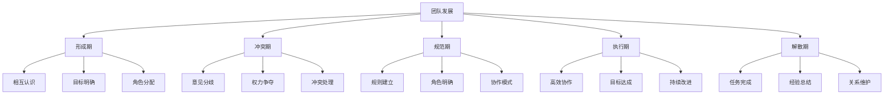
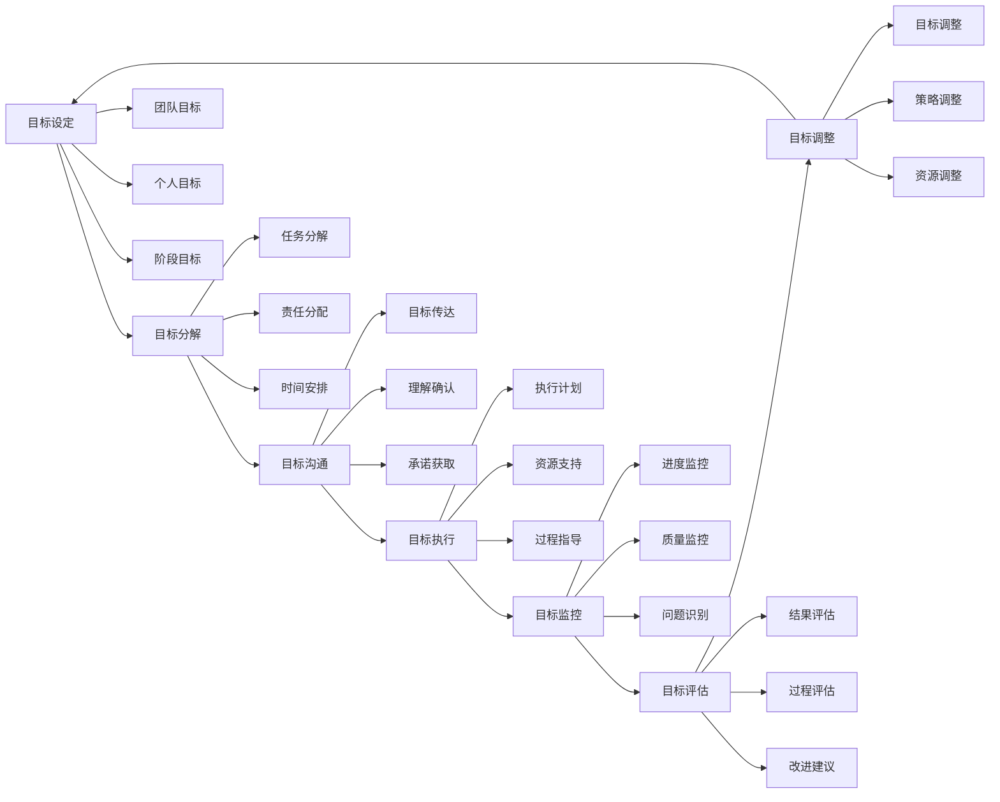
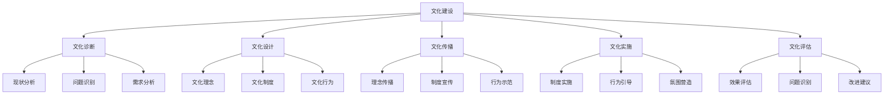
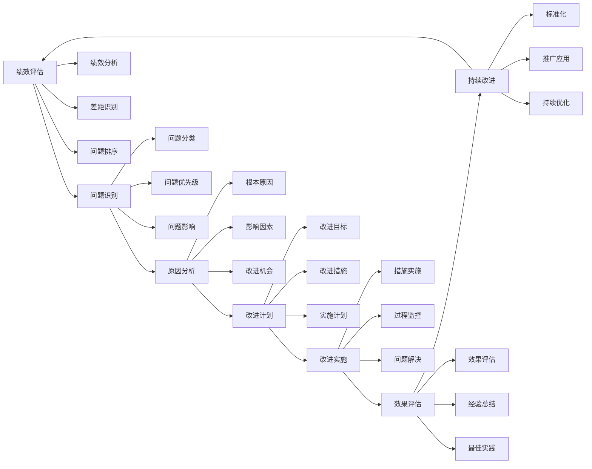

# 团队建设

## 🎯 核心概念

### 团队建设定义
**团队建设**是指领导者通过选拔、培训、激励、协调等手段，构建高效团队，提升团队凝聚力和协作能力，实现团队目标的过程。

### 核心特征
- **目标导向**：围绕共同目标
- **协作配合**：成员间协作配合
- **能力互补**：技能能力互补
- **持续发展**：团队持续发展

## 📚 团队理论框架

### 团队发展阶段

### 团队类型分类
| 团队类型 | 特征 | 适用场景 | 管理要点 |
|----------|------|----------|----------|
| **功能团队** | 同部门、同职能 | 日常运营 | 技能提升 |
| **项目团队** | 跨部门、临时性 | 项目执行 | 目标管理 |
| **虚拟团队** | 远程、技术支撑 | 跨地域合作 | 技术支撑 |
| **创新团队** | 创新导向、灵活 | 研发创新 | 创新激励 |
| **管理团队** | 决策导向、高层 | 战略决策 | 决策效率 |

## 🔍 团队构建要素

### 团队目标
#### 目标设定原则
| 原则 | 具体内容 | 实施方法 | 评估标准 |
|------|----------|----------|----------|
| **SMART原则** | 具体、可测量、可达成、相关、时限 | 目标分解 | 目标达成度 |
| **挑战性原则** | 具有挑战性 | 适度挑战 | 激励效果 |
| **共识性原则** | 团队共识 | 充分讨论 | 认同度 |
| **动态性原则** | 动态调整 | 定期评估 | 适应性 |

#### 目标管理流程

### 团队成员
#### 成员选拔
| 选拔维度 | 具体内容 | 评估方法 | 权重 |
|----------|----------|----------|------|
| **专业技能** | 专业能力、经验水平 | 技能测试 | 30% |
| **团队协作** | 协作能力、沟通能力 | 行为观察 | 25% |
| **学习能力** | 学习意愿、适应能力 | 学习测试 | 20% |
| **价值观匹配** | 价值观念、文化适应 | 价值观评估 | 15% |
| **动机水平** | 工作动机、成就需求 | 动机测试 | 10% |

#### 角色分配
| 角色类型 | 主要职责 | 能力要求 | 发展重点 |
|----------|----------|----------|----------|
| **领导者** | 团队管理、决策制定 | 领导能力 | 战略思维 |
| **执行者** | 任务执行、目标达成 | 执行能力 | 专业技能 |
| **协调者** | 关系协调、冲突处理 | 协调能力 | 沟通技能 |
| **创新者** | 创新思维、问题解决 | 创新能力 | 创新思维 |
| **支持者** | 团队支持、资源提供 | 支持能力 | 服务意识 |

### 团队文化
#### 文化要素
| 文化要素 | 具体内容 | 建设方法 | 评估标准 |
|----------|----------|----------|----------|
| **共同价值观** | 价值观念、行为准则 | 价值观传播 | 认同度 |
| **团队精神** | 团队意识、协作精神 | 团队活动 | 凝聚力 |
| **学习文化** | 学习氛围、知识共享 | 学习机制 | 学习效果 |
| **创新文化** | 创新氛围、风险承担 | 创新激励 | 创新成果 |

#### 文化建设

## 🎯 团队建设方法

### 团队培训
#### 培训类型
| 培训类型 | 具体内容 | 培训方法 | 适用对象 |
|----------|----------|----------|----------|
| **技能培训** | 专业技能、工作技能 | 理论+实践 | 新员工 |
| **团队培训** | 团队协作、沟通技能 | 团队活动 | 团队成员 |
| **领导培训** | 领导技能、管理能力 | 案例+实践 | 团队领导 |
| **文化培训** | 企业文化、团队文化 | 文化传播 | 全体员工 |

#### 培训方法
| 方法类型 | 具体方法 | 适用场景 | 效果评估 |
|----------|----------|----------|----------|
| **理论培训** | 讲座、课程 | 知识传授 | 知识测试 |
| **实践培训** | 实习、演练 | 技能提升 | 技能评估 |
| **案例培训** | 案例分析、讨论 | 问题解决 | 分析能力 |
| **体验培训** | 拓展训练、游戏 | 团队建设 | 团队效果 |

### 团队激励
#### 激励理论
| 激励理论 | 核心观点 | 激励方法 | 适用场景 |
|----------|----------|----------|----------|
| **需求层次理论** | 满足不同层次需求 | 需求满足 | 员工发展 |
| **双因素理论** | 激励因素和保健因素 | 因素激励 | 工作设计 |
| **期望理论** | 期望、工具性、效价 | 期望激励 | 目标设定 |
| **公平理论** | 公平感影响动机 | 公平激励 | 薪酬管理 |

#### 激励方法
| 激励类型 | 具体方法 | 实施要点 | 效果评估 |
|----------|----------|----------|----------|
| **物质激励** | 薪酬、奖金、福利 | 公平合理 | 满意度 |
| **精神激励** | 认可、赞扬、荣誉 | 及时具体 | 成就感 |
| **发展激励** | 培训、晋升、挑战 | 个性化 | 成长感 |
| **环境激励** | 工作环境、氛围 | 舒适友好 | 归属感 |

### 团队协调
#### 协调机制
| 协调类型 | 具体内容 | 实施方法 | 适用场景 |
|----------|----------|----------|----------|
| **目标协调** | 统一目标方向 | 目标沟通 | 目标分歧 |
| **资源协调** | 合理配置资源 | 资源分配 | 资源冲突 |
| **流程协调** | 优化工作流程 | 流程设计 | 流程问题 |
| **关系协调** | 改善人际关系 | 关系建设 | 关系紧张 |

#### 协调工具
| 工具类型 | 具体工具 | 使用场景 | 使用要点 |
|----------|----------|----------|----------|
| **沟通工具** | 会议、邮件、电话 | 信息交流 | 及时有效 |
| **协调工具** | 协调会、工作坊 | 问题解决 | 充分讨论 |
| **管理工具** | 项目管理、流程管理 | 系统协调 | 规范管理 |
| **技术工具** | 协作平台、管理系统 | 技术支撑 | 便捷高效 |

## 📊 团队绩效管理

### 绩效评估
#### 评估维度
| 评估维度 | 具体内容 | 评估方法 | 权重 |
|----------|----------|----------|------|
| **任务绩效** | 任务完成、质量水平 | 结果评估 | 40% |
| **关系绩效** | 团队协作、关系质量 | 360度评估 | 30% |
| **创新绩效** | 创新贡献、改进建议 | 创新评估 | 20% |
| **发展绩效** | 能力提升、学习成长 | 发展评估 | 10% |

#### 评估方法
| 评估方法 | 具体内容 | 适用场景 | 评估标准 |
|----------|----------|----------|----------|
| **目标管理** | 目标达成度评估 | 目标导向 | 目标达成率 |
| **360度评估** | 多角度综合评估 | 全面评估 | 综合评分 |
| **关键事件** | 关键事件记录评估 | 行为评估 | 事件质量 |
| **平衡计分卡** | 多维度平衡评估 | 战略评估 | 平衡指标 |

### 绩效改进
#### 改进策略
| 改进策略 | 具体内容 | 实施方法 | 预期效果 |
|----------|----------|----------|----------|
| **技能提升** | 提升专业技能 | 培训发展 | 能力提升 |
| **流程优化** | 优化工作流程 | 流程改进 | 效率提升 |
| **激励改进** | 改进激励机制 | 激励调整 | 动机提升 |
| **环境改善** | 改善工作环境 | 环境优化 | 满意度提升 |

#### 改进流程

## 📈 团队建设效果评估

### 评估维度
| 评估维度 | 具体内容 | 评估方法 | 评估标准 |
|----------|----------|----------|----------|
| **团队绩效** | 任务完成、目标达成 | 绩效评估 | 绩效指标 |
| **团队凝聚力** | 团队团结、协作程度 | 凝聚力评估 | 凝聚力指数 |
| **团队满意度** | 成员满意度、归属感 | 满意度调查 | 满意度指数 |
| **团队发展** | 能力提升、持续发展 | 发展评估 | 发展指标 |

### 评估工具
#### 团队建设评估表
| 评估项目 | 评估内容 | 评分标准 | 权重 |
|----------|----------|----------|------|
| **团队目标** | 目标清晰度、达成度 | 1-5分 | 25% |
| **团队协作** | 协作程度、配合度 | 1-5分 | 25% |
| **团队文化** | 文化认同、氛围质量 | 1-5分 | 25% |
| **团队发展** | 能力提升、持续改进 | 1-5分 | 25% |

## 🎯 团队建设能力发展

### 发展路径
#### 基础阶段
- **目标**：掌握基本团队建设技能
- **内容**：学习团队理论、掌握基本技能
- **方法**：理论学习、技能训练
- **评估**：技能应用能力

#### 进阶阶段
- **目标**：提升团队建设效果
- **内容**：学习高级技能、提升建设能力
- **方法**：实践锻炼、经验积累
- **评估**：建设效果水平

#### 高级阶段
- **目标**：发展战略团队建设能力
- **内容**：学习战略团队建设、发展领导能力
- **方法**：战略实践、领导锻炼
- **评估**：战略建设能力

### 发展方法
#### 理论学习
| 学习内容 | 学习方法 | 学习资源 | 评估标准 |
|----------|----------|----------|----------|
| **团队理论** | 阅读经典著作 | 团队管理书籍 | 理论理解度 |
| **建设方法** | 学习建设工具 | 建设工具培训 | 工具应用能力 |
| **案例研究** | 分析建设案例 | 企业案例库 | 案例分析能力 |

#### 实践锻炼
| 实践内容 | 实践方法 | 实践机会 | 评估标准 |
|----------|----------|----------|----------|
| **团队建设** | 参与团队建设 | 工作团队 | 建设效果 |
| **团队管理** | 管理团队工作 | 管理岗位 | 管理效果 |
| **团队发展** | 推动团队发展 | 发展项目 | 发展效果 |

## 🔗 相关概念链接

### 基础概念
- [[01-基础认知层/01-领导力概述|领导力概述]]
- [[01-基础认知层/02-管理者vs领导者|管理者vs领导者]]
- [[02-理论理解层/经典领导理论/02-行为理论|行为理论]]

### 理论概念
- [[02-理论理解层/现代领导理论/03-分布式领导|分布式领导]]
- [[02-理论理解层/现代领导理论/02-服务型领导|服务型领导]]

### 能力概念
- [[01-战略思维|战略思维]]
- [[03-沟通协调|沟通协调]]
- [[05-变革管理|变革管理]]

### 实践概念
- [[04-实践应用层/管理实践/01-团队管理|团队管理]]
- [[07-工具资源层/实用模板/02-团队建设模板|团队模板]]

## 💡 学习要点总结

### 关键理解
1. **团队发展**：团队发展的不同阶段
2. **团队构建**：目标、成员、文化等要素
3. **团队建设**：培训、激励、协调等方法
4. **团队绩效**：绩效评估和改进

### 实践应用
1. **团队构建**：构建高效团队
2. **团队建设**：运用各种方法建设团队
3. **团队管理**：管理团队日常工作
4. **团队发展**：推动团队持续发展

### 思考问题
1. 如何构建高效团队？
2. 如何提升团队凝聚力？
3. 如何处理团队冲突？
4. 如何评估团队建设效果？

---

**下一步**：[[05-变革管理|变革管理]] | [[06-情商与自我管理|情商管理]]
