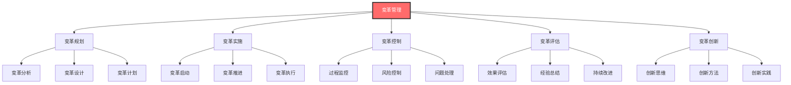
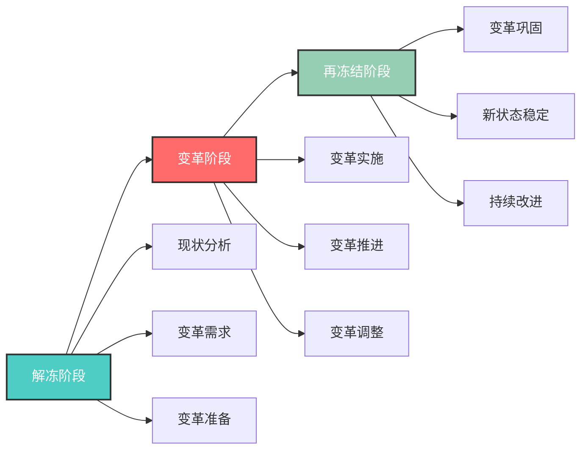
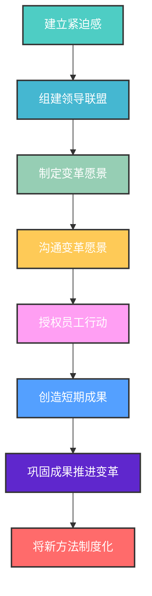
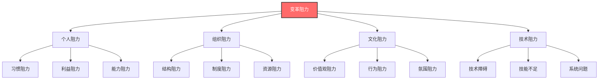
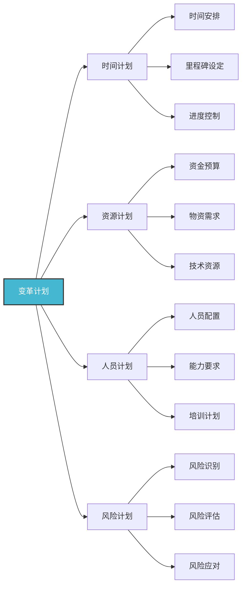
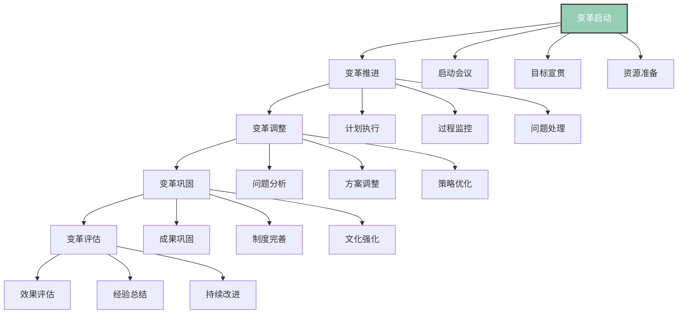
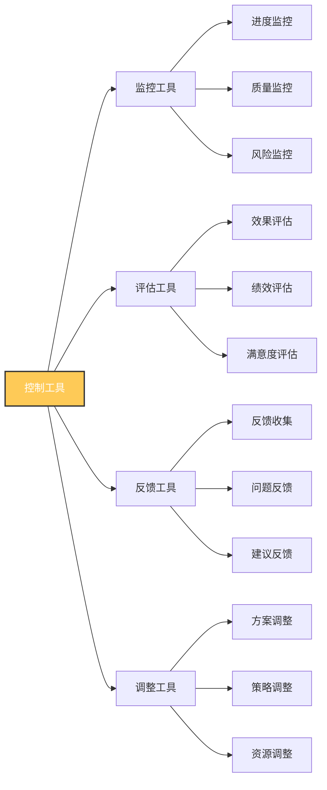
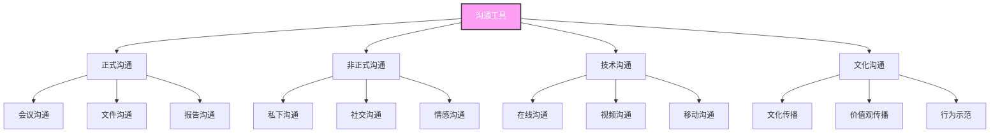
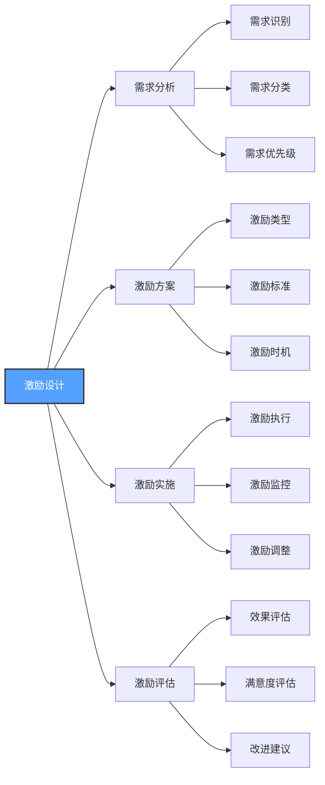
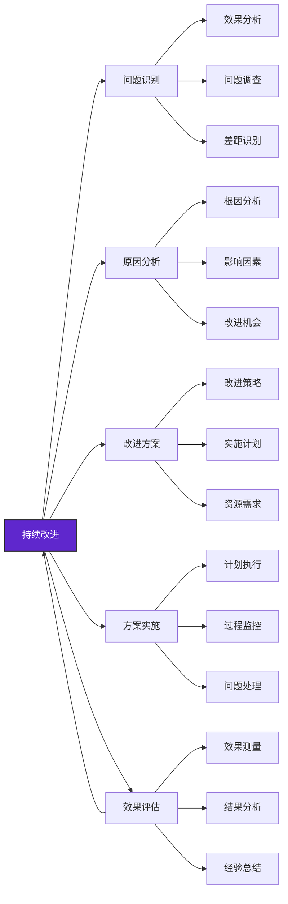

# 变革管理

## 🎯 核心概念理解

### 基本定义
**变革管理**（Change Management）是领导者在组织面临内外部环境变化时，通过系统性的规划、实施和控制，引导组织适应变化，实现转型发展的综合能力。

### 核心特征

## 📚 变革理论框架

### 变革类型分类
#### 按变革范围分类
| 变革类型 | 特征 | 影响程度 | 实施难度 | 适用情境 |
|----------|------|----------|----------|----------|
| **渐进式变革** | 逐步推进、小幅调整 | 低 | 低 | 稳定环境 |
| **激进式变革** | 快速推进、大幅调整 | 高 | 高 | 危机环境 |
| **混合式变革** | 结合渐进与激进 | 中 | 中 | 复杂环境 |

#### 按变革内容分类
| 变革类型 | 具体内容 | 变革重点 | 实施要点 |
|----------|----------|----------|----------|
| **战略变革** | 战略方向、战略目标 | 战略调整 | 战略沟通 |
| **组织变革** | 组织结构、组织流程 | 结构优化 | 流程再造 |
| **文化变革** | 价值观、行为规范 | 文化重塑 | 文化传播 |
| **技术变革** | 技术升级、技术应用 | 技术更新 | 技术培训 |

### 变革过程模型
#### 勒温变革模型

#### 科特变革模型

## 🔍 变革管理要素

### 1. 变革分析
#### 变革动因分析
| 动因类型 | 具体表现 | 影响程度 | 应对策略 |
|----------|----------|----------|----------|
| **外部动因** | 市场变化、技术发展 | 高 | 适应变化 |
| **内部动因** | 组织问题、发展需要 | 中 | 主动变革 |
| **竞争动因** | 竞争加剧、生存压力 | 高 | 竞争应对 |
| **创新动因** | 创新需求、发展机遇 | 中 | 创新发展 |

#### 变革阻力分析

#### 阻力应对策略
| 阻力类型 | 应对策略 | 具体方法 | 预期效果 |
|----------|----------|----------|----------|
| **个人阻力** | 沟通教育、激励支持 | 变革沟通、培训支持 | 阻力减少 |
| **组织阻力** | 结构调整、制度完善 | 结构优化、制度改进 | 阻力消除 |
| **文化阻力** | 文化变革、氛围营造 | 文化传播、氛围建设 | 阻力化解 |
| **技术阻力** | 技术升级、技能培训 | 技术改进、技能提升 | 阻力克服 |

### 2. 变革规划
#### 变革目标设定
| 目标类型 | 具体内容 | 设定原则 | 评估标准 |
|----------|----------|----------|----------|
| **战略目标** | 战略方向、战略目标 | 明确具体、可衡量 | 战略达成度 |
| **绩效目标** | 绩效指标、绩效标准 | 挑战性、可实现性 | 绩效提升度 |
| **能力目标** | 能力提升、技能发展 | 针对性、实用性 | 能力提升度 |
| **文化目标** | 文化变革、氛围改善 | 价值观、行为规范 | 文化改善度 |

#### 变革计划制定

### 3. 变革实施
#### 实施策略
| 策略类型 | 具体内容 | 实施方法 | 适用情境 |
|----------|----------|----------|----------|
| **自上而下** | 高层推动、逐级实施 | 权威推动、强制实施 | 危机变革 |
| **自下而上** | 基层推动、向上发展 | 参与推动、自愿实施 | 渐进变革 |
| **双向互动** | 上下结合、互动实施 | 协作推动、共同实施 | 复杂变革 |
| **试点先行** | 局部试点、逐步推广 | 试点实施、经验推广 | 风险变革 |

#### 实施步骤

### 4. 变革控制
#### 控制机制
| 控制类型 | 具体内容 | 控制方法 | 控制目标 |
|----------|----------|----------|----------|
| **过程控制** | 变革过程监控 | 进度监控、质量检查 | 过程规范 |
| **风险控制** | 变革风险管控 | 风险识别、风险应对 | 风险可控 |
| **质量控制** | 变革质量保证 | 质量标准、质量检查 | 质量达标 |
| **成本控制** | 变革成本管理 | 成本预算、成本监控 | 成本可控 |

#### 控制工具

## 🎯 变革管理方法

### 1. 变革沟通
#### 沟通策略
| 沟通策略 | 具体内容 | 实施方法 | 预期效果 |
|----------|----------|----------|----------|
| **变革宣贯** | 变革意义、变革目标 | 全员会议、宣传材料 | 理解支持 |
| **变革教育** | 变革知识、变革技能 | 培训教育、技能培训 | 能力提升 |
| **变革参与** | 参与决策、参与实施 | 参与机制、参与平台 | 参与度提升 |
| **变革反馈** | 意见反馈、建议收集 | 反馈机制、建议平台 | 改进优化 |

#### 沟通工具

### 2. 变革培训
#### 培训体系
| 培训层次 | 培训内容 | 培训方法 | 培训时间 | 评估方式 |
|----------|----------|----------|----------|----------|
| **认知培训** | 变革认知、变革理解 | 理论讲解、案例分析 | 1天 | 理解测试 |
| **技能培训** | 变革技能、操作技能 | 技能训练、实践练习 | 3天 | 技能测试 |
| **应用培训** | 实际应用、问题解决 | 项目实践、问题解决 | 1周 | 应用评估 |
| **持续培训** | 持续学习、能力提升 | 自主学习、经验分享 | 持续 | 能力评估 |

#### 培训方法
| 培训方法 | 适用内容 | 培训特点 | 实施要点 |
|----------|----------|----------|----------|
| **课堂培训** | 理论知识、概念理解 | 系统性强、效率高 | 内容设计、互动性 |
| **实践培训** | 技能训练、实际应用 | 实用性强、效果好 | 实践机会、指导支持 |
| **案例培训** | 问题分析、经验学习 | 针对性强、启发性 | 案例选择、分析深度 |
| **在线培训** | 知识学习、技能训练 | 灵活性强、成本低 | 平台建设、内容质量 |

### 3. 变革激励
#### 激励策略
| 激励类型 | 具体内容 | 激励方法 | 激励效果 |
|----------|----------|----------|----------|
| **物质激励** | 薪酬奖励、福利改善 | 绩效奖励、福利提升 | 短期效果 |
| **精神激励** | 认可表扬、荣誉奖励 | 公开表扬、荣誉授予 | 长期效果 |
| **发展激励** | 发展机会、能力提升 | 晋升机会、培训支持 | 持续效果 |
| **参与激励** | 参与决策、参与管理 | 参与机制、参与平台 | 内在动机 |

#### 激励设计

## 📊 变革管理效果

### 效果评估指标
#### 变革效果指标
| 评估维度 | 具体指标 | 测量方法 | 目标值 |
|----------|----------|----------|--------|
| **目标达成** | 变革目标达成率 | 目标对比分析 | >90% |
| **绩效提升** | 绩效改善程度 | 绩效指标对比 | >20% |
| **能力提升** | 能力发展水平 | 能力评估测试 | >80% |
| **满意度** | 变革满意度 | 满意度调查 | >4.0分 |

#### 变革过程指标
| 评估维度 | 具体指标 | 测量方法 | 目标值 |
|----------|----------|----------|--------|
| **参与度** | 员工参与程度 | 参与统计调查 | >80% |
| **支持度** | 变革支持程度 | 支持度调查 | >4.0分 |
| **阻力度** | 变革阻力程度 | 阻力评估调查 | <2.0分 |
| **沟通度** | 沟通效果程度 | 沟通效果调查 | >4.0分 |

### 效果提升策略
#### 1. 持续改进

#### 2. 经验总结
| 总结内容 | 具体方法 | 总结时间 | 应用价值 |
|----------|----------|----------|----------|
| **成功经验** | 成功案例分析 | 变革完成后 | 经验传承 |
| **失败教训** | 失败原因分析 | 变革完成后 | 避免重复 |
| **最佳实践** | 最佳实践总结 | 持续进行 | 实践推广 |
| **改进建议** | 改进建议提出 | 持续进行 | 持续改进 |

## 🎓 费曼学习法应用

### 第一步：选择概念
选择"变革管理"这一核心概念

### 第二步：教授他人
用简单语言向他人解释：
- 变革管理就像医生治病，需要诊断病情（分析现状）、制定治疗方案（变革计划）、实施治疗（变革实施）、监控效果（变革控制）

### 第三步：识别盲点
发现理解不足的地方：
- 如何平衡变革速度与变革质量？
- 如何在不同文化背景下实施变革？

### 第四步：重新学习
回到资料重新学习盲点：
- 变革平衡理论
- 跨文化变革理论

### 第五步：简化表达
用更简洁的方式表达概念：
- 变革管理 = 变革分析 + 变革规划 + 变革实施 + 变革控制 + 变革评估

## 💡 刻意练习要点

### 练习目标
1. **明确目标**：掌握变革管理核心要素
2. **专注练习**：重点练习薄弱环节
3. **即时反馈**：获得变革效果反馈
4. **走出舒适区**：挑战复杂变革情境
5. **持续改进**：基于反馈不断优化

### 练习方法
| 练习类型 | 具体方法 | 实施步骤 | 评估标准 |
|----------|----------|----------|----------|
| **案例分析** | 分析变革案例 | 1.选择案例 2.问题分析 3.方法总结 4.应用实践 | 分析深度 |
| **情景模拟** | 模拟变革情境 | 1.设定情境 2.角色扮演 3.变革实践 4.效果评估 | 实践效果 |
| **项目实践** | 实际变革项目 | 1.项目选择 2.计划制定 3.实施执行 4.效果评估 | 项目效果 |
| **技能训练** | 专项技能训练 | 1.选择技能 2.制定计划 3.反复练习 4.效果评估 | 技能提升 |

## 🔗 相关概念链接

### 基础概念
- [[01-基础认知层/01-领导力概述|领导力概述]] - 理解领导力本质
- [[01-基础认知层/04-现代领导力挑战|现代挑战]] - 现代背景
- [[01-基础认知层/05-领导力伦理与价值观|伦理价值观]] - 价值基础

### 理论概念
- [[02-理论理解层/现代领导理论/01-变革型领导|变革型领导]] - 变革理论
- [[02-理论理解层/现代领导理论/03-分布式领导|分布式领导]] - 分布理论

### 能力概念
- [[01-战略思维|战略思维]] - 战略能力
- [[02-决策能力|决策能力]] - 决策能力
- [[03-沟通协调|沟通协调]] - 沟通能力

### 实践概念
- [[04-实践应用层/管理实践/02-组织文化建设|组织文化]] - 文化建设
- [[04-实践应用层/特殊情境/02-数字化转型领导|数字化转型]] - 数字化实践

## 💡 学习要点总结

### 关键理解
1. **系统性**：变革管理是一个系统工程
2. **过程性**：变革管理有明确的过程
3. **控制性**：变革管理需要有效控制
4. **创新性**：变革管理需要创新思维

### 实践应用
1. **系统规划**：制定系统性的变革规划
2. **过程管理**：有效管理变革过程
3. **风险控制**：有效控制变革风险
4. **效果评估**：持续评估变革效果

### 思考问题
1. 如何有效实施组织变革？
2. 变革管理在组织发展中的作用？
3. 如何平衡变革速度与变革质量？
4. 如何在不同文化背景下实施变革？

---

**下一步**：[[06-情商与自我管理|情商管理]] | [[07-能力发展路径|能力发展路径]]