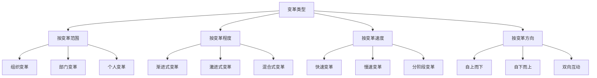
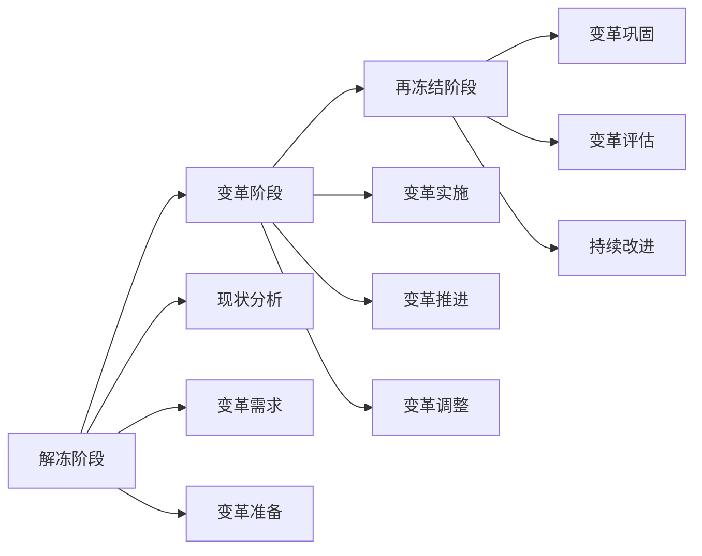
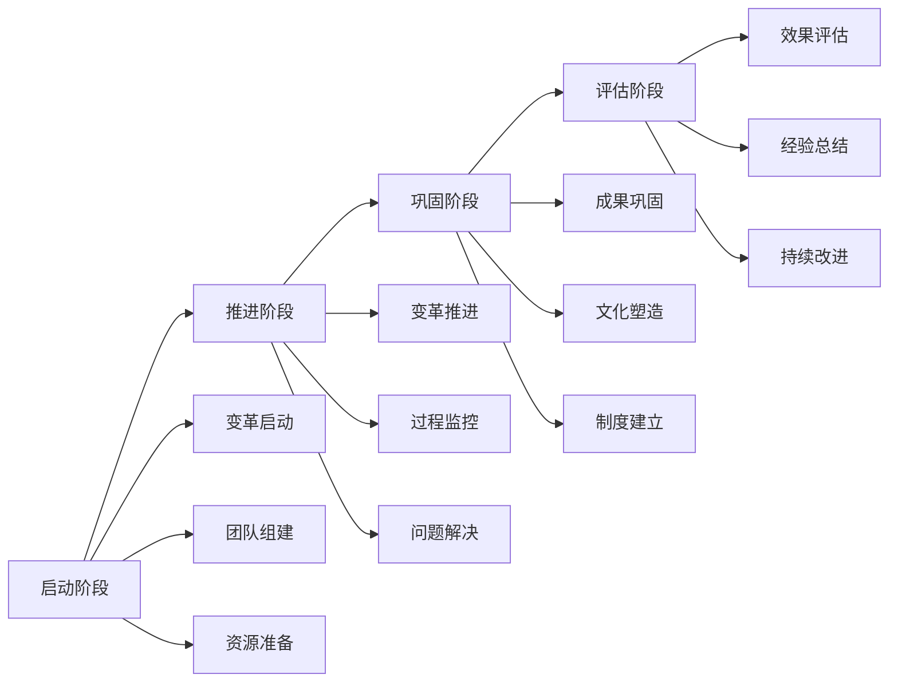
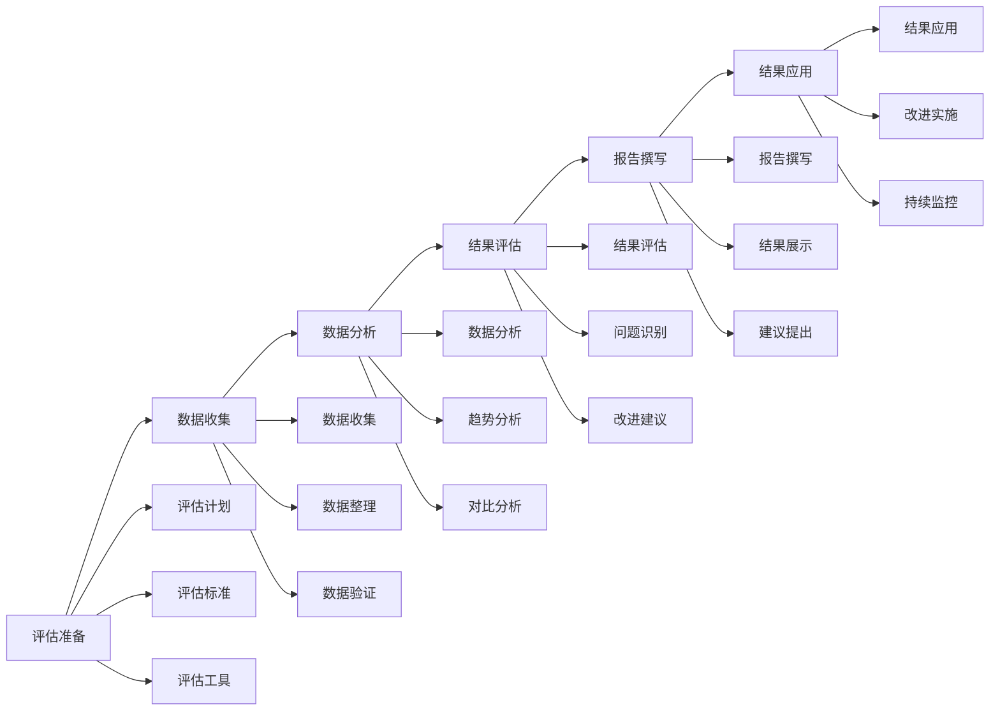

# 变革管理

## 🎯 核心概念

### 变革管理定义
**变革管理**是指领导者在组织变革过程中，通过系统性的规划、实施和控制，引导组织从当前状态向期望状态转变，实现组织目标的过程。

### 核心特征
- **系统性**：系统规划变革过程
- **引导性**：引导组织变革方向
- **控制性**：控制变革过程和结果
- **适应性**：适应环境变化需求

## 📚 变革理论框架

### 变革类型分类

### 变革过程模型
#### 勒温变革模型

#### 科特变革模型

```mermaid
graph TD
    A[科特变革模型] --> B[建立紧迫感]
    A --> C[组建领导联盟]
    A --> D[制定变革愿景]
    A --> E[沟通变革愿景]
    A --> F[授权员工行动]
    A --> G[创造短期成果]
    A --> H[巩固成果推进变革]
    A --> I[将新方法制度化]
    
    B --> B1[危机意识]
    B --> B2[变革必要性]
    B --> B3[紧迫感建立]
    
    C --> C1[领导团队]
    C --> C2[变革联盟]
    C --> C3[权力支持]
    
    D --> D1[愿景设计]
    D --> D2[战略规划]
    D --> D3[目标设定]
    
    E --> E1[愿景传播]
    E --> E2[沟通策略]
    E --> E3[理解确认]
    
    F --> F1[权力下放]
    F --> F2[资源支持]
    F --> F3[障碍清除]
    
    G --> G1[短期目标]
    G --> G2[快速胜利]
    G --> G3[成果展示]
    
    H --> H1[成果巩固]
    H --> H2[变革推进]
    H --> H3[持续改进]
    
    I --> I1[制度建立]
    I --> I2[文化塑造]
    I --> I3[持续发展]
```

## 🔍 变革管理要素

### 变革准备
#### 环境分析
| 分析维度 | 具体内容 | 分析方法 | 分析要点 |
|----------|----------|----------|----------|
| **外部环境** | 市场、技术、政策 | PEST分析 | 变化趋势 |
| **内部环境** | 资源、能力、文化 | SWOT分析 | 优劣势分析 |
| **竞争环境** | 竞争者、竞争态势 | 竞争分析 | 竞争压力 |
| **利益相关者** | 股东、员工、客户 | 利益分析 | 利益诉求 |

#### 变革需求评估
| 评估维度 | 具体内容 | 评估方法 | 评估标准 |
|----------|----------|----------|----------|
| **变革必要性** | 变革原因、紧迫性 | 必要性分析 | 紧迫程度 |
| **变革可行性** | 资源、能力、支持 | 可行性分析 | 可行程度 |
| **变革风险** | 风险识别、风险评估 | 风险分析 | 风险等级 |
| **变革收益** | 预期收益、投资回报 | 收益分析 | 收益水平 |

### 变革规划
#### 变革目标设定
| 目标类型 | 具体内容 | 设定原则 | 设定方法 |
|----------|----------|----------|----------|
| **战略目标** | 长期目标、愿景目标 | 战略导向 | 战略规划 |
| **战术目标** | 中期目标、阶段目标 | 可操作性 | 目标分解 |
| **操作目标** | 短期目标、具体目标 | 可测量性 | 目标细化 |

#### 变革策略制定
| 策略类型 | 具体内容 | 适用场景 | 实施要点 |
|----------|----------|----------|----------|
| **渐进式策略** | 逐步推进、分阶段实施 | 风险敏感 | 风险控制 |
| **激进式策略** | 快速推进、全面实施 | 危机紧迫 | 快速响应 |
| **混合式策略** | 结合渐进和激进 | 复杂变革 | 灵活调整 |

### 变革实施
#### 实施阶段

#### 实施要点
| 实施要点 | 具体内容 | 实施方法 | 控制措施 |
|----------|----------|----------|----------|
| **沟通管理** | 变革沟通、信息传递 | 沟通计划 | 沟通效果 |
| **培训管理** | 技能培训、知识更新 | 培训计划 | 培训效果 |
| **资源管理** | 资源配置、资源支持 | 资源计划 | 资源效率 |
| **风险管理** | 风险识别、风险控制 | 风险计划 | 风险水平 |

## 🎯 变革管理方法

### 变革沟通
#### 沟通策略
| 策略类型 | 具体内容 | 适用对象 | 实施方法 |
|----------|----------|----------|----------|
| **信息沟通** | 变革信息、进展信息 | 全体员工 | 信息发布 |
| **情感沟通** | 情感支持、心理疏导 | 受影响员工 | 情感关怀 |
| **参与沟通** | 参与决策、意见收集 | 关键员工 | 参与机制 |
| **反馈沟通** | 反馈收集、问题解决 | 所有员工 | 反馈机制 |

#### 沟通工具
| 工具类型 | 具体工具 | 使用场景 | 使用要点 |
|----------|----------|----------|----------|
| **正式沟通** | 会议、公告、邮件 | 正式信息 | 权威性 |
| **非正式沟通** | 谈话、交流、活动 | 日常沟通 | 亲和力 |
| **多媒体沟通** | 视频、音频、图片 | 复杂信息 | 生动性 |
| **互动沟通** | 讨论、问答、反馈 | 双向交流 | 互动性 |

### 变革培训
#### 培训类型
| 培训类型 | 具体内容 | 培训对象 | 培训方法 |
|----------|----------|----------|----------|
| **认知培训** | 变革认知、理念更新 | 全体员工 | 理论培训 |
| **技能培训** | 新技能、新方法 | 相关员工 | 实践培训 |
| **态度培训** | 变革态度、支持变革 | 关键员工 | 体验培训 |
| **文化培训** | 新文化、新价值观 | 全体员工 | 文化培训 |

#### 培训方法
| 方法类型 | 具体方法 | 适用场景 | 效果评估 |
|----------|----------|----------|----------|
| **理论培训** | 讲座、课程、阅读 | 知识传授 | 知识测试 |
| **实践培训** | 实习、演练、操作 | 技能提升 | 技能评估 |
| **案例培训** | 案例分析、讨论 | 问题解决 | 分析能力 |
| **体验培训** | 拓展训练、游戏 | 态度改变 | 态度评估 |

### 变革激励
#### 激励策略
| 策略类型 | 具体内容 | 适用对象 | 实施方法 |
|----------|----------|----------|----------|
| **物质激励** | 薪酬、奖金、福利 | 所有员工 | 薪酬调整 |
| **精神激励** | 认可、赞扬、荣誉 | 优秀员工 | 精神奖励 |
| **发展激励** | 培训、晋升、挑战 | 有潜力员工 | 发展机会 |
| **环境激励** | 工作环境、氛围 | 全体员工 | 环境改善 |

#### 激励方法
| 方法类型 | 具体方法 | 实施要点 | 效果评估 |
|----------|----------|----------|----------|
| **正向激励** | 奖励、认可、赞扬 | 及时具体 | 积极性 |
| **负向激励** | 惩罚、批评、约束 | 公平合理 | 约束力 |
| **过程激励** | 过程支持、及时反馈 | 持续支持 | 持续性 |
| **结果激励** | 结果奖励、成果分享 | 成果导向 | 效果性 |

## 📊 变革管理控制

### 过程控制
#### 控制维度
| 控制维度 | 具体内容 | 控制方法 | 控制标准 |
|----------|----------|----------|----------|
| **进度控制** | 变革进度、时间节点 | 进度监控 | 时间标准 |
| **质量控制** | 变革质量、效果质量 | 质量监控 | 质量标准 |
| **成本控制** | 变革成本、资源消耗 | 成本监控 | 成本标准 |
| **风险控制** | 变革风险、潜在风险 | 风险监控 | 风险标准 |

#### 控制工具
| 工具类型 | 具体工具 | 使用场景 | 使用要点 |
|----------|----------|----------|----------|
| **监控工具** | 仪表板、报告、指标 | 实时监控 | 及时性 |
| **评估工具** | 评估表、问卷、访谈 | 定期评估 | 客观性 |
| **分析工具** | 数据分析、趋势分析 | 深度分析 | 准确性 |
| **预警工具** | 预警系统、警报机制 | 风险预警 | 敏感性 |

### 结果控制
#### 效果评估
| 评估维度 | 具体内容 | 评估方法 | 评估标准 |
|----------|----------|----------|----------|
| **目标达成** | 目标完成度、效果达成 | 目标评估 | 达成率 |
| **绩效改善** | 绩效提升、效率改善 | 绩效评估 | 改善幅度 |
| **满意度提升** | 员工满意度、客户满意度 | 满意度调查 | 满意度指数 |
| **文化改变** | 文化转变、价值观更新 | 文化评估 | 转变程度 |

#### 持续改进
| 改进类型 | 具体内容 | 改进方法 | 改进效果 |
|----------|----------|----------|----------|
| **过程改进** | 流程优化、方法改进 | 流程改进 | 效率提升 |
| **结果改进** | 效果提升、质量改善 | 结果改进 | 质量提升 |
| **方法改进** | 方法创新、工具更新 | 方法改进 | 创新性 |
| **能力改进** | 能力提升、技能更新 | 能力改进 | 能力水平 |

## 📈 变革管理效果评估

### 评估框架
#### 评估维度
| 评估维度 | 具体内容 | 评估方法 | 权重 |
|----------|----------|----------|------|
| **变革效果** | 目标达成、效果实现 | 效果评估 | 40% |
| **变革效率** | 时间效率、成本效率 | 效率评估 | 25% |
| **变革质量** | 变革质量、实施质量 | 质量评估 | 20% |
| **变革影响** | 长期影响、持续影响 | 影响评估 | 15% |

#### 评估工具
| 工具类型 | 具体工具 | 使用场景 | 评估标准 |
|----------|----------|----------|----------|
| **定量评估** | 数据指标、统计分析 | 客观评估 | 准确性 |
| **定性评估** | 访谈、观察、分析 | 主观评估 | 全面性 |
| **综合评估** | 定量定性结合 | 全面评估 | 综合性 |
| **对比评估** | 前后对比、横向对比 | 比较评估 | 可比性 |

### 评估流程

## 🎯 变革管理能力发展

### 发展路径
#### 基础阶段
- **目标**：掌握基本变革管理技能
- **内容**：学习变革理论、掌握基本方法
- **方法**：理论学习、案例分析
- **评估**：方法应用能力

#### 进阶阶段
- **目标**：提升变革管理效果
- **内容**：学习高级方法、提升管理能力
- **方法**：实践锻炼、经验积累
- **评估**：管理效果水平

#### 高级阶段
- **目标**：发展战略变革管理能力
- **内容**：学习战略变革、发展领导能力
- **方法**：战略实践、领导锻炼
- **评估**：战略管理能力

### 发展方法
#### 理论学习
| 学习内容 | 学习方法 | 学习资源 | 评估标准 |
|----------|----------|----------|----------|
| **变革理论** | 阅读经典著作 | 变革管理书籍 | 理论理解度 |
| **管理方法** | 学习管理工具 | 管理工具培训 | 工具应用能力 |
| **案例研究** | 分析变革案例 | 企业案例库 | 案例分析能力 |

#### 实践锻炼
| 实践内容 | 实践方法 | 实践机会 | 评估标准 |
|----------|----------|----------|----------|
| **变革实践** | 参与变革项目 | 工作变革 | 变革效果 |
| **管理实践** | 管理变革过程 | 管理岗位 | 管理效果 |
| **领导实践** | 领导变革团队 | 领导岗位 | 领导效果 |

## 🔗 相关概念链接

### 基础概念
- [[01-基础认知层/01-领导力概述|领导力概述]]
- [[01-基础认知层/04-现代领导力挑战|现代挑战]]
- [[02-理论理解层/现代领导理论/01-变革型领导|变革型领导]]

### 理论概念
- [[02-理论理解层/现代领导理论/03-分布式领导|分布式领导]]
- [[02-理论理解层/现代领导理论/02-服务型领导|服务型领导]]

### 能力概念
- [[01-战略思维|战略思维]]
- [[02-决策能力|决策能力]]
- [[03-沟通协调|沟通协调]]

### 实践概念
- [[04-实践应用层/管理实践/02-组织文化建设|组织文化]]
- [[04-实践应用层/特殊情境/02-数字化转型领导|数字化转型]]

## 💡 学习要点总结

### 关键理解
1. **变革过程**：解冻、变革、再冻结的完整过程
2. **变革管理**：系统性的规划、实施和控制
3. **变革方法**：沟通、培训、激励等方法
4. **变革控制**：过程控制和结果控制

### 实践应用
1. **变革规划**：制定变革计划和策略
2. **变革实施**：实施变革过程
3. **变革控制**：控制变革过程和结果
4. **变革评估**：评估变革效果

### 思考问题
1. 如何有效管理组织变革？
2. 如何应对变革阻力？
3. 如何评估变革效果？
4. 如何建立变革文化？

---

**下一步**：[[06-情商与自我管理|情商管理]] | [[07-能力发展路径|能力发展路径]]
