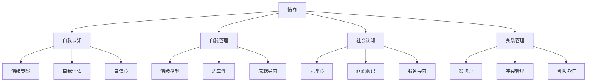
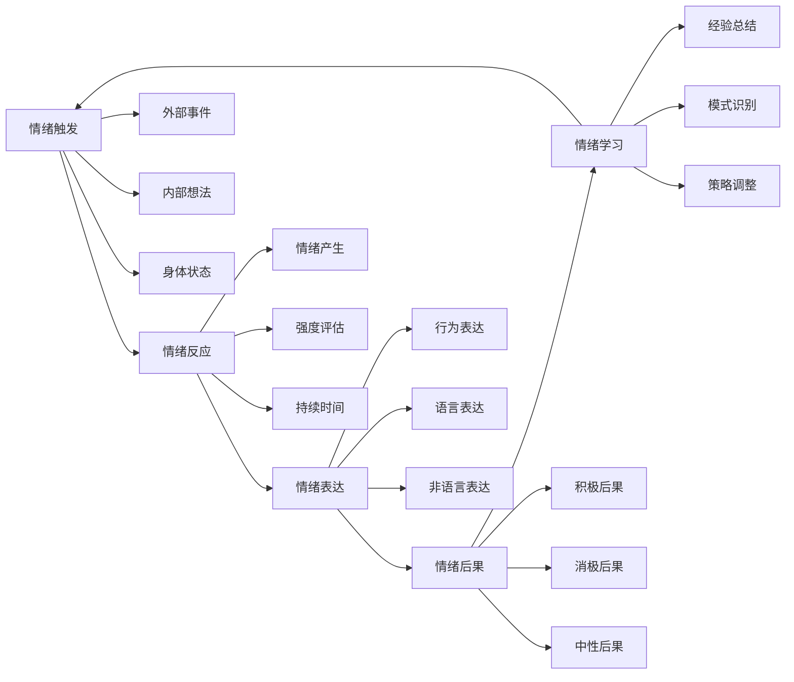
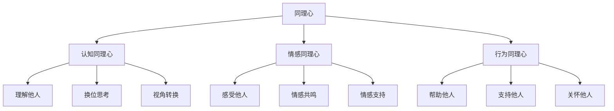
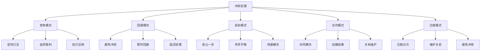

# 情商与自我管理

## 🎯 核心概念

### 情商定义
**情商**（Emotional Intelligence, EI）是指个体识别、理解、管理和运用自己及他人情绪的能力，包括自我认知、自我管理、社会认知和关系管理四个核心维度。

### 自我管理定义
**自我管理**是指个体通过自我认知、自我控制、自我激励和自我发展，实现个人目标，提升个人效能的过程。

### 核心特征
- **自我认知**：了解自己的情绪和需求
- **自我控制**：控制自己的情绪和行为
- **自我激励**：激发内在动机和动力
- **自我发展**：持续学习和成长

## 📚 情商理论框架

### 情商四维度模型

### 情商层次结构
| 层次 | 维度 | 具体内容 | 发展重点 |
|------|------|----------|----------|
| **基础层** | 自我认知 | 情绪觉察、自我评估 | 自我了解 |
| **控制层** | 自我管理 | 情绪控制、适应性 | 自我控制 |
| **认知层** | 社会认知 | 同理心、组织意识 | 他人理解 |
| **应用层** | 关系管理 | 影响力、冲突管理 | 关系建立 |

## 🔍 自我认知

### 情绪觉察
#### 情绪识别
| 情绪类型 | 具体表现 | 识别方法 | 管理策略 |
|----------|----------|----------|----------|
| **愤怒** | 愤怒、暴躁、攻击性 | 身体反应、行为变化 | 冷静思考、深呼吸 |
| **恐惧** | 焦虑、紧张、逃避 | 心理反应、逃避行为 | 直面恐惧、寻求支持 |
| **悲伤** | 沮丧、失落、无助 | 情绪低落、行为消极 | 情感表达、寻求安慰 |
| **快乐** | 兴奋、满足、积极 | 情绪高涨、行为积极 | 保持平衡、分享快乐 |

#### 情绪模式

### 自我评估
#### 评估维度
| 评估维度 | 具体内容 | 评估方法 | 评估标准 |
|----------|----------|----------|----------|
| **情绪稳定性** | 情绪波动、情绪控制 | 情绪日记 | 稳定性指数 |
| **情绪表达** | 表达能力、表达方式 | 行为观察 | 表达适当性 |
| **情绪理解** | 情绪理解、情绪分析 | 情绪测试 | 理解准确度 |
| **情绪调节** | 调节能力、调节方法 | 情境测试 | 调节效果 |

#### 评估工具
| 工具类型 | 具体工具 | 使用场景 | 评估标准 |
|----------|----------|----------|----------|
| **自评工具** | 情绪问卷、自我评估 | 自我了解 | 准确性 |
| **他评工具** | 360度评估、他人反馈 | 客观评估 | 客观性 |
| **观察工具** | 行为观察、情境分析 | 行为评估 | 客观性 |
| **测试工具** | 情绪测试、心理测试 | 专业评估 | 专业性 |

## 🎯 自我管理

### 情绪控制
#### 控制策略
| 策略类型 | 具体方法 | 适用场景 | 实施要点 |
|----------|----------|----------|----------|
| **认知重评** | 重新解释、视角转换 | 情绪产生时 | 理性思考 |
| **注意力转移** | 转移焦点、分散注意 | 情绪强烈时 | 快速转移 |
| **身体调节** | 深呼吸、放松训练 | 身体紧张时 | 身体放松 |
| **行为调节** | 行为改变、环境改变 | 行为问题时 | 行为调整 |

#### 控制技巧
| 技巧类型 | 具体技巧 | 实施方法 | 效果评估 |
|----------|----------|----------|----------|
| **深呼吸** | 腹式呼吸、节奏呼吸 | 情绪激动时 | 放松程度 |
| **正念冥想** | 专注当下、观察情绪 | 日常练习 | 专注度 |
| **运动调节** | 有氧运动、力量训练 | 身体活动 | 情绪改善 |
| **音乐调节** | 音乐聆听、音乐创作 | 情绪低落时 | 情绪提升 |

### 适应性管理
#### 适应策略
| 策略类型 | 具体内容 | 适用场景 | 实施方法 |
|----------|----------|----------|----------|
| **环境适应** | 适应环境变化 | 环境变化时 | 环境调整 |
| **角色适应** | 适应角色变化 | 角色转换时 | 角色学习 |
| **压力适应** | 适应压力环境 | 压力增大时 | 压力管理 |
| **变化适应** | 适应各种变化 | 变化频繁时 | 变化应对 |

#### 适应能力
| 能力类型 | 具体内容 | 发展方法 | 评估标准 |
|----------|----------|----------|----------|
| **认知灵活性** | 思维转换、视角变化 | 思维训练 | 转换速度 |
| **行为灵活性** | 行为调整、方式改变 | 行为训练 | 调整效果 |
| **情感灵活性** | 情感调节、情绪管理 | 情感训练 | 调节效果 |
| **社交灵活性** | 社交适应、关系调整 | 社交训练 | 适应程度 |

### 成就导向
#### 目标设定
| 目标类型 | 具体内容 | 设定原则 | 设定方法 |
|----------|----------|----------|----------|
| **短期目标** | 近期目标、具体目标 | 可达成性 | SMART原则 |
| **中期目标** | 阶段性目标、发展目标 | 挑战性 | 目标分解 |
| **长期目标** | 愿景目标、人生目标 | 激励性 | 愿景规划 |
| **学习目标** | 技能目标、知识目标 | 成长性 | 学习计划 |

#### 动机激发
| 动机类型 | 具体内容 | 激发方法 | 维持策略 |
|----------|----------|----------|----------|
| **内在动机** | 兴趣、好奇心、成就感 | 兴趣培养 | 持续兴趣 |
| **外在动机** | 奖励、认可、竞争 | 奖励机制 | 奖励持续 |
| **成就动机** | 成功需求、挑战需求 | 挑战设置 | 挑战递增 |
| **权力动机** | 影响力、控制力 | 权力赋予 | 权力平衡 |

## 📊 社会认知

### 同理心
#### 同理心层次

#### 同理心发展
| 发展阶段 | 特征 | 发展方法 | 评估标准 |
|----------|------|----------|----------|
| **基础阶段** | 理解他人情绪 | 情绪识别训练 | 识别准确度 |
| **进阶阶段** | 感受他人情感 | 情感体验训练 | 感受深度 |
| **高级阶段** | 帮助他人解决问题 | 问题解决训练 | 帮助效果 |

### 组织意识
#### 意识层次
| 意识层次 | 具体内容 | 发展方法 | 应用场景 |
|----------|----------|----------|----------|
| **个人意识** | 了解自己的角色 | 角色认知 | 个人发展 |
| **团队意识** | 了解团队动态 | 团队观察 | 团队协作 |
| **组织意识** | 了解组织文化 | 文化学习 | 组织适应 |
| **环境意识** | 了解外部环境 | 环境分析 | 战略决策 |

#### 意识提升
| 提升方法 | 具体内容 | 实施要点 | 效果评估 |
|----------|----------|----------|----------|
| **观察学习** | 观察他人行为 | 主动观察 | 观察能力 |
| **经验积累** | 积累实践经验 | 实践反思 | 经验丰富度 |
| **知识学习** | 学习相关知识 | 持续学习 | 知识水平 |
| **反馈获取** | 获取他人反馈 | 主动寻求 | 反馈质量 |

## 🎯 关系管理

### 影响力
#### 影响策略
| 策略类型 | 具体内容 | 适用场景 | 实施方法 |
|----------|----------|----------|----------|
| **理性影响** | 逻辑说服、数据分析 | 理性决策 | 逻辑论证 |
| **情感影响** | 情感共鸣、关系建立 | 情感决策 | 情感连接 |
| **权威影响** | 专业权威、职位权威 | 权威决策 | 权威建立 |
| **榜样影响** | 以身作则、行为示范 | 行为改变 | 榜样示范 |

#### 影响技巧
| 技巧类型 | 具体技巧 | 使用场景 | 效果评估 |
|----------|----------|----------|----------|
| **倾听技巧** | 主动倾听、同理倾听 | 关系建立 | 理解程度 |
| **表达技巧** | 清晰表达、情感表达 | 信息传递 | 理解准确度 |
| **说服技巧** | 逻辑说服、情感说服 | 观点改变 | 接受程度 |
| **激励技巧** | 正向激励、挑战激励 | 动机激发 | 激励效果 |

### 冲突管理
#### 冲突类型
| 冲突类型 | 具体表现 | 产生原因 | 处理策略 |
|----------|----------|----------|----------|
| **任务冲突** | 目标分歧、方法分歧 | 目标差异 | 目标协调 |
| **关系冲突** | 人际关系紧张 | 个性差异 | 关系改善 |
| **价值观冲突** | 价值观念不同 | 文化差异 | 价值融合 |
| **利益冲突** | 利益分配不均 | 利益差异 | 利益平衡 |

#### 处理模式

### 团队协作
#### 协作要素
| 协作要素 | 具体内容 | 发展方法 | 评估标准 |
|----------|----------|----------|----------|
| **沟通协作** | 有效沟通、信息共享 | 沟通训练 | 沟通效果 |
| **任务协作** | 任务分工、相互支持 | 任务训练 | 协作效率 |
| **关系协作** | 关系建立、关系维护 | 关系训练 | 关系质量 |
| **文化协作** | 文化适应、文化融合 | 文化学习 | 文化认同 |

#### 协作技巧
| 技巧类型 | 具体技巧 | 使用场景 | 效果评估 |
|----------|----------|----------|----------|
| **沟通技巧** | 倾听、表达、反馈 | 日常沟通 | 理解准确度 |
| **协调技巧** | 协调、调解、整合 | 问题解决 | 解决效果 |
| **支持技巧** | 支持、帮助、鼓励 | 团队支持 | 支持效果 |
| **领导技巧** | 领导、引导、激励 | 团队领导 | 领导效果 |

## 📈 情商与自我管理发展

### 发展路径
#### 基础阶段
- **目标**：建立情绪觉察能力
- **内容**：学习情绪识别、情绪理解
- **方法**：情绪日记、情绪观察
- **评估**：情绪识别准确度

#### 进阶阶段
- **目标**：提升情绪管理能力
- **内容**：学习情绪控制、情绪调节
- **方法**：情绪训练、情境练习
- **评估**：情绪控制效果

#### 高级阶段
- **目标**：发展社会情商能力
- **内容**：学习同理心、关系管理
- **方法**：社交实践、关系建设
- **评估**：关系管理效果

### 发展方法
#### 自我发展
| 发展方法 | 具体内容 | 实施要点 | 效果评估 |
|----------|----------|----------|----------|
| **自我反思** | 定期反思、经验总结 | 持续进行 | 反思深度 |
| **自我观察** | 行为观察、情绪观察 | 客观观察 | 观察准确性 |
| **自我学习** | 知识学习、技能学习 | 持续学习 | 学习效果 |
| **自我实践** | 技能实践、能力实践 | 主动实践 | 实践效果 |

#### 外部支持
| 支持类型 | 具体内容 | 获取方法 | 支持效果 |
|----------|----------|----------|----------|
| **专业指导** | 心理咨询、专业培训 | 专业机构 | 专业水平 |
| **同伴支持** | 同伴交流、经验分享 | 同伴网络 | 支持程度 |
| **导师指导** | 导师指导、经验传授 | 导师关系 | 指导质量 |
| **团队支持** | 团队协作、团队学习 | 团队环境 | 团队氛围 |

## 📊 情商与自我管理评估

### 评估维度
| 评估维度 | 具体内容 | 评估方法 | 权重 |
|----------|----------|----------|------|
| **自我认知** | 情绪觉察、自我评估 | 自评+他评 | 25% |
| **自我管理** | 情绪控制、适应性 | 行为观察 | 25% |
| **社会认知** | 同理心、组织意识 | 情境测试 | 25% |
| **关系管理** | 影响力、冲突管理 | 关系评估 | 25% |

### 评估工具
#### 情商评估量表
| 评估项目 | 评估内容 | 评分标准 | 权重 |
|----------|----------|----------|------|
| **情绪觉察** | 情绪识别能力 | 1-5分 | 25% |
| **情绪管理** | 情绪控制能力 | 1-5分 | 25% |
| **同理心** | 理解他人能力 | 1-5分 | 25% |
| **关系管理** | 关系建立能力 | 1-5分 | 25% |

## 🔗 相关概念链接

### 基础概念
- [[01-基础认知层/01-领导力概述|领导力概述]]
- [[01-基础认知层/02-管理者vs领导者|管理者vs领导者]]
- [[02-理论理解层/经典领导理论/01-特质理论|特质理论]]

### 理论概念
- [[02-理论理解层/现代领导理论/02-服务型领导|服务型领导]]
- [[02-理论理解层/现代领导理论/01-变革型领导|变革型领导]]

### 能力概念
- [[01-战略思维|战略思维]]
- [[03-沟通协调|沟通协调]]
- [[04-团队建设|团队建设]]

### 实践概念
- [[05-发展提升层/自我发展/01-自我认知与评估|自我认知]]
- [[05-发展提升层/自我发展/02-学习与发展路径|学习路径]]

## 💡 学习要点总结

### 关键理解
1. **情商四维度**：自我认知、自我管理、社会认知、关系管理
2. **自我管理**：情绪控制、适应性、成就导向
3. **社会认知**：同理心、组织意识
4. **关系管理**：影响力、冲突管理、团队协作

### 实践应用
1. **情绪管理**：识别、理解、控制情绪
2. **自我发展**：持续学习、自我提升
3. **关系建设**：建立和维护良好关系
4. **团队协作**：促进团队协作和配合

### 思考问题
1. 如何提升情商水平？
2. 如何有效管理自己的情绪？
3. 如何发展同理心？
4. 如何改善人际关系？

---

**下一步**：[[07-能力发展路径|能力发展路径]] | [[08-领导力测量与评估|测量评估]]
