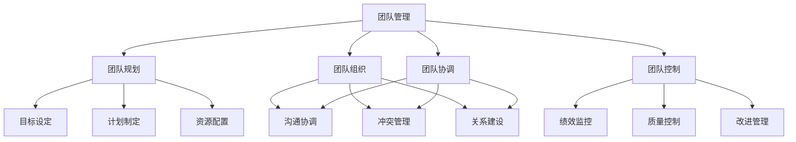
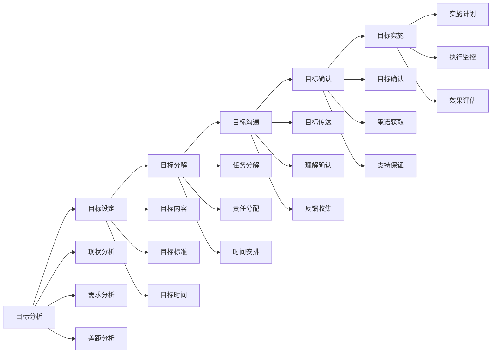
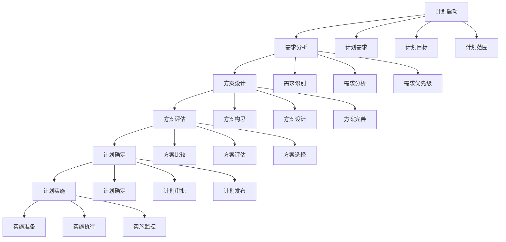
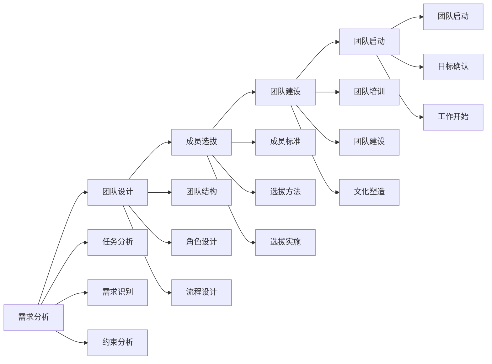
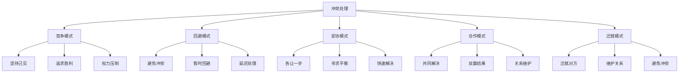

# 团队管理

## 🎯 核心概念

### 团队管理定义
**团队管理**是指领导者通过计划、组织、协调、控制等手段，有效管理团队资源，提升团队绩效，实现团队目标的过程。

### 核心特征
- **目标导向**：围绕团队目标
- **资源整合**：整合团队资源
- **绩效提升**：提升团队绩效
- **持续改进**：持续改进管理

## 📚 团队管理理论框架

### 团队管理模型

### 团队管理要素
| 管理要素 | 具体内容 | 管理方法 | 管理重点 |
|----------|----------|----------|----------|
| **目标管理** | 团队目标、个人目标 | 目标设定、目标分解 | 目标一致性 |
| **人员管理** | 成员选拔、培训发展 | 人员配置、能力提升 | 人员匹配度 |
| **任务管理** | 任务分配、进度控制 | 任务规划、执行监控 | 任务完成度 |
| **资源管理** | 资源分配、资源利用 | 资源配置、效率提升 | 资源利用率 |

## 🔍 团队规划

### 目标设定
#### 目标类型
| 目标类型 | 具体内容 | 设定原则 | 设定方法 |
|----------|----------|----------|----------|
| **团队目标** | 团队整体目标 | 挑战性、可达成性 | 团队讨论 |
| **个人目标** | 个人发展目标 | 个性化、相关性 | 个人设定 |
| **项目目标** | 项目完成目标 | 具体性、时限性 | 项目规划 |
| **绩效目标** | 绩效提升目标 | 可测量性、可评估性 | 绩效管理 |

#### 目标设定流程

### 计划制定
#### 计划类型
| 计划类型 | 具体内容 | 制定方法 | 实施要点 |
|----------|----------|----------|----------|
| **战略计划** | 长期战略规划 | 战略分析 | 战略执行 |
| **战术计划** | 中期战术规划 | 战术设计 | 战术实施 |
| **操作计划** | 短期操作规划 | 操作设计 | 操作执行 |
| **应急计划** | 应急处理规划 | 风险评估 | 应急响应 |

#### 计划制定流程

## 🎯 团队组织

### 团队组建
#### 组建要素
| 组建要素 | 具体内容 | 组建方法 | 组建标准 |
|----------|----------|----------|----------|
| **团队规模** | 团队人数、团队结构 | 规模设计 | 规模适宜性 |
| **团队构成** | 成员构成、技能构成 | 构成设计 | 构成合理性 |
| **团队文化** | 团队价值观、行为规范 | 文化建设 | 文化一致性 |
| **团队目标** | 团队使命、团队愿景 | 目标设定 | 目标清晰性 |

#### 组建流程

### 角色分配
#### 角色类型
| 角色类型 | 主要职责 | 能力要求 | 发展重点 |
|----------|----------|----------|----------|
| **领导者** | 团队管理、决策制定 | 领导能力、决策能力 | 战略思维 |
| **执行者** | 任务执行、目标达成 | 执行能力、专业技能 | 专业技能 |
| **协调者** | 关系协调、冲突处理 | 协调能力、沟通能力 | 沟通协调 |
| **创新者** | 创新思维、问题解决 | 创新能力、学习能力 | 创新思维 |
| **支持者** | 团队支持、资源提供 | 支持能力、服务意识 | 服务意识 |

#### 角色分配原则
| 分配原则 | 具体内容 | 实施方法 | 评估标准 |
|----------|----------|----------|----------|
| **能力匹配** | 能力与角色匹配 | 能力评估 | 匹配度 |
| **兴趣匹配** | 兴趣与角色匹配 | 兴趣调查 | 兴趣度 |
| **个性匹配** | 个性与角色匹配 | 个性测试 | 适合度 |
| **发展匹配** | 发展与角色匹配 | 发展评估 | 发展度 |

## 📊 团队协调

### 沟通协调
#### 沟通机制
| 沟通类型 | 具体内容 | 沟通方法 | 沟通效果 |
|----------|----------|----------|----------|
| **正式沟通** | 会议、报告、文件 | 正式渠道 | 权威性 |
| **非正式沟通** | 谈话、交流、活动 | 非正式渠道 | 亲和力 |
| **上行沟通** | 汇报、请示、建议 | 向上沟通 | 信息传递 |
| **下行沟通** | 指令、指导、反馈 | 向下沟通 | 指令传达 |
| **平行沟通** | 协调、配合、信息共享 | 横向沟通 | 协作效果 |

#### 协调策略
| 策略类型 | 具体内容 | 实施方法 | 适用场景 |
|----------|----------|----------|----------|
| **目标协调** | 统一目标方向 | 目标沟通 | 目标分歧 |
| **资源协调** | 合理配置资源 | 资源分配 | 资源冲突 |
| **流程协调** | 优化工作流程 | 流程设计 | 流程问题 |
| **关系协调** | 改善人际关系 | 关系建设 | 关系紧张 |

### 冲突管理
#### 冲突类型
| 冲突类型 | 具体表现 | 产生原因 | 处理策略 |
|----------|----------|----------|----------|
| **任务冲突** | 目标分歧、方法分歧 | 目标差异 | 目标协调 |
| **关系冲突** | 人际关系紧张 | 个性差异 | 关系改善 |
| **过程冲突** | 工作流程分歧 | 流程差异 | 流程统一 |
| **价值观冲突** | 价值观念不同 | 文化差异 | 价值融合 |

#### 冲突处理模式

## 🎯 团队控制

### 绩效监控
#### 监控维度
| 监控维度 | 具体内容 | 监控方法 | 监控标准 |
|----------|----------|----------|----------|
| **进度监控** | 任务进度、时间节点 | 进度跟踪 | 时间标准 |
| **质量监控** | 工作质量、成果质量 | 质量检查 | 质量标准 |
| **成本监控** | 资源消耗、成本控制 | 成本分析 | 成本标准 |
| **风险监控** | 潜在风险、风险控制 | 风险评估 | 风险标准 |

#### 监控工具
| 工具类型 | 具体工具 | 使用场景 | 使用要点 |
|----------|----------|----------|----------|
| **进度工具** | 进度表、甘特图 | 进度管理 | 及时更新 |
| **质量工具** | 质量检查表、评估表 | 质量管理 | 定期检查 |
| **成本工具** | 成本分析表、预算表 | 成本管理 | 成本控制 |
| **风险工具** | 风险评估表、预警系统 | 风险管理 | 风险预警 |

### 质量控制
#### 质量要素
| 质量要素 | 具体内容 | 控制方法 | 质量标准 |
|----------|----------|----------|----------|
| **工作质量** | 工作标准、工作效果 | 质量标准 | 质量水平 |
| **服务质量** | 服务质量、客户满意度 | 服务标准 | 满意度 |
| **产品质量** | 产品质量、产品标准 | 产品标准 | 产品水平 |
| **管理质量** | 管理效果、管理标准 | 管理标准 | 管理水平 |

#### 质量控制
| 控制类型 | 具体内容 | 控制方法 | 控制标准 |
|----------|----------|----------|----------|
| **过程控制** | 工作过程质量控制 | 过程监控 | 过程质量 |
| **结果控制** | 工作结果质量控制 | 结果检查 | 结果质量 |
| **人员控制** | 人员工作质量控制 | 人员管理 | 人员质量 |
| **系统控制** | 系统运行质量控制 | 系统管理 | 系统质量 |

## 📈 团队管理效果评估

### 评估维度
| 评估维度 | 具体内容 | 评估方法 | 权重 |
|----------|----------|----------|------|
| **团队绩效** | 任务完成、目标达成 | 绩效评估 | 30% |
| **团队协作** | 协作程度、配合度 | 协作评估 | 25% |
| **团队满意度** | 成员满意度、归属感 | 满意度调查 | 25% |
| **团队发展** | 能力提升、持续发展 | 发展评估 | 20% |

### 评估工具
#### 团队管理评估表
| 评估项目 | 评估内容 | 评分标准 | 权重 |
|----------|----------|----------|------|
| **目标管理** | 目标清晰度、达成度 | 1-5分 | 25% |
| **人员管理** | 人员配置、能力提升 | 1-5分 | 25% |
| **任务管理** | 任务分配、进度控制 | 1-5分 | 25% |
| **资源管理** | 资源配置、利用效率 | 1-5分 | 25% |

## 🎯 团队管理能力发展

### 发展路径
#### 基础阶段
- **目标**：掌握基本团队管理技能
- **内容**：学习团队理论、掌握基本方法
- **方法**：理论学习、案例分析
- **评估**：方法应用能力

#### 进阶阶段
- **目标**：提升团队管理效果
- **内容**：学习高级方法、提升管理能力
- **方法**：实践锻炼、经验积累
- **评估**：管理效果水平

#### 高级阶段
- **目标**：发展战略团队管理能力
- **内容**：学习战略管理、发展领导能力
- **方法**：战略实践、领导锻炼
- **评估**：战略管理能力

### 发展方法
#### 理论学习
| 学习内容 | 学习方法 | 学习资源 | 评估标准 |
|----------|----------|----------|----------|
| **团队理论** | 阅读经典著作 | 团队管理书籍 | 理论理解度 |
| **管理方法** | 学习管理工具 | 管理工具培训 | 工具应用能力 |
| **案例研究** | 分析管理案例 | 企业案例库 | 案例分析能力 |

#### 实践锻炼
| 实践内容 | 实践方法 | 实践机会 | 评估标准 |
|----------|----------|----------|----------|
| **团队管理** | 管理团队工作 | 管理岗位 | 管理效果 |
| **团队建设** | 建设团队文化 | 团队项目 | 建设效果 |
| **团队发展** | 推动团队发展 | 发展项目 | 发展效果 |

## 🔗 相关概念链接

### 基础概念
- [[01-基础认知层/01-领导力概述|领导力概述]]
- [[01-基础认知层/02-管理者vs领导者|管理者vs领导者]]
- [[02-理论理解层/经典领导理论/02-行为理论|行为理论]]

### 理论概念
- [[02-理论理解层/现代领导理论/03-分布式领导|分布式领导]]
- [[02-理论理解层/现代领导理论/02-服务型领导|服务型领导]]

### 能力概念
- [[03-能力构建层/核心领导能力/03-沟通协调|沟通协调]]
- [[03-能力构建层/核心领导能力/04-团队建设|团队建设]]

### 实践概念
- [[02-组织文化建设|组织文化]]
- [[07-工具资源层/实用模板/02-团队建设模板|团队模板]]

## 💡 学习要点总结

### 关键理解
1. **系统管理**：系统性的团队管理
2. **目标导向**：以目标为导向管理
3. **资源整合**：有效整合团队资源
4. **持续改进**：持续改进管理效果

### 实践应用
1. **团队规划**：制定团队发展规划
2. **团队组织**：组建高效团队
3. **团队协调**：协调团队工作
4. **团队控制**：控制团队绩效

### 思考问题
1. 如何有效管理团队？
2. 如何提升团队绩效？
3. 如何处理团队冲突？
4. 如何评估团队管理效果？

---

**下一步**：[[02-组织文化建设|组织文化]] | [[03-绩效管理|绩效管理]]
