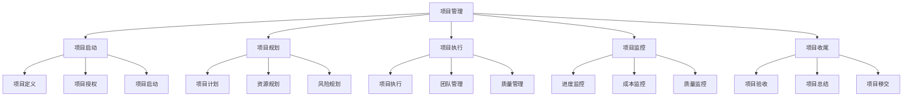
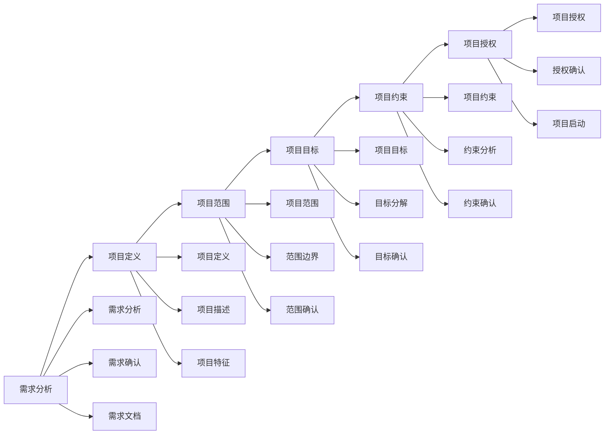
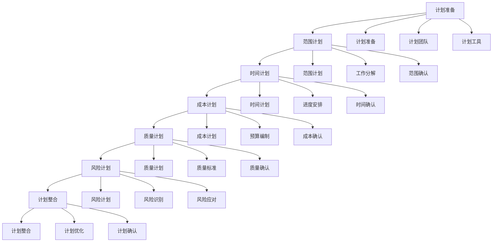
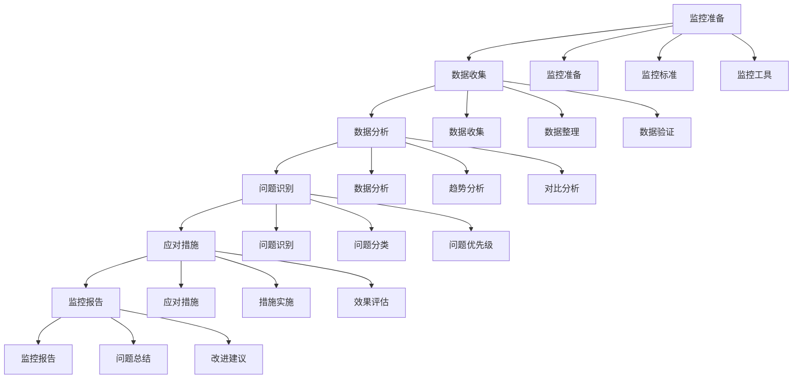
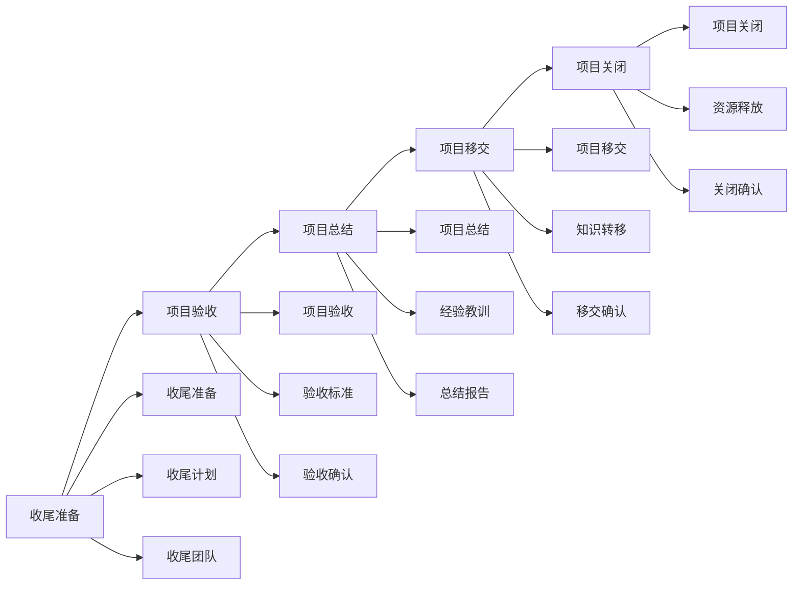

# 项目管理

## 🎯 核心概念

### 项目管理定义
**项目管理**是指在特定时间、预算和资源约束下，通过计划、组织、领导和控制等管理职能，实现项目目标的管理过程。

### 核心特征
- **目标导向**：以项目目标为核心
- **时间约束**：具有明确的时间限制
- **资源约束**：受资源限制影响
- **独特性**：每个项目都具有独特性

## 📚 项目管理理论框架

### 项目管理模型

### 项目管理要素
| 管理要素 | 具体内容 | 管理重点 | 管理方法 |
|----------|----------|----------|----------|
| **范围管理** | 项目范围、需求管理 | 范围明确性 | 范围管理 |
| **时间管理** | 项目进度、时间控制 | 时间有效性 | 时间管理 |
| **成本管理** | 项目成本、预算控制 | 成本控制性 | 成本管理 |
| **质量管理** | 项目质量、质量控制 | 质量保证性 | 质量管理 |

## 🔍 项目启动

### 项目定义
#### 项目特征
| 项目特征 | 具体内容 | 特征要求 | 评估标准 |
|----------|----------|----------|----------|
| **独特性** | 项目独特、不可重复 | 独特性 | 独特性 |
| **临时性** | 项目临时、有起止时间 | 临时性 | 临时性 |
| **目标性** | 项目有明确目标 | 目标性 | 目标性 |
| **约束性** | 项目受资源约束 | 约束性 | 约束性 |

#### 项目定义流程

### 项目章程
#### 章程内容
| 章程要素 | 具体内容 | 内容要求 | 内容标准 |
|----------|----------|----------|----------|
| **项目概述** | 项目背景、项目目标 | 概述清晰 | 清晰性 |
| **项目范围** | 项目范围、项目边界 | 范围明确 | 明确性 |
| **项目组织** | 项目团队、项目角色 | 组织清晰 | 清晰性 |
| **项目约束** | 时间约束、资源约束 | 约束明确 | 明确性 |

#### 章程制定
| 制定步骤 | 具体内容 | 制定方法 | 制定效果 |
|----------|----------|----------|----------|
| **需求分析** | 分析项目需求 | 需求分析 | 需求明确性 |
| **目标设定** | 设定项目目标 | 目标设定 | 目标明确性 |
| **范围确定** | 确定项目范围 | 范围确定 | 范围明确性 |
| **约束识别** | 识别项目约束 | 约束识别 | 约束明确性 |

## 📊 项目规划

### 项目计划
#### 计划要素
| 计划要素 | 具体内容 | 计划要求 | 计划标准 |
|----------|----------|----------|----------|
| **范围计划** | 项目范围、工作分解 | 范围完整性 | 完整性 |
| **时间计划** | 项目进度、时间安排 | 时间合理性 | 合理性 |
| **成本计划** | 项目预算、成本控制 | 成本准确性 | 准确性 |
| **质量计划** | 质量标准、质量控制 | 质量保证性 | 保证性 |

#### 计划制定流程

### 工作分解结构
#### WBS结构
| WBS层级 | 具体内容 | 分解原则 | 分解标准 |
|----------|----------|----------|----------|
| **项目层** | 项目总体 | 项目完整性 | 完整性 |
| **阶段层** | 项目阶段 | 阶段逻辑性 | 逻辑性 |
| **任务层** | 具体任务 | 任务独立性 | 独立性 |
| **活动层** | 具体活动 | 活动可操作性 | 可操作性 |

#### 分解方法
| 分解方法 | 具体内容 | 适用场景 | 分解效果 |
|----------|----------|----------|----------|
| **功能分解** | 按功能模块分解 | 功能项目 | 功能清晰 |
| **过程分解** | 按过程步骤分解 | 过程项目 | 过程清晰 |
| **组织分解** | 按组织部门分解 | 组织项目 | 组织清晰 |
| **时间分解** | 按时间阶段分解 | 时间项目 | 时间清晰 |

## 🚀 项目执行

### 执行管理
#### 执行要素
| 执行要素 | 具体内容 | 执行要求 | 执行标准 |
|----------|----------|----------|----------|
| **团队管理** | 团队建设、团队协调 | 团队有效性 | 有效性 |
| **沟通管理** | 沟通协调、信息传递 | 沟通有效性 | 有效性 |
| **质量管理** | 质量控制、质量保证 | 质量保证性 | 保证性 |
| **风险管理** | 风险识别、风险应对 | 风险控制性 | 控制性 |

#### 执行流程

### 团队管理
#### 团队建设
| 建设要素 | 具体内容 | 建设方法 | 建设效果 |
|----------|----------|----------|----------|
| **团队组建** | 团队结构、团队角色 | 团队设计 | 团队有效性 |
| **团队培训** | 技能培训、团队培训 | 培训计划 | 团队能力 |
| **团队激励** | 团队激励、个人激励 | 激励策略 | 团队动力 |
| **团队协调** | 团队协调、冲突管理 | 协调机制 | 团队和谐 |

#### 团队角色
| 角色类型 | 具体内容 | 角色职责 | 角色要求 |
|----------|----------|----------|----------|
| **项目经理** | 项目总负责人 | 项目整体管理 | 管理能力 |
| **技术负责人** | 技术总负责人 | 技术管理 | 技术能力 |
| **质量负责人** | 质量总负责人 | 质量管理 | 质量能力 |
| **团队成员** | 项目执行人员 | 任务执行 | 执行能力 |

## 📈 项目监控

### 监控体系
#### 监控维度
| 监控维度 | 具体内容 | 监控方法 | 监控频率 |
|----------|----------|----------|----------|
| **进度监控** | 项目进度、里程碑 | 进度跟踪 | 日常 |
| **成本监控** | 项目成本、预算执行 | 成本跟踪 | 周度 |
| **质量监控** | 项目质量、质量标准 | 质量检查 | 日常 |
| **风险监控** | 项目风险、风险应对 | 风险评估 | 周度 |

#### 监控工具
| 工具类型 | 具体工具 | 使用场景 | 使用效果 |
|----------|----------|----------|----------|
| **进度工具** | 甘特图、里程碑图 | 进度管理 | 进度清晰 |
| **成本工具** | 成本曲线、预算表 | 成本管理 | 成本清晰 |
| **质量工具** | 质量检查表、质量报告 | 质量管理 | 质量清晰 |
| **风险工具** | 风险登记册、风险矩阵 | 风险管理 | 风险清晰 |

### 监控流程
#### 监控步骤

## 🎯 项目收尾

### 收尾管理
#### 收尾要素
| 收尾要素 | 具体内容 | 收尾要求 | 收尾标准 |
|----------|----------|----------|----------|
| **项目验收** | 项目交付、验收标准 | 验收完整性 | 完整性 |
| **项目总结** | 项目总结、经验教训 | 总结全面性 | 全面性 |
| **项目移交** | 项目移交、知识转移 | 移交完整性 | 完整性 |
| **项目关闭** | 项目关闭、资源释放 | 关闭彻底性 | 彻底性 |

#### 收尾流程

### 项目总结
#### 总结内容
| 总结要素 | 具体内容 | 总结要求 | 总结标准 |
|----------|----------|----------|----------|
| **项目回顾** | 项目过程、项目结果 | 回顾全面性 | 全面性 |
| **经验教训** | 成功经验、失败教训 | 经验价值性 | 价值性 |
| **改进建议** | 改进建议、优化方案 | 建议可行性 | 可行性 |
| **知识积累** | 知识积累、知识分享 | 积累系统性 | 系统性 |

#### 总结方法
| 总结方法 | 具体内容 | 适用场景 | 总结效果 |
|----------|----------|----------|----------|
| **回顾会议** | 项目回顾会议 | 团队总结 | 团队参与 |
| **文档总结** | 项目总结文档 | 正式总结 | 总结正式性 |
| **案例分析** | 项目案例分析 | 深度总结 | 总结深度 |
| **知识分享** | 知识分享会 | 知识传播 | 知识传播 |

## 📊 项目管理工具

### 工具分类
#### 计划工具
| 工具类型 | 具体工具 | 使用场景 | 使用效果 |
|----------|----------|----------|----------|
| **WBS** | 工作分解结构 | 项目分解 | 分解清晰 |
| **甘特图** | 项目进度图 | 进度管理 | 进度清晰 |
| **网络图** | 项目网络图 | 逻辑关系 | 关系清晰 |
| **里程碑** | 项目里程碑 | 关键节点 | 节点清晰 |

#### 监控工具
| 工具类型 | 具体工具 | 使用场景 | 使用效果 |
|----------|----------|----------|----------|
| **进度跟踪** | 进度跟踪表 | 进度监控 | 进度清晰 |
| **成本跟踪** | 成本跟踪表 | 成本监控 | 成本清晰 |
| **质量检查** | 质量检查表 | 质量监控 | 质量清晰 |
| **风险登记** | 风险登记册 | 风险管理 | 风险清晰 |

### 工具应用
#### 应用原则
| 应用原则 | 具体内容 | 实施方法 | 应用效果 |
|----------|----------|----------|----------|
| **适用性** | 工具适用项目 | 工具选择 | 工具有效性 |
| **简洁性** | 工具简洁易用 | 工具设计 | 工具易用性 |
| **有效性** | 工具有效管理 | 工具应用 | 管理有效性 |
| **持续性** | 工具持续使用 | 工具维护 | 使用持续性 |

## 🎯 项目管理能力发展

### 发展路径
#### 基础阶段
- **目标**：掌握基本项目管理技能
- **内容**：学习项目理论、掌握基本方法
- **方法**：理论学习、案例分析
- **评估**：方法应用能力

#### 进阶阶段
- **目标**：提升项目管理效果
- **内容**：学习高级方法、提升管理能力
- **方法**：实践锻炼、经验积累
- **评估**：管理效果水平

#### 高级阶段
- **目标**：发展战略项目管理能力
- **内容**：学习战略项目、发展领导能力
- **方法**：战略实践、领导锻炼
- **评估**：战略管理能力

### 发展方法
#### 理论学习
| 学习内容 | 学习方法 | 学习资源 | 评估标准 |
|----------|----------|----------|----------|
| **项目理论** | 阅读经典著作 | 项目管理书籍 | 理论理解度 |
| **管理方法** | 学习管理工具 | 管理工具培训 | 工具应用能力 |
| **案例研究** | 分析管理案例 | 企业案例库 | 案例分析能力 |

#### 实践锻炼
| 实践内容 | 实践方法 | 实践机会 | 评估标准 |
|----------|----------|----------|----------|
| **项目管理** | 参与项目管理 | 管理项目 | 管理效果 |
| **团队领导** | 领导项目团队 | 领导岗位 | 领导效果 |
| **项目优化** | 优化项目管理 | 优化项目 | 优化效果 |

## 🔗 相关概念链接

### 基础概念
- [[01-基础认知层/01-领导力概述|领导力概述]]
- [[01-基础认知层/02-管理者vs领导者|管理者vs领导者]]
- [[02-理论理解层/经典领导理论/02-行为理论|行为理论]]

### 理论概念
- [[02-理论理解层/现代领导理论/01-变革型领导|变革型领导]]
- [[02-理论理解层/现代领导理论/02-服务型领导|服务型领导]]

### 能力概念
- [[03-能力构建层/核心领导能力/01-战略思维|战略思维]]
- [[03-能力构建层/核心领导能力/02-决策能力|决策能力]]

### 实践概念
- [[01-团队管理|团队管理]]
- [[02-组织文化建设|组织文化建设]]

## 💡 学习要点总结

### 关键理解
1. **项目管理**：启动、规划、执行、监控、收尾
2. **项目启动**：项目定义、项目章程、项目授权
3. **项目规划**：项目计划、工作分解、资源规划
4. **项目执行**：执行管理、团队管理、质量管理

### 实践应用
1. **项目启动**：明确项目定义
2. **项目规划**：制定项目计划
3. **项目执行**：管理项目执行
4. **项目监控**：监控项目进展

### 思考问题
1. 如何定义项目范围？
2. 如何制定项目计划？
3. 如何管理项目执行？
4. 如何监控项目进展？

---

**下一步**：[[05-冲突管理|冲突管理]] | [[01-战略领导|战略领导]]
