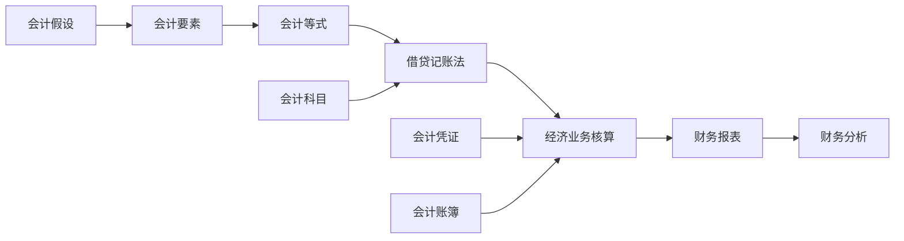

# 会计学知识点索引

## 快速导航

### 🔍 按层级分类

#### 01-基础认知层
| 知识点 | 文件链接 | 核心概念 | 难度 |
|--------|----------|----------|------|
| 会计学基本概念 | [[01-基础认知层/会计学概述/01-会计学基本概念]] | 定义、目标、职能 | ⭐ |
| 会计信息使用者 | [[01-基础认知层/会计学概述/02-会计信息使用者]] | 内部外部使用者 | ⭐ |
| 会计假设与基础 | [[01-基础认知层/会计学概述/03-会计假设与基础]] | 四大假设、权责发生制 | ⭐⭐ |
| 会计发展历程 | [[01-基础认知层/会计学概述/04-会计发展历程]] | 历史脉络 | ⭐ |
| 会计要素详解 | [[01-基础认知层/会计要素与等式/01-会计要素详解]] | 六大要素 | ⭐⭐ |
| 会计等式原理 | [[01-基础认知层/会计要素与等式/02-会计等式原理]] | 静态动态等式 | ⭐⭐ |
| 要素关系图解 | [[01-基础认知层/会计要素与等式/03-要素关系图解]] | 可视化关系 | ⭐ |
| 等式应用实例 | [[01-基础认知层/会计要素与等式/04-等式应用实例]] | 实际应用 | ⭐⭐ |
| 会计科目体系 | [[01-基础认知层/会计科目与账户/01-会计科目体系]] | 科目分类 | ⭐⭐ |
| 账户结构分析 | [[01-基础认知层/会计科目与账户/02-账户结构分析]] | T型账户 | ⭐⭐ |
| 借贷记账法 | [[01-基础认知层/会计科目与账户/03-借贷记账法]] | 记账原理 | ⭐⭐⭐ |
| 记账规则总结 | [[01-基础认知层/会计科目与账户/04-记账规则总结]] | 记忆口诀 | ⭐⭐ |

#### 02-理解掌握层
| 知识点 | 文件链接 | 核心概念 | 难度 |
|--------|----------|----------|------|
| 权责发生制详解 | [[02-理解掌握层/会计核算基础/01-权责发生制详解]] | 与收付实现制对比 | ⭐⭐⭐ |
| 会计确认与计量 | [[02-理解掌握层/会计核算基础/02-会计确认与计量]] | 确认条件、计量属性 | ⭐⭐⭐ |
| 会计记录方法 | [[02-理解掌握层/会计核算基础/03-会计记录方法]] | 记账方法和技巧 | ⭐⭐ |
| 会计报告体系 | [[02-理解掌握层/会计核算基础/04-会计报告体系]] | 报告内容和要求 | ⭐⭐ |
| 资金筹集业务 | [[02-理解掌握层/经济业务核算/01-资金筹集业务]] | 股权筹资、债权筹资 | ⭐⭐⭐ |
| 供应过程业务 | [[02-理解掌握层/经济业务核算/02-供应过程业务]] | 采购、入库、付款 | ⭐⭐⭐ |
| 生产过程业务 | [[02-理解掌握层/经济业务核算/03-生产过程业务]] | 领料、人工、制造费用 | ⭐⭐⭐ |
| 销售过程业务 | [[02-理解掌握层/经济业务核算/04-销售过程业务]] | 销售、收款、成本结转 | ⭐⭐⭐ |
| 利润形成分配 | [[02-理解掌握层/经济业务核算/05-利润形成分配]] | 利润计算、分配方案 | ⭐⭐⭐ |
| 业务核算综合案例 | [[02-理解掌握层/经济业务核算/06-业务核算综合案例]] | 完整业务流程 | ⭐⭐⭐⭐ |
| 会计凭证体系 | [[02-理解掌握层/会计凭证账簿/01-会计凭证体系]] | 原始凭证、记账凭证 | ⭐⭐ |
| 会计账簿分类 | [[02-理解掌握层/会计凭证账簿/02-会计账簿分类]] | 总账、明细账、日记账 | ⭐⭐ |
| 账簿登记方法 | [[02-理解掌握层/会计凭证账簿/03-账簿登记方法]] | 登记规则和技巧 | ⭐⭐ |
| 对账结账程序 | [[02-理解掌握层/会计凭证账簿/04-对账结账程序]] | 对账方法、结账程序 | ⭐⭐⭐ |
| 错账更正方法 | [[02-理解掌握层/会计凭证账簿/05-错账更正方法]] | 划线更正、红字更正 | ⭐⭐⭐ |

### 📊 按主题分类

#### 财务报表相关
- [[03-应用实践层/财务报表编制/01-资产负债表编制]] - 资产负债表
- [[03-应用实践层/财务报表编制/02-利润表编制]] - 利润表
- [[03-应用实践层/财务报表编制/03-现金流量表编制]] - 现金流量表
- [[03-应用实践层/财务报表编制/04-所有者权益变动表]] - 所有者权益变动表
- [[03-应用实践层/财务报表编制/05-财务报表附注]] - 财务报表附注

#### 财务分析相关
- [[03-应用实践层/财务分析应用/01-财务比率分析]] - 财务比率分析
- [[03-应用实践层/财务分析应用/02-趋势分析方法]] - 趋势分析
- [[03-应用实践层/财务分析应用/03-综合分析模型]] - 综合分析
- [[03-应用实践层/财务分析应用/04-财务预警系统]] - 财务预警
- [[03-应用实践层/财务分析应用/05-分析报告撰写]] - 分析报告

#### 特殊业务处理
- [[03-应用实践层/特殊业务处理/01-存货计价方法]] - 存货计价
- [[03-应用实践层/特殊业务处理/02-固定资产折旧]] - 固定资产折旧
- [[03-应用实践层/特殊业务处理/03-坏账准备计提]] - 坏账准备
- [[03-应用实践层/特殊业务处理/04-投资业务处理]] - 投资业务
- [[03-应用实践层/特殊业务处理/05-外币业务处理]] - 外币业务
- [[03-应用实践层/特殊业务处理/06-合并报表基础]] - 合并报表

### 🎯 按难度分类

#### ⭐ 基础入门
- [[01-基础认知层/会计学概述/01-会计学基本概念]]
- [[01-基础认知层/会计学概述/02-会计信息使用者]]
- [[01-基础认知层/会计学概述/04-会计发展历程]]
- [[01-基础认知层/会计要素与等式/03-要素关系图解]]

#### ⭐⭐ 理解掌握
- [[01-基础认知层/会计学概述/03-会计假设与基础]]
- [[01-基础认知层/会计要素与等式/01-会计要素详解]]
- [[01-基础认知层/会计要素与等式/02-会计等式原理]]
- [[01-基础认知层/会计科目与账户/01-会计科目体系]]
- [[01-基础认知层/会计科目与账户/02-账户结构分析]]

#### ⭐⭐⭐ 应用实践
- [[01-基础认知层/会计科目与账户/03-借贷记账法]]
- [[02-理解掌握层/会计核算基础/01-权责发生制详解]]
- [[02-理解掌握层/会计核算基础/02-会计确认与计量]]
- [[02-理解掌握层/经济业务核算/01-资金筹集业务]]
- [[03-应用实践层/财务报表编制/01-资产负债表编制]]

#### ⭐⭐⭐⭐ 综合提升
- [[02-理解掌握层/经济业务核算/06-业务核算综合案例]]
- [[04-综合提升层/案例分析/01-制造业企业案例]]
- [[04-综合提升层/案例分析/02-商业企业案例]]
- [[04-综合提升层/案例分析/03-服务业企业案例]]
- [[04-综合提升层/案例分析/04-上市公司案例]]

### 🔗 知识点关联图

## 搜索技巧

### 按关键词搜索
- **基础概念**：会计、要素、等式、科目、账户
- **核算方法**：借贷、权责发生制、确认、计量
- **业务流程**：筹资、供应、生产、销售、利润
- **财务报表**：资产负债表、利润表、现金流量表
- **财务分析**：比率、趋势、综合分析

### 按问题类型搜索
- **"什么是"** → 基础概念类文件
- **"如何"** → 方法技巧类文件
- **"为什么"** → 原理分析类文件
- **"案例分析"** → 实务应用类文件

## 相关链接
- [[01-学习路径图]] - 整体学习路径
- [[03-复习检查清单]] - 复习要点
- [[04-学习目标设定]] - 学习目标
- [[05-学习进度跟踪]] - 进度记录
