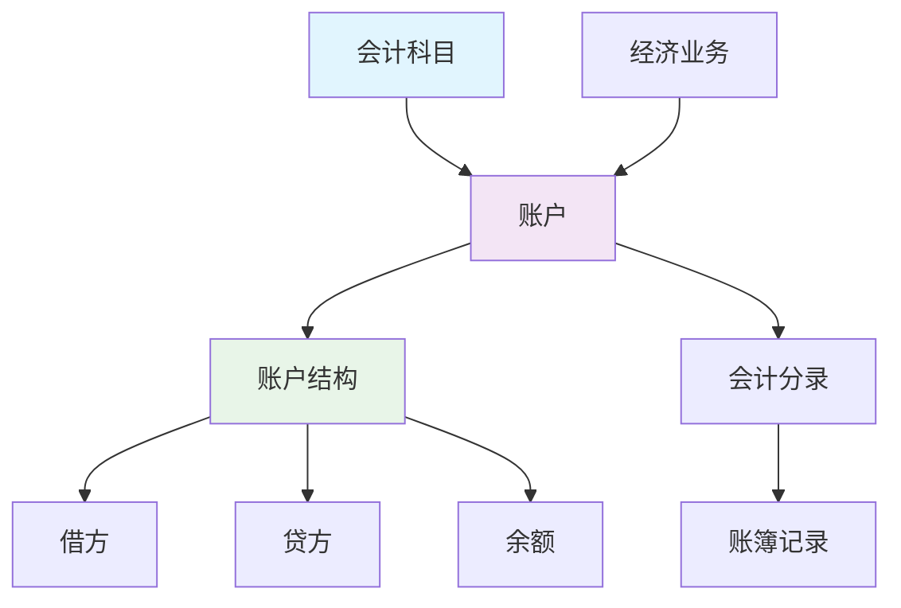
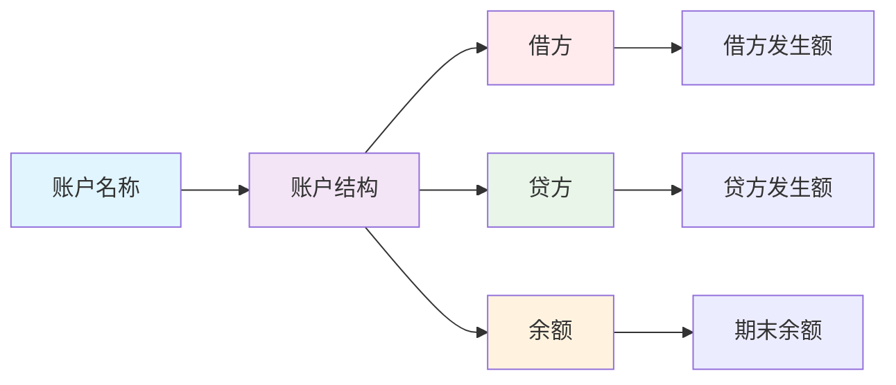

# 账户结构分析

## 账户的定义

### 📖 基本定义
**账户**是根据会计科目开设的，具有一定格式和结构，用来分类、连续、系统地记录各项经济业务增减变动及其结果的载体。

### 🔍 定义解析
- **开设依据**：根据会计科目开设
- **格式结构**：具有一定格式和结构
- **记录载体**：记录经济业务的载体
- **分类记录**：分类、连续、系统地记录

## 账户与会计科目的关系

### 🔗 相互关系

#### 1. 联系
- **开设依据**：账户根据会计科目开设
- **名称一致**：账户名称与会计科目名称一致
- **内容一致**：账户内容与会计科目内容一致
- **相互依存**：账户与会计科目相互依存

#### 2. 区别
- **概念不同**：账户是载体，科目是名称
- **作用不同**：账户用于记录，科目用于分类
- **形式不同**：账户有结构，科目无结构
- **层次不同**：账户是具体的，科目是抽象的

### 📊 关系图解

## 账户的基本结构

### 📋 账户结构要素

#### 1. 账户名称
- **科目名称**：账户的名称
- **编码**：账户的编码
- **级次**：账户的级次

#### 2. 账户格式
- **借方栏**：记录借方发生额
- **贷方栏**：记录贷方发生额
- **余额栏**：记录账户余额
- **摘要栏**：记录经济业务摘要

#### 3. 账户内容
- **期初余额**：账户期初余额
- **本期发生额**：账户本期发生额
- **期末余额**：账户期末余额

### 🏗️ 账户结构图

## 账户的分类

### 📊 按经济内容分类

#### 1. 资产类账户
**定义**：反映企业资产增减变动情况的账户

**结构特点**：
- 借方登记增加
- 贷方登记减少
- 余额在借方

**主要账户**：
- 库存现金、银行存款
- 应收账款、存货
- 固定资产、无形资产

#### 2. 负债类账户
**定义**：反映企业负债增减变动情况的账户

**结构特点**：
- 借方登记减少
- 贷方登记增加
- 余额在贷方

**主要账户**：
- 短期借款、应付账款
- 应付工资、应交税费
- 长期借款、应付债券

#### 3. 所有者权益类账户
**定义**：反映企业所有者权益增减变动情况的账户

**结构特点**：
- 借方登记减少
- 贷方登记增加
- 余额在贷方

**主要账户**：
- 实收资本、资本公积
- 盈余公积、未分配利润

#### 4. 收入类账户
**定义**：反映企业收入增减变动情况的账户

**结构特点**：
- 借方登记减少
- 贷方登记增加
- 期末无余额

**主要账户**：
- 主营业务收入
- 其他业务收入
- 营业外收入

#### 5. 费用类账户
**定义**：反映企业费用增减变动情况的账户

**结构特点**：
- 借方登记增加
- 贷方登记减少
- 期末无余额

**主要账户**：
- 主营业务成本
- 管理费用、销售费用
- 财务费用

#### 6. 利润类账户
**定义**：反映企业利润增减变动情况的账户

**结构特点**：
- 借方登记减少
- 贷方登记增加
- 余额方向不定

**主要账户**：
- 本年利润
- 利润分配

### 🔄 按用途分类

#### 1. 盘存类账户
**定义**：用于核算实物资产增减变动的账户

**特点**：
- 有实物形态
- 需要盘点
- 余额在借方

**举例**：
- 库存现金、银行存款
- 存货、固定资产

#### 2. 结算类账户
**定义**：用于核算债权债务增减变动的账户

**特点**：
- 无实物形态
- 需要核对
- 余额方向不定

**举例**：
- 应收账款、预付账款
- 应付账款、预收账款

#### 3. 调整类账户
**定义**：用于调整其他账户余额的账户

**特点**：
- 调整作用
- 与被调整账户相反
- 余额方向不定

**举例**：
- 累计折旧、坏账准备
- 存货跌价准备

#### 4. 成本类账户
**定义**：用于核算成本费用的账户

**特点**：
- 成本核算
- 期末结转
- 余额在借方

**举例**：
- 生产成本、制造费用
- 劳务成本

## 账户的登记规则

### 📝 登记规则

#### 1. 资产类账户
- **增加**：记在借方
- **减少**：记在贷方
- **余额**：在借方

#### 2. 负债类账户
- **增加**：记在贷方
- **减少**：记在借方
- **余额**：在贷方

#### 3. 所有者权益类账户
- **增加**：记在贷方
- **减少**：记在借方
- **余额**：在贷方

#### 4. 收入类账户
- **增加**：记在贷方
- **减少**：记在借方
- **余额**：期末无余额

#### 5. 费用类账户
- **增加**：记在借方
- **减少**：记在贷方
- **余额**：期末无余额

#### 6. 利润类账户
- **增加**：记在贷方
- **减少**：记在借方
- **余额**：方向不定

### 📊 登记规则表

| 账户类别 | 借方登记 | 贷方登记 | 余额方向 |
|----------|----------|----------|----------|
| 资产类 | 增加 | 减少 | 借方 |
| 负债类 | 减少 | 增加 | 贷方 |
| 所有者权益类 | 减少 | 增加 | 贷方 |
| 收入类 | 减少 | 增加 | 无余额 |
| 费用类 | 增加 | 减少 | 无余额 |
| 利润类 | 减少 | 增加 | 不定 |

## 账户余额的计算

### 🧮 余额计算公式

#### 1. 资产类账户
**期末余额 = 期初余额 + 借方发生额 - 贷方发生额**

#### 2. 负债类账户
**期末余额 = 期初余额 + 贷方发生额 - 借方发生额**

#### 3. 所有者权益类账户
**期末余额 = 期初余额 + 贷方发生额 - 借方发生额**

#### 4. 收入类账户
**期末余额 = 0（期末无余额）**

#### 5. 费用类账户
**期末余额 = 0（期末无余额）**

#### 6. 利润类账户
**期末余额 = 期初余额 + 贷方发生额 - 借方发生额**

### 📈 余额计算示例

#### 示例1：资产类账户
**银行存款账户**
- 期初余额：100,000元
- 借方发生额：50,000元
- 贷方发生额：30,000元
- 期末余额：100,000 + 50,000 - 30,000 = 120,000元

#### 示例2：负债类账户
**应付账款账户**
- 期初余额：80,000元
- 借方发生额：20,000元
- 贷方发生额：40,000元
- 期末余额：80,000 + 40,000 - 20,000 = 100,000元

#### 示例3：所有者权益类账户
**实收资本账户**
- 期初余额：500,000元
- 借方发生额：0元
- 贷方发生额：100,000元
- 期末余额：500,000 + 100,000 - 0 = 600,000元

## 账户的平行登记

### 🔄 平行登记原则

#### 1. 同时登记
- **总账账户**：登记总账账户
- **明细账户**：登记明细账户
- **时间一致**：登记时间一致

#### 2. 方向一致
- **借贷方向**：借贷方向一致
- **增减方向**：增减方向一致
- **余额方向**：余额方向一致

#### 3. 金额相等
- **发生额相等**：发生额相等
- **余额相等**：余额相等
- **合计相等**：合计相等

### 📊 平行登记示例

#### 示例：应收账款账户
**总账账户（应收账款）**
- 期初余额：200,000元
- 借方发生额：100,000元
- 贷方发生额：80,000元
- 期末余额：220,000元

**明细账户**
- 应收账款——A公司：期初100,000，借方50,000，贷方40,000，期末110,000
- 应收账款——B公司：期初100,000，借方50,000，贷方40,000，期末110,000

**验证**：
- 总账余额 = 明细账余额合计：220,000 = 110,000 + 110,000 ✓
- 总账发生额 = 明细账发生额合计：100,000 = 50,000 + 50,000 ✓

## 费曼学习法应用

### 🎯 学习目标
**能够准确理解和运用账户结构**

### 📝 学习步骤
1. **选择概念**：账户的定义、结构和分类
2. **简化解释**：用简单语言解释账户结构
3. **识别盲区**：发现不理解的地方
4. **重新学习**：回到源头重新理解

### 💡 记忆技巧
- **账户结构**：借方、贷方、余额
- **登记规则**：资产借方、负债贷方
- **余额计算**：期初+增加-减少

## 刻意练习要点

### 🎯 练习重点
1. **账户识别**：准确识别不同类型的账户
2. **结构分析**：分析账户的结构特点
3. **登记规则**：掌握账户的登记规则
4. **余额计算**：计算账户的期末余额

### 📊 练习方法
1. **账户分类**：练习账户分类
2. **结构分析**：分析账户结构
3. **登记练习**：练习账户登记
4. **余额计算**：计算账户余额

## 相关链接
- [[01-会计科目体系]] - 会计科目体系
- [[03-借贷记账法]] - 借贷记账法
- [[04-记账规则总结]] - 记账规则总结
- [[01-基础认知层/会计要素与等式/01-会计要素详解]] - 会计要素详解
- [[01-基础认知层/会计要素与等式/02-会计等式原理]] - 会计等式原理
