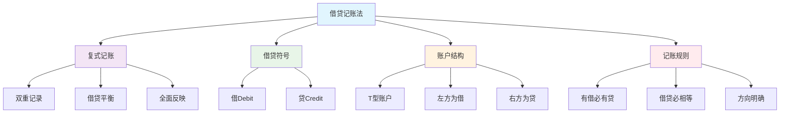
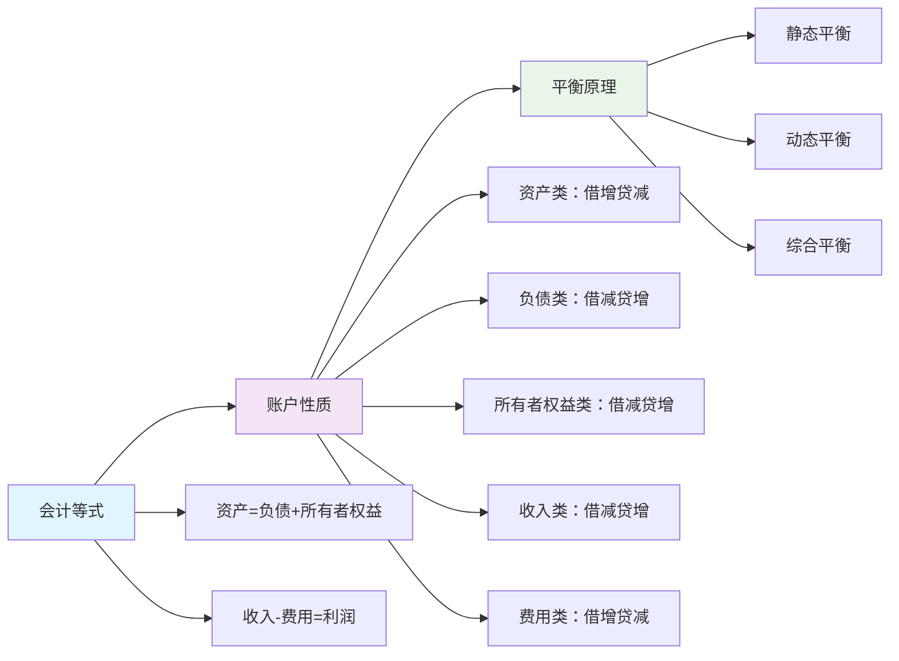

# 借贷记账法

## 借贷记账法的定义

### 📖 基本定义
**借贷记账法**是以"借"和"贷"作为记账符号，记录经济业务增减变动情况的一种复式记账方法。

### 🔍 定义解析
- **记账符号**：以"借"和"贷"作为记账符号
- **记录内容**：记录经济业务增减变动情况
- **记账方法**：复式记账方法
- **理论基础**：会计等式

## 借贷记账法的特点

### 🎯 主要特点

#### 1. 复式记账
- **双重记录**：每笔经济业务都要在两个或两个以上账户中记录
- **借贷平衡**：借方金额等于贷方金额
- **全面反映**：全面反映经济业务的来龙去脉

#### 2. 借贷符号
- **借（Debit）**：表示账户的左方
- **贷（Credit）**：表示账户的右方
- **符号含义**：符号本身没有实际含义，只是记账方向

#### 3. 账户结构
- **T型账户**：账户分为左右两方
- **左方为借**：左方称为借方
- **右方为贷**：右方称为贷方

#### 4. 记账规则
- **有借必有贷**：每笔分录必须有借方和贷方
- **借贷必相等**：借方金额必须等于贷方金额
- **方向明确**：借贷方向明确

### 📊 借贷记账法特点图解



## 借贷记账法的理论基础

### 🏗️ 理论基础

#### 1. 会计等式
**基本等式**：资产 = 负债 + 所有者权益

**扩展等式**：资产 = 负债 + 所有者权益 + 收入 - 费用

#### 2. 账户性质
- **资产类账户**：借方登记增加，贷方登记减少
- **负债类账户**：借方登记减少，贷方登记增加
- **所有者权益类账户**：借方登记减少，贷方登记增加
- **收入类账户**：借方登记减少，贷方登记增加
- **费用类账户**：借方登记增加，贷方登记减少

#### 3. 平衡原理
- **静态平衡**：资产 = 负债 + 所有者权益
- **动态平衡**：收入 - 费用 = 利润
- **综合平衡**：资产 = 负债 + 所有者权益 + 利润

### 📈 理论基础图解



## 借贷记账法的记账规则

### 📝 记账规则

#### 1. 基本规则
- **有借必有贷**：每笔经济业务都要同时记入借方和贷方
- **借贷必相等**：借方金额必须等于贷方金额
- **方向明确**：借贷方向必须明确

#### 2. 具体规则
- **资产增加**：记借方
- **资产减少**：记贷方
- **负债增加**：记贷方
- **负债减少**：记借方
- **所有者权益增加**：记贷方
- **所有者权益减少**：记借方
- **收入增加**：记贷方
- **收入减少**：记借方
- **费用增加**：记借方
- **费用减少**：记贷方

### 📊 记账规则表

| 账户类别 | 增加 | 减少 | 余额方向 |
|----------|------|------|----------|
| 资产类 | 借方 | 贷方 | 借方 |
| 负债类 | 贷方 | 借方 | 贷方 |
| 所有者权益类 | 贷方 | 借方 | 贷方 |
| 收入类 | 贷方 | 借方 | 无余额 |
| 费用类 | 借方 | 贷方 | 无余额 |

## 借贷记账法的应用

### 🔄 应用步骤

#### 1. 分析经济业务
- **识别要素**：识别涉及的会计要素
- **确定方向**：确定增减变动方向
- **选择账户**：选择相应的账户

#### 2. 编制会计分录
- **确定借方**：确定借方账户和金额
- **确定贷方**：确定贷方账户和金额
- **检查平衡**：检查借贷是否平衡

#### 3. 登记账户
- **登记总账**：登记总分类账户
- **登记明细账**：登记明细分类账户
- **平行登记**：总账和明细账平行登记

### 📋 应用示例

#### 示例1：收到投资款
**经济业务**：收到投资者投入资金100,000元，存入银行

**分析**：
- 涉及要素：资产（银行存款）、所有者权益（实收资本）
- 变动方向：银行存款增加、实收资本增加
- 账户选择：银行存款、实收资本

**会计分录**：
```
借：银行存款    100,000
贷：实收资本    100,000
```

#### 示例2：购买设备
**经济业务**：用银行存款购买设备50,000元

**分析**：
- 涉及要素：资产（固定资产、银行存款）
- 变动方向：固定资产增加、银行存款减少
- 账户选择：固定资产、银行存款

**会计分录**：
```
借：固定资产    50,000
贷：银行存款    50,000
```

#### 示例3：销售商品
**经济业务**：销售商品取得收入80,000元，款项存入银行

**分析**：
- 涉及要素：资产（银行存款）、收入（主营业务收入）
- 变动方向：银行存款增加、主营业务收入增加
- 账户选择：银行存款、主营业务收入

**会计分录**：
```
借：银行存款    80,000
贷：主营业务收入    80,000
```

#### 示例4：支付费用
**经济业务**：用银行存款支付管理费用10,000元

**分析**：
- 涉及要素：资产（银行存款）、费用（管理费用）
- 变动方向：银行存款减少、管理费用增加
- 账户选择：银行存款、管理费用

**会计分录**：
```
借：管理费用    10,000
贷：银行存款    10,000
```

## 借贷记账法的优势

### ✅ 主要优势

#### 1. 科学性强
- **理论基础**：有坚实的理论基础
- **逻辑严密**：逻辑严密，体系完整
- **方法先进**：方法先进，技术成熟

#### 2. 适用性广
- **适用范围**：适用于各种类型的企业
- **业务类型**：适用于各种业务类型
- **规模大小**：适用于各种规模的企业

#### 3. 操作简便
- **规则明确**：规则明确，易于掌握
- **操作简单**：操作简单，便于实施
- **检查方便**：检查方便，便于验证

#### 4. 信息完整
- **信息全面**：信息全面，反映完整
- **信息准确**：信息准确，真实可靠
- **信息及时**：信息及时，便于决策

### 📊 优势对比表

| 方面 | 借贷记账法 | 其他记账方法 |
|------|------------|--------------|
| 科学性 | 强 | 一般 |
| 适用性 | 广 | 有限 |
| 操作性 | 简便 | 复杂 |
| 信息性 | 完整 | 不完整 |

## 借贷记账法的局限性

### ⚠️ 主要局限性

#### 1. 学习难度
- **概念抽象**：概念抽象，不易理解
- **规则复杂**：规则复杂，难以掌握
- **应用困难**：应用困难，容易出错

#### 2. 技术要求
- **专业要求**：需要专业知识和技能
- **操作要求**：需要熟练的操作技能
- **维护要求**：需要持续的维护和更新

#### 3. 成本较高
- **人力成本**：需要专业会计人员
- **设备成本**：需要相应的设备和软件
- **培训成本**：需要持续的培训和学习

## 费曼学习法应用

### 🎯 学习目标
**能够准确理解和运用借贷记账法**

### 📝 学习步骤
1. **选择概念**：借贷记账法的定义、特点和规则
2. **简化解释**：用简单语言解释借贷记账法
3. **识别盲区**：发现不理解的地方
4. **重新学习**：回到源头重新理解

### 💡 记忆技巧
- **记账规则**：有借必有贷，借贷必相等
- **账户性质**：资产借方、负债贷方
- **平衡原理**：借方总额=贷方总额

## 刻意练习要点

### 🎯 练习重点
1. **规则掌握**：掌握借贷记账法的基本规则
2. **分录编制**：能够编制正确的会计分录
3. **账户登记**：能够正确登记账户
4. **平衡检查**：能够检查借贷是否平衡

### 📊 练习方法
1. **规则练习**：练习记账规则
2. **分录练习**：练习编制会计分录
3. **登记练习**：练习账户登记
4. **平衡练习**：练习平衡检查

## 相关链接
- [[01-会计科目体系]] - 会计科目体系
- [[02-账户结构分析]] - 账户结构分析
- [[04-记账规则总结]] - 记账规则总结
- [[01-基础认知层/会计要素与等式/01-会计要素详解]] - 会计要素详解
- [[01-基础认知层/会计要素与等式/02-会计等式原理]] - 会计等式原理
