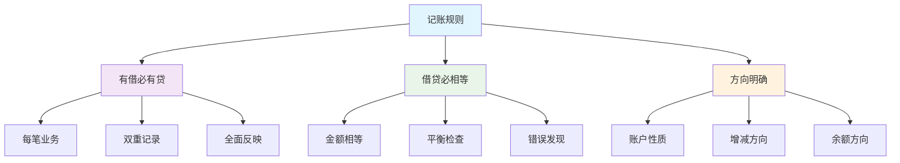

# 记账规则总结

## 记账规则概述

### 📖 基本概念
**记账规则**是指在借贷记账法下，记录经济业务增减变动时必须遵循的规则和原则。

### 🔍 核心规则
- **有借必有贷**：每笔经济业务都要同时记入借方和贷方
- **借贷必相等**：借方金额必须等于贷方金额
- **方向明确**：借贷方向必须明确

## 各类账户的记账规则

### 📊 资产类账户

#### 记账规则
- **增加**：记在借方
- **减少**：记在贷方
- **余额**：在借方

#### 典型账户
- 库存现金、银行存款
- 应收账款、存货
- 固定资产、无形资产

#### 记账示例
```
收到投资款存入银行：
借：银行存款    100,000
贷：实收资本    100,000

用银行存款购买设备：
借：固定资产    50,000
贷：银行存款    50,000
```

### 📊 负债类账户

#### 记账规则
- **增加**：记在贷方
- **减少**：记在借方
- **余额**：在贷方

#### 典型账户
- 短期借款、应付账款
- 应付工资、应交税费
- 长期借款、应付债券

#### 记账示例
```
向银行借款：
借：银行存款    200,000
贷：短期借款    200,000

偿还借款：
借：短期借款    200,000
贷：银行存款    200,000
```

### 📊 所有者权益类账户

#### 记账规则
- **增加**：记在贷方
- **减少**：记在借方
- **余额**：在贷方

#### 典型账户
- 实收资本、资本公积
- 盈余公积、未分配利润

#### 记账示例
```
收到投资款：
借：银行存款    100,000
贷：实收资本    100,000

提取盈余公积：
借：利润分配    50,000
贷：盈余公积    50,000
```

### 📊 收入类账户

#### 记账规则
- **增加**：记在贷方
- **减少**：记在借方
- **余额**：期末无余额

#### 典型账户
- 主营业务收入
- 其他业务收入
- 营业外收入

#### 记账示例
```
销售商品取得收入：
借：银行存款    80,000
贷：主营业务收入    80,000

期末结转收入：
借：主营业务收入    80,000
贷：本年利润    80,000
```

### 📊 费用类账户

#### 记账规则
- **增加**：记在借方
- **减少**：记在贷方
- **余额**：期末无余额

#### 典型账户
- 主营业务成本
- 管理费用、销售费用
- 财务费用

#### 记账示例
```
支付管理费用：
借：管理费用    10,000
贷：银行存款    10,000

期末结转费用：
借：本年利润    10,000
贷：管理费用    10,000
```

### 📊 利润类账户

#### 记账规则
- **增加**：记在贷方
- **减少**：记在借方
- **余额**：方向不定

#### 典型账户
- 本年利润
- 利润分配

#### 记账示例
```
期末结转利润：
借：主营业务收入    80,000
贷：本年利润    80,000

借：本年利润    10,000
贷：管理费用    10,000
```

## 记账规则总结表

### 📋 完整规则表

| 账户类别 | 借方登记 | 贷方登记 | 余额方向 | 期末处理 |
|----------|----------|----------|----------|----------|
| 资产类 | 增加 | 减少 | 借方 | 结转下期 |
| 负债类 | 减少 | 增加 | 贷方 | 结转下期 |
| 所有者权益类 | 减少 | 增加 | 贷方 | 结转下期 |
| 收入类 | 减少 | 增加 | 无余额 | 结转本年利润 |
| 费用类 | 增加 | 减少 | 无余额 | 结转本年利润 |
| 利润类 | 减少 | 增加 | 不定 | 结转利润分配 |

### 🔄 记账规则图解



## 特殊记账规则

### 🔄 调整类账户

#### 累计折旧账户
- **性质**：资产类调整账户
- **结构**：贷方登记增加，借方登记减少
- **余额**：在贷方
- **作用**：调整固定资产账面价值

#### 记账示例
```
计提折旧：
借：管理费用    5,000
贷：累计折旧    5,000

固定资产清理：
借：累计折旧    50,000
贷：固定资产    50,000
```

### 🔄 备抵类账户

#### 坏账准备账户
- **性质**：资产类备抵账户
- **结构**：贷方登记增加，借方登记减少
- **余额**：在贷方
- **作用**：备抵应收账款

#### 记账示例
```
计提坏账准备：
借：资产减值损失    2,000
贷：坏账准备    2,000

核销坏账：
借：坏账准备    2,000
贷：应收账款    2,000
```

### 🔄 成本类账户

#### 生产成本账户
- **性质**：成本类账户
- **结构**：借方登记增加，贷方登记减少
- **余额**：在借方
- **作用**：核算产品成本

#### 记账示例
```
发生生产费用：
借：生产成本    30,000
贷：原材料    30,000

产品完工入库：
借：库存商品    30,000
贷：生产成本    30,000
```

## 记账规则的应用

### 🎯 应用步骤

#### 1. 分析经济业务
- **识别要素**：识别涉及的会计要素
- **确定方向**：确定增减变动方向
- **选择账户**：选择相应的账户

#### 2. 确定记账方向
- **资产增加**：记借方
- **资产减少**：记贷方
- **负债增加**：记贷方
- **负债减少**：记借方
- **所有者权益增加**：记贷方
- **所有者权益减少**：记借方
- **收入增加**：记贷方
- **收入减少**：记借方
- **费用增加**：记借方
- **费用减少**：记贷方

#### 3. 编制会计分录
- **确定借方**：确定借方账户和金额
- **确定贷方**：确定贷方账户和金额
- **检查平衡**：检查借贷是否平衡

#### 4. 登记账户
- **登记总账**：登记总分类账户
- **登记明细账**：登记明细分类账户
- **平行登记**：总账和明细账平行登记

### 📋 应用示例

#### 示例1：综合业务
**经济业务**：企业销售商品，取得收入100,000元，款项存入银行，商品成本60,000元

**分析**：
- 涉及要素：资产（银行存款、库存商品）、收入（主营业务收入）、费用（主营业务成本）
- 变动方向：银行存款增加、库存商品减少、主营业务收入增加、主营业务成本增加

**会计分录**：
```
借：银行存款    100,000
贷：主营业务收入    100,000

借：主营业务成本    60,000
贷：库存商品    60,000
```

#### 示例2：复杂业务
**经济业务**：企业购买原材料50,000元，其中30,000元用银行存款支付，20,000元暂欠

**分析**：
- 涉及要素：资产（原材料、银行存款）、负债（应付账款）
- 变动方向：原材料增加、银行存款减少、应付账款增加

**会计分录**：
```
借：原材料    50,000
贷：银行存款    30,000
贷：应付账款    20,000
```

## 记账规则的检查

### ✅ 检查方法

#### 1. 平衡检查
- **借贷平衡**：借方总额=贷方总额
- **账户平衡**：账户借方=账户贷方
- **报表平衡**：资产负债表平衡

#### 2. 方向检查
- **方向正确**：借贷方向正确
- **账户性质**：账户性质正确
- **余额方向**：余额方向正确

#### 3. 金额检查
- **金额准确**：金额计算准确
- **单位一致**：计量单位一致
- **精度适当**：精度适当

### 📊 检查表

| 检查项目 | 检查内容 | 检查方法 | 检查结果 |
|----------|----------|----------|----------|
| 平衡性 | 借贷是否平衡 | 计算核对 | ✓/✗ |
| 方向性 | 借贷方向是否正确 | 规则对照 | ✓/✗ |
| 金额性 | 金额是否准确 | 计算验证 | ✓/✗ |
| 完整性 | 业务是否完整 | 业务核对 | ✓/✗ |

## 常见错误及纠正

### ⚠️ 常见错误

#### 1. 方向错误
- **错误表现**：借贷方向颠倒
- **错误原因**：账户性质理解错误
- **纠正方法**：重新分析账户性质

#### 2. 金额错误
- **错误表现**：借贷金额不等
- **错误原因**：计算错误或遗漏
- **纠正方法**：重新计算核对

#### 3. 账户错误
- **错误表现**：账户选择错误
- **错误原因**：业务理解错误
- **纠正方法**：重新分析业务

#### 4. 遗漏错误
- **错误表现**：业务记录不完整
- **错误原因**：业务分析不全面
- **纠正方法**：全面分析业务

### 🔧 纠正方法

#### 1. 红字冲销法
- **适用情况**：错误金额较大
- **操作方法**：用红字冲销错误分录
- **重新记录**：用蓝字记录正确分录

#### 2. 补充登记法
- **适用情况**：遗漏金额
- **操作方法**：补充记录遗漏金额
- **注意事项**：保持借贷平衡

#### 3. 划线更正法
- **适用情况**：错误金额较小
- **操作方法**：划线更正错误金额
- **重新记录**：在划线上方记录正确金额

## 费曼学习法应用

### 🎯 学习目标
**能够准确掌握和运用记账规则**

### 📝 学习步骤
1. **选择概念**：记账规则的定义、内容和应用
2. **简化解释**：用简单语言解释记账规则
3. **识别盲区**：发现不理解的地方
4. **重新学习**：回到源头重新理解

### 💡 记忆技巧
- **基本规则**：有借必有贷，借贷必相等
- **账户性质**：资产借方、负债贷方
- **增减方向**：增加记哪方，减少记哪方

## 刻意练习要点

### 🎯 练习重点
1. **规则掌握**：掌握各类账户的记账规则
2. **分录编制**：能够编制正确的会计分录
3. **错误识别**：能够识别和纠正记账错误
4. **平衡检查**：能够检查借贷是否平衡

### 📊 练习方法
1. **规则练习**：练习各类账户的记账规则
2. **分录练习**：练习编制会计分录
3. **错误练习**：练习识别和纠正错误
4. **平衡练习**：练习平衡检查

## 相关链接
- [[01-会计科目体系]] - 会计科目体系
- [[02-账户结构分析]] - 账户结构分析
- [[03-借贷记账法]] - 借贷记账法
- [[01-基础认知层/会计要素与等式/01-会计要素详解]] - 会计要素详解
- [[01-基础认知层/会计要素与等式/02-会计等式原理]] - 会计等式原理
