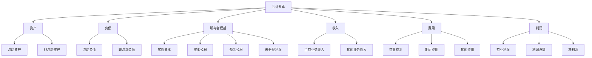
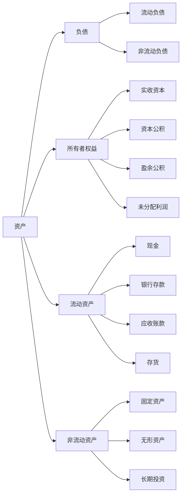
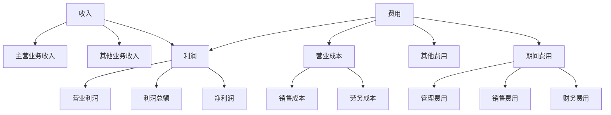
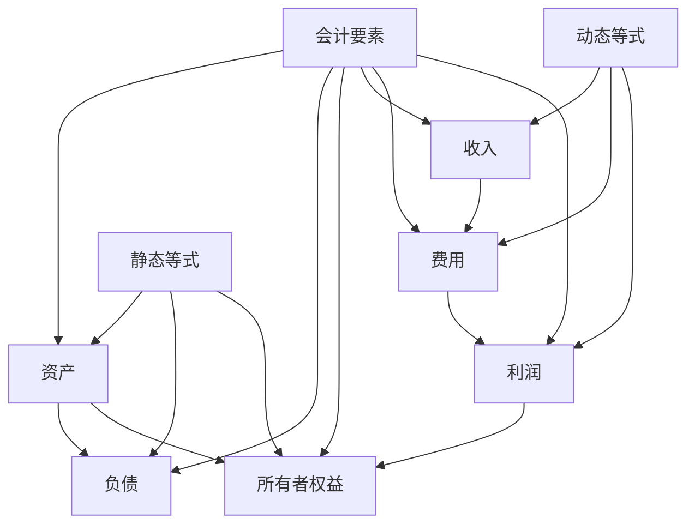
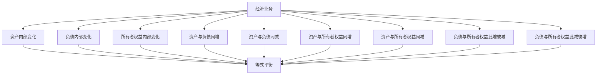
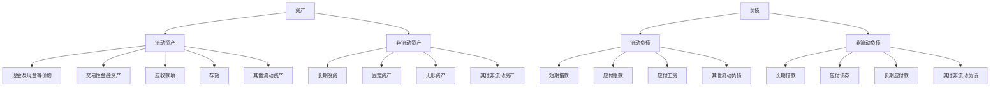
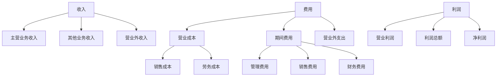
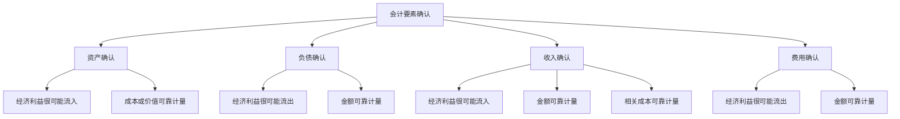
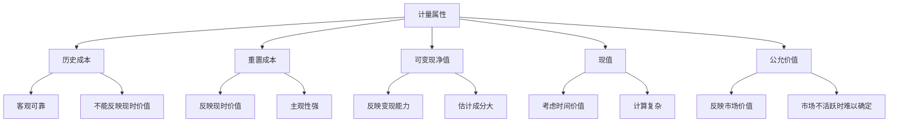

# 要素关系图解

## 会计要素关系概览

### 🔗 基本关系结构



## 静态关系图解

### ⚖️ 资产负债表关系



### 📊 等式关系

```
资产 = 负债 + 所有者权益
```

**具体分解**：
```
流动资产 + 非流动资产 = 流动负债 + 非流动负债 + 实收资本 + 资本公积 + 盈余公积 + 未分配利润
```

## 动态关系图解

### 📈 利润表关系



### 📊 等式关系

```
收入 - 费用 = 利润
```

**具体分解**：
```
主营业务收入 + 其他业务收入 - 营业成本 - 期间费用 - 其他费用 = 营业利润
营业利润 + 营业外收入 - 营业外支出 = 利润总额
利润总额 - 所得税费用 = 净利润
```

## 综合关系图解

### 🔄 会计要素综合关系



### 📊 综合等式

```
资产 = 负债 + 所有者权益 + 利润
```

**具体分解**：
```
资产 = 负债 + 所有者权益 + 收入 - 费用
```

## 要素变化关系图解

### 🔄 经济业务对要素的影响



### 📊 变化规律

| 业务类型 | 资产变化 | 负债变化 | 所有者权益变化 | 等式状态 |
|----------|----------|----------|----------------|----------|
| 资产内部变化 | 不变 | 不变 | 不变 | 平衡 |
| 负债内部变化 | 不变 | 不变 | 不变 | 平衡 |
| 所有者权益内部变化 | 不变 | 不变 | 不变 | 平衡 |
| 资产与负债同增 | 增加 | 增加 | 不变 | 平衡 |
| 资产与负债同减 | 减少 | 减少 | 不变 | 平衡 |
| 资产与所有者权益同增 | 增加 | 不变 | 增加 | 平衡 |
| 资产与所有者权益同减 | 减少 | 不变 | 减少 | 平衡 |
| 负债与所有者权益此增彼减 | 不变 | 增加 | 减少 | 平衡 |
| 负债与所有者权益此减彼增 | 不变 | 减少 | 增加 | 平衡 |

## 要素分类关系图解

### 📋 按流动性分类



### 📊 按功能分类



## 要素确认关系图解

### ✅ 确认条件关系



## 要素计量关系图解

### 📏 计量属性关系



## 费曼学习法应用

### 🎯 学习目标
**能够通过图解准确理解会计要素之间的关系**

### 📝 学习步骤
1. **选择概念**：会计要素之间的关系
2. **图解解释**：用图解方式解释关系
3. **识别盲区**：发现不理解的地方
4. **重新学习**：回到源头重新理解

### 💡 记忆技巧
- **静态关系**：资产=负债+所有者权益
- **动态关系**：收入-费用=利润
- **变化规律**：等式两边同时变化，等式平衡

## 刻意练习要点

### 🎯 练习重点
1. **关系理解**：准确理解要素之间的关系
2. **图解分析**：通过图解分析关系
3. **变化规律**：掌握要素变化规律
4. **综合应用**：综合运用所学知识分析问题

### 📊 练习方法
1. **图解绘制**：绘制要素关系图解
2. **关系分析**：分析要素之间的关系
3. **变化分析**：分析要素变化规律
4. **综合应用**：综合运用所学知识分析问题

## 相关链接
- [[01-会计要素详解]] - 会计要素详解
- [[02-会计等式原理]] - 会计等式原理
- [[04-等式应用实例]] - 等式应用实例
- [[01-基础认知层/会计科目与账户/01-会计科目体系]] - 会计科目体系
- [[03-应用实践层/财务报表编制/01-资产负债表编制]] - 资产负债表编制
