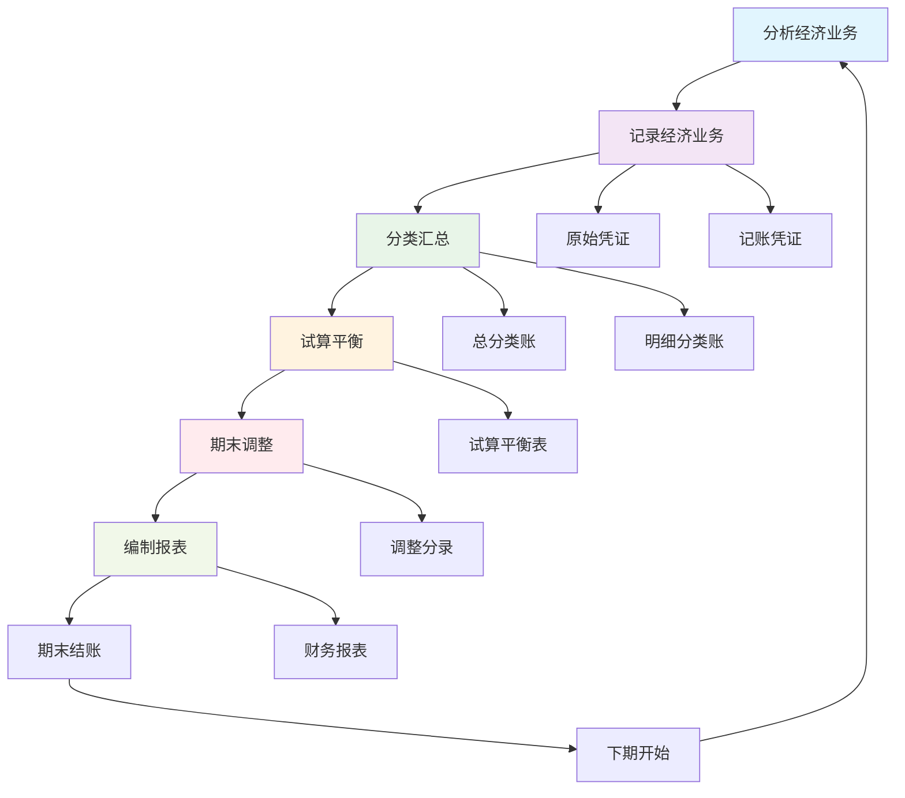

# 会计循环过程

## 会计循环概述

### 📖 基本定义
**会计循环**是指企业在一个会计期间内，从经济业务发生到编制财务报表的完整会计核算过程，包括分析、记录、分类、汇总、报告等步骤。

### 🔍 循环特点
- **周期性**：按会计期间循环进行
- **连续性**：各期间循环衔接
- **完整性**：包含完整的核算步骤
- **规范性**：遵循统一的核算规范

## 会计循环的基本步骤

### 🔄 基本步骤

#### 1. 分析经济业务
- **业务识别**：识别经济业务
- **业务分析**：分析业务性质
- **业务确认**：确认业务内容
- **业务计量**：确定业务金额

#### 2. 记录经济业务
- **原始凭证**：取得原始凭证
- **记账凭证**：填制记账凭证
- **凭证审核**：审核凭证内容
- **凭证传递**：传递凭证

#### 3. 分类汇总
- **账户分类**：按账户分类
- **账簿登记**：登记各类账簿
- **平行登记**：总账和明细账平行登记
- **余额计算**：计算账户余额

#### 4. 试算平衡
- **试算表编制**：编制试算平衡表
- **平衡检查**：检查借贷平衡
- **错误发现**：发现核算错误
- **错误纠正**：纠正核算错误

#### 5. 期末调整
- **调整分录**：编制调整分录
- **调整登记**：登记调整分录
- **调整试算**：编制调整后试算表
- **调整检查**：检查调整结果

#### 6. 编制报表
- **报表编制**：编制财务报表
- **报表审核**：审核报表内容
- **报表披露**：披露报表信息
- **报表归档**：归档报表资料

### 📊 会计循环图解



## 会计循环的详细过程

### 📋 详细过程

#### 第一步：分析经济业务
**目的**：确定经济业务的性质和影响

**内容**：
- 识别经济业务
- 分析业务性质
- 确定影响账户
- 确定增减方向

**示例**：
```
业务：收到投资者投入资金100,000元，存入银行
分析：
- 涉及账户：银行存款（资产）、实收资本（所有者权益）
- 影响方向：银行存款增加、实收资本增加
- 记账方向：银行存款借方、实收资本贷方
```

#### 第二步：记录经济业务
**目的**：将经济业务记录在会计凭证中

**内容**：
- 取得原始凭证
- 填制记账凭证
- 审核凭证内容
- 传递凭证

**示例**：
```
记账凭证：
借：银行存款    100,000
贷：实收资本    100,000
```

#### 第三步：分类汇总
**目的**：将经济业务按账户分类并汇总

**内容**：
- 按账户分类
- 登记总分类账
- 登记明细分类账
- 计算账户余额

**示例**：
```
银行存款总账：
期初余额：50,000
本期借方：100,000
本期贷方：0
期末余额：150,000

实收资本总账：
期初余额：200,000
本期借方：0
本期贷方：100,000
期末余额：300,000
```

#### 第四步：试算平衡
**目的**：检查账户记录是否正确

**内容**：
- 编制试算平衡表
- 检查借贷平衡
- 发现核算错误
- 纠正核算错误

**示例**：
```
试算平衡表：
账户名称        借方余额    贷方余额
银行存款        150,000
实收资本                300,000
合计            150,000    300,000
```

#### 第五步：期末调整
**目的**：调整期末应计项目

**内容**：
- 编制调整分录
- 登记调整分录
- 编制调整后试算表
- 检查调整结果

**示例**：
```
调整分录：
借：管理费用    5,000
贷：累计折旧    5,000
```

#### 第六步：编制报表
**目的**：编制财务报表

**内容**：
- 编制资产负债表
- 编制利润表
- 编制现金流量表
- 审核报表内容

**示例**：
```
资产负债表：
资产：
银行存款        150,000
固定资产        95,000
累计折旧        -5,000
资产合计        240,000

负债和所有者权益：
实收资本        300,000
负债和所有者权益合计  300,000
```

## 会计循环的时间安排

### ⏰ 时间安排

#### 1. 日常处理
- **业务发生**：随时处理
- **凭证填制**：当日完成
- **账簿登记**：当日完成
- **余额计算**：当日完成

#### 2. 期末处理
- **试算平衡**：月末进行
- **期末调整**：月末进行
- **报表编制**：月末进行
- **期末结账**：月末进行

#### 3. 期初处理
- **期初余额**：月初结转
- **期初检查**：月初检查
- **期初调整**：月初调整
- **期初准备**：月初准备

### 📅 时间安排表

| 时间 | 处理内容 | 处理要求 | 完成标准 |
|------|----------|----------|----------|
| 日常 | 业务处理 | 及时处理 | 当日完成 |
| 月末 | 试算平衡 | 准确无误 | 借贷平衡 |
| 月末 | 期末调整 | 完整准确 | 调整完成 |
| 月末 | 报表编制 | 及时准确 | 报表完成 |
| 月初 | 期初结转 | 准确结转 | 余额正确 |

## 会计循环的质量控制

### 🛡️ 质量控制要点

#### 1. 准确性控制
- **业务分析**：准确分析业务
- **凭证填制**：准确填制凭证
- **账簿登记**：准确登记账簿
- **报表编制**：准确编制报表

#### 2. 完整性控制
- **业务完整**：业务处理完整
- **凭证完整**：凭证内容完整
- **账簿完整**：账簿记录完整
- **报表完整**：报表内容完整

#### 3. 及时性控制
- **及时处理**：及时处理业务
- **及时登记**：及时登记账簿
- **及时编制**：及时编制报表
- **及时披露**：及时披露信息

#### 4. 规范性控制
- **规范处理**：规范处理业务
- **规范登记**：规范登记账簿
- **规范编制**：规范编制报表
- **规范披露**：规范披露信息

### 📋 质量控制措施

#### 1. 内部审核
- **凭证审核**：审核凭证内容
- **账簿审核**：审核账簿记录
- **报表审核**：审核报表内容
- **流程审核**：审核处理流程

#### 2. 外部审计
- **年度审计**：接受年度审计
- **专项审计**：接受专项审计
- **监管检查**：接受监管检查
- **社会监督**：接受社会监督

#### 3. 技术控制
- **软件控制**：使用会计软件
- **系统控制**：建立控制系统
- **数据控制**：控制数据质量
- **流程控制**：控制处理流程

## 会计循环的优化

### 🚀 优化方向

#### 1. 流程优化
- **简化流程**：简化处理流程
- **提高效率**：提高处理效率
- **降低成本**：降低处理成本
- **改善质量**：改善处理质量

#### 2. 技术优化
- **信息化**：实现信息化处理
- **自动化**：实现自动化处理
- **智能化**：实现智能化处理
- **网络化**：实现网络化处理

#### 3. 管理优化
- **制度优化**：优化管理制度
- **组织优化**：优化组织结构
- **人员优化**：优化人员配置
- **培训优化**：优化培训体系

### 📊 优化效果

#### 1. 效率提升
- **处理速度**：提高处理速度
- **工作质量**：提高工作质量
- **成本节约**：节约处理成本
- **资源利用**：提高资源利用率

#### 2. 质量改善
- **准确性**：提高处理准确性
- **完整性**：提高处理完整性
- **及时性**：提高处理及时性
- **规范性**：提高处理规范性

#### 3. 管理改进
- **内部控制**：加强内部控制
- **风险管理**：加强风险管理
- **决策支持**：提供决策支持
- **信息透明**：提高信息透明度

## 费曼学习法应用

### 🎯 学习目标
**能够准确理解和运用会计循环过程**

### 📝 学习步骤
1. **选择概念**：会计循环的定义、步骤和特点
2. **简化解释**：用简单语言解释会计循环
3. **识别盲区**：发现不理解的地方
4. **重新学习**：回到源头重新理解

### 💡 记忆技巧
- **基本步骤**：分析→记录→分类→试算→调整→报表
- **循环特点**：周期性、连续性、完整性、规范性
- **质量控制**：准确性、完整性、及时性、规范性

## 刻意练习要点

### 🎯 练习重点
1. **循环理解**：理解会计循环的完整过程
2. **步骤掌握**：掌握各步骤的操作方法
3. **质量控制**：掌握质量控制要点
4. **循环优化**：了解循环优化方向

### 📊 练习方法
1. **循环练习**：练习完整的会计循环
2. **步骤练习**：练习各步骤的操作
3. **控制练习**：练习质量控制
4. **优化练习**：练习循环优化

## 相关链接
- [[01-会计核算程序]] - 会计核算程序
- [[03-试算平衡方法]] - 试算平衡方法
- [[04-期末调整处理]] - 期末调整处理
- [[01-基础认知层/会计科目与账户/03-借贷记账法]] - 借贷记账法
- [[01-基础认知层/会计科目与账户/04-记账规则总结]] - 记账规则总结
