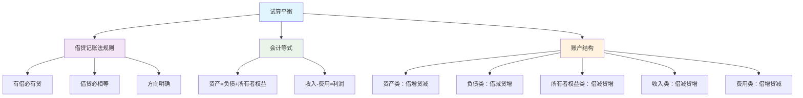

# 试算平衡方法

## 试算平衡概述

### 📖 基本定义
**试算平衡**是指根据借贷记账法的记账规则，通过计算所有账户的借方发生额和贷方发生额是否相等，来检查账户记录是否正确的一种方法。

### 🔍 平衡原理
- **借贷平衡**：借方发生额 = 贷方发生额
- **余额平衡**：借方余额 = 贷方余额
- **等式平衡**：资产 = 负债 + 所有者权益

## 试算平衡的理论基础

### 🏗️ 理论基础

#### 1. 借贷记账法规则
- **有借必有贷**：每笔业务都有借方和贷方
- **借贷必相等**：借方金额 = 贷方金额
- **方向明确**：借贷方向明确

#### 2. 会计等式
- **基本等式**：资产 = 负债 + 所有者权益
- **扩展等式**：资产 = 负债 + 所有者权益 + 收入 - 费用
- **综合等式**：资产 = 负债 + 所有者权益 + 利润

#### 3. 账户结构
- **资产类账户**：借方登记增加，贷方登记减少
- **负债类账户**：借方登记减少，贷方登记增加
- **所有者权益类账户**：借方登记减少，贷方登记增加
- **收入类账户**：借方登记减少，贷方登记增加
- **费用类账户**：借方登记增加，贷方登记减少

### 📊 理论基础图解



## 试算平衡的类型

### 📋 平衡类型

#### 1. 发生额试算平衡
**定义**：检查所有账户的借方发生额和贷方发生额是否相等

**公式**：∑借方发生额 = ∑贷方发生额

**作用**：
- 检查本期发生额记录是否正确
- 发现本期发生额记录错误
- 验证借贷记账法规则

**示例**：
```
发生额试算平衡表：
账户名称        借方发生额    贷方发生额
银行存款        100,000      50,000
应收账款        80,000       60,000
库存商品        120,000      90,000
固定资产        200,000      0
短期借款        0           150,000
应付账款        0           100,000
实收资本        0           300,000
主营业务收入    0           250,000
主营业务成本    180,000     0
管理费用        40,000      0
合计            720,000     720,000
```

#### 2. 余额试算平衡
**定义**：检查所有账户的借方余额和贷方余额是否相等

**公式**：∑借方余额 = ∑贷方余额

**作用**：
- 检查账户余额计算是否正确
- 发现账户余额计算错误
- 验证会计等式

**示例**：
```
余额试算平衡表：
账户名称        借方余额      贷方余额
库存现金        5,000
银行存款        150,000
应收账款        120,000
库存商品        200,000
固定资产        500,000
累计折旧                50,000
短期借款                200,000
应付账款                80,000
实收资本                400,000
盈余公积                50,000
未分配利润              195,000
合计            975,000     975,000
```

#### 3. 综合试算平衡
**定义**：同时检查发生额和余额的试算平衡

**内容**：
- 发生额试算平衡
- 余额试算平衡
- 综合平衡检查

**作用**：
- 全面检查账户记录
- 发现各种记录错误
- 确保核算质量

### 📊 试算平衡类型对比表

| 平衡类型 | 检查内容 | 计算公式 | 主要作用 | 适用情况 |
|----------|----------|----------|----------|----------|
| 发生额试算平衡 | 本期发生额 | ∑借方发生额 = ∑贷方发生额 | 检查发生额记录 | 日常检查 |
| 余额试算平衡 | 账户余额 | ∑借方余额 = ∑贷方余额 | 检查余额计算 | 期末检查 |
| 综合试算平衡 | 发生额和余额 | 同时检查两种平衡 | 全面检查 | 综合检查 |

## 试算平衡表的编制

### 📋 编制步骤

#### 1. 收集账户资料
- **总账账户**：收集所有总账账户
- **账户余额**：收集账户期末余额
- **发生额**：收集账户本期发生额
- **账户名称**：收集账户名称

#### 2. 分类整理账户
- **资产类账户**：整理资产类账户
- **负债类账户**：整理负债类账户
- **所有者权益类账户**：整理所有者权益类账户
- **收入类账户**：整理收入类账户
- **费用类账户**：整理费用类账户

#### 3. 计算发生额和余额
- **发生额计算**：计算借方和贷方发生额
- **余额计算**：计算借方和贷方余额
- **合计计算**：计算发生额和余额合计
- **平衡检查**：检查借贷是否平衡

#### 4. 编制试算平衡表
- **表头设计**：设计表头格式
- **账户排列**：按账户类别排列
- **数据填入**：填入计算数据
- **平衡验证**：验证平衡关系

### 📊 试算平衡表格式

#### 发生额试算平衡表
| 账户名称 | 借方发生额 | 贷方发生额 |
|----------|------------|------------|
| 库存现金 | 10,000 | 8,000 |
| 银行存款 | 200,000 | 150,000 |
| 应收账款 | 120,000 | 100,000 |
| 库存商品 | 180,000 | 160,000 |
| 固定资产 | 300,000 | 0 |
| 短期借款 | 0 | 200,000 |
| 应付账款 | 0 | 120,000 |
| 实收资本 | 0 | 400,000 |
| 主营业务收入 | 0 | 300,000 |
| 主营业务成本 | 200,000 | 0 |
| 管理费用 | 50,000 | 0 |
| 合计 | 1,060,000 | 1,060,000 |

#### 余额试算平衡表
| 账户名称 | 借方余额 | 贷方余额 |
|----------|----------|----------|
| 库存现金 | 12,000 | |
| 银行存款 | 250,000 | |
| 应收账款 | 140,000 | |
| 库存商品 | 220,000 | |
| 固定资产 | 800,000 | |
| 累计折旧 | | 100,000 |
| 短期借款 | | 300,000 |
| 应付账款 | | 150,000 |
| 实收资本 | | 500,000 |
| 盈余公积 | | 80,000 |
| 未分配利润 | | 292,000 |
| 合计 | 1,422,000 | 1,422,000 |

## 试算平衡的作用

### ✅ 主要作用

#### 1. 检查账户记录
- **记录正确性**：检查账户记录是否正确
- **记录完整性**：检查账户记录是否完整
- **记录准确性**：检查账户记录是否准确
- **记录及时性**：检查账户记录是否及时

#### 2. 发现核算错误
- **方向错误**：发现借贷方向错误
- **金额错误**：发现金额计算错误
- **账户错误**：发现账户选择错误
- **遗漏错误**：发现业务遗漏错误

#### 3. 验证记账规则
- **规则遵循**：验证是否遵循记账规则
- **规则应用**：验证规则应用是否正确
- **规则理解**：验证对规则的理解
- **规则掌握**：验证对规则的掌握

#### 4. 保证核算质量
- **核算准确性**：保证核算准确性
- **核算完整性**：保证核算完整性
- **核算及时性**：保证核算及时性
- **核算规范性**：保证核算规范性

### 📊 作用对比表

| 作用类型 | 具体作用 | 检查内容 | 发现错误 | 保证质量 |
|----------|----------|----------|----------|----------|
| 检查账户记录 | 记录正确性 | 账户记录 | 记录错误 | 记录质量 |
| 发现核算错误 | 方向错误 | 借贷方向 | 方向错误 | 方向正确 |
| 验证记账规则 | 规则遵循 | 记账规则 | 规则错误 | 规则正确 |
| 保证核算质量 | 核算准确性 | 核算质量 | 质量错误 | 质量保证 |

## 试算平衡的局限性

### ⚠️ 主要局限性

#### 1. 不能发现所有错误
- **方向错误**：不能发现借贷方向错误
- **金额错误**：不能发现金额计算错误
- **账户错误**：不能发现账户选择错误
- **遗漏错误**：不能发现业务遗漏错误

#### 2. 只能发现部分错误
- **平衡错误**：只能发现平衡错误
- **计算错误**：只能发现计算错误
- **记录错误**：只能发现记录错误
- **汇总错误**：只能发现汇总错误

#### 3. 需要其他方法配合
- **凭证检查**：需要凭证检查配合
- **账簿检查**：需要账簿检查配合
- **报表检查**：需要报表检查配合
- **业务检查**：需要业务检查配合

### 📋 局限性说明

#### 1. 不能发现的错误
- **借贷方向颠倒**：借贷方向颠倒但金额相等
- **账户选择错误**：选择错误账户但金额相等
- **业务遗漏**：遗漏业务但其他业务平衡
- **重复记录**：重复记录但金额相等

#### 2. 需要配合的方法
- **凭证审核**：审核原始凭证和记账凭证
- **账簿核对**：核对总账和明细账
- **报表分析**：分析财务报表
- **业务核实**：核实经济业务

## 试算平衡的改进

### 🚀 改进方向

#### 1. 方法改进
- **多重平衡**：使用多重平衡检查
- **分层平衡**：使用分层平衡检查
- **交叉平衡**：使用交叉平衡检查
- **综合平衡**：使用综合平衡检查

#### 2. 技术改进
- **软件应用**：使用会计软件
- **自动化**：实现自动化检查
- **智能化**：实现智能化检查
- **网络化**：实现网络化检查

#### 3. 管理改进
- **制度完善**：完善检查制度
- **流程优化**：优化检查流程
- **人员培训**：培训检查人员
- **质量控制**：加强质量控制

### 📊 改进效果

#### 1. 检查效果
- **检查准确性**：提高检查准确性
- **检查完整性**：提高检查完整性
- **检查及时性**：提高检查及时性
- **检查效率**：提高检查效率

#### 2. 错误发现
- **错误发现率**：提高错误发现率
- **错误纠正率**：提高错误纠正率
- **错误预防**：提高错误预防
- **错误控制**：提高错误控制

#### 3. 质量保证
- **核算质量**：提高核算质量
- **信息质量**：提高信息质量
- **管理质量**：提高管理质量
- **服务质量**：提高服务质量

## 费曼学习法应用

### 🎯 学习目标
**能够准确理解和运用试算平衡方法**

### 📝 学习步骤
1. **选择概念**：试算平衡的定义、类型和作用
2. **简化解释**：用简单语言解释试算平衡
3. **识别盲区**：发现不理解的地方
4. **重新学习**：回到源头重新理解

### 💡 记忆技巧
- **平衡原理**：借方发生额=贷方发生额，借方余额=贷方余额
- **平衡类型**：发生额平衡、余额平衡、综合平衡
- **平衡作用**：检查记录、发现错误、验证规则、保证质量

## 刻意练习要点

### 🎯 练习重点
1. **平衡理解**：理解试算平衡的原理和作用
2. **平衡编制**：掌握试算平衡表的编制方法
3. **平衡检查**：掌握平衡检查的方法
4. **平衡改进**：了解平衡改进的方向

### 📊 练习方法
1. **平衡练习**：练习试算平衡表的编制
2. **检查练习**：练习平衡检查
3. **错误练习**：练习发现和纠正错误
4. **改进练习**：练习平衡改进

## 相关链接
- [[01-会计核算程序]] - 会计核算程序
- [[02-会计循环过程]] - 会计循环过程
- [[04-期末调整处理]] - 期末调整处理
- [[01-基础认知层/会计科目与账户/03-借贷记账法]] - 借贷记账法
- [[01-基础认知层/会计科目与账户/04-记账规则总结]] - 记账规则总结
