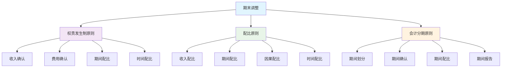

# 期末调整处理

## 期末调整概述

### 📖 基本定义
**期末调整**是指在会计期末，为了正确反映企业的财务状况和经营成果，对某些账户余额进行调整的会计处理过程。

### 🔍 调整目的
- **权责发生制**：贯彻权责发生制原则
- **配比原则**：贯彻配比原则
- **真实性**：真实反映财务状况
- **准确性**：准确计算经营成果

## 期末调整的理论基础

### 🏗️ 理论基础

#### 1. 权责发生制原则
- **收入确认**：收入在实际发生时确认
- **费用确认**：费用在实际发生时确认
- **期间配比**：收入与费用在期间内配比
- **时间配比**：收入与费用在时间上配比

#### 2. 配比原则
- **收入配比**：收入与相关费用配比
- **期间配比**：收入与费用在期间内配比
- **因果配比**：收入与费用在因果关系上配比
- **时间配比**：收入与费用在时间上配比

#### 3. 会计分期原则
- **期间划分**：按会计期间划分
- **期间确认**：按会计期间确认
- **期间配比**：按会计期间配比
- **期间报告**：按会计期间报告

### 📊 理论基础图解



## 期末调整的类型

### 📋 调整类型

#### 1. 应计项目调整
**定义**：对已经发生但尚未记录的收入和费用进行调整

**特点**：
- 已经发生但尚未记录
- 需要补充记录
- 影响当期损益
- 影响资产负债表

**主要项目**：
- 应计收入
- 应计费用
- 应计利息
- 应计工资

#### 2. 递延项目调整
**定义**：对已经记录但尚未实现的收入和费用进行调整

**特点**：
- 已经记录但尚未实现
- 需要调整记录
- 影响当期损益
- 影响资产负债表

**主要项目**：
- 预收收入
- 预付费用
- 预收账款
- 预付账款

#### 3. 估计项目调整
**定义**：对需要估计的项目进行调整

**特点**：
- 需要估计
- 估计可能变化
- 影响当期损益
- 影响资产负债表

**主要项目**：
- 坏账准备
- 折旧费用
- 摊销费用
- 减值准备

#### 4. 重分类调整
**定义**：对账户分类进行调整

**特点**：
- 账户分类错误
- 需要重新分类
- 不影响损益
- 影响资产负债表

**主要项目**：
- 长期资产重分类
- 长期负债重分类
- 流动资产重分类
- 流动负债重分类

### 📊 调整类型对比表

| 调整类型 | 调整内容 | 调整特点 | 影响损益 | 影响资产负债表 |
|----------|----------|----------|----------|----------------|
| 应计项目 | 已发生未记录 | 补充记录 | 是 | 是 |
| 递延项目 | 已记录未实现 | 调整记录 | 是 | 是 |
| 估计项目 | 需要估计 | 估计调整 | 是 | 是 |
| 重分类 | 账户分类 | 重新分类 | 否 | 是 |

## 期末调整的具体处理

### 🔧 具体处理

#### 1. 应计收入调整
**定义**：对已经发生但尚未记录的收入进行调整

**处理步骤**：
1. 确认应计收入
2. 计算应计金额
3. 编制调整分录
4. 登记调整分录

**示例**：
```
应计利息收入：
借：应收利息    5,000
贷：利息收入    5,000

应计租金收入：
借：其他应收款    10,000
贷：其他业务收入    10,000
```

#### 2. 应计费用调整
**定义**：对已经发生但尚未记录的费用进行调整

**处理步骤**：
1. 确认应计费用
2. 计算应计金额
3. 编制调整分录
4. 登记调整分录

**示例**：
```
应计工资费用：
借：管理费用    20,000
贷：应付职工薪酬    20,000

应计利息费用：
借：财务费用    3,000
贷：应付利息    3,000
```

#### 3. 预收收入调整
**定义**：对已经收到但尚未实现的收入进行调整

**处理步骤**：
1. 确认预收收入
2. 计算实现金额
3. 编制调整分录
4. 登记调整分录

**示例**：
```
预收租金收入：
借：预收账款    12,000
贷：其他业务收入    12,000

预收服务费：
借：预收账款    8,000
贷：主营业务收入    8,000
```

#### 4. 预付费用调整
**定义**：对已经支付但尚未发生的费用进行调整

**处理步骤**：
1. 确认预付费用
2. 计算发生金额
3. 编制调整分录
4. 登记调整分录

**示例**：
```
预付保险费：
借：管理费用    2,000
贷：预付账款    2,000

预付租金：
借：管理费用    5,000
贷：预付账款    5,000
```

#### 5. 折旧费用调整
**定义**：对固定资产折旧费用进行调整

**处理步骤**：
1. 确认折旧费用
2. 计算折旧金额
3. 编制调整分录
4. 登记调整分录

**示例**：
```
计提折旧：
借：管理费用    10,000
贷：累计折旧    10,000

计提折旧：
借：制造费用    15,000
贷：累计折旧    15,000
```

#### 6. 坏账准备调整
**定义**：对应收账款坏账准备进行调整

**处理步骤**：
1. 确认坏账准备
2. 计算准备金额
3. 编制调整分录
4. 登记调整分录

**示例**：
```
计提坏账准备：
借：资产减值损失    5,000
贷：坏账准备    5,000

核销坏账：
借：坏账准备    3,000
贷：应收账款    3,000
```

## 期末调整的编制步骤

### 📋 编制步骤

#### 1. 分析调整项目
- **识别项目**：识别需要调整的项目
- **分析性质**：分析调整项目的性质
- **确定金额**：确定调整金额
- **选择账户**：选择相关账户

#### 2. 编制调整分录
- **确定借方**：确定借方账户和金额
- **确定贷方**：确定贷方账户和金额
- **检查平衡**：检查借贷是否平衡
- **审核分录**：审核调整分录

#### 3. 登记调整分录
- **登记总账**：登记总分类账
- **登记明细账**：登记明细分类账
- **平行登记**：总账和明细账平行登记
- **核对余额**：核对账户余额

#### 4. 编制调整后试算表
- **收集余额**：收集调整后余额
- **编制试算表**：编制调整后试算表
- **检查平衡**：检查借贷是否平衡
- **验证调整**：验证调整结果

### 📊 调整分录汇总表

| 调整项目 | 借方账户 | 贷方账户 | 调整金额 | 调整原因 |
|----------|----------|----------|----------|----------|
| 应计利息收入 | 应收利息 | 利息收入 | 5,000 | 权责发生制 |
| 应计工资费用 | 管理费用 | 应付职工薪酬 | 20,000 | 权责发生制 |
| 预收租金收入 | 预收账款 | 其他业务收入 | 12,000 | 收入实现 |
| 预付保险费 | 管理费用 | 预付账款 | 2,000 | 费用发生 |
| 计提折旧 | 管理费用 | 累计折旧 | 10,000 | 折旧计提 |
| 计提坏账准备 | 资产减值损失 | 坏账准备 | 5,000 | 坏账准备 |

## 期末调整的注意事项

### ⚠️ 注意事项

#### 1. 调整时机
- **调整时间**：在会计期末进行
- **调整顺序**：按一定顺序进行
- **调整完整性**：确保调整完整
- **调整及时性**：确保调整及时

#### 2. 调整金额
- **金额准确**：确保金额准确
- **计算正确**：确保计算正确
- **单位一致**：确保单位一致
- **精度适当**：确保精度适当

#### 3. 调整账户
- **账户正确**：确保账户正确
- **方向正确**：确保方向正确
- **性质正确**：确保性质正确
- **分类正确**：确保分类正确

#### 4. 调整记录
- **记录完整**：确保记录完整
- **记录准确**：确保记录准确
- **记录及时**：确保记录及时
- **记录规范**：确保记录规范

### 📋 注意事项说明

#### 1. 调整时机注意事项
- **期末调整**：必须在会计期末进行
- **调整顺序**：先调整应计项目，再调整递延项目
- **调整完整性**：不能遗漏任何调整项目
- **调整及时性**：不能拖延调整时间

#### 2. 调整金额注意事项
- **金额计算**：必须准确计算调整金额
- **计算方法**：必须使用正确计算方法
- **计算依据**：必须有充分计算依据
- **计算验证**：必须验证计算结果

#### 3. 调整账户注意事项
- **账户选择**：必须选择正确账户
- **账户性质**：必须考虑账户性质
- **账户余额**：必须考虑账户余额
- **账户关系**：必须考虑账户关系

## 期末调整的质量控制

### 🛡️ 质量控制要点

#### 1. 准确性控制
- **调整准确**：确保调整准确
- **计算准确**：确保计算准确
- **记录准确**：确保记录准确
- **报告准确**：确保报告准确

#### 2. 完整性控制
- **调整完整**：确保调整完整
- **记录完整**：确保记录完整
- **报告完整**：确保报告完整
- **资料完整**：确保资料完整

#### 3. 及时性控制
- **调整及时**：确保调整及时
- **记录及时**：确保记录及时
- **报告及时**：确保报告及时
- **披露及时**：确保披露及时

#### 4. 规范性控制
- **调整规范**：确保调整规范
- **记录规范**：确保记录规范
- **报告规范**：确保报告规范
- **披露规范**：确保披露规范

### 📋 质量控制措施

#### 1. 内部审核
- **调整审核**：审核调整内容
- **分录审核**：审核调整分录
- **计算审核**：审核计算结果
- **记录审核**：审核调整记录

#### 2. 外部审计
- **年度审计**：接受年度审计
- **专项审计**：接受专项审计
- **监管检查**：接受监管检查
- **社会监督**：接受社会监督

#### 3. 技术控制
- **软件控制**：使用会计软件
- **系统控制**：建立控制系统
- **数据控制**：控制数据质量
- **流程控制**：控制处理流程

## 费曼学习法应用

### 🎯 学习目标
**能够准确理解和运用期末调整处理**

### 📝 学习步骤
1. **选择概念**：期末调整的定义、类型和处理
2. **简化解释**：用简单语言解释期末调整
3. **识别盲区**：发现不理解的地方
4. **重新学习**：回到源头重新理解

### 💡 记忆技巧
- **调整类型**：应计项目、递延项目、估计项目、重分类
- **调整原则**：权责发生制、配比原则、会计分期
- **调整步骤**：分析→编制→登记→验证

## 刻意练习要点

### 🎯 练习重点
1. **调整理解**：理解期末调整的原理和类型
2. **调整编制**：掌握调整分录的编制方法
3. **调整登记**：掌握调整分录的登记方法
4. **调整控制**：掌握调整质量控制要点

### 📊 练习方法
1. **调整练习**：练习期末调整处理
2. **分录练习**：练习调整分录编制
3. **登记练习**：练习调整分录登记
4. **控制练习**：练习调整质量控制

## 相关链接
- [[01-会计核算程序]] - 会计核算程序
- [[02-会计循环过程]] - 会计循环过程
- [[03-试算平衡方法]] - 试算平衡方法
- [[01-基础认知层/会计科目与账户/03-借贷记账法]] - 借贷记账法
- [[01-基础认知层/会计科目与账户/04-记账规则总结]] - 记账规则总结
