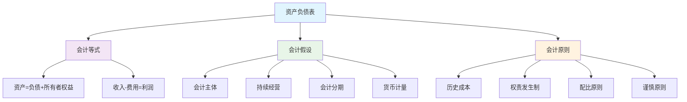
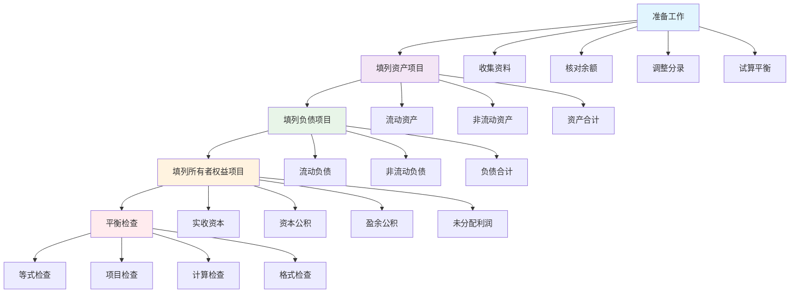

# 资产负债表编制

## 资产负债表概述

### 📖 基本定义
**资产负债表**是反映企业在某一特定日期财务状况的财务报表，它列示了企业在特定时点的资产、负债和所有者权益的构成情况。

### 🔍 报表特点
- **时点报表**：反映特定时点的财务状况
- **静态报表**：反映静态的财务状况
- **平衡报表**：资产 = 负债 + 所有者权益
- **分类报表**：按流动性分类列示

## 资产负债表的理论基础

### 🏗️ 理论基础

#### 1. 会计等式
- **基本等式**：资产 = 负债 + 所有者权益
- **扩展等式**：资产 = 负债 + 所有者权益 + 收入 - 费用
- **综合等式**：资产 = 负债 + 所有者权益 + 利润

#### 2. 会计假设
- **会计主体假设**：明确会计主体
- **持续经营假设**：假设持续经营
- **会计分期假设**：按会计期间分期
- **货币计量假设**：以货币计量

#### 3. 会计原则
- **历史成本原则**：按历史成本计量
- **权责发生制原则**：按权责发生制确认
- **配比原则**：收入与费用配比
- **谨慎性原则**：谨慎处理不确定性

### 📊 理论基础图解



## 资产负债表的格式

### 📋 报表格式

#### 1. 账户式格式
**特点**：
- 左右对称排列
- 左边列示资产
- 右边列示负债和所有者权益
- 符合会计等式

**格式**：
```
资产负债表（账户式）
资产                    负债和所有者权益
流动资产                流动负债
非流动资产              非流动负债
                        所有者权益
资产合计                负债和所有者权益合计
```

#### 2. 报告式格式
**特点**：
- 上下垂直排列
- 先列示资产
- 再列示负债
- 最后列示所有者权益

**格式**：
```
资产负债表（报告式）
资产
流动资产
非流动资产
资产合计

负债
流动负债
非流动负债
负债合计

所有者权益
所有者权益合计

负债和所有者权益合计
```

### 📊 格式对比表

| 格式类型 | 排列方式 | 特点 | 优点 | 缺点 |
|----------|----------|------|------|------|
| 账户式 | 左右对称 | 符合会计等式 | 直观明了 | 版面较宽 |
| 报告式 | 上下垂直 | 便于阅读 | 版面较窄 | 不够直观 |

## 资产负债表的项目分类

### 📋 资产项目分类

#### 1. 流动资产
**定义**：预计在一年内或一个营业周期内变现或耗用的资产

**主要项目**：
- 货币资金（库存现金、银行存款、其他货币资金）
- 交易性金融资产
- 应收票据
- 应收账款
- 预付账款
- 其他应收款
- 存货
- 一年内到期的非流动资产

**特点**：
- 流动性强
- 变现能力强
- 周转速度快
- 风险相对较小

#### 2. 非流动资产
**定义**：除流动资产以外的资产

**主要项目**：
- 长期股权投资
- 固定资产
- 在建工程
- 无形资产
- 长期待摊费用
- 递延所得税资产
- 其他非流动资产

**特点**：
- 流动性弱
- 变现能力弱
- 周转速度慢
- 风险相对较大

### 📋 负债项目分类

#### 1. 流动负债
**定义**：预计在一年内或一个营业周期内偿还的负债

**主要项目**：
- 短期借款
- 交易性金融负债
- 应付票据
- 应付账款
- 预收账款
- 应付职工薪酬
- 应交税费
- 其他应付款
- 一年内到期的非流动负债

**特点**：
- 偿还期限短
- 偿还压力大
- 流动性强
- 风险相对较大

#### 2. 非流动负债
**定义**：除流动负债以外的负债

**主要项目**：
- 长期借款
- 应付债券
- 长期应付款
- 专项应付款
- 预计负债
- 递延所得税负债
- 其他非流动负债

**特点**：
- 偿还期限长
- 偿还压力小
- 流动性弱
- 风险相对较小

### 📋 所有者权益项目分类

#### 1. 实收资本
**定义**：投资者实际投入的资本

**特点**：
- 永久性资本
- 不得随意抽回
- 享有剩余索取权
- 承担经营风险

#### 2. 资本公积
**定义**：企业收到投资者出资额超过其在注册资本中所占份额的部分

**特点**：
- 非经营形成
- 不得随意分配
- 可以转增资本
- 不承担经营风险

#### 3. 盈余公积
**定义**：企业从净利润中提取的积累资金

**特点**：
- 经营形成
- 可以转增资本
- 可以弥补亏损
- 承担经营风险

#### 4. 未分配利润
**定义**：企业留待以后年度分配的利润

**特点**：
- 经营形成
- 可以分配
- 可以转增资本
- 承担经营风险

## 资产负债表的编制方法

### 🔧 编制方法

#### 1. 直接填列法
**定义**：根据总账账户余额直接填列

**适用项目**：
- 货币资金
- 短期借款
- 应付票据
- 应付职工薪酬
- 应交税费
- 实收资本
- 资本公积

**编制步骤**：
1. 确定总账账户余额
2. 直接填入报表项目
3. 检查填列是否正确
4. 验证平衡关系

#### 2. 分析填列法
**定义**：根据总账账户余额分析填列

**适用项目**：
- 应收账款
- 预付账款
- 应付账款
- 预收账款
- 存货
- 固定资产

**编制步骤**：
1. 分析总账账户余额
2. 确定填列金额
3. 填入报表项目
4. 检查填列是否正确

#### 3. 计算填列法
**定义**：根据总账账户余额计算填列

**适用项目**：
- 货币资金
- 存货
- 固定资产净值
- 未分配利润

**编制步骤**：
1. 收集相关账户余额
2. 计算填列金额
3. 填入报表项目
4. 检查计算结果

### 📊 编制方法对比表

| 编制方法 | 适用项目 | 编制特点 | 优点 | 缺点 |
|----------|----------|----------|------|------|
| 直接填列法 | 简单项目 | 直接填列 | 简单快捷 | 适用范围有限 |
| 分析填列法 | 复杂项目 | 分析填列 | 准确可靠 | 工作量大 |
| 计算填列法 | 计算项目 | 计算填列 | 准确可靠 | 计算复杂 |

## 资产负债表的编制步骤

### 📋 编制步骤

#### 1. 准备工作
- **收集资料**：收集总账和明细账资料
- **核对余额**：核对账户余额
- **调整分录**：编制期末调整分录
- **试算平衡**：进行试算平衡

#### 2. 填列资产项目
- **流动资产**：填列流动资产项目
- **非流动资产**：填列非流动资产项目
- **资产合计**：计算资产合计
- **检查核对**：检查资产项目填列

#### 3. 填列负债项目
- **流动负债**：填列流动负债项目
- **非流动负债**：填列非流动负债项目
- **负债合计**：计算负债合计
- **检查核对**：检查负债项目填列

#### 4. 填列所有者权益项目
- **实收资本**：填列实收资本
- **资本公积**：填列资本公积
- **盈余公积**：填列盈余公积
- **未分配利润**：填列未分配利润
- **所有者权益合计**：计算所有者权益合计

#### 5. 平衡检查
- **等式检查**：检查资产 = 负债 + 所有者权益
- **项目检查**：检查各项目填列
- **计算检查**：检查计算结果
- **格式检查**：检查报表格式

### 📊 编制步骤图解



## 资产负债表的分析应用

### 📊 分析应用

#### 1. 结构分析
**定义**：分析资产负债表的构成结构

**分析内容**：
- 资产结构分析
- 负债结构分析
- 所有者权益结构分析
- 资本结构分析

**分析指标**：
- 流动资产比率
- 固定资产比率
- 流动负债比率
- 长期负债比率

#### 2. 比率分析
**定义**：计算相关财务比率进行分析

**分析内容**：
- 偿债能力分析
- 营运能力分析
- 盈利能力分析
- 发展能力分析

**分析指标**：
- 流动比率
- 速动比率
- 资产负债率
- 权益乘数

#### 3. 趋势分析
**定义**：分析资产负债表项目的变动趋势

**分析内容**：
- 资产变动趋势
- 负债变动趋势
- 所有者权益变动趋势
- 整体变动趋势

**分析方法**：
- 环比分析
- 同比分析
- 定基分析
- 趋势预测

### 📊 分析应用表

| 分析类型 | 分析内容 | 分析指标 | 分析目的 | 分析意义 |
|----------|----------|----------|----------|----------|
| 结构分析 | 构成结构 | 各种比率 | 了解结构 | 优化结构 |
| 比率分析 | 财务比率 | 财务指标 | 评价能力 | 提高能力 |
| 趋势分析 | 变动趋势 | 变动幅度 | 预测趋势 | 把握趋势 |

## 资产负债表的注意事项

### ⚠️ 注意事项

#### 1. 填列准确性
- **金额准确**：确保填列金额准确
- **项目正确**：确保项目填列正确
- **分类正确**：确保分类正确
- **计算正确**：确保计算正确

#### 2. 完整性要求
- **项目完整**：确保项目填列完整
- **资料完整**：确保资料收集完整
- **信息完整**：确保信息反映完整
- **披露完整**：确保披露完整

#### 3. 及时性要求
- **编制及时**：确保编制及时
- **报送及时**：确保报送及时
- **披露及时**：确保披露及时
- **更新及时**：确保更新及时

#### 4. 规范性要求
- **格式规范**：确保格式规范
- **内容规范**：确保内容规范
- **披露规范**：确保披露规范
- **审核规范**：确保审核规范

### 📋 注意事项说明

#### 1. 填列准确性注意事项
- **金额核对**：必须核对填列金额
- **项目核对**：必须核对填列项目
- **分类核对**：必须核对项目分类
- **计算核对**：必须核对计算结果

#### 2. 完整性要求注意事项
- **项目检查**：必须检查所有项目
- **资料检查**：必须检查所有资料
- **信息检查**：必须检查所有信息
- **披露检查**：必须检查所有披露

## 费曼学习法应用

### 🎯 学习目标
**能够准确理解和运用资产负债表编制**

### 📝 学习步骤
1. **选择概念**：资产负债表的定义、格式和编制
2. **简化解释**：用简单语言解释资产负债表
3. **识别盲区**：发现不理解的地方
4. **重新学习**：回到源头重新理解

### 💡 记忆技巧
- **基本等式**：资产 = 负债 + 所有者权益
- **项目分类**：流动资产、非流动资产、流动负债、非流动负债
- **编制方法**：直接填列、分析填列、计算填列

## 刻意练习要点

### 🎯 练习重点
1. **报表理解**：理解资产负债表的原理和格式
2. **项目填列**：掌握各项目的填列方法
3. **编制步骤**：掌握完整的编制步骤
4. **分析应用**：掌握报表的分析应用

### 📊 练习方法
1. **报表练习**：练习资产负债表编制
2. **项目练习**：练习各项目填列
3. **步骤练习**：练习编制步骤
4. **分析练习**：练习报表分析

## 相关链接
- [[02-利润表编制]] - 利润表编制
- [[03-现金流量表编制]] - 现金流量表编制
- [[04-所有者权益变动表编制]] - 所有者权益变动表编制
- [[02-理解掌握层/会计核算基础/01-会计核算程序]] - 会计核算程序
- [[02-理解掌握层/会计核算基础/02-会计循环过程]] - 会计循环过程
