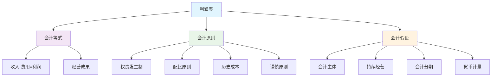
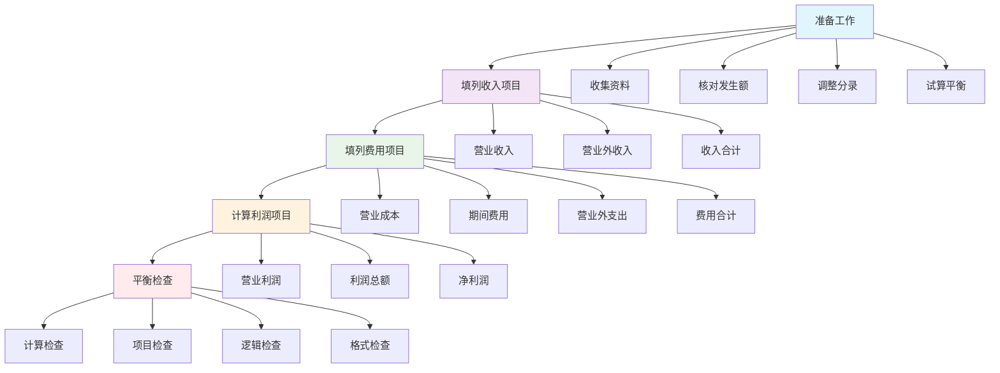

# 利润表编制

## 利润表概述

### 📖 基本定义
**利润表**是反映企业在一定会计期间经营成果的财务报表，它列示了企业在该期间内的收入、费用和利润的构成情况。

### 🔍 报表特点
- **期间报表**：反映特定期间的经营成果
- **动态报表**：反映动态的经营成果
- **成果报表**：反映经营成果
- **分类报表**：按功能分类列示

## 利润表的理论基础

### 🏗️ 理论基础

#### 1. 会计等式
- **基本等式**：收入 - 费用 = 利润
- **扩展等式**：收入 - 费用 = 利润
- **综合等式**：收入 - 费用 = 利润

#### 2. 会计原则
- **权责发生制原则**：按权责发生制确认
- **配比原则**：收入与费用配比
- **历史成本原则**：按历史成本计量
- **谨慎性原则**：谨慎处理不确定性

#### 3. 会计假设
- **会计主体假设**：明确会计主体
- **持续经营假设**：假设持续经营
- **会计分期假设**：按会计期间分期
- **货币计量假设**：以货币计量

### 📊 理论基础图解



## 利润表的格式

### 📋 报表格式

#### 1. 单步式格式
**特点**：
- 一步计算利润
- 收入总额 - 费用总额 = 利润
- 格式简单
- 信息不够详细

**格式**：
```
利润表（单步式）
收入
主营业务收入
其他业务收入
营业外收入
收入合计

费用
主营业务成本
其他业务成本
营业税金及附加
销售费用
管理费用
财务费用
营业外支出
费用合计

利润
利润总额
```

#### 2. 多步式格式
**特点**：
- 分步计算利润
- 提供详细信息
- 格式复杂
- 信息详细

**格式**：
```
利润表（多步式）
一、营业收入
减：营业成本
减：营业税金及附加
减：销售费用
减：管理费用
减：财务费用
减：资产减值损失
加：公允价值变动收益
加：投资收益
二、营业利润
加：营业外收入
减：营业外支出
三、利润总额
减：所得税费用
四、净利润
```

### 📊 格式对比表

| 格式类型 | 计算方式 | 特点 | 优点 | 缺点 |
|----------|----------|------|------|------|
| 单步式 | 一步计算 | 简单明了 | 格式简单 | 信息不够详细 |
| 多步式 | 分步计算 | 详细完整 | 信息详细 | 格式复杂 |

## 利润表的项目分类

### 📋 收入项目分类

#### 1. 营业收入
**定义**：企业在日常经营活动中取得的收入

**主要项目**：
- 主营业务收入
- 其他业务收入

**特点**：
- 日常经营活动产生
- 经常性收入
- 主要收入来源
- 可持续性强

#### 2. 营业外收入
**定义**：企业在非日常经营活动中取得的收入

**主要项目**：
- 处置固定资产净收益
- 处置无形资产净收益
- 政府补助
- 捐赠收入

**特点**：
- 非日常经营活动产生
- 偶发性收入
- 非主要收入来源
- 可持续性弱

### 📋 费用项目分类

#### 1. 营业成本
**定义**：企业在日常经营活动中发生的成本

**主要项目**：
- 主营业务成本
- 其他业务成本

**特点**：
- 日常经营活动产生
- 经常性费用
- 主要费用来源
- 与收入配比

#### 2. 期间费用
**定义**：企业在经营期间发生的不能直接归属于特定产品的费用

**主要项目**：
- 销售费用
- 管理费用
- 财务费用

**特点**：
- 期间性费用
- 不能直接归属
- 需要分摊
- 影响当期损益

#### 3. 营业外支出
**定义**：企业在非日常经营活动中发生的支出

**主要项目**：
- 处置固定资产净损失
- 处置无形资产净损失
- 捐赠支出
- 罚款支出

**特点**：
- 非日常经营活动产生
- 偶发性支出
- 非主要支出来源
- 不影响正常经营

### 📋 利润项目分类

#### 1. 营业利润
**定义**：企业日常经营活动产生的利润

**计算公式**：营业利润 = 营业收入 - 营业成本 - 营业税金及附加 - 销售费用 - 管理费用 - 财务费用 - 资产减值损失 + 公允价值变动收益 + 投资收益

**特点**：
- 日常经营活动产生
- 反映经营能力
- 可持续性强
- 主要利润来源

#### 2. 利润总额
**定义**：企业在一定期间内实现的全部利润

**计算公式**：利润总额 = 营业利润 + 营业外收入 - 营业外支出

**特点**：
- 全部经营活动产生
- 反映综合能力
- 包含非经常性项目
- 影响所得税

#### 3. 净利润
**定义**：企业在一定期间内实现的最终利润

**计算公式**：净利润 = 利润总额 - 所得税费用

**特点**：
- 最终经营成果
- 可供分配利润
- 影响所有者权益
- 反映盈利能力

## 利润表的编制方法

### 🔧 编制方法

#### 1. 直接填列法
**定义**：根据总账账户发生额直接填列

**适用项目**：
- 主营业务收入
- 主营业务成本
- 销售费用
- 管理费用
- 财务费用
- 营业外收入
- 营业外支出

**编制步骤**：
1. 确定总账账户发生额
2. 直接填入报表项目
3. 检查填列是否正确
4. 验证计算结果

#### 2. 分析填列法
**定义**：根据总账账户发生额分析填列

**适用项目**：
- 营业收入
- 营业成本
- 营业税金及附加
- 资产减值损失
- 公允价值变动收益
- 投资收益

**编制步骤**：
1. 分析总账账户发生额
2. 确定填列金额
3. 填入报表项目
4. 检查填列是否正确

#### 3. 计算填列法
**定义**：根据相关项目计算填列

**适用项目**：
- 营业利润
- 利润总额
- 净利润

**编制步骤**：
1. 收集相关项目金额
2. 计算填列金额
3. 填入报表项目
4. 检查计算结果

### 📊 编制方法对比表

| 编制方法 | 适用项目 | 编制特点 | 优点 | 缺点 |
|----------|----------|----------|------|------|
| 直接填列法 | 简单项目 | 直接填列 | 简单快捷 | 适用范围有限 |
| 分析填列法 | 复杂项目 | 分析填列 | 准确可靠 | 工作量大 |
| 计算填列法 | 计算项目 | 计算填列 | 准确可靠 | 计算复杂 |

## 利润表的编制步骤

### 📋 编制步骤

#### 1. 准备工作
- **收集资料**：收集总账和明细账资料
- **核对发生额**：核对账户发生额
- **调整分录**：编制期末调整分录
- **试算平衡**：进行试算平衡

#### 2. 填列收入项目
- **营业收入**：填列营业收入项目
- **营业外收入**：填列营业外收入项目
- **收入合计**：计算收入合计
- **检查核对**：检查收入项目填列

#### 3. 填列费用项目
- **营业成本**：填列营业成本项目
- **期间费用**：填列期间费用项目
- **营业外支出**：填列营业外支出项目
- **费用合计**：计算费用合计

#### 4. 计算利润项目
- **营业利润**：计算营业利润
- **利润总额**：计算利润总额
- **净利润**：计算净利润
- **检查核对**：检查利润项目计算

#### 5. 平衡检查
- **计算检查**：检查计算结果
- **项目检查**：检查各项目填列
- **逻辑检查**：检查逻辑关系
- **格式检查**：检查报表格式

### 📊 编制步骤图解



## 利润表的分析应用

### 📊 分析应用

#### 1. 结构分析
**定义**：分析利润表的构成结构

**分析内容**：
- 收入结构分析
- 费用结构分析
- 利润结构分析
- 成本结构分析

**分析指标**：
- 主营业务收入比率
- 期间费用比率
- 营业利润比率
- 净利润比率

#### 2. 比率分析
**定义**：计算相关财务比率进行分析

**分析内容**：
- 盈利能力分析
- 营运能力分析
- 偿债能力分析
- 发展能力分析

**分析指标**：
- 销售毛利率
- 销售净利率
- 总资产收益率
- 净资产收益率

#### 3. 趋势分析
**定义**：分析利润表项目的变动趋势

**分析内容**：
- 收入变动趋势
- 费用变动趋势
- 利润变动趋势
- 整体变动趋势

**分析方法**：
- 环比分析
- 同比分析
- 定基分析
- 趋势预测

### 📊 分析应用表

| 分析类型 | 分析内容 | 分析指标 | 分析目的 | 分析意义 |
|----------|----------|----------|----------|----------|
| 结构分析 | 构成结构 | 各种比率 | 了解结构 | 优化结构 |
| 比率分析 | 财务比率 | 财务指标 | 评价能力 | 提高能力 |
| 趋势分析 | 变动趋势 | 变动幅度 | 预测趋势 | 把握趋势 |

## 利润表的注意事项

### ⚠️ 注意事项

#### 1. 填列准确性
- **金额准确**：确保填列金额准确
- **项目正确**：确保项目填列正确
- **分类正确**：确保分类正确
- **计算正确**：确保计算正确

#### 2. 完整性要求
- **项目完整**：确保项目填列完整
- **资料完整**：确保资料收集完整
- **信息完整**：确保信息反映完整
- **披露完整**：确保披露完整

#### 3. 及时性要求
- **编制及时**：确保编制及时
- **报送及时**：确保报送及时
- **披露及时**：确保披露及时
- **更新及时**：确保更新及时

#### 4. 规范性要求
- **格式规范**：确保格式规范
- **内容规范**：确保内容规范
- **披露规范**：确保披露规范
- **审核规范**：确保审核规范

### 📋 注意事项说明

#### 1. 填列准确性注意事项
- **金额核对**：必须核对填列金额
- **项目核对**：必须核对填列项目
- **分类核对**：必须核对项目分类
- **计算核对**：必须核对计算结果

#### 2. 完整性要求注意事项
- **项目检查**：必须检查所有项目
- **资料检查**：必须检查所有资料
- **信息检查**：必须检查所有信息
- **披露检查**：必须检查所有披露

## 费曼学习法应用

### 🎯 学习目标
**能够准确理解和运用利润表编制**

### 📝 学习步骤
1. **选择概念**：利润表的定义、格式和编制
2. **简化解释**：用简单语言解释利润表
3. **识别盲区**：发现不理解的地方
4. **重新学习**：回到源头重新理解

### 💡 记忆技巧
- **基本等式**：收入 - 费用 = 利润
- **项目分类**：营业收入、营业成本、期间费用、营业外收支
- **编制方法**：直接填列、分析填列、计算填列

## 刻意练习要点

### 🎯 练习重点
1. **报表理解**：理解利润表的原理和格式
2. **项目填列**：掌握各项目的填列方法
3. **编制步骤**：掌握完整的编制步骤
4. **分析应用**：掌握报表的分析应用

### 📊 练习方法
1. **报表练习**：练习利润表编制
2. **项目练习**：练习各项目填列
3. **步骤练习**：练习编制步骤
4. **分析练习**：练习报表分析

## 相关链接
- [[01-资产负债表编制]] - 资产负债表编制
- [[03-现金流量表编制]] - 现金流量表编制
- [[04-所有者权益变动表编制]] - 所有者权益变动表编制
- [[02-理解掌握层/会计核算基础/01-会计核算程序]] - 会计核算程序
- [[02-理解掌握层/会计核算基础/02-会计循环过程]] - 会计循环过程
