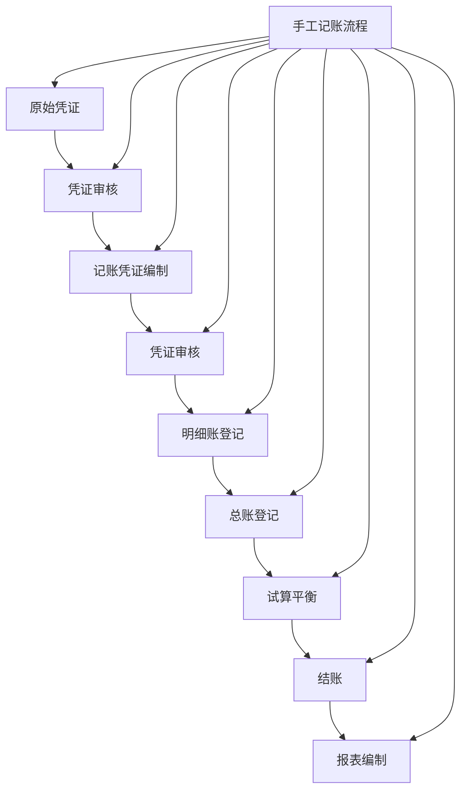

# 手工记账实务

## 手工记账概述

### 📖 基本定义
**手工记账**是指会计人员使用纸质账簿和手工方法进行会计核算的过程，是传统会计工作的基础。

### 🔍 记账特点
- **传统方法**：传统的记账方法
- **基础技能**：会计人员的基础技能
- **规范操作**：需要规范的操作流程
- **质量要求**：对记账质量有严格要求

### 🎯 记账作用
1. **基础工作**：会计工作的基础
- **技能培养**：培养会计人员基本技能
- **质量保证**：保证会计信息质量
- **规范管理**：规范会计管理

## 手工记账的基本要求

### 📋 基本要求

#### 1. 准确性要求
- **数据准确**：记账数据必须准确
- **计算准确**：计算过程必须准确
- **分类准确**：账户分类必须准确
- **方向准确**：借贷方向必须准确

#### 2. 完整性要求
- **内容完整**：记账内容必须完整
- **手续完整**：记账手续必须完整
- **依据完整**：记账依据必须完整
- **记录完整**：记账记录必须完整

#### 3. 及时性要求
- **及时记账**：及时进行记账
- **及时结账**：及时进行结账
- **及时对账**：及时进行对账
- **及时报告**：及时进行报告

#### 4. 规范性要求
- **格式规范**：记账格式必须规范
- **字迹规范**：字迹必须规范清晰
- **方法规范**：记账方法必须规范
- **程序规范**：记账程序必须规范

### 🎯 记账原则

#### 1. 客观性原则
- **真实记录**：真实记录经济业务
- **客观反映**：客观反映财务状况
- **避免主观**：避免主观臆断
- **依据充分**：依据充分可靠

#### 2. 一致性原则
- **方法一致**：记账方法保持一致
- **标准统一**：记账标准统一
- **政策稳定**：会计政策稳定
- **可比性强**：信息可比性强

#### 3. 重要性原则
- **重要事项**：重要事项详细记录
- **一般事项**：一般事项简化记录
- **区分主次**：区分主要和次要
- **突出重点**：突出重点事项

#### 4. 谨慎性原则
- **谨慎处理**：谨慎处理不确定事项
- **充分估计**：充分估计可能损失
- **避免高估**：避免高估资产和收入
- **避免低估**：避免低估负债和费用

## 手工记账的基本流程

### 🔄 记账流程

#### 1. 原始凭证审核
- **凭证完整性**：检查凭证是否完整
- **凭证真实性**：检查凭证是否真实
- **凭证合法性**：检查凭证是否合法
- **凭证准确性**：检查凭证是否准确

#### 2. 记账凭证编制
- **业务分析**：分析经济业务
- **账户确定**：确定涉及的账户
- **方向判断**：判断借贷方向
- **金额确定**：确定借贷金额

#### 3. 记账凭证审核
- **内容审核**：审核凭证内容
- **分录审核**：审核会计分录
- **金额审核**：审核借贷金额
- **签字确认**：签字确认

#### 4. 账簿登记
- **明细账登记**：登记明细账
- **总账登记**：登记总账
- **余额计算**：计算账户余额
- **核对检查**：核对检查登记

#### 5. 试算平衡
- **试算编制**：编制试算平衡表
- **平衡检查**：检查借贷平衡
- **错误查找**：查找记账错误
- **错误纠正**：纠正记账错误

### 📊 流程图



## 手工记账的具体操作

### 📝 记账凭证编制

#### 1. 凭证格式
```
记账凭证
日期：2024年1月15日    凭证号：记-001

摘要：销售商品
┌─────────────────────────────────────┐
│ 会计科目    │ 借方金额 │ 贷方金额 │
├─────────────────────────────────────┤
│ 应收账款    │ 100,000  │          │
│ 主营业务收入 │          │ 100,000  │
│ 主营业务成本 │ 60,000   │          │
│ 库存商品    │          │ 60,000   │
├─────────────────────────────────────┤
│ 合计        │ 160,000  │ 160,000  │
└─────────────────────────────────────┘

制单：张三    审核：李四    记账：王五
```

#### 2. 编制要求
- **摘要清楚**：摘要内容清楚明了
- **科目正确**：使用正确的会计科目
- **方向正确**：借贷方向正确
- **金额准确**：借贷金额准确

#### 3. 编制步骤
1. **分析业务**：分析经济业务
2. **确定账户**：确定涉及的账户
3. **判断方向**：判断借贷方向
4. **确定金额**：确定借贷金额
5. **编制分录**：编制会计分录
6. **填写凭证**：填写记账凭证

### 📚 账簿登记

#### 1. 明细账登记
```
应收账款明细账
账户：应收账款

日期    凭证号    摘要        借方金额    贷方金额    余额
1月1日  期初余额                             100,000
1月15日 记-001   销售商品    100,000             200,000
1月20日 记-005   收回货款             80,000     120,000
1月25日 记-008   销售商品    50,000              170,000
1月31日 本期合计 150,000     80,000     170,000
```

#### 2. 总账登记
```
总账
账户：应收账款

日期    凭证号    摘要        借方金额    贷方金额    余额
1月1日  期初余额                             100,000
1月15日 记-001   销售商品    100,000             200,000
1月20日 记-005   收回货款             80,000     120,000
1月25日 记-008   销售商品    50,000              170,000
1月31日 本期合计 150,000     80,000     170,000
```

#### 3. 登记要求
- **逐笔登记**：逐笔登记经济业务
- **及时登记**：及时登记经济业务
- **准确登记**：准确登记经济业务
- **完整登记**：完整登记经济业务

### ⚖️ 试算平衡

#### 1. 试算平衡表
```
试算平衡表
2024年1月31日

账户名称        期初余额    本期发生额    期末余额
                借方  贷方  借方    贷方  借方  贷方
库存现金        10,000      5,000   3,000  12,000
银行存款        100,000     200,000 150,000 150,000
应收账款        100,000     150,000 80,000  170,000
库存商品        50,000      60,000  60,000  50,000
固定资产        200,000     50,000  0       250,000
短期借款                20,000 30,000 50,000     50,000
应付账款                30,000 40,000 60,000     50,000
实收资本                0       0       100,000     100,000
主营业务收入            0       0       100,000     100,000
主营业务成本            0       60,000  0           60,000
管理费用        0           20,000  0           20,000
合计           460,000 460,000 585,000 585,000 712,000 300,000
```

#### 2. 平衡检查
- **期初余额平衡**：期初借方余额合计 = 期初贷方余额合计
- **发生额平衡**：本期借方发生额合计 = 本期贷方发生额合计
- **期末余额平衡**：期末借方余额合计 = 期末贷方余额合计

## 手工记账的注意事项

### ⚠️ 注意事项

#### 1. 字迹要求
- **字迹清晰**：字迹必须清晰
- **书写规范**：书写必须规范
- **避免涂改**：避免随意涂改
- **使用墨水**：使用蓝黑墨水或碳素墨水

#### 2. 格式要求
- **格式统一**：格式必须统一
- **项目完整**：项目必须完整
- **排列整齐**：排列必须整齐
- **美观大方**：美观大方

#### 3. 数据要求
- **数据准确**：数据必须准确
- **计算正确**：计算必须正确
- **核对一致**：核对必须一致
- **及时更新**：及时更新数据

#### 4. 程序要求
- **程序规范**：程序必须规范
- **步骤完整**：步骤必须完整
- **顺序正确**：顺序必须正确
- **检查到位**：检查必须到位

### 🔧 常见问题

#### 1. 记账错误
- **问题表现**：记账数据错误
- **问题原因**：粗心大意、计算错误
- **解决方法**：划线更正、红字更正
- **预防措施**：仔细核对、认真计算

#### 2. 格式不规范
- **问题表现**：格式不规范
- **问题原因**：不熟悉格式要求
- **解决方法**：使用标准格式
- **预防措施**：学习格式要求

#### 3. 字迹不清
- **问题表现**：字迹不清
- **问题原因**：书写不规范
- **解决方法**：重新书写
- **预防措施**：规范书写

#### 4. 程序错误
- **问题表现**：程序错误
- **问题原因**：不熟悉程序
- **解决方法**：按正确程序操作
- **预防措施**：熟悉操作程序

## 手工记账的技能要求

### 🎯 基本技能

#### 1. 书写技能
- **字迹工整**：字迹工整清晰
- **书写速度**：书写速度适中
- **格式规范**：格式规范统一
- **美观大方**：美观大方

#### 2. 计算技能
- **计算准确**：计算准确无误
- **计算速度**：计算速度适中
- **计算方法**：掌握计算方法
- **计算工具**：熟练使用计算工具

#### 3. 分析技能
- **业务分析**：能够分析经济业务
- **账户分析**：能够分析账户性质
- **关系分析**：能够分析账户关系
- **逻辑分析**：能够进行逻辑分析

#### 4. 操作技能
- **操作熟练**：操作熟练规范
- **程序掌握**：掌握操作程序
- **工具使用**：熟练使用工具
- **问题处理**：能够处理问题

### 📚 专业知识

#### 1. 会计理论
- **会计原理**：掌握会计基本原理
- **会计方法**：掌握会计方法
- **会计制度**：熟悉会计制度
- **会计准则**：熟悉会计准则

#### 2. 会计实务
- **实务操作**：掌握实务操作
- **业务处理**：能够处理业务
- **问题解决**：能够解决问题
- **经验积累**：积累实践经验

#### 3. 相关法规
- **会计法规**：熟悉会计法规
- **税法规定**：了解税法规定
- **公司法规定**：了解公司法规定
- **其他法规**：了解其他相关法规

## 手工记账的发展趋势

### 🚀 发展趋势

#### 1. 电算化趋势
- **电算化普及**：电算化系统普及
- **手工记账减少**：手工记账逐渐减少
- **技能要求变化**：技能要求发生变化
- **工作方式改变**：工作方式发生改变

#### 2. 专业化趋势
- **专业分工**：专业分工更加细化
- **技能要求**：技能要求不断提高
- **职业发展**：职业发展更加规范
- **继续教育**：继续教育更加重要

#### 3. 标准化趋势
- **标准统一**：标准更加统一
- **规范操作**：操作更加规范
- **质量要求**：质量要求更高
- **管理严格**：管理更加严格

#### 4. 综合化趋势
- **综合技能**：需要综合技能
- **跨领域知识**：需要跨领域知识
- **创新能力**：需要创新能力
- **学习能力**：需要学习能力

## 费曼学习法应用

### 🎯 学习目标
**能够掌握手工记账实务**

### 📝 学习步骤
1. **选择概念**：手工记账的定义、要求和流程
2. **简化解释**：用简单语言解释手工记账
3. **识别盲区**：发现不理解的地方
4. **重新学习**：回到源头重新理解

### 💡 记忆技巧
- **基本要求**：准确性、完整性、及时性、规范性
- **记账流程**：凭证审核、凭证编制、凭证审核、账簿登记、试算平衡
- **技能要求**：书写技能、计算技能、分析技能、操作技能
- **注意事项**：字迹要求、格式要求、数据要求、程序要求

## 刻意练习要点

### 🎯 练习重点
1. **基本技能**：掌握基本技能
2. **操作流程**：掌握操作流程
3. **注意事项**：掌握注意事项
4. **问题处理**：掌握问题处理方法

### 📊 练习方法
1. **技能练习**：练习基本技能
2. **流程练习**：练习操作流程
3. **注意事项练习**：练习注意事项
4. **问题处理练习**：练习问题处理

## 相关链接
- [[02-电算化操作指南]] - 电算化操作指南
- [[03-纳税申报实务]] - 纳税申报实务
- [[04-审计配合实务]] - 审计配合实务
- [[01-基础认知层/会计科目与账户/03-借贷记账法]] - 借贷记账法
- [[02-理解掌握层/会计核算基础/02-会计循环过程]] - 会计循环过程

