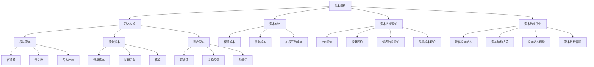

# 资本结构

## 🎯 学习目标
掌握资本结构理论，学会优化企业资本结构，平衡财务风险和收益，实现企业价值最大化。

## 📊 资本结构框架

### 资本结构模型

## 💰 资本构成

### 权益资本
**普通股**：
- **特征**：无固定股息，有投票权
- **成本**：股东期望收益率
- **风险**：承担经营风险
- **收益**：剩余收益分配

**优先股**：
- **特征**：固定股息，无投票权
- **成本**：优先股股息率
- **风险**：介于债务和普通股之间
- **收益**：固定股息收益

**留存收益**：
- **特征**：内部融资，无发行成本
- **成本**：机会成本
- **风险**：与普通股相同
- **收益**：再投资收益

**权益资本特点**：
- **永久性**：无到期日
- **风险性**：承担经营风险
- **收益性**：参与剩余收益分配
- **控制性**：拥有企业控制权

### 债务资本
**短期债务**：
- **特征**：期限短，利率相对较低
- **成本**：短期利率
- **风险**：流动性风险
- **用途**：营运资金需求

**长期债务**：
- **特征**：期限长，利率相对较高
- **成本**：长期利率
- **风险**：利率风险
- **用途**：长期投资需求

**债券**：
- **特征**：标准化债务工具
- **成本**：债券收益率
- **风险**：信用风险
- **用途**：大额融资需求

**债务资本特点**：
- **固定性**：固定利息支付
- **优先性**：优先于权益资本
- **有限性**：有到期日
- **抵税性**：利息可抵税

### 混合资本
**可转债**：
- **特征**：可转换为普通股
- **成本**：介于债务和权益之间
- **风险**：转换风险
- **收益**：固定利息+转换价值

**认股权证**：
- **特征**：购买普通股的权利
- **成本**：权证价值
- **风险**：行权风险
- **收益**：行权收益

**永续债**：
- **特征**：无到期日
- **成本**：永续债收益率
- **风险**：永续风险
- **收益**：永续利息

**混合资本特点**：
- **灵活性**：兼具债务和权益特征
- **复杂性**：结构相对复杂
- **创新性**：金融创新产品
- **适应性**：适应不同需求

## 💸 资本成本

### 权益成本
**股利折现模型**：
- **基本公式**：Ke = D1/P0 + g
- **适用条件**：稳定增长企业
- **影响因素**：股利、股价、增长率
- **局限性**：假设条件严格

**资本资产定价模型**：
- **基本公式**：Ke = Rf + β(Rm - Rf)
- **适用条件**：市场有效
- **影响因素**：无风险利率、市场风险溢价、β系数
- **局限性**：市场假设

**风险溢价法**：
- **基本公式**：Ke = Rf + RP
- **适用条件**：非上市公司
- **影响因素**：无风险利率、风险溢价
- **局限性**：主观性强

### 债务成本
**税前债务成本**：
- **基本公式**：Kd = I/P
- **影响因素**：利息、本金
- **计算方法**：到期收益率法
- **应用场景**：债券定价

**税后债务成本**：
- **基本公式**：Kd(1-T) = Kd × (1-T)
- **影响因素**：税前成本、税率
- **税收效应**：利息抵税效应
- **实际成本**：考虑税收后的成本

**债务成本特点**：
- **相对较低**：通常低于权益成本
- **固定性**：相对固定
- **抵税性**：利息可抵税
- **风险性**：存在违约风险

### 加权平均成本
**计算公式**：
- **基本公式**：WACC = We×Ke + Wd×Kd(1-T)
- **权重计算**：市场价值权重
- **成本计算**：各资本成本
- **税率影响**：考虑税率影响

**影响因素**：
- **资本结构**：权益债务比例
- **资本成本**：各资本成本水平
- **税率**：企业所得税率
- **市场条件**：市场环境

**应用场景**：
- **投资决策**：项目评估
- **价值评估**：企业估值
- **资本预算**：资本预算决策
- **绩效评估**：绩效评估

## 📚 资本结构理论

### MM理论
**无税MM理论**：
- **基本假设**：无税、无交易成本、无破产成本
- **命题一**：企业价值与资本结构无关
- **命题二**：权益成本随负债率上升
- **结论**：资本结构不影响企业价值

**有税MM理论**：
- **基本假设**：考虑税收影响
- **命题一**：企业价值随负债增加
- **命题二**：权益成本上升幅度减小
- **结论**：最优资本结构为100%负债

**MM理论局限性**：
- **假设严格**：现实条件不符
- **忽略成本**：忽略破产成本
- **忽略代理**：忽略代理成本
- **忽略信息**：忽略信息不对称

### 权衡理论
**基本思想**：
- **税收收益**：债务的税收收益
- **破产成本**：债务的破产成本
- **最优结构**：平衡收益与成本

**税收收益**：
- **利息抵税**：利息费用抵税
- **税收节约**：减少税收支出
- **价值增加**：增加企业价值
- **边际收益**：边际税收收益

**破产成本**：
- **直接成本**：破产程序成本
- **间接成本**：经营效率损失
- **代理成本**：股东债权人冲突
- **边际成本**：边际破产成本

**最优资本结构**：
- **平衡点**：税收收益=破产成本
- **最优负债率**：最优负债比例
- **价值最大化**：企业价值最大化
- **动态调整**：根据条件调整

### 优序融资理论
**基本思想**：
- **融资顺序**：内部融资→债务融资→权益融资
- **信息不对称**：管理者与投资者信息不对称
- **信号传递**：融资选择传递信号
- **成本考虑**：考虑融资成本

**融资顺序**：
- **内部融资**：留存收益、折旧
- **债务融资**：银行贷款、债券
- **权益融资**：新股发行
- **混合融资**：可转债等

**信号传递**：
- **内部融资**：传递积极信号
- **债务融资**：传递中性信号
- **权益融资**：传递消极信号
- **市场反应**：市场对信号的反应

**实际应用**：
- **融资策略**：制定融资策略
- **时机选择**：选择融资时机
- **方式选择**：选择融资方式
- **成本控制**：控制融资成本

### 代理成本理论
**基本思想**：
- **代理关系**：股东与管理者代理关系
- **代理成本**：代理关系产生的成本
- **资本结构**：影响代理成本
- **最优结构**：最小化代理成本

**代理成本类型**：
- **监督成本**：监督管理者成本
- **约束成本**：约束管理者成本
- **剩余损失**：代理关系损失
- **总代理成本**：所有代理成本

**资本结构影响**：
- **债务约束**：债务约束管理者
- **股权激励**：股权激励管理者
- **控制权**：影响控制权分配
- **代理成本**：影响代理成本水平

**最优资本结构**：
- **成本最小化**：最小化代理成本
- **激励相容**：激励相容机制
- **约束有效**：有效约束机制
- **价值最大化**：企业价值最大化

## ⚖️ 资本结构优化

### 最优资本结构
**最优标准**：
- **价值最大化**：企业价值最大化
- **成本最小化**：资本成本最小化
- **风险可控**：财务风险可控
- **灵活性**：保持财务灵活性

**影响因素**：
- **行业特征**：行业资本结构特征
- **企业规模**：企业规模大小
- **盈利能力**：企业盈利能力
- **成长性**：企业成长性

**确定方法**：
- **理论模型**：基于理论模型
- **行业比较**：与行业比较
- **历史分析**：历史数据分析
- **情景分析**：情景分析

### 资本结构决策
**决策因素**：
- **财务目标**：企业财务目标
- **风险承受**：风险承受能力
- **市场条件**：市场环境条件
- **监管要求**：监管政策要求

**决策方法**：
- **定量分析**：定量分析方法
- **定性分析**：定性分析方法
- **综合分析**：综合分析
- **专家判断**：专家判断

**决策流程**：
- **目标设定**：设定资本结构目标
- **现状分析**：分析现状资本结构
- **方案设计**：设计调整方案
- **方案评估**：评估调整方案
- **方案实施**：实施调整方案

### 资本结构调整
**调整动因**：
- **市场变化**：市场环境变化
- **经营变化**：经营状况变化
- **战略调整**：发展战略调整
- **监管变化**：监管政策变化

**调整方式**：
- **增量调整**：增加资本
- **存量调整**：调整现有资本
- **结构重组**：资本结构重组
- **渐进调整**：渐进式调整

**调整策略**：
- **时机选择**：选择调整时机
- **方式选择**：选择调整方式
- **规模控制**：控制调整规模
- **风险控制**：控制调整风险

### 资本结构管理
**管理原则**：
- **目标导向**：以目标为导向
- **风险控制**：控制财务风险
- **成本优化**：优化资本成本
- **灵活调整**：保持调整灵活性

**管理内容**：
- **结构监控**：监控资本结构
- **成本管理**：管理资本成本
- **风险管理**：管理财务风险
- **绩效评估**：评估管理绩效

**管理工具**：
- **财务模型**：财务分析模型
- **风险模型**：风险评估模型
- **监控系统**：监控信息系统
- **决策支持**：决策支持系统

## 💡 资本结构案例

### 成功案例
**苹果公司**：
- **资本结构**：高现金、低负债
- **优势**：财务灵活性高
- **策略**：现金回购股票
- **效果**：提升股东价值

**微软公司**：
- **资本结构**：适度负债
- **优势**：平衡风险收益
- **策略**：债务融资投资
- **效果**：提高资本效率

**特斯拉**：
- **资本结构**：高负债率
- **优势**：快速扩张
- **策略**：债务融资发展
- **效果**：实现快速增长

### 失败案例
**失败原因**：
- **过度负债**：负债率过高
- **流动性不足**：流动性风险
- **盈利能力差**：盈利能力不足
- **市场变化**：市场环境变化

**失败教训**：
- **风险控制**：控制财务风险
- **流动性管理**：管理流动性
- **盈利能力**：提升盈利能力
- **市场适应**：适应市场变化

## 🧠 学习要点

### 费曼学习法应用
1. **选择概念**：资本结构
2. **简化解释**：用简单语言解释资本结构
3. **识别盲点**：找出理解不足的地方
4. **重新学习**：针对盲点深入学习

### 刻意练习要点
- **理论掌握**：掌握资本结构理论
- **方法应用**：掌握资本成本计算
- **案例分析**：分析成功失败案例
- **实践应用**：实践应用资本结构管理

## 🔗 关联学习

### 前置知识
- [[01-融资渠道]] - 融资渠道
- [[01-财务报表分析]] - 财务报表分析
- [[02-财务比率分析]] - 财务比率分析

### 后续学习
- [[03-股利政策]] - 股利政策
- [[01-投资决策]] - 投资决策
- [[01-估值方法]] - 估值方法

### 实践应用
- 企业资本结构优化
- 资本成本管理
- 财务风险管理
- 企业价值评估

## 🎯 学习检验

### 理解检验
- [ ] 能够理解资本结构理论
- [ ] 能够计算资本成本
- [ ] 能够分析资本结构
- [ ] 能够制定优化策略

### 应用检验
- [ ] 能够分析企业资本结构
- [ ] 能够计算企业资本成本
- [ ] 能够制定资本结构优化方案
- [ ] 能够实施资本结构管理

---
**下一步**：[[03-股利政策]] - 股利政策
