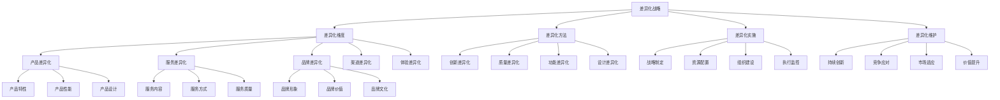

# 差异化战略

## 🎯 学习目标
掌握差异化战略理论，学会创造独特的产品服务，建立竞争优势，实现可持续增长。

## 📊 差异化战略框架

### 差异化战略模型

## 🎨 差异化维度

### 产品差异化
**产品特性**：
- **独特功能**：提供独特的产品功能
- **技术优势**：拥有技术优势
- **材料选择**：使用独特材料
- **工艺技术**：采用独特工艺

**产品性能**：
- **性能指标**：超越竞争对手的性能指标
- **可靠性**：更高的产品可靠性
- **耐用性**：更长的产品寿命
- **效率**：更高的使用效率

**产品设计**：
- **外观设计**：独特的外观设计
- **用户体验**：优秀的用户体验
- **人机交互**：良好的人机交互
- **美学价值**：具有美学价值

**产品案例**：
- **苹果iPhone**：独特的设计和用户体验
- **特斯拉**：电动汽车技术领先
- **戴森**：独特的吸尘器技术

### 服务差异化
**服务内容**：
- **增值服务**：提供增值服务
- **定制服务**：提供定制化服务
- **一站式服务**：提供一站式服务
- **专业服务**：提供专业服务

**服务方式**：
- **服务渠道**：多渠道服务
- **服务时间**：24小时服务
- **服务地点**：上门服务
- **服务方式**：在线服务

**服务质量**：
- **服务标准**：高标准服务
- **服务态度**：优质服务态度
- **服务效率**：高效服务
- **服务创新**：创新服务方式

**服务案例**：
- **海底捞**：优质的服务体验
- **顺丰**：快速可靠的快递服务
- **招商银行**：专业的金融服务

### 品牌差异化
**品牌形象**：
- **品牌定位**：独特的品牌定位
- **品牌个性**：鲜明的品牌个性
- **品牌故事**：感人的品牌故事
- **品牌视觉**：独特的品牌视觉

**品牌价值**：
- **价值主张**：独特的价值主张
- **品牌承诺**：明确的品牌承诺
- **品牌体验**：一致的品牌体验
- **品牌情感**：强烈的情感连接

**品牌文化**：
- **企业文化**：独特的企业文化
- **品牌理念**：深刻的品牌理念
- **社会责任**：积极的社会责任
- **可持续发展**：可持续发展理念

**品牌案例**：
- **耐克**：Just Do It的品牌精神
- **可口可乐**：快乐分享的品牌文化
- **星巴克**：第三空间的品牌理念

### 渠道差异化
**渠道类型**：
- **直销渠道**：建立直销渠道
- **代理渠道**：建立代理渠道
- **电商渠道**：建立电商渠道
- **新零售**：建立新零售渠道

**渠道覆盖**：
- **地理覆盖**：广泛的地理覆盖
- **市场覆盖**：全面的市场覆盖
- **客户覆盖**：精准的客户覆盖
- **时间覆盖**：全天候覆盖

**渠道服务**：
- **渠道支持**：提供渠道支持
- **渠道培训**：提供渠道培训
- **渠道激励**：提供渠道激励
- **渠道管理**：有效渠道管理

**渠道案例**：
- **小米**：线上线下融合的新零售
- **华为**：全球化的渠道网络
- **阿里巴巴**：数字化的渠道平台

### 体验差异化
**体验设计**：
- **体验流程**：设计体验流程
- **体验触点**：设计体验触点
- **体验环境**：营造体验环境
- **体验互动**：设计体验互动

**体验内容**：
- **感官体验**：提供感官体验
- **情感体验**：提供情感体验
- **认知体验**：提供认知体验
- **行为体验**：提供行为体验

**体验价值**：
- **体验价值**：创造体验价值
- **体验记忆**：创造体验记忆
- **体验分享**：促进体验分享
- **体验忠诚**：建立体验忠诚

**体验案例**：
- **迪士尼**：梦幻的体验世界
- **宜家**：家居体验中心
- **苹果零售店**：科技体验空间

## 🔧 差异化方法

### 创新差异化
**技术创新**：
- **技术研发**：持续技术研发
- **技术突破**：实现技术突破
- **技术应用**：创新技术应用
- **技术标准**：制定技术标准

**产品创新**：
- **产品开发**：持续产品开发
- **产品改进**：持续产品改进
- **产品组合**：创新产品组合
- **产品平台**：构建产品平台

**服务创新**：
- **服务模式**：创新服务模式
- **服务内容**：创新服务内容
- **服务技术**：应用服务技术
- **服务体验**：创新服务体验

**创新案例**：
- **谷歌**：搜索引擎技术创新
- **亚马逊**：电商服务创新
- **Netflix**：流媒体服务创新

### 质量差异化
**质量标准**：
- **质量体系**：建立质量体系
- **质量标准**：制定质量标准
- **质量认证**：获得质量认证
- **质量文化**：建设质量文化

**质量控制**：
- **过程控制**：过程质量控制
- **检验测试**：严格检验测试
- **持续改进**：持续质量改进
- **质量监控**：质量监控体系

**质量优势**：
- **质量领先**：建立质量领先优势
- **质量口碑**：建立质量口碑
- **质量品牌**：建立质量品牌
- **质量溢价**：实现质量溢价

**质量案例**：
- **丰田**：精益生产质量体系
- **博世**：德国制造质量标准
- **3M**：创新产品质量

### 功能差异化
**功能设计**：
- **功能规划**：功能需求规划
- **功能开发**：功能开发实现
- **功能测试**：功能测试验证
- **功能优化**：功能持续优化

**功能特色**：
- **独特功能**：提供独特功能
- **功能组合**：创新功能组合
- **功能扩展**：功能扩展能力
- **功能定制**：功能定制能力

**功能价值**：
- **功能价值**：创造功能价值
- **功能效率**：提升功能效率
- **功能体验**：优化功能体验
- **功能创新**：持续功能创新

**功能案例**：
- **微信**：社交功能创新
- **支付宝**：支付功能创新
- **抖音**：短视频功能创新

### 设计差异化
**设计理念**：
- **设计哲学**：独特的设计哲学
- **设计原则**：明确的设计原则
- **设计风格**：鲜明的设计风格
- **设计文化**：深刻的设计文化

**设计能力**：
- **设计团队**：优秀的设计团队
- **设计流程**：完善的设计流程
- **设计工具**：先进的设计工具
- **设计方法**：创新的设计方法

**设计价值**：
- **设计价值**：创造设计价值
- **设计品牌**：建立设计品牌
- **设计影响**：扩大设计影响
- **设计创新**：持续设计创新

**设计案例**：
- **苹果**：简约设计美学
- **无印良品**：极简设计理念
- **特斯拉**：未来感设计

## 🚀 差异化实施

### 战略制定
**战略分析**：
- **市场分析**：分析目标市场
- **竞争分析**：分析竞争对手
- **客户分析**：分析目标客户
- **资源分析**：分析企业资源

**战略选择**：
- **差异化方向**：选择差异化方向
- **差异化程度**：确定差异化程度
- **差异化范围**：确定差异化范围
- **差异化时机**：确定差异化时机

**战略规划**：
- **战略目标**：设定战略目标
- **战略路径**：规划战略路径
- **战略措施**：制定战略措施
- **战略评估**：建立评估体系

### 资源配置
**资源识别**：
- **人力资源**：识别人力资源需求
- **技术资源**：识别技术资源需求
- **资金资源**：识别资金资源需求
- **信息资源**：识别信息资源需求

**资源获取**：
- **内部资源**：利用内部资源
- **外部资源**：获取外部资源
- **资源整合**：整合内外部资源
- **资源优化**：优化资源配置

**资源管理**：
- **资源分配**：合理分配资源
- **资源监控**：监控资源使用
- **资源调整**：及时调整资源
- **资源评估**：评估资源效果

### 组织建设
**组织架构**：
- **组织设计**：设计组织架构
- **部门设置**：设置相关部门
- **岗位设计**：设计相关岗位
- **职责分工**：明确职责分工

**人员配置**：
- **人员招聘**：招聘相关人员
- **人员培训**：培训相关人员
- **人员激励**：激励相关人员
- **人员发展**：发展相关人员

**文化建设**：
- **文化理念**：建立文化理念
- **文化传播**：传播企业文化
- **文化实践**：实践企业文化
- **文化评估**：评估文化效果

### 执行监控
**执行计划**：
- **执行目标**：设定执行目标
- **执行计划**：制定执行计划
- **执行步骤**：明确执行步骤
- **执行时间**：确定执行时间

**执行监控**：
- **进度监控**：监控执行进度
- **质量监控**：监控执行质量
- **成本监控**：监控执行成本
- **风险监控**：监控执行风险

**执行调整**：
- **问题识别**：识别执行问题
- **原因分析**：分析问题原因
- **措施制定**：制定改进措施
- **效果评估**：评估改进效果

## 🛡️ 差异化维护

### 持续创新
**创新机制**：
- **创新文化**：建设创新文化
- **创新激励**：建立创新激励
- **创新平台**：构建创新平台
- **创新合作**：开展创新合作

**创新方向**：
- **技术创新**：持续技术创新
- **产品创新**：持续产品创新
- **服务创新**：持续服务创新
- **模式创新**：持续模式创新

**创新管理**：
- **创新规划**：制定创新规划
- **创新投入**：加大创新投入
- **创新评估**：建立创新评估
- **创新转化**：促进创新转化

### 竞争应对
**竞争分析**：
- **竞争态势**：分析竞争态势
- **竞争策略**：分析竞争策略
- **竞争威胁**：识别竞争威胁
- **竞争机会**：识别竞争机会

**应对策略**：
- **防御策略**：制定防御策略
- **进攻策略**：制定进攻策略
- **合作策略**：制定合作策略
- **转型策略**：制定转型策略

**应对措施**：
- **快速响应**：快速响应竞争
- **资源调配**：调配应对资源
- **策略调整**：调整竞争策略
- **能力提升**：提升竞争能力

### 市场适应
**市场变化**：
- **需求变化**：适应需求变化
- **技术变化**：适应技术变化
- **竞争变化**：适应竞争变化
- **环境变化**：适应环境变化

**适应策略**：
- **市场细分**：细分目标市场
- **客户聚焦**：聚焦目标客户
- **产品调整**：调整产品策略
- **服务优化**：优化服务策略

**适应能力**：
- **学习能力**：提升学习能力
- **适应能力**：提升适应能力
- **创新能力**：提升创新能力
- **执行能力**：提升执行能力

### 价值提升
**价值创造**：
- **客户价值**：提升客户价值
- **企业价值**：提升企业价值
- **社会价值**：创造社会价值
- **生态价值**：创造生态价值

**价值传递**：
- **价值沟通**：有效价值沟通
- **价值体验**：优化价值体验
- **价值交付**：确保价值交付
- **价值反馈**：收集价值反馈

**价值维护**：
- **价值保护**：保护价值资产
- **价值提升**：持续价值提升
- **价值创新**：持续价值创新
- **价值传承**：传承价值理念

## 💡 差异化战略案例

### 成功案例
**苹果公司**：
- **产品差异化**：独特的设计和用户体验
- **品牌差异化**：强大的品牌影响力
- **服务差异化**：优质的客户服务
- **体验差异化**：独特的零售体验

**特斯拉**：
- **技术差异化**：电动汽车技术领先
- **产品差异化**：创新的汽车设计
- **服务差异化**：直销服务模式
- **品牌差异化**：环保科技品牌

**星巴克**：
- **体验差异化**：第三空间体验
- **服务差异化**：个性化服务
- **品牌差异化**：咖啡文化品牌
- **渠道差异化**：全球门店网络

### 失败案例
**失败原因**：
- **差异化不足**：差异化程度不够
- **成本过高**：差异化成本过高
- **市场不接受**：市场不接受差异化
- **竞争加剧**：竞争加剧削弱差异化

**失败教训**：
- **平衡成本**：平衡差异化与成本
- **市场验证**：充分市场验证
- **持续创新**：持续创新差异化
- **竞争应对**：有效应对竞争

## 🧠 学习要点

### 费曼学习法应用
1. **选择概念**：差异化战略
2. **简化解释**：用简单语言解释差异化战略
3. **识别盲点**：找出理解不足的地方
4. **重新学习**：针对盲点深入学习

### 刻意练习要点
- **理论掌握**：掌握差异化战略理论
- **方法应用**：掌握差异化方法
- **案例分析**：分析成功失败案例
- **实践应用**：实践应用差异化战略

## 🔗 关联学习

### 前置知识
- [[03-蓝海战略]] - 蓝海战略
- [[02-价值链分析]] - 价值链分析
- [[01-波特五力模型]] - 波特五力分析

### 后续学习
- [[01-多元化战略]] - 多元化战略
- [[02-并购战略]] - 并购战略
- [[01-品牌管理]] - 品牌管理

### 实践应用
- 企业差异化战略制定
- 产品服务差异化设计
- 品牌差异化建设
- 竞争优势构建

## 🎯 学习检验

### 理解检验
- [ ] 能够理解差异化战略理论
- [ ] 能够掌握差异化维度
- [ ] 能够应用差异化方法
- [ ] 能够制定差异化战略

### 应用检验
- [ ] 能够分析企业差异化机会
- [ ] 能够制定差异化策略
- [ ] 能够实施差异化战略
- [ ] 能够维护差异化优势

---
**下一步**：[[01-多元化战略]] - 多元化战略
