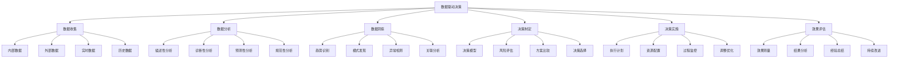

# 数据驱动决策

## 🎯 学习目标
掌握数据驱动决策的理念和方法，学会运用数据分析支持商业决策，提升决策质量和效率。

## 📊 数据驱动决策框架

### 决策体系

## 📈 数据收集

### 内部数据
**业务数据**：
- **销售数据**：销售业绩、客户信息、产品数据
- **财务数据**：收入、成本、利润、现金流
- **运营数据**：生产效率、质量指标、库存数据
- **人力资源数据**：员工信息、绩效数据、培训记录

**系统数据**：
- **ERP数据**：企业资源规划系统数据
- **CRM数据**：客户关系管理系统数据
- **SCM数据**：供应链管理系统数据
- **HRM数据**：人力资源管理系统数据

**数据质量**：
- **准确性**：数据准确性要求
- **完整性**：数据完整性要求
- **一致性**：数据一致性要求
- **时效性**：数据时效性要求

### 外部数据
**市场数据**：
- **行业数据**：行业发展趋势、市场规模
- **竞争数据**：竞争对手信息、市场地位
- **客户数据**：客户需求、行为偏好
- **供应商数据**：供应商信息、价格趋势

**环境数据**：
- **宏观经济数据**：GDP、通胀率、利率
- **政策数据**：政策变化、法规要求
- **技术数据**：技术发展趋势、创新动态
- **社会数据**：社会趋势、文化变化

**数据来源**：
- **公开数据**：政府统计、行业报告
- **第三方数据**：数据服务商、研究机构
- **网络数据**：社交媒体、网络平台
- **调研数据**：市场调研、客户调研

### 实时数据
**实时监控**：
- **业务监控**：实时业务指标监控
- **系统监控**：系统运行状态监控
- **市场监控**：市场变化实时监控
- **风险监控**：风险因素实时监控

**数据流**：
- **数据采集**：实时数据采集
- **数据传输**：数据实时传输
- **数据处理**：数据实时处理
- **数据存储**：数据实时存储

**技术支撑**：
- **流处理技术**：实时流处理技术
- **消息队列**：消息队列技术
- **缓存技术**：缓存技术应用
- **API接口**：API接口技术

### 历史数据
**数据积累**：
- **时间序列**：历史时间序列数据
- **趋势分析**：历史趋势分析
- **周期性**：历史周期性分析
- **季节性**：历史季节性分析

**数据挖掘**：
- **模式识别**：历史模式识别
- **异常检测**：历史异常检测
- **关联分析**：历史关联分析
- **预测建模**：历史预测建模

**数据价值**：
- **经验积累**：历史经验积累
- **知识发现**：历史知识发现
- **决策支持**：历史决策支持
- **风险预警**：历史风险预警

## 🔍 数据分析

### 描述性分析
**数据概览**：
- **数据统计**：基本统计信息
- **数据分布**：数据分布特征
- **数据质量**：数据质量评估
- **数据可视化**：数据可视化展示

**趋势分析**：
- **时间趋势**：时间序列趋势分析
- **空间趋势**：空间分布趋势分析
- **结构趋势**：结构变化趋势分析
- **关联趋势**：关联关系趋势分析

**对比分析**：
- **横向对比**：同期数据对比
- **纵向对比**：历史数据对比
- **目标对比**：与目标值对比
- **基准对比**：与基准值对比

### 诊断性分析
**原因分析**：
- **根因分析**：问题根本原因分析
- **影响因素**：影响因素分析
- **因果关系**：因果关系分析
- **相关关系**：相关关系分析

**问题诊断**：
- **问题识别**：问题识别方法
- **问题分类**：问题分类方法
- **问题优先级**：问题优先级排序
- **问题解决**：问题解决方案

**异常分析**：
- **异常识别**：异常数据识别
- **异常原因**：异常原因分析
- **异常影响**：异常影响评估
- **异常处理**：异常处理方法

### 预测性分析
**预测模型**：
- **时间序列预测**：时间序列预测模型
- **回归预测**：回归预测模型
- **机器学习预测**：机器学习预测模型
- **深度学习预测**：深度学习预测模型

**预测方法**：
- **统计方法**：统计预测方法
- **机器学习方法**：机器学习预测方法
- **深度学习方法**：深度学习预测方法
- **混合方法**：混合预测方法

**预测评估**：
- **准确性评估**：预测准确性评估
- **稳定性评估**：预测稳定性评估
- **可靠性评估**：预测可靠性评估
- **实用性评估**：预测实用性评估

### 规范性分析
**优化模型**：
- **线性规划**：线性规划模型
- **非线性规划**：非线性规划模型
- **整数规划**：整数规划模型
- **动态规划**：动态规划模型

**决策支持**：
- **方案生成**：决策方案生成
- **方案评估**：决策方案评估
- **方案比较**：决策方案比较
- **方案选择**：决策方案选择

**约束条件**：
- **资源约束**：资源约束条件
- **时间约束**：时间约束条件
- **技术约束**：技术约束条件
- **政策约束**：政策约束条件

## 💡 数据洞察

### 趋势识别
**趋势类型**：
- **上升趋势**：上升趋势识别
- **下降趋势**：下降趋势识别
- **平稳趋势**：平稳趋势识别
- **波动趋势**：波动趋势识别

**趋势分析**：
- **趋势强度**：趋势强度分析
- **趋势持续性**：趋势持续性分析
- **趋势变化点**：趋势变化点识别
- **趋势预测**：趋势预测分析

**趋势应用**：
- **战略规划**：趋势在战略规划中的应用
- **市场预测**：趋势在市场预测中的应用
- **风险预警**：趋势在风险预警中的应用
- **机会识别**：趋势在机会识别中的应用

### 模式发现
**模式类型**：
- **周期性模式**：周期性模式发现
- **季节性模式**：季节性模式发现
- **关联模式**：关联模式发现
- **异常模式**：异常模式发现

**模式分析**：
- **模式识别**：模式识别方法
- **模式验证**：模式验证方法
- **模式解释**：模式解释方法
- **模式应用**：模式应用方法

**模式价值**：
- **预测价值**：模式的预测价值
- **决策价值**：模式的决策价值
- **优化价值**：模式的优化价值
- **创新价值**：模式的创新价值

### 异常检测
**异常类型**：
- **数据异常**：数据异常检测
- **行为异常**：行为异常检测
- **系统异常**：系统异常检测
- **业务异常**：业务异常检测

**检测方法**：
- **统计方法**：统计异常检测方法
- **机器学习方法**：机器学习异常检测方法
- **深度学习方法**：深度学习异常检测方法
- **规则方法**：规则异常检测方法

**异常处理**：
- **异常确认**：异常确认方法
- **异常分析**：异常分析方法
- **异常处理**：异常处理方法
- **异常预防**：异常预防方法

### 关联分析
**关联类型**：
- **线性关联**：线性关联分析
- **非线性关联**：非线性关联分析
- **因果关系**：因果关系分析
- **相关关系**：相关关系分析

**分析方法**：
- **相关性分析**：相关性分析方法
- **回归分析**：回归分析方法
- **因果推断**：因果推断方法
- **网络分析**：网络分析方法

**关联应用**：
- **预测应用**：关联在预测中的应用
- **优化应用**：关联在优化中的应用
- **决策应用**：关联在决策中的应用
- **创新应用**：关联在创新中的应用

## 🎯 决策制定

### 决策模型
**决策框架**：
- **问题定义**：决策问题定义
- **目标设定**：决策目标设定
- **方案生成**：决策方案生成
- **方案评估**：决策方案评估

**决策方法**：
- **多准则决策**：多准则决策方法
- **风险决策**：风险决策方法
- **不确定性决策**：不确定性决策方法
- **群体决策**：群体决策方法

**决策工具**：
- **决策树**：决策树工具
- **决策矩阵**：决策矩阵工具
- **敏感性分析**：敏感性分析工具
- **蒙特卡洛模拟**：蒙特卡洛模拟工具

### 风险评估
**风险识别**：
- **风险类型**：风险类型识别
- **风险来源**：风险来源识别
- **风险影响**：风险影响识别
- **风险概率**：风险概率识别

**风险分析**：
- **风险等级**：风险等级分析
- **风险矩阵**：风险矩阵分析
- **风险趋势**：风险趋势分析
- **风险关联**：风险关联分析

**风险应对**：
- **风险规避**：风险规避策略
- **风险减轻**：风险减轻策略
- **风险转移**：风险转移策略
- **风险接受**：风险接受策略

### 方案比较
**比较维度**：
- **效果比较**：方案效果比较
- **成本比较**：方案成本比较
- **风险比较**：方案风险比较
- **可行性比较**：方案可行性比较

**比较方法**：
- **定量比较**：定量比较方法
- **定性比较**：定性比较方法
- **综合比较**：综合比较方法
- **动态比较**：动态比较方法

**比较工具**：
- **比较矩阵**：比较矩阵工具
- **评分模型**：评分模型工具
- **层次分析法**：层次分析法工具
- **模糊评价**：模糊评价工具

### 决策选择
**选择标准**：
- **目标导向**：目标导向选择
- **风险控制**：风险控制选择
- **资源约束**：资源约束选择
- **时间要求**：时间要求选择

**选择方法**：
- **最优选择**：最优选择方法
- **满意选择**：满意选择方法
- **妥协选择**：妥协选择方法
- **创新选择**：创新选择方法

**选择验证**：
- **逻辑验证**：逻辑验证方法
- **数据验证**：数据验证方法
- **专家验证**：专家验证方法
- **实践验证**：实践验证方法

## 🚀 决策实施

### 执行计划
**计划制定**：
- **目标分解**：目标分解方法
- **任务分配**：任务分配方法
- **时间安排**：时间安排方法
- **资源配置**：资源配置方法

**计划管理**：
- **计划监控**：计划监控方法
- **计划调整**：计划调整方法
- **计划优化**：计划优化方法
- **计划评估**：计划评估方法

### 资源配置
**资源类型**：
- **人力资源**：人力资源配置
- **物质资源**：物质资源配置
- **技术资源**：技术资源配置
- **资金资源**：资金资源配置

**配置原则**：
- **效率原则**：资源配置效率原则
- **公平原则**：资源配置公平原则
- **平衡原则**：资源配置平衡原则
- **优化原则**：资源配置优化原则

**配置方法**：
- **线性规划**：线性规划配置方法
- **动态规划**：动态规划配置方法
- **启发式方法**：启发式配置方法
- **智能优化**：智能优化配置方法

### 过程监控
**监控指标**：
- **进度指标**：进度监控指标
- **质量指标**：质量监控指标
- **成本指标**：成本监控指标
- **风险指标**：风险监控指标

**监控方法**：
- **实时监控**：实时监控方法
- **定期监控**：定期监控方法
- **重点监控**：重点监控方法
- **全面监控**：全面监控方法

**监控工具**：
- **仪表板**：监控仪表板工具
- **报表系统**：监控报表系统工具
- **预警系统**：监控预警系统工具
- **分析工具**：监控分析工具

### 调整优化
**调整触发**：
- **偏差触发**：偏差触发调整
- **风险触发**：风险触发调整
- **机会触发**：机会触发调整
- **环境触发**：环境触发调整

**调整方法**：
- **渐进调整**：渐进调整方法
- **激进调整**：激进调整方法
- **局部调整**：局部调整方法
- **全面调整**：全面调整方法

**优化策略**：
- **效率优化**：效率优化策略
- **质量优化**：质量优化策略
- **成本优化**：成本优化策略
- **风险优化**：风险优化策略

## 📊 效果评估

### 效果测量
**测量指标**：
- **定量指标**：定量效果测量指标
- **定性指标**：定性效果测量指标
- **综合指标**：综合效果测量指标
- **动态指标**：动态效果测量指标

**测量方法**：
- **对比测量**：对比测量方法
- **基准测量**：基准测量方法
- **趋势测量**：趋势测量方法
- **综合测量**：综合测量方法

**测量工具**：
- **统计工具**：统计测量工具
- **分析工具**：分析测量工具
- **可视化工具**：可视化测量工具
- **报告工具**：报告测量工具

### 结果分析
**分析维度**：
- **效果分析**：决策效果分析
- **成本分析**：决策成本分析
- **风险分析**：决策风险分析
- **收益分析**：决策收益分析

**分析方法**：
- **对比分析**：结果对比分析方法
- **趋势分析**：结果趋势分析方法
- **归因分析**：结果归因分析方法
- **敏感性分析**：结果敏感性分析方法

**分析工具**：
- **统计分析**：统计分析工具
- **数据挖掘**：数据挖掘分析工具
- **机器学习**：机器学习分析工具
- **可视化**：可视化分析工具

### 经验总结
**总结内容**：
- **成功经验**：成功经验总结
- **失败教训**：失败教训总结
- **最佳实践**：最佳实践总结
- **改进建议**：改进建议总结

**总结方法**：
- **案例总结**：案例总结方法
- **对比总结**：对比总结方法
- **趋势总结**：趋势总结方法
- **综合总结**：综合总结方法

**总结应用**：
- **知识积累**：经验在知识积累中的应用
- **能力提升**：经验在能力提升中的应用
- **决策改进**：经验在决策改进中的应用
- **创新驱动**：经验在创新驱动中的应用

### 持续改进
**改进方向**：
- **流程改进**：决策流程改进
- **方法改进**：决策方法改进
- **工具改进**：决策工具改进
- **能力改进**：决策能力改进

**改进方法**：
- **PDCA循环**：PDCA改进方法
- **六西格玛**：六西格玛改进方法
- **精益改进**：精益改进方法
- **敏捷改进**：敏捷改进方法

**改进管理**：
- **改进计划**：改进计划管理
- **改进实施**：改进实施管理
- **改进监控**：改进监控管理
- **改进评估**：改进评估管理

## 💡 实践应用

### 数据驱动决策流程
1. **数据收集**：收集相关数据
2. **数据分析**：进行数据分析
3. **数据洞察**：获得数据洞察
4. **决策制定**：制定决策方案
5. **决策实施**：实施决策方案
6. **效果评估**：评估决策效果
7. **持续改进**：持续改进决策

### 案例分析
**选择案例**：如电商平台数据驱动决策
**分析维度**：
- 数据收集：用户行为数据、交易数据、商品数据
- 数据分析：用户画像分析、商品推荐分析、价格分析
- 数据洞察：用户偏好洞察、市场趋势洞察、竞争洞察
- 决策制定：商品策略、价格策略、营销策略
- 决策实施：策略执行、效果监控、调整优化

## 🧠 学习要点

### 费曼学习法应用
1. **选择概念**：数据驱动决策
2. **简化解释**：用简单语言解释数据驱动决策
3. **识别盲点**：找出理解不足的地方
4. **重新学习**：针对盲点深入学习

### 刻意练习要点
- **数据思维**：培养数据思维
- **分析能力**：提升数据分析能力
- **洞察能力**：提升数据洞察能力
- **决策能力**：提升数据驱动决策能力

## 🔗 关联学习

### 前置知识
- [[01-数字化战略]] - 数字化战略
- [[01-商业学概论]] - 商业学基础
- [[01-战略管理概论]] - 战略管理

### 后续学习
- [[03-人工智能应用]] - AI应用
- [[04-数字化营销]] - 数字营销
- [[01-商业分析工具]] - 商业分析工具

### 实践应用
- 企业数据驱动决策
- 数据分析应用
- 决策支持系统
- 商业智能应用

## 🎯 学习检验

### 理解检验
- [ ] 能够理解数据驱动决策概念
- [ ] 能够掌握数据分析方法
- [ ] 能够获得数据洞察
- [ ] 能够制定数据驱动决策

### 应用检验
- [ ] 能够收集和分析数据
- [ ] 能够获得商业洞察
- [ ] 能够制定数据驱动决策
- [ ] 能够实施和评估决策

---
**下一步**：[[03-人工智能应用]] - AI应用
