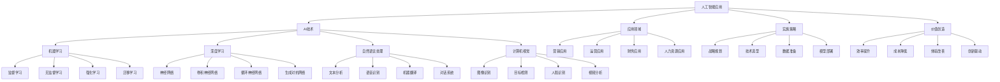

# 人工智能应用

## 🎯 学习目标
掌握人工智能在商业中的应用，学会运用AI技术提升商业效率和创造价值。

## 📊 AI应用框架

### AI应用模型

## 🤖 AI技术

### 机器学习
**监督学习**：
- **分类算法**：分类问题解决
- **回归算法**：回归问题解决
- **决策树**：决策树算法
- **随机森林**：随机森林算法

**无监督学习**：
- **聚类算法**：聚类分析
- **降维算法**：降维分析
- **关联规则**：关联规则挖掘
- **异常检测**：异常检测

**强化学习**：
- **Q学习**：Q学习算法
- **策略梯度**：策略梯度算法
- **Actor-Critic**：Actor-Critic算法
- **深度强化学习**：深度强化学习

**迁移学习**：
- **预训练模型**：预训练模型
- **微调技术**：微调技术
- **领域适应**：领域适应
- **知识迁移**：知识迁移

### 深度学习
**神经网络**：
- **感知机**：感知机模型
- **多层感知机**：多层感知机
- **反向传播**：反向传播算法
- **激活函数**：激活函数

**卷积神经网络**：
- **卷积层**：卷积层
- **池化层**：池化层
- **全连接层**：全连接层
- **批归一化**：批归一化

**循环神经网络**：
- **RNN**：循环神经网络
- **LSTM**：长短期记忆网络
- **GRU**：门控循环单元
- **注意力机制**：注意力机制

**生成对抗网络**：
- **生成器**：生成器网络
- **判别器**：判别器网络
- **对抗训练**：对抗训练
- **应用场景**：应用场景

### 自然语言处理
**文本分析**：
- **分词**：文本分词
- **词性标注**：词性标注
- **命名实体识别**：命名实体识别
- **情感分析**：情感分析

**语音识别**：
- **语音转文本**：语音转文本
- **声学模型**：声学模型
- **语言模型**：语言模型
- **端到端模型**：端到端模型

**机器翻译**：
- **统计机器翻译**：统计机器翻译
- **神经机器翻译**：神经机器翻译
- **注意力机制**：注意力机制
- **多语言翻译**：多语言翻译

**对话系统**：
- **任务型对话**：任务型对话
- **闲聊型对话**：闲聊型对话
- **多轮对话**：多轮对话
- **对话管理**：对话管理

### 计算机视觉
**图像识别**：
- **图像分类**：图像分类
- **目标检测**：目标检测
- **语义分割**：语义分割
- **实例分割**：实例分割

**人脸识别**：
- **人脸检测**：人脸检测
- **人脸识别**：人脸识别
- **人脸验证**：人脸验证
- **人脸分析**：人脸分析

**视频分析**：
- **视频分类**：视频分类
- **动作识别**：动作识别
- **视频摘要**：视频摘要
- **实时分析**：实时分析

**图像生成**：
- **图像生成**：图像生成
- **图像修复**：图像修复
- **图像超分辨率**：图像超分辨率
- **风格迁移**：风格迁移

## 🎯 应用领域

### 营销应用
**客户分析**：
- **客户画像**：客户画像构建
- **行为分析**：客户行为分析
- **偏好预测**：偏好预测
- **流失预警**：流失预警

**精准营销**：
- **个性化推荐**：个性化推荐
- **精准投放**：精准投放
- **营销自动化**：营销自动化
- **效果优化**：效果优化

**内容营销**：
- **内容生成**：内容自动生成
- **内容优化**：内容优化
- **内容分发**：内容分发
- **效果分析**：效果分析

**社交媒体**：
- **情感分析**：情感分析
- **话题监测**：话题监测
- **影响力分析**：影响力分析
- **危机预警**：危机预警

### 运营应用
**供应链优化**：
- **需求预测**：需求预测
- **库存优化**：库存优化
- **路径规划**：路径规划
- **供应商管理**：供应商管理

**生产管理**：
- **质量控制**：质量控制
- **设备维护**：设备维护
- **生产调度**：生产调度
- **异常检测**：异常检测

**物流管理**：
- **路线优化**：路线优化
- **配送调度**：配送调度
- **仓储管理**：仓储管理
- **最后一公里**：最后一公里

**客户服务**：
- **智能客服**：智能客服
- **问题分类**：问题分类
- **自动回复**：自动回复
- **服务质量**：服务质量

### 财务应用
**风险控制**：
- **信用评估**：信用评估
- **欺诈检测**：欺诈检测
- **风险预警**：风险预警
- **合规监控**：合规监控

**投资决策**：
- **市场分析**：市场分析
- **投资组合**：投资组合优化
- **算法交易**：算法交易
- **风险评估**：风险评估

**财务分析**：
- **财务预测**：财务预测
- **成本分析**：成本分析
- **盈利能力**：盈利能力分析
- **现金流预测**：现金流预测

**审计支持**：
- **异常检测**：异常检测
- **风险评估**：风险评估
- **合规检查**：合规检查
- **报告生成**：报告生成

### 人力资源应用
**招聘管理**：
- **简历筛选**：简历筛选
- **候选人匹配**：候选人匹配
- **面试评估**：面试评估
- **背景调查**：背景调查

**绩效管理**：
- **绩效评估**：绩效评估
- **目标设定**：目标设定
- **反馈分析**：反馈分析
- **改进建议**：改进建议

**培训发展**：
- **培训推荐**：培训推荐
- **学习路径**：学习路径
- **效果评估**：效果评估
- **能力分析**：能力分析

**员工管理**：
- **员工画像**：员工画像
- **离职预测**：离职预测
- **满意度分析**：满意度分析
- **团队优化**：团队优化

## 🚀 实施策略

### 战略规划
**AI战略制定**：
- **战略目标**：AI战略目标
- **技术路线**：技术路线规划
- **资源投入**：资源投入规划
- **时间规划**：时间规划

**组织准备**：
- **组织架构**：组织架构调整
- **人员配置**：人员配置
- **文化建设**：文化建设
- **能力建设**：能力建设

**风险评估**：
- **技术风险**：技术风险评估
- **数据风险**：数据风险评估
- **业务风险**：业务风险评估
- **合规风险**：合规风险评估

### 技术选型
**技术评估**：
- **技术成熟度**：技术成熟度评估
- **适用性分析**：适用性分析
- **成本效益**：成本效益分析
- **风险分析**：风险分析

**平台选择**：
- **云平台**：云平台选择
- **开发框架**：开发框架选择
- **工具选择**：工具选择
- **服务选择**：服务选择

**技术架构**：
- **架构设计**：架构设计
- **技术栈**：技术栈选择
- **集成方案**：集成方案
- **扩展性**：扩展性考虑

### 数据准备
**数据收集**：
- **数据源识别**：数据源识别
- **数据收集**：数据收集
- **数据整合**：数据整合
- **数据存储**：数据存储

**数据清洗**：
- **数据质量**：数据质量检查
- **数据清洗**：数据清洗
- **数据标准化**：数据标准化
- **数据验证**：数据验证

**数据标注**：
- **标注策略**：标注策略
- **标注工具**：标注工具
- **标注质量**：标注质量控制
- **标注管理**：标注管理

**数据安全**：
- **数据保护**：数据保护
- **隐私保护**：隐私保护
- **访问控制**：访问控制
- **合规管理**：合规管理

### 模型部署
**模型开发**：
- **模型设计**：模型设计
- **模型训练**：模型训练
- **模型验证**：模型验证
- **模型优化**：模型优化

**模型部署**：
- **部署环境**：部署环境
- **部署方式**：部署方式
- **性能监控**：性能监控
- **版本管理**：版本管理

**模型维护**：
- **模型更新**：模型更新
- **性能监控**：性能监控
- **问题诊断**：问题诊断
- **持续优化**：持续优化

## 💎 价值创造

### 效率提升
**自动化**：
- **流程自动化**：流程自动化
- **决策自动化**：决策自动化
- **服务自动化**：服务自动化
- **运营自动化**：运营自动化

**智能化**：
- **智能决策**：智能决策
- **智能推荐**：智能推荐
- **智能预测**：智能预测
- **智能优化**：智能优化

**精准化**：
- **精准营销**：精准营销
- **精准服务**：精准服务
- **精准预测**：精准预测
- **精准控制**：精准控制

### 成本降低
**人力成本**：
- **自动化替代**：自动化替代人力
- **效率提升**：效率提升降低成本
- **错误减少**：错误减少降低成本
- **重复工作**：减少重复工作

**运营成本**：
- **流程优化**：流程优化降低成本
- **资源优化**：资源优化降低成本
- **质量提升**：质量提升降低成本
- **风险控制**：风险控制降低成本

**决策成本**：
- **决策速度**：决策速度提升
- **决策质量**：决策质量提升
- **决策风险**：决策风险降低
- **决策成本**：决策成本降低

### 体验改善
**个性化体验**：
- **个性化服务**：个性化服务
- **个性化推荐**：个性化推荐
- **个性化界面**：个性化界面
- **个性化内容**：个性化内容

**智能化体验**：
- **智能交互**：智能交互
- **智能助手**：智能助手
- **智能预测**：智能预测
- **智能优化**：智能优化

**便利性体验**：
- **自动化服务**：自动化服务
- **即时响应**：即时响应
- **无缝体验**：无缝体验
- **一站式服务**：一站式服务

### 创新驱动
**产品创新**：
- **智能产品**：智能产品开发
- **个性化产品**：个性化产品
- **创新功能**：创新功能
- **用户体验**：用户体验创新

**服务创新**：
- **智能服务**：智能服务
- **个性化服务**：个性化服务
- **创新服务**：创新服务
- **服务模式**：服务模式创新

**商业模式创新**：
- **AI驱动**：AI驱动商业模式
- **数据变现**：数据变现
- **平台化**：平台化商业模式
- **生态化**：生态化商业模式

## 💡 AI应用案例

### 成功案例
**亚马逊**：
- **应用领域**：电商推荐
- **AI技术**：机器学习、深度学习
- **核心价值**：个性化推荐
- **效果**：提升销售转化率

**Netflix**：
- **应用领域**：内容推荐
- **AI技术**：协同过滤、深度学习
- **核心价值**：个性化内容推荐
- **效果**：提升用户满意度

**谷歌**：
- **应用领域**：搜索引擎
- **AI技术**：自然语言处理、机器学习
- **核心价值**：智能搜索
- **效果**：提升搜索准确性

**特斯拉**：
- **应用领域**：自动驾驶
- **AI技术**：计算机视觉、深度学习
- **核心价值**：自动驾驶技术
- **效果**：提升驾驶安全性

### 失败案例
**失败原因**：
- **技术不成熟**：技术不成熟
- **数据质量差**：数据质量差
- **应用场景不当**：应用场景不当
- **用户接受度低**：用户接受度低

**失败教训**：
- **技术选择**：选择合适的技术
- **数据质量**：重视数据质量
- **应用场景**：选择合适的应用场景
- **用户教育**：重视用户教育

## 🧠 学习要点

### 费曼学习法应用
1. **选择概念**：人工智能应用
2. **简化解释**：用简单语言解释AI应用
3. **识别盲点**：找出理解不足的地方
4. **重新学习**：针对盲点深入学习

### 刻意练习要点
- **技术掌握**：掌握AI技术
- **应用理解**：理解AI应用场景
- **案例分析**：分析成功失败案例
- **实践应用**：实践应用AI技术

## 🔗 关联学习

### 前置知识
- [[02-数据驱动决策]] - 数据驱动决策
- [[01-数字化战略]] - 数字化战略
- [[01-商业模式画布]] - 商业模式画布

### 后续学习
- [[04-数字化营销]] - 数字化营销
- [[01-AI伦理与治理]] - AI伦理与治理
- [[01-数字化转型]] - 数字化转型

### 实践应用
- AI技术应用
- 智能商业构建
- 数据驱动决策
- 商业模式创新

## 🎯 学习检验

### 理解检验
- [ ] 能够理解AI技术原理
- [ ] 能够掌握AI应用场景
- [ ] 能够分析AI价值创造
- [ ] 能够制定AI实施策略

### 应用检验
- [ ] 能够选择合适AI技术
- [ ] 能够设计AI应用方案
- [ ] 能够实施AI项目
- [ ] 能够评估AI效果

---
**下一步**：[[04-数字化营销]] - 数字化营销
