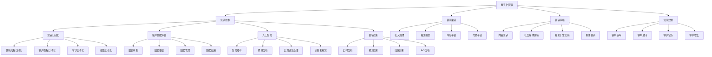

# 数字化营销

## 🎯 学习目标
掌握数字化营销理论和方法，学会运用数字技术提升营销效果，实现精准营销和客户价值最大化。

## 📊 数字化营销框架

### 数字化营销模型

## 🛠️ 营销技术

### 营销自动化
**营销流程自动化**：
- **线索管理**：线索自动管理
- **客户细分**：客户自动细分
- **营销活动**：营销活动自动化
- **销售跟进**：销售跟进自动化

**客户旅程自动化**：
- **旅程设计**：客户旅程设计
- **触点管理**：触点自动管理
- **个性化体验**：个性化体验自动化
- **旅程优化**：旅程自动优化

**内容自动化**：
- **内容生成**：内容自动生成
- **内容分发**：内容自动分发
- **内容优化**：内容自动优化
- **内容个性化**：内容个性化

**报告自动化**：
- **数据收集**：数据自动收集
- **报告生成**：报告自动生成
- **指标监控**：指标自动监控
- **洞察提取**：洞察自动提取

### 客户数据平台
**数据收集**：
- **第一方数据**：第一方数据收集
- **第二方数据**：第二方数据收集
- **第三方数据**：第三方数据收集
- **行为数据**：行为数据收集

**数据整合**：
- **数据清洗**：数据清洗
- **数据标准化**：数据标准化
- **数据匹配**：数据匹配
- **数据融合**：数据融合

**数据管理**：
- **数据存储**：数据存储管理
- **数据安全**：数据安全管理
- **数据治理**：数据治理
- **数据质量**：数据质量管理

**数据应用**：
- **客户画像**：客户画像构建
- **个性化推荐**：个性化推荐
- **精准营销**：精准营销
- **预测分析**：预测分析

### 人工智能
**智能推荐**：
- **协同过滤**：协同过滤推荐
- **内容推荐**：内容推荐
- **商品推荐**：商品推荐
- **服务推荐**：服务推荐

**预测分析**：
- **客户流失预测**：客户流失预测
- **购买预测**：购买预测
- **价值预测**：客户价值预测
- **行为预测**：行为预测

**自然语言处理**：
- **情感分析**：情感分析
- **文本分析**：文本分析
- **聊天机器人**：聊天机器人
- **内容生成**：内容生成

**计算机视觉**：
- **图像识别**：图像识别
- **视频分析**：视频分析
- **人脸识别**：人脸识别
- **内容审核**：内容审核

### 营销分析
**实时分析**：
- **实时监控**：实时监控
- **实时预警**：实时预警
- **实时优化**：实时优化
- **实时决策**：实时决策

**预测分析**：
- **趋势预测**：趋势预测
- **需求预测**：需求预测
- **风险预测**：风险预测
- **机会预测**：机会预测

**归因分析**：
- **渠道归因**：渠道归因分析
- **触点归因**：触点归因分析
- **内容归因**：内容归因分析
- **活动归因**：活动归因分析

**ROI分析**：
- **投资回报**：投资回报分析
- **成本效益**：成本效益分析
- **价值评估**：价值评估
- **优化建议**：优化建议

## 📱 营销渠道

### 社交媒体
**平台类型**：
- **社交网络**：社交网络平台
- **短视频平台**：短视频平台
- **直播平台**：直播平台
- **专业平台**：专业平台

**营销方式**：
- **内容营销**：内容营销
- **KOL合作**：KOL合作
- **社群营销**：社群营销
- **直播营销**：直播营销

**效果评估**：
- **曝光量**：曝光量评估
- **互动率**：互动率评估
- **转化率**：转化率评估
- **品牌认知**：品牌认知评估

### 搜索引擎
**搜索营销**：
- **SEO优化**：SEO优化
- **SEM广告**：SEM广告
- **本地搜索**：本地搜索优化
- **语音搜索**：语音搜索优化

**内容优化**：
- **关键词优化**：关键词优化
- **内容质量**：内容质量优化
- **用户体验**：用户体验优化
- **技术优化**：技术优化

**效果监控**：
- **排名监控**：排名监控
- **流量分析**：流量分析
- **转化跟踪**：转化跟踪
- **竞争分析**：竞争分析

### 内容平台
**平台类型**：
- **视频平台**：视频平台
- **音频平台**：音频平台
- **图文平台**：图文平台
- **知识平台**：知识平台

**内容策略**：
- **内容规划**：内容规划
- **内容创作**：内容创作
- **内容分发**：内容分发
- **内容优化**：内容优化

**效果评估**：
- **内容表现**：内容表现评估
- **用户参与**：用户参与评估
- **品牌影响**：品牌影响评估
- **商业价值**：商业价值评估

### 电商平台
**平台类型**：
- **综合电商**：综合电商平台
- **垂直电商**：垂直电商平台
- **社交电商**：社交电商平台
- **直播电商**：直播电商平台

**营销策略**：
- **店铺优化**：店铺优化
- **商品推广**：商品推广
- **促销活动**：促销活动
- **客户服务**：客户服务

**效果评估**：
- **销售表现**：销售表现评估
- **客户获取**：客户获取评估
- **客户留存**：客户留存评估
- **盈利能力**：盈利能力评估

## 🎯 营销策略

### 内容营销
**内容策略**：
- **内容规划**：内容规划
- **内容主题**：内容主题选择
- **内容形式**：内容形式选择
- **内容频率**：内容发布频率

**内容创作**：
- **内容创作**：内容创作
- **内容质量**：内容质量控制
- **内容创新**：内容创新
- **内容个性化**：内容个性化

**内容分发**：
- **渠道选择**：分发渠道选择
- **时间优化**：发布时间优化
- **受众定位**：受众定位
- **效果跟踪**：效果跟踪

**内容优化**：
- **内容分析**：内容分析
- **效果评估**：效果评估
- **优化调整**：优化调整
- **持续改进**：持续改进

### 社交媒体营销
**平台策略**：
- **平台选择**：平台选择策略
- **账号建设**：账号建设
- **内容策略**：内容策略
- **互动策略**：互动策略

**内容策略**：
- **内容类型**：内容类型选择
- **内容风格**：内容风格
- **内容频率**：内容发布频率
- **内容质量**：内容质量

**互动策略**：
- **用户互动**：用户互动
- **社群建设**：社群建设
- **KOL合作**：KOL合作
- **活动策划**：活动策划

**效果评估**：
- **粉丝增长**：粉丝增长评估
- **互动效果**：互动效果评估
- **品牌影响**：品牌影响评估
- **商业转化**：商业转化评估

### 搜索引擎营销
**SEO策略**：
- **关键词策略**：关键词策略
- **内容优化**：内容优化
- **技术优化**：技术优化
- **链接建设**：链接建设

**SEM策略**：
- **广告策略**：广告策略
- **关键词选择**：关键词选择
- **出价策略**：出价策略
- **广告创意**：广告创意

**本地搜索**：
- **本地优化**：本地搜索优化
- **地图营销**：地图营销
- **本地内容**：本地内容营销
- **本地广告**：本地广告

**效果监控**：
- **排名监控**：排名监控
- **流量分析**：流量分析
- **转化跟踪**：转化跟踪
- **ROI分析**：ROI分析

### 邮件营销
**邮件策略**：
- **邮件类型**：邮件类型选择
- **发送频率**：发送频率
- **内容策略**：内容策略
- **个性化策略**：个性化策略

**邮件设计**：
- **邮件模板**：邮件模板设计
- **视觉效果**：视觉效果设计
- **内容布局**：内容布局设计
- **移动优化**：移动端优化

**邮件发送**：
- **发送时间**：发送时间优化
- **发送频率**：发送频率控制
- **A/B测试**：A/B测试
- **发送监控**：发送监控

**效果评估**：
- **打开率**：打开率评估
- **点击率**：点击率评估
- **转化率**：转化率评估
- **退订率**：退订率评估

## 📈 营销效果

### 客户获取
**获客渠道**：
- **数字渠道**：数字渠道获客
- **内容营销**：内容营销获客
- **社交媒体**：社交媒体获客
- **搜索引擎**：搜索引擎获客

**获客策略**：
- **免费试用**：免费试用策略
- **优惠促销**：优惠促销策略
- **推荐奖励**：推荐奖励策略
- **内容吸引**：内容吸引策略

**获客成本**：
- **CAC计算**：客户获取成本
- **成本优化**：成本优化
- **ROI分析**：投资回报分析
- **渠道效果**：渠道效果分析

### 客户激活
**激活策略**：
- **引导流程**：用户引导流程
- **功能体验**：功能体验激活
- **价值感知**：价值感知激活
- **使用习惯**：使用习惯培养

**激活指标**：
- **激活率**：用户激活率
- **使用频率**：使用频率
- **功能使用**：功能使用率
- **价值实现**：价值实现率

**激活优化**：
- **流程优化**：激活流程优化
- **体验优化**：激活体验优化
- **内容优化**：激活内容优化
- **工具优化**：激活工具优化

### 客户留存
**留存策略**：
- **价值持续**：持续价值提供
- **关系维护**：客户关系维护
- **体验优化**：体验持续优化
- **个性化服务**：个性化服务

**留存指标**：
- **留存率**：客户留存率
- **流失率**：客户流失率
- **生命周期**：客户生命周期
- **价值贡献**：客户价值贡献

**留存优化**：
- **流失预警**：流失预警机制
- **挽回策略**：客户挽回策略
- **忠诚度**：客户忠诚度建设
- **满意度**：客户满意度提升

### 客户增长
**增长策略**：
- **使用升级**：使用升级策略
- **功能扩展**：功能扩展策略
- **服务升级**：服务升级策略
- **价值提升**：价值提升策略

**增长指标**：
- **使用深度**：使用深度增长
- **使用广度**：使用广度增长
- **价值增长**：客户价值增长
- **推荐增长**：推荐增长

**增长优化**：
- **增长路径**：增长路径设计
- **激励机制**：增长激励机制
- **价值传递**：价值传递优化
- **体验提升**：体验提升优化

## 💡 数字化营销案例

### 成功案例
**亚马逊**：
- **营销策略**：个性化推荐
- **技术应用**：机器学习、大数据
- **核心价值**：精准营销
- **效果**：提升销售转化率

**Netflix**：
- **营销策略**：内容推荐
- **技术应用**：协同过滤、深度学习
- **核心价值**：个性化体验
- **效果**：提升用户满意度

**Spotify**：
- **营销策略**：音乐推荐
- **技术应用**：机器学习、自然语言处理
- **核心价值**：个性化音乐体验
- **效果**：提升用户粘性

**Airbnb**：
- **营销策略**：个性化住宿推荐
- **技术应用**：机器学习、大数据
- **核心价值**：个性化住宿体验
- **效果**：提升预订转化率

### 失败案例
**失败原因**：
- **技术应用不当**：技术应用不当
- **数据质量差**：数据质量差
- **用户体验差**：用户体验差
- **营销策略错误**：营销策略错误

**失败教训**：
- **技术选择**：选择合适的技术
- **数据质量**：重视数据质量
- **用户体验**：重视用户体验
- **策略制定**：制定正确的营销策略

## 🧠 学习要点

### 费曼学习法应用
1. **选择概念**：数字化营销
2. **简化解释**：用简单语言解释数字化营销
3. **识别盲点**：找出理解不足的地方
4. **重新学习**：针对盲点深入学习

### 刻意练习要点
- **理论掌握**：掌握数字化营销理论
- **技术应用**：掌握营销技术应用
- **案例分析**：分析成功失败案例
- **实践应用**：实践应用数字化营销

## 🔗 关联学习

### 前置知识
- [[03-人工智能应用]] - 人工智能应用
- [[02-数据驱动决策]] - 数据驱动决策
- [[01-数字化战略]] - 数字化战略

### 后续学习
- [[01-社交媒体营销]] - 社交媒体营销
- [[02-内容营销]] - 内容营销
- [[03-搜索引擎营销]] - 搜索引擎营销

### 实践应用
- 数字化营销策略制定
- 营销技术应用
- 客户关系管理
- 营销效果优化

## 🎯 学习检验

### 理解检验
- [ ] 能够理解数字化营销理论
- [ ] 能够掌握营销技术应用
- [ ] 能够分析营销策略
- [ ] 能够评估营销效果

### 应用检验
- [ ] 能够制定数字化营销策略
- [ ] 能够应用营销技术
- [ ] 能够实施营销活动
- [ ] 能够优化营销效果

---
**下一步**：[[01-社交媒体营销]] - 社交媒体营销
