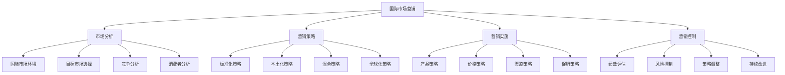

# 国际市场营销

## 🎯 学习目标
掌握国际市场营销理论和方法，学会制定国际化营销策略，提升企业在国际市场的竞争力。

## 📊 国际市场营销框架

### 营销要素

## 🌍 市场分析

### 国际市场环境
**宏观环境分析**：
- **政治环境**：政治稳定性、政策变化、法律环境
- **经济环境**：经济发展水平、汇率变化、通胀率
- **社会环境**：文化差异、消费习惯、社会结构
- **技术环境**：技术水平、技术转移、技术创新

**微观环境分析**：
- **供应商**：供应商能力、供应商关系、供应商风险
- **中间商**：中间商网络、中间商能力、中间商关系
- **竞争者**：竞争格局、竞争策略、竞争优势
- **公众**：媒体关系、政府关系、社区关系

**环境评估**：
- **机会识别**：市场机会识别
- **威胁分析**：市场威胁分析
- **风险评估**：市场风险评估
- **适应性分析**：环境适应性分析

### 目标市场选择
**市场细分**：
- **地理细分**：按地理位置细分
- **人口细分**：按人口特征细分
- **心理细分**：按心理特征细分
- **行为细分**：按行为特征细分

**市场评估**：
- **市场规模**：目标市场规模
- **市场增长**：目标市场增长潜力
- **市场吸引力**：目标市场吸引力
- **市场进入壁垒**：市场进入难度

**市场选择**：
- **选择标准**：市场选择标准
- **选择方法**：市场选择方法
- **选择策略**：市场选择策略
- **选择验证**：市场选择验证

### 竞争分析
**竞争格局**：
- **竞争强度**：市场竞争强度
- **竞争结构**：市场竞争结构
- **竞争趋势**：市场竞争趋势
- **竞争变化**：市场竞争变化

**竞争对手分析**：
- **直接竞争**：直接竞争对手分析
- **间接竞争**：间接竞争对手分析
- **潜在竞争**：潜在竞争对手分析
- **替代竞争**：替代竞争对手分析

**竞争策略**：
- **成本领先**：成本领先策略
- **差异化**：差异化策略
- **集中化**：集中化策略
- **创新**：创新策略

## 🎯 营销策略

### 标准化策略
**策略特点**：
- **统一性**：全球统一营销策略
- **效率性**：提高营销效率
- **一致性**：保持品牌一致性
- **成本优势**：降低营销成本

**适用条件**：
- **产品同质化**：产品同质化程度高
- **需求相似**：市场需求相似
- **文化趋同**：文化差异较小
- **技术标准化**：技术标准化程度高

**实施方法**：
- **产品标准化**：产品标准化设计
- **价格标准化**：价格标准化策略
- **渠道标准化**：渠道标准化管理
- **促销标准化**：促销标准化执行

### 本土化策略
**策略特点**：
- **适应性**：适应本地市场需求
- **灵活性**：灵活应对市场变化
- **针对性**：针对本地市场特点
- **有效性**：提高营销有效性

**适用条件**：
- **文化差异大**：文化差异较大
- **需求差异大**：市场需求差异大
- **竞争激烈**：市场竞争激烈
- **政策限制**：政策限制较多

**实施方法**：
- **产品本土化**：产品本土化设计
- **价格本土化**：价格本土化策略
- **渠道本土化**：渠道本土化建设
- **促销本土化**：促销本土化执行

### 混合策略
**策略特点**：
- **平衡性**：平衡标准化与本土化
- **灵活性**：灵活调整策略组合
- **效率性**：保持营销效率
- **适应性**：适应市场变化

**实施方法**：
- **核心标准化**：核心要素标准化
- **外围本土化**：外围要素本土化
- **动态调整**：动态调整策略
- **持续优化**：持续优化策略

## 🚀 营销实施

### 产品策略
**产品决策**：
- **产品标准化**：产品标准化决策
- **产品本土化**：产品本土化决策
- **产品创新**：产品创新决策
- **产品组合**：产品组合决策

**产品开发**：
- **需求分析**：市场需求分析
- **产品设计**：产品设计开发
- **产品测试**：产品测试验证
- **产品上市**：产品上市推广

**产品管理**：
- **产品生命周期**：产品生命周期管理
- **产品组合**：产品组合管理
- **产品创新**：产品创新管理
- **产品退出**：产品退出管理

### 价格策略
**定价策略**：
- **成本导向定价**：成本导向定价策略
- **需求导向定价**：需求导向定价策略
- **竞争导向定价**：竞争导向定价策略
- **价值导向定价**：价值导向定价策略

**价格管理**：
- **价格标准化**：价格标准化管理
- **价格本土化**：价格本土化管理
- **价格调整**：价格调整管理
- **价格保护**：价格保护管理

**汇率影响**：
- **汇率风险**：汇率风险管理
- **汇率对冲**：汇率对冲策略
- **汇率调整**：汇率调整策略
- **汇率预测**：汇率预测分析

### 渠道策略
**渠道选择**：
- **直接渠道**：直接销售渠道
- **间接渠道**：间接销售渠道
- **混合渠道**：混合销售渠道
- **数字渠道**：数字销售渠道

**渠道管理**：
- **渠道设计**：渠道设计规划
- **渠道建设**：渠道建设实施
- **渠道激励**：渠道激励机制
- **渠道控制**：渠道控制管理

**渠道创新**：
- **渠道创新**：渠道创新策略
- **渠道整合**：渠道整合策略
- **渠道优化**：渠道优化策略
- **渠道转型**：渠道转型策略

### 促销策略
**促销策略**：
- **广告策略**：广告策略制定
- **公关策略**：公关策略制定
- **促销策略**：促销策略制定
- **人员推销**：人员推销策略

**促销实施**：
- **促销计划**：促销计划制定
- **促销执行**：促销执行管理
- **促销监控**：促销监控管理
- **促销评估**：促销效果评估

**文化适应**：
- **文化理解**：文化理解分析
- **文化适应**：文化适应策略
- **文化创新**：文化创新策略
- **文化融合**：文化融合策略

## 📊 营销控制

### 绩效评估
**评估指标**：
- **销售指标**：销售额、市场份额、增长率
- **财务指标**：利润率、投资回报率、现金流
- **客户指标**：客户满意度、客户忠诚度、客户价值
- **品牌指标**：品牌知名度、品牌形象、品牌价值

**评估方法**：
- **定量评估**：定量指标评估
- **定性评估**：定性指标评估
- **对比评估**：对比分析评估
- **趋势评估**：趋势分析评估

**评估报告**：
- **评估报告**：评估报告编制
- **问题识别**：问题识别分析
- **改进建议**：改进建议提出
- **行动计划**：行动计划制定

### 风险控制
**风险识别**：
- **政治风险**：政治风险识别
- **经济风险**：经济风险识别
- **文化风险**：文化风险识别
- **竞争风险**：竞争风险识别

**风险评估**：
- **风险概率**：风险发生概率
- **风险影响**：风险影响程度
- **风险等级**：风险等级评估
- **风险优先级**：风险优先级排序

**风险应对**：
- **风险规避**：风险规避策略
- **风险转移**：风险转移策略
- **风险减轻**：风险减轻策略
- **风险接受**：风险接受策略

### 策略调整
**调整触发**：
- **环境变化**：环境变化触发
- **竞争变化**：竞争变化触发
- **绩效变化**：绩效变化触发
- **机会变化**：机会变化触发

**调整策略**：
- **策略修正**：策略修正调整
- **策略优化**：策略优化调整
- **策略创新**：策略创新调整
- **策略转型**：策略转型调整

**调整实施**：
- **调整计划**：调整计划制定
- **调整执行**：调整执行管理
- **调整监控**：调整监控管理
- **调整评估**：调整效果评估

## 💡 实践应用

### 国际市场营销流程
1. **市场分析**：分析国际市场环境
2. **策略制定**：制定国际营销策略
3. **策略实施**：实施国际营销策略
4. **绩效评估**：评估营销绩效
5. **策略调整**：调整营销策略

### 案例分析
**选择案例**：如苹果国际市场营销
**分析维度**：
- 市场分析：环境分析、市场选择、竞争分析
- 营销策略：标准化策略、本土化策略、混合策略
- 营销实施：产品策略、价格策略、渠道策略、促销策略
- 营销控制：绩效评估、风险控制、策略调整

## 🧠 学习要点

### 费曼学习法应用
1. **选择概念**：国际市场营销
2. **简化解释**：用简单语言解释国际市场营销
3. **识别盲点**：找出理解不足的地方
4. **重新学习**：针对盲点深入学习

### 刻意练习要点
- **市场分析**：提升市场分析能力
- **策略制定**：提升策略制定能力
- **策略实施**：提升策略实施能力
- **营销控制**：提升营销控制能力

## 🔗 关联学习

### 前置知识
- [[02-跨文化管理]] - 跨文化管理
- [[01-国际贸易理论]] - 国际贸易理论
- [[01-4P营销理论]] - 4P营销理论

### 后续学习
- [[04-全球供应链管理]] - 全球供应链
- [[01-品牌管理]] - 品牌管理
- [[01-客户生命周期价值]] - 客户生命周期价值

### 实践应用
- 国际市场营销策略制定
- 国际市场进入策略
- 国际品牌管理
- 国际客户关系管理

## 🎯 学习检验

### 理解检验
- [ ] 能够分析国际市场环境
- [ ] 能够制定国际营销策略
- [ ] 能够实施国际营销策略
- [ ] 能够控制国际营销风险

### 应用检验
- [ ] 能够分析具体国际市场
- [ ] 能够制定国际化营销策略
- [ ] 能够实施国际化营销活动
- [ ] 能够评估国际化营销效果

---
**下一步**：[[04-全球供应链管理]] - 全球供应链管理
