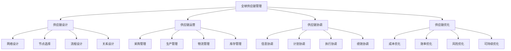

# 全球供应链管理

## 🎯 学习目标
掌握全球供应链管理理论和方法，学会构建和管理全球供应链网络，提升供应链效率和竞争力。

## 📊 全球供应链管理框架

### 管理要素

## 🏗️ 供应链设计

### 网络设计
**网络结构**：
- **集中式网络**：集中式供应链网络
- **分布式网络**：分布式供应链网络
- **混合式网络**：混合式供应链网络
- **动态网络**：动态供应链网络

**设计原则**：
- **效率原则**：提高供应链效率
- **灵活性原则**：增强供应链灵活性
- **可靠性原则**：保证供应链可靠性
- **可持续原则**：实现供应链可持续发展

**设计方法**：
- **数学模型**：数学建模方法
- **仿真模拟**：仿真模拟方法
- **优化算法**：优化算法方法
- **决策支持**：决策支持系统

### 节点选择
**节点类型**：
- **供应商节点**：供应商选择
- **制造商节点**：制造商选择
- **分销商节点**：分销商选择
- **零售商节点**：零售商选择

**选择标准**：
- **能力标准**：节点能力评估
- **成本标准**：节点成本评估
- **质量标准**：节点质量评估
- **服务标准**：节点服务评估

**选择方法**：
- **多标准决策**：多标准决策方法
- **层次分析法**：层次分析方法
- **数据包络分析**：数据包络分析方法
- **模糊综合评价**：模糊综合评价方法

### 流程设计
**流程类型**：
- **采购流程**：采购流程设计
- **生产流程**：生产流程设计
- **物流流程**：物流流程设计
- **信息流程**：信息流程设计

**流程优化**：
- **流程分析**：流程分析优化
- **流程重组**：流程重组优化
- **流程标准化**：流程标准化优化
- **流程自动化**：流程自动化优化

## ⚙️ 供应链运营

### 采购管理
**采购策略**：
- **集中采购**：集中采购策略
- **分散采购**：分散采购策略
- **混合采购**：混合采购策略
- **战略采购**：战略采购策略

**供应商管理**：
- **供应商选择**：供应商选择管理
- **供应商评估**：供应商评估管理
- **供应商发展**：供应商发展管理
- **供应商关系**：供应商关系管理

**采购执行**：
- **采购计划**：采购计划制定
- **采购执行**：采购执行管理
- **采购监控**：采购监控管理
- **采购评估**：采购效果评估

### 生产管理
**生产策略**：
- **按订单生产**：按订单生产策略
- **按库存生产**：按库存生产策略
- **混合生产**：混合生产策略
- **柔性生产**：柔性生产策略

**生产计划**：
- **主生产计划**：主生产计划制定
- **物料需求计划**：物料需求计划制定
- **能力需求计划**：能力需求计划制定
- **生产排程**：生产排程管理

**生产控制**：
- **生产监控**：生产监控管理
- **质量控制**：生产质量控制
- **成本控制**：生产成本控制
- **进度控制**：生产进度控制

### 物流管理
**物流策略**：
- **自营物流**：自营物流策略
- **第三方物流**：第三方物流策略
- **混合物流**：混合物流策略
- **第四方物流**：第四方物流策略

**运输管理**：
- **运输方式**：运输方式选择
- **运输路线**：运输路线优化
- **运输计划**：运输计划制定
- **运输监控**：运输监控管理

**仓储管理**：
- **仓储网络**：仓储网络设计
- **仓储布局**：仓储布局优化
- **仓储作业**：仓储作业管理
- **仓储技术**：仓储技术应用

### 库存管理
**库存策略**：
- **推式库存**：推式库存策略
- **拉式库存**：拉式库存策略
- **混合库存**：混合库存策略
- **协同库存**：协同库存策略

**库存控制**：
- **安全库存**：安全库存设定
- **订货点**：订货点设定
- **订货量**：订货量确定
- **库存监控**：库存监控管理

**库存优化**：
- **库存分析**：库存分析优化
- **库存预测**：库存预测优化
- **库存配置**：库存配置优化
- **库存成本**：库存成本优化

## 🤝 供应链协调

### 信息协调
**信息共享**：
- **需求信息**：需求信息共享
- **供应信息**：供应信息共享
- **库存信息**：库存信息共享
- **计划信息**：计划信息共享

**信息系统**：
- **ERP系统**：企业资源计划系统
- **SCM系统**：供应链管理系统
- **WMS系统**：仓储管理系统
- **TMS系统**：运输管理系统

**信息标准**：
- **数据标准**：数据标准化
- **接口标准**：接口标准化
- **安全标准**：信息安全标准
- **质量标准**：信息质量标准

### 计划协调
**协同计划**：
- **需求预测**：协同需求预测
- **生产计划**：协同生产计划
- **采购计划**：协同采购计划
- **配送计划**：协同配送计划

**计划方法**：
- **CPFR**：协同计划、预测与补货
- **VMI**：供应商管理库存
- **JMI**：联合管理库存
- **S&OP**：销售与运营计划

**计划优化**：
- **计划协调**：计划协调优化
- **计划同步**：计划同步优化
- **计划调整**：计划调整优化
- **计划执行**：计划执行优化

### 执行协调
**执行监控**：
- **订单执行**：订单执行监控
- **生产执行**：生产执行监控
- **物流执行**：物流执行监控
- **服务执行**：服务执行监控

**异常处理**：
- **异常识别**：异常情况识别
- **异常分析**：异常原因分析
- **异常处理**：异常处理措施
- **异常预防**：异常预防措施

**绩效协调**：
- **绩效指标**：绩效指标体系
- **绩效评估**：绩效评估方法
- **绩效改进**：绩效改进措施
- **绩效激励**：绩效激励机制

## 🚀 供应链优化

### 成本优化
**成本分析**：
- **成本结构**：成本结构分析
- **成本驱动**：成本驱动因素
- **成本控制**：成本控制措施
- **成本优化**：成本优化策略

**成本管理**：
- **目标成本**：目标成本管理
- **标准成本**：标准成本管理
- **作业成本**：作业成本管理
- **生命周期成本**：生命周期成本管理

**成本优化**：
- **采购优化**：采购成本优化
- **生产优化**：生产成本优化
- **物流优化**：物流成本优化
- **库存优化**：库存成本优化

### 效率优化
**效率分析**：
- **效率指标**：效率指标体系
- **效率瓶颈**：效率瓶颈识别
- **效率改进**：效率改进措施
- **效率提升**：效率提升策略

**流程优化**：
- **流程分析**：流程分析优化
- **流程重组**：流程重组优化
- **流程标准化**：流程标准化优化
- **流程自动化**：流程自动化优化

**技术优化**：
- **信息技术**：信息技术应用
- **自动化技术**：自动化技术应用
- **人工智能**：人工智能应用
- **物联网技术**：物联网技术应用

### 风险优化
**风险识别**：
- **供应风险**：供应风险识别
- **需求风险**：需求风险识别
- **运营风险**：运营风险识别
- **外部风险**：外部风险识别

**风险评估**：
- **风险概率**：风险发生概率
- **风险影响**：风险影响程度
- **风险等级**：风险等级评估
- **风险优先级**：风险优先级排序

**风险应对**：
- **风险规避**：风险规避策略
- **风险转移**：风险转移策略
- **风险减轻**：风险减轻策略
- **风险接受**：风险接受策略

### 可持续优化
**可持续发展**：
- **环境可持续**：环境可持续发展
- **社会可持续**：社会可持续发展
- **经济可持续**：经济可持续发展
- **治理可持续**：治理可持续发展

**绿色供应链**：
- **绿色采购**：绿色采购策略
- **绿色生产**：绿色生产策略
- **绿色物流**：绿色物流策略
- **绿色回收**：绿色回收策略

**社会责任**：
- **劳工权益**：劳工权益保护
- **社区责任**：社区责任履行
- **环境保护**：环境保护责任
- **道德经营**：道德经营责任

## 💡 实践应用

### 全球供应链管理流程
1. **供应链设计**：设计供应链网络
2. **供应链运营**：运营供应链活动
3. **供应链协调**：协调供应链关系
4. **供应链优化**：优化供应链绩效
5. **供应链创新**：创新供应链模式

### 案例分析
**选择案例**：如苹果全球供应链管理
**分析维度**：
- 供应链设计：网络设计、节点选择、流程设计
- 供应链运营：采购管理、生产管理、物流管理
- 供应链协调：信息协调、计划协调、执行协调
- 供应链优化：成本优化、效率优化、风险优化

## 🧠 学习要点

### 费曼学习法应用
1. **选择概念**：全球供应链管理
2. **简化解释**：用简单语言解释全球供应链管理
3. **识别盲点**：找出理解不足的地方
4. **重新学习**：针对盲点深入学习

### 刻意练习要点
- **供应链设计**：提升供应链设计能力
- **供应链运营**：提升供应链运营能力
- **供应链协调**：提升供应链协调能力
- **供应链优化**：提升供应链优化能力

## 🔗 关联学习

### 前置知识
- [[03-国际市场营销]] - 国际市场营销
- [[02-跨文化管理]] - 跨文化管理
- [[01-供应链管理]] - 供应链管理

### 后续学习
- [[01-商业模式创新]] - 商业模式创新
- [[01-数字化转型]] - 数字化转型
- [[01-可持续发展商业]] - 可持续发展商业

### 实践应用
- 全球供应链网络设计
- 全球供应链运营管理
- 全球供应链风险控制
- 全球供应链绩效优化

## 🎯 学习检验

### 理解检验
- [ ] 能够设计全球供应链网络
- [ ] 能够运营全球供应链活动
- [ ] 能够协调全球供应链关系
- [ ] 能够优化全球供应链绩效

### 应用检验
- [ ] 能够构建全球供应链网络
- [ ] 能够管理全球供应链运营
- [ ] 能够控制全球供应链风险
- [ ] 能够优化全球供应链效率

---
**下一步**：[[01-商业模式创新]] - 商业模式创新
