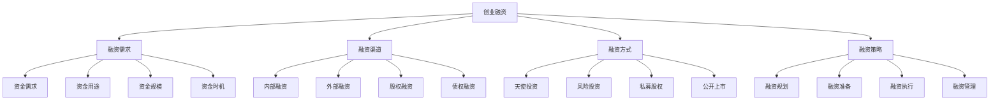

# 创业融资

## 🎯 学习目标
掌握创业融资理论和方法，了解各种融资渠道和方式，学会制定融资策略，提升创业融资成功率。

## 📊 创业融资框架

### 融资要素

## 💰 融资需求

### 资金需求
**需求分析**：
- **资金缺口**：资金缺口分析
- **资金规模**：资金需求规模
- **资金结构**：资金需求结构
- **资金时间**：资金需求时间

**需求预测**：
- **短期需求**：短期资金需求
- **中期需求**：中期资金需求
- **长期需求**：长期资金需求
- **应急需求**：应急资金需求

**需求优化**：
- **需求优化**：资金需求优化
- **成本优化**：资金成本优化
- **结构优化**：资金结构优化
- **时机优化**：资金时机优化

### 资金用途
**用途分类**：
- **运营资金**：日常运营资金
- **投资资金**：固定资产投资
- **研发资金**：研发投入资金
- **市场资金**：市场推广资金

**用途规划**：
- **用途规划**：资金用途规划
- **用途分配**：资金用途分配
- **用途监控**：资金用途监控
- **用途评估**：资金用途评估

**用途管理**：
- **用途管理**：资金用途管理
- **用途控制**：资金用途控制
- **用途优化**：资金用途优化
- **用途创新**：资金用途创新

### 资金规模
**规模确定**：
- **规模计算**：资金规模计算
- **规模验证**：资金规模验证
- **规模调整**：资金规模调整
- **规模优化**：资金规模优化

**规模分析**：
- **规模分析**：资金规模分析
- **规模比较**：资金规模比较
- **规模趋势**：资金规模趋势
- **规模预测**：资金规模预测

**规模管理**：
- **规模管理**：资金规模管理
- **规模控制**：资金规模控制
- **规模优化**：资金规模优化
- **规模创新**：资金规模创新

### 资金时机
**时机选择**：
- **时机选择**：融资时机选择
- **时机判断**：融资时机判断
- **时机把握**：融资时机把握
- **时机优化**：融资时机优化

**时机分析**：
- **时机分析**：融资时机分析
- **时机评估**：融资时机评估
- **时机预测**：融资时机预测
- **时机调整**：融资时机调整

**时机管理**：
- **时机管理**：融资时机管理
- **时机控制**：融资时机控制
- **时机优化**：融资时机优化
- **时机创新**：融资时机创新

## 🏦 融资渠道

### 内部融资
**自有资金**：
- **个人储蓄**：个人储蓄资金
- **家庭资金**：家庭资金支持
- **朋友资金**：朋友资金支持
- **合伙人资金**：合伙人资金

**内部积累**：
- **利润积累**：企业利润积累
- **资产变现**：资产变现资金
- **应收账款**：应收账款资金
- **库存变现**：库存变现资金

**内部优化**：
- **成本控制**：成本控制优化
- **效率提升**：效率提升优化
- **现金流管理**：现金流管理优化
- **资产优化**：资产结构优化

### 外部融资
**银行融资**：
- **银行贷款**：银行贷款融资
- **信用贷款**：信用贷款融资
- **抵押贷款**：抵押贷款融资
- **担保贷款**：担保贷款融资

**非银行融资**：
- **小额贷款**：小额贷款公司
- **融资租赁**：融资租赁公司
- **商业保理**：商业保理公司
- **典当融资**：典当行融资

**政府支持**：
- **政府基金**：政府引导基金
- **政策支持**：政策支持资金
- **税收优惠**：税收优惠政策
- **补贴支持**：政府补贴支持

### 股权融资
**天使投资**：
- **天使投资人**：天使投资人
- **天使基金**：天使投资基金
- **天使网络**：天使投资网络
- **天使平台**：天使投资平台

**风险投资**：
- **VC基金**：风险投资基金
- **VC机构**：风险投资机构
- **VC网络**：风险投资网络
- **VC平台**：风险投资平台

**私募股权**：
- **PE基金**：私募股权基金
- **PE机构**：私募股权机构
- **PE网络**：私募股权网络
- **PE平台**：私募股权平台

### 债权融资
**债券融资**：
- **企业债券**：企业债券融资
- **可转债**：可转换债券
- **短期债券**：短期融资券
- **中期债券**：中期票据

**票据融资**：
- **商业票据**：商业票据融资
- **银行承兑**：银行承兑汇票
- **商业承兑**：商业承兑汇票
- **电子票据**：电子商业汇票

**其他债权**：
- **信托融资**：信托融资
- **资产证券化**：资产证券化
- **供应链金融**：供应链金融
- **互联网金融**：互联网金融

## 🚀 融资方式

### 天使投资
**天使特点**：
- **投资阶段**：早期投资阶段
- **投资规模**：小额投资规模
- **投资风险**：高风险投资
- **投资回报**：高回报预期

**天使选择**：
- **天使背景**：天使投资人背景
- **天使经验**：天使投资经验
- **天使资源**：天使资源网络
- **天使理念**：天使投资理念

**天使合作**：
- **合作模式**：天使合作模式
- **合作条件**：天使合作条件
- **合作管理**：天使合作管理
- **合作退出**：天使合作退出

### 风险投资
**VC特点**：
- **投资阶段**：成长期投资
- **投资规模**：中等投资规模
- **投资风险**：中高风险
- **投资回报**：中高回报

**VC选择**：
- **VC背景**：VC机构背景
- **VC经验**：VC投资经验
- **VC资源**：VC资源网络
- **VC理念**：VC投资理念

**VC合作**：
- **合作模式**：VC合作模式
- **合作条件**：VC合作条件
- **合作管理**：VC合作管理
- **合作退出**：VC合作退出

### 私募股权
**PE特点**：
- **投资阶段**：成熟期投资
- **投资规模**：大额投资规模
- **投资风险**：中低风险
- **投资回报**：中等回报

**PE选择**：
- **PE背景**：PE机构背景
- **PE经验**：PE投资经验
- **PE资源**：PE资源网络
- **PE理念**：PE投资理念

**PE合作**：
- **合作模式**：PE合作模式
- **合作条件**：PE合作条件
- **合作管理**：PE合作管理
- **合作退出**：PE合作退出

### 公开上市
**IPO特点**：
- **融资规模**：大规模融资
- **融资成本**：相对较低成本
- **融资影响**：品牌影响力
- **融资要求**：严格上市要求

**IPO准备**：
- **财务准备**：财务规范准备
- **法律准备**：法律合规准备
- **治理准备**：公司治理准备
- **业务准备**：业务发展准备

**IPO过程**：
- **IPO申请**：IPO申请过程
- **IPO审核**：IPO审核过程
- **IPO发行**：IPO发行过程
- **IPO上市**：IPO上市过程

## 📋 融资策略

### 融资规划
**规划制定**：
- **融资规划**：融资规划制定
- **融资目标**：融资目标设定
- **融资策略**：融资策略制定
- **融资计划**：融资计划制定

**规划实施**：
- **规划实施**：融资规划实施
- **规划监控**：融资规划监控
- **规划调整**：融资规划调整
- **规划评估**：融资规划评估

**规划优化**：
- **规划优化**：融资规划优化
- **规划创新**：融资规划创新
- **规划改进**：融资规划改进
- **规划升级**：融资规划升级

### 融资准备
**材料准备**：
- **商业计划书**：商业计划书准备
- **财务资料**：财务资料准备
- **法律文件**：法律文件准备
- **技术资料**：技术资料准备

**团队准备**：
- **团队建设**：融资团队建设
- **团队培训**：融资团队培训
- **团队激励**：融资团队激励
- **团队管理**：融资团队管理

**资源准备**：
- **资源整合**：融资资源整合
- **资源优化**：融资资源优化
- **资源利用**：融资资源利用
- **资源创新**：融资资源创新

### 融资执行
**执行策略**：
- **执行策略**：融资执行策略
- **执行计划**：融资执行计划
- **执行监控**：融资执行监控
- **执行调整**：融资执行调整

**执行管理**：
- **执行管理**：融资执行管理
- **执行控制**：融资执行控制
- **执行优化**：融资执行优化
- **执行创新**：融资执行创新

**执行评估**：
- **执行评估**：融资执行评估
- **执行分析**：融资执行分析
- **执行改进**：融资执行改进
- **执行升级**：融资执行升级

### 融资管理
**资金管理**：
- **资金管理**：融资资金管理
- **资金监控**：融资资金监控
- **资金控制**：融资资金控制
- **资金优化**：融资资金优化

**关系管理**：
- **投资者关系**：投资者关系管理
- **银行关系**：银行关系管理
- **政府关系**：政府关系管理
- **媒体关系**：媒体关系管理

**风险管理**：
- **融资风险**：融资风险管理
- **市场风险**：市场风险管理
- **信用风险**：信用风险管理
- **操作风险**：操作风险管理

## 💡 实践应用

### 创业融资实施流程
1. **需求分析**：分析融资需求
2. **渠道选择**：选择融资渠道
3. **方式确定**：确定融资方式
4. **策略制定**：制定融资策略
5. **执行管理**：执行融资管理

### 案例分析
**选择案例**：如小米创业融资
**分析维度**：
- 融资需求：资金需求、资金用途、资金规模、资金时机
- 融资渠道：内部融资、外部融资、股权融资、债权融资
- 融资方式：天使投资、风险投资、私募股权、公开上市
- 融资策略：融资规划、融资准备、融资执行、融资管理

## 🧠 学习要点

### 费曼学习法应用
1. **选择概念**：创业融资
2. **简化解释**：用简单语言解释创业融资
3. **识别盲点**：找出理解不足的地方
4. **重新学习**：针对盲点深入学习

### 刻意练习要点
- **需求分析**：提升融资需求分析能力
- **渠道选择**：提升融资渠道选择能力
- **策略制定**：提升融资策略制定能力
- **执行管理**：提升融资执行管理能力

## 🔗 关联学习

### 前置知识
- [[02-商业计划书]] - 商业计划书
- [[01-创业机会识别]] - 创业机会识别
- [[01-融资渠道]] - 融资渠道

### 后续学习
- [[04-创业团队管理]] - 创业团队管理
- [[01-财务管理]] - 财务管理
- [[01-风险管理]] - 风险管理

### 实践应用
- 创业融资需求分析
- 创业融资渠道选择
- 创业融资策略制定
- 创业融资执行管理

## 🎯 学习检验

### 理解检验
- [ ] 能够分析融资需求
- [ ] 能够选择融资渠道
- [ ] 能够制定融资策略
- [ ] 能够管理融资过程

### 应用检验
- [ ] 能够制定融资计划
- [ ] 能够执行融资策略
- [ ] 能够管理融资风险
- [ ] 能够优化融资效果

---
**下一步**：[[04-创业团队管理]] - 创业团队管理
