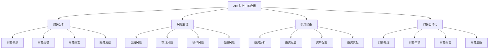

# AI在财务中的应用

## 🎯 学习目标
掌握人工智能在财务管理中的应用，学会运用AI技术提升财务分析、风险管理和决策支持能力。

## 📊 AI财务应用框架

### 应用领域

## 📈 财务分析

### 财务预测
**预测模型**：
- **时间序列**：时间序列预测模型
- **机器学习**：机器学习预测模型
- **深度学习**：深度学习预测模型
- **集成学习**：集成学习预测模型

**预测应用**：
- **收入预测**：收入预测分析
- **成本预测**：成本预测分析
- **现金流预测**：现金流预测分析
- **财务指标预测**：财务指标预测分析

**预测优化**：
- **准确性提升**：预测准确性提升
- **实时性增强**：预测实时性增强
- **适应性改进**：预测适应性改进
- **成本降低**：预测成本降低

### 财务建模
**建模技术**：
- **统计建模**：统计建模技术
- **机器学习**：机器学习建模
- **深度学习**：深度学习建模
- **优化建模**：优化建模技术

**建模应用**：
- **财务模型**：财务预测模型
- **估值模型**：企业估值模型
- **风险模型**：财务风险模型
- **优化模型**：财务优化模型

**建模优化**：
- **模型精度**：模型精度提升
- **模型解释**：模型解释能力
- **模型更新**：模型更新机制
- **模型验证**：模型验证方法

### 财务洞察
**洞察分析**：
- **趋势分析**：财务趋势分析
- **异常检测**：财务异常检测
- **关联分析**：财务关联分析
- **模式识别**：财务模式识别

**洞察应用**：
- **业务洞察**：业务财务洞察
- **风险洞察**：财务风险洞察
- **机会洞察**：财务机会洞察
- **优化洞察**：财务优化洞察

**洞察价值**：
- **决策支持**：决策支持价值
- **风险预警**：风险预警价值
- **机会发现**：机会发现价值
- **效率提升**：效率提升价值

## ⚠️ 风险管理

### 信用风险
**风险评估**：
- **信用评分**：AI信用评分模型
- **违约预测**：违约概率预测
- **信用评级**：智能信用评级
- **风险定价**：信用风险定价

**风险控制**：
- **风险监控**：实时风险监控
- **风险预警**：风险预警系统
- **风险限额**：风险限额管理
- **风险对冲**：风险对冲策略

**风险优化**：
- **风险分散**：风险分散策略
- **风险转移**：风险转移策略
- **风险减轻**：风险减轻策略
- **风险接受**：风险接受策略

### 市场风险
**风险识别**：
- **价格风险**：市场价格风险
- **汇率风险**：汇率波动风险
- **利率风险**：利率变化风险
- **流动性风险**：流动性风险

**风险测量**：
- **VaR模型**：风险价值模型
- **压力测试**：压力测试模型
- **情景分析**：情景分析模型
- **蒙特卡洛**：蒙特卡洛模拟

**风险对冲**：
- **对冲策略**：风险对冲策略
- **对冲工具**：风险对冲工具
- **对冲效果**：对冲效果评估
- **对冲优化**：对冲策略优化

### 操作风险
**风险识别**：
- **流程风险**：操作流程风险
- **系统风险**：操作系统风险
- **人员风险**：操作人员风险
- **外部风险**：外部操作风险

**风险控制**：
- **流程控制**：操作流程控制
- **系统控制**：操作系统控制
- **人员控制**：操作人员控制
- **监控控制**：操作监控控制

**风险改进**：
- **流程改进**：操作流程改进
- **系统改进**：操作系统改进
- **培训改进**：操作培训改进
- **制度改进**：操作制度改进

## 💰 投资决策

### 投资分析
**分析技术**：
- **基本面分析**：AI基本面分析
- **技术分析**：AI技术分析
- **量化分析**：AI量化分析
- **情绪分析**：AI情绪分析

**分析应用**：
- **股票分析**：股票投资分析
- **债券分析**：债券投资分析
- **商品分析**：商品投资分析
- **外汇分析**：外汇投资分析

**分析优化**：
- **分析精度**：分析精度提升
- **分析速度**：分析速度提升
- **分析深度**：分析深度提升
- **分析广度**：分析广度提升

### 投资组合
**组合优化**：
- **资产配置**：智能资产配置
- **风险控制**：组合风险控制
- **收益优化**：组合收益优化
- **再平衡**：智能再平衡

**组合管理**：
- **组合监控**：组合实时监控
- **组合调整**：组合动态调整
- **组合评估**：组合绩效评估
- **组合优化**：组合持续优化

**组合策略**：
- **策略选择**：投资策略选择
- **策略执行**：投资策略执行
- **策略监控**：策略执行监控
- **策略调整**：策略动态调整

### 投资优化
**优化算法**：
- **优化模型**：投资优化模型
- **优化算法**：投资优化算法
- **约束条件**：优化约束条件
- **目标函数**：优化目标函数

**优化应用**：
- **收益优化**：投资收益优化
- **风险优化**：投资风险优化
- **成本优化**：投资成本优化
- **效率优化**：投资效率优化

**优化效果**：
- **收益提升**：投资收益提升
- **风险降低**：投资风险降低
- **成本节约**：投资成本节约
- **效率提高**：投资效率提高

## 🤖 财务自动化

### 财务处理
**自动化处理**：
- **数据录入**：财务数据自动录入
- **数据清洗**：财务数据自动清洗
- **数据验证**：财务数据自动验证
- **数据转换**：财务数据自动转换

**处理技术**：
- **OCR技术**：光学字符识别
- **NLP技术**：自然语言处理
- **RPA技术**：机器人流程自动化
- **API技术**：应用程序接口

**处理效果**：
- **效率提升**：处理效率提升
- **准确性提高**：处理准确性提高
- **成本降低**：处理成本降低
- **质量改善**：处理质量改善

### 财务审核
**智能审核**：
- **异常检测**：财务异常自动检测
- **合规检查**：合规性自动检查
- **风险评估**：风险自动评估
- **审核建议**：审核建议生成

**审核技术**：
- **规则引擎**：审核规则引擎
- **机器学习**：机器学习审核
- **知识图谱**：知识图谱审核
- **专家系统**：专家系统审核

**审核优化**：
- **审核效率**：审核效率提升
- **审核准确性**：审核准确性提升
- **审核覆盖**：审核覆盖范围扩大
- **审核成本**：审核成本降低

### 财务监控
**实时监控**：
- **指标监控**：财务指标实时监控
- **异常监控**：财务异常实时监控
- **趋势监控**：财务趋势实时监控
- **风险监控**：财务风险实时监控

**监控技术**：
- **实时计算**：实时计算技术
- **流处理**：流数据处理技术
- **可视化**：数据可视化技术
- **预警系统**：智能预警系统

**监控效果**：
- **及时性**：监控及时性提升
- **准确性**：监控准确性提升
- **全面性**：监控全面性提升
- **有效性**：监控有效性提升

## 💡 实践应用

### AI财务实施流程
1. **需求分析**：分析财务需求
2. **技术选择**：选择AI技术
3. **系统设计**：设计AI财务系统
4. **系统实施**：实施AI财务系统
5. **效果评估**：评估实施效果

### 案例分析
**选择案例**：如高盛AI财务应用
**分析维度**：
- 财务分析：财务预测、财务建模、财务洞察
- 风险管理：信用风险、市场风险、操作风险
- 投资决策：投资分析、投资组合、投资优化
- 财务自动化：财务处理、财务审核、财务监控

## 🧠 学习要点

### 费曼学习法应用
1. **选择概念**：AI在财务中的应用
2. **简化解释**：用简单语言解释AI财务应用
3. **识别盲点**：找出理解不足的地方
4. **重新学习**：针对盲点深入学习

### 刻意练习要点
- **技术理解**：理解AI财务技术
- **应用能力**：提升AI财务应用能力
- **分析思维**：培养财务分析思维
- **创新实践**：创新财务实践

## 🔗 关联学习

### 前置知识
- [[02-AI在运营中的应用]] - AI运营应用
- [[01-财务报表分析]] - 财务报表分析
- [[01-投资决策]] - 投资决策

### 后续学习
- [[04-AI伦理与治理]] - AI伦理治理
- [[01-数字化转型]] - 数字化转型
- [[01-风险管理]] - 风险管理

### 实践应用
- AI财务系统设计
- AI财务分析应用
- AI财务风险管理
- AI财务决策支持

## 🎯 学习检验

### 理解检验
- [ ] 能够理解AI财务应用原理
- [ ] 能够掌握AI财务技术
- [ ] 能够设计AI财务系统
- [ ] 能够评估AI财务效果

### 应用检验
- [ ] 能够实施AI财务项目
- [ ] 能够应用AI财务分析
- [ ] 能够管理AI财务风险
- [ ] 能够优化AI财务决策

---
**下一步**：[[04-AI伦理与治理]] - AI伦理治理
