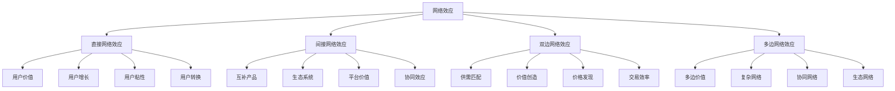

# 网络效应

## 🎯 学习目标
掌握网络效应理论，理解网络效应的形成机制和价值创造，学会运用网络效应构建竞争优势。

## 📊 网络效应框架

### 效应类型

## 🔗 直接网络效应

### 用户价值
**价值来源**：
- **连接价值**：用户间连接价值
- **互动价值**：用户间互动价值
- **内容价值**：用户生成内容价值
- **社交价值**：用户社交价值

**价值增长**：
- **线性增长**：用户价值线性增长
- **指数增长**：用户价值指数增长
- **网络密度**：网络密度影响价值
- **网络结构**：网络结构影响价值

**价值测量**：
- **用户价值**：单个用户价值
- **网络价值**：整体网络价值
- **边际价值**：新增用户边际价值
- **总价值**：网络总价值

### 用户增长
**增长机制**：
- **病毒式增长**：病毒式传播增长
- **口碑传播**：口碑传播增长
- **网络效应**：网络效应驱动增长
- **临界点**：网络效应临界点

**增长策略**：
- **用户获取**：用户获取策略
- **用户激活**：用户激活策略
- **用户留存**：用户留存策略
- **用户推荐**：用户推荐策略

**增长优化**：
- **增长黑客**：增长黑客方法
- **A/B测试**：A/B测试优化
- **数据分析**：数据分析优化
- **产品迭代**：产品迭代优化

### 用户粘性
**粘性来源**：
- **转换成本**：用户转换成本
- **网络价值**：网络价值粘性
- **习惯养成**：用户习惯养成
- **社交关系**：社交关系粘性

**粘性策略**：
- **功能粘性**：产品功能粘性
- **内容粘性**：内容价值粘性
- **社交粘性**：社交关系粘性
- **数据粘性**：数据积累粘性

**粘性提升**：
- **个性化**：个性化服务
- **社区建设**：社区建设
- **激励机制**：激励机制设计
- **价值创造**：持续价值创造

## 🔄 间接网络效应

### 互补产品
**互补关系**：
- **产品互补**：产品间互补关系
- **服务互补**：服务间互补关系
- **技术互补**：技术间互补关系
- **生态互补**：生态间互补关系

**互补价值**：
- **协同价值**：互补产品协同价值
- **组合价值**：产品组合价值
- **创新价值**：互补创新价值
- **网络价值**：互补网络价值

**互补策略**：
- **生态建设**：互补生态建设
- **合作发展**：互补合作发展
- **标准制定**：互补标准制定
- **平台整合**：平台整合策略

### 生态系统
**生态构成**：
- **核心平台**：生态系统核心平台
- **互补产品**：生态系统互补产品
- **服务提供商**：生态系统服务提供商
- **用户群体**：生态系统用户群体

**生态价值**：
- **整体价值**：生态系统整体价值
- **协同价值**：生态协同价值
- **创新价值**：生态创新价值
- **网络价值**：生态网络价值

**生态管理**：
- **生态规划**：生态系统规划
- **生态治理**：生态系统治理
- **生态激励**：生态系统激励
- **生态优化**：生态系统优化

## 🤝 双边网络效应

### 供需匹配
**匹配机制**：
- **算法匹配**：智能算法匹配
- **价格匹配**：价格机制匹配
- **质量匹配**：质量机制匹配
- **偏好匹配**：偏好机制匹配

**匹配效率**：
- **匹配速度**：匹配速度优化
- **匹配精度**：匹配精度优化
- **匹配成本**：匹配成本优化
- **匹配满意度**：匹配满意度优化

**匹配策略**：
- **双边激励**：双边激励策略
- **质量控制**：质量控制策略
- **价格策略**：价格策略制定
- **服务策略**：服务策略制定

### 价值创造
**价值来源**：
- **交易价值**：交易价值创造
- **信息价值**：信息价值创造
- **服务价值**：服务价值创造
- **网络价值**：网络价值创造

**价值分配**：
- **价值分配**：价值分配机制
- **收益分享**：收益分享机制
- **风险分担**：风险分担机制
- **激励分配**：激励分配机制

**价值优化**：
- **价值最大化**：价值最大化策略
- **价值平衡**：价值平衡策略
- **价值创新**：价值创新策略
- **价值持续**：价值持续策略

## 🌐 多边网络效应

### 多边价值
**价值类型**：
- **双边价值**：双边网络价值
- **三边价值**：三边网络价值
- **多边价值**：多边网络价值
- **生态价值**：生态网络价值

**价值机制**：
- **协同效应**：多边协同效应
- **规模效应**：多边规模效应
- **范围效应**：多边范围效应
- **网络效应**：多边网络效应

**价值管理**：
- **价值识别**：多边价值识别
- **价值测量**：多边价值测量
- **价值优化**：多边价值优化
- **价值分配**：多边价值分配

### 复杂网络
**网络特征**：
- **网络结构**：复杂网络结构
- **网络动态**：网络动态变化
- **网络演化**：网络演化过程
- **网络效应**：网络效应机制

**网络分析**：
- **网络拓扑**：网络拓扑分析
- **网络中心性**：网络中心性分析
- **网络聚类**：网络聚类分析
- **网络传播**：网络传播分析

**网络优化**：
- **网络设计**：网络结构设计
- **网络控制**：网络动态控制
- **网络演化**：网络演化引导
- **网络效应**：网络效应优化

## 💡 实践应用

### 网络效应构建流程
1. **网络识别**：识别网络效应机会
2. **网络设计**：设计网络结构
3. **网络建设**：建设网络平台
4. **网络运营**：运营网络生态
5. **网络优化**：优化网络效应

### 案例分析
**选择案例**：如微信网络效应
**分析维度**：
- 直接网络效应：用户价值、用户增长、用户粘性
- 间接网络效应：互补产品、生态系统
- 双边网络效应：供需匹配、价值创造
- 多边网络效应：多边价值、复杂网络

## 🧠 学习要点

### 费曼学习法应用
1. **选择概念**：网络效应
2. **简化解释**：用简单语言解释网络效应
3. **识别盲点**：找出理解不足的地方
4. **重新学习**：针对盲点深入学习

### 刻意练习要点
- **理论理解**：理解网络效应理论
- **机制分析**：分析网络效应机制
- **策略制定**：制定网络效应策略
- **实践应用**：实践网络效应应用

## 🔗 关联学习

### 前置知识
- [[01-平台商业模式]] - 平台商业模式
- [[01-商业模式画布]] - 商业模式画布
- [[01-战略管理概论]] - 战略管理

### 后续学习
- [[03-平台治理]] - 平台治理
- [[04-平台竞争策略]] - 平台竞争策略
- [[01-数字化转型]] - 数字化转型

### 实践应用
- 网络效应平台设计
- 网络效应策略制定
- 网络效应价值创造
- 网络效应竞争优势构建

## 🎯 学习检验

### 理解检验
- [ ] 能够理解网络效应理论
- [ ] 能够分析网络效应机制
- [ ] 能够识别网络效应机会
- [ ] 能够设计网络效应策略

### 应用检验
- [ ] 能够构建网络效应平台
- [ ] 能够运营网络效应生态
- [ ] 能够优化网络效应价值
- [ ] 能够创造网络效应竞争优势

---
**下一步**：[[03-平台治理]] - 平台治理
