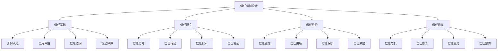

# 信任机制设计

## 🎯 学习目标
掌握信任机制设计理论和方法，学会构建有效的信任体系，提升共享经济平台的信任度和用户参与度。

## 📊 信任机制设计框架

### 机制要素

## 🏗️ 信任基础

### 身份认证
**认证方式**：
- **实名认证**：真实身份认证
- **手机认证**：手机号码认证
- **邮箱认证**：邮箱地址认证
- **社交认证**：社交账号认证

**认证技术**：
- **生物识别**：指纹、面部识别
- **证件识别**：身份证、驾驶证识别
- **活体检测**：活体检测技术
- **多因子认证**：多因子认证技术

**认证管理**：
- **认证流程**：身份认证流程
- **认证标准**：认证标准制定
- **认证监控**：认证过程监控
- **认证更新**：认证信息更新

### 信用评估
**评估维度**：
- **历史行为**：历史交易行为
- **信用记录**：信用历史记录
- **社交关系**：社交网络关系
- **财务状况**：财务状况评估

**评估方法**：
- **评分模型**：信用评分模型
- **机器学习**：机器学习评估
- **专家判断**：专家判断评估
- **综合评估**：综合评估方法

**评估应用**：
- **准入控制**：用户准入控制
- **风险定价**：风险定价应用
- **服务分级**：服务等级分级
- **激励措施**：激励措施制定

### 信息透明
**透明内容**：
- **用户信息**：用户基本信息
- **交易信息**：交易过程信息
- **评价信息**：用户评价信息
- **平台信息**：平台运营信息

**透明方式**：
- **信息公开**：信息主动公开
- **信息查询**：信息查询服务
- **信息验证**：信息验证机制
- **信息更新**：信息及时更新

**透明管理**：
- **透明标准**：信息透明标准
- **透明监控**：透明性监控
- **透明改进**：透明性改进
- **透明保护**：隐私保护平衡

### 安全保障
**安全措施**：
- **数据安全**：数据安全保护
- **交易安全**：交易安全保护
- **隐私保护**：隐私信息保护
- **系统安全**：系统安全保护

**安全技术**：
- **加密技术**：数据加密技术
- **防火墙**：网络安全防护
- **入侵检测**：入侵检测系统
- **安全审计**：安全审计机制

**安全管理**：
- **安全策略**：安全策略制定
- **安全监控**：安全事件监控
- **安全响应**：安全事件响应
- **安全改进**：安全措施改进

## 🤝 信任建立

### 信任信号
**信号类型**：
- **身份信号**：身份认证信号
- **能力信号**：能力证明信号
- **信誉信号**：信誉评价信号
- **承诺信号**：承诺履行信号

**信号设计**：
- **信号强度**：信号强度设计
- **信号可信度**：信号可信度设计
- **信号成本**：信号成本设计
- **信号效果**：信号效果设计

**信号应用**：
- **信号发送**：信任信号发送
- **信号接收**：信任信号接收
- **信号解读**：信任信号解读
- **信号验证**：信任信号验证

### 信任传递
**传递机制**：
- **直接传递**：直接信任传递
- **间接传递**：间接信任传递
- **网络传递**：网络信任传递
- **平台传递**：平台信任传递

**传递方式**：
- **口碑传递**：口碑信任传递
- **评价传递**：评价信任传递
- **推荐传递**：推荐信任传递
- **认证传递**：认证信任传递

**传递管理**：
- **传递监控**：信任传递监控
- **传递优化**：信任传递优化
- **传递激励**：信任传递激励
- **传递保护**：信任传递保护

### 信任积累
**积累机制**：
- **行为积累**：行为信任积累
- **时间积累**：时间信任积累
- **频率积累**：频率信任积累
- **质量积累**：质量信任积累

**积累策略**：
- **正向积累**：正向行为积累
- **负向积累**：负向行为积累
- **平衡积累**：平衡信任积累
- **动态积累**：动态信任积累

**积累管理**：
- **积累监控**：信任积累监控
- **积累分析**：信任积累分析
- **积累优化**：信任积累优化
- **积累保护**：信任积累保护

### 信任验证
**验证方式**：
- **行为验证**：行为一致性验证
- **结果验证**：结果符合性验证
- **第三方验证**：第三方验证
- **平台验证**：平台验证

**验证技术**：
- **数据验证**：数据真实性验证
- **行为分析**：行为模式分析
- **异常检测**：异常行为检测
- **风险评估**：风险等级评估

**验证管理**：
- **验证标准**：验证标准制定
- **验证流程**：验证流程管理
- **验证监控**：验证过程监控
- **验证改进**：验证方法改进

## 🛡️ 信任维护

### 信任监控
**监控内容**：
- **行为监控**：用户行为监控
- **交易监控**：交易过程监控
- **评价监控**：评价真实性监控
- **风险监控**：风险事件监控

**监控技术**：
- **实时监控**：实时监控技术
- **数据分析**：数据分析技术
- **异常检测**：异常检测技术
- **预警系统**：预警系统技术

**监控管理**：
- **监控策略**：监控策略制定
- **监控实施**：监控措施实施
- **监控分析**：监控数据分析
- **监控改进**：监控方法改进

### 信任更新
**更新机制**：
- **定期更新**：定期信任更新
- **事件更新**：事件触发更新
- **行为更新**：行为影响更新
- **评价更新**：评价反馈更新

**更新策略**：
- **权重调整**：信任权重调整
- **算法优化**：信任算法优化
- **标准调整**：信任标准调整
- **机制改进**：信任机制改进

**更新管理**：
- **更新策略**：更新策略制定
- **更新实施**：更新措施实施
- **更新监控**：更新效果监控
- **更新优化**：更新方法优化

### 信任保护
**保护措施**：
- **信息保护**：信任信息保护
- **隐私保护**：用户隐私保护
- **安全保护**：系统安全保护
- **法律保护**：法律权益保护

**保护技术**：
- **加密技术**：数据加密技术
- **访问控制**：访问权限控制
- **安全审计**：安全审计技术
- **备份恢复**：数据备份恢复

**保护管理**：
- **保护策略**：保护策略制定
- **保护实施**：保护措施实施
- **保护监控**：保护效果监控
- **保护改进**：保护方法改进

### 信任激励
**激励方式**：
- **正向激励**：正向行为激励
- **负向激励**：负向行为激励
- **等级激励**：信任等级激励
- **特权激励**：特殊权限激励

**激励措施**：
- **经济激励**：经济奖励激励
- **声誉激励**：声誉提升激励
- **服务激励**：优质服务激励
- **机会激励**：优先机会激励

**激励管理**：
- **激励策略**：激励策略制定
- **激励实施**：激励措施实施
- **激励监控**：激励效果监控
- **激励优化**：激励方法优化

## 🔧 信任修复

### 信任危机
**危机类型**：
- **个人危机**：个人信任危机
- **平台危机**：平台信任危机
- **行业危机**：行业信任危机
- **社会危机**：社会信任危机

**危机原因**：
- **行为失范**：用户行为失范
- **信息虚假**：信息虚假传播
- **服务问题**：服务质量问题
- **安全事件**：安全事件发生

**危机影响**：
- **用户流失**：用户信任流失
- **平台声誉**：平台声誉受损
- **行业影响**：行业整体影响
- **社会影响**：社会信任影响

### 信任修复
**修复策略**：
- **承认错误**：承认问题错误
- **承担责任**：承担相应责任
- **改进措施**：实施改进措施
- **重建信任**：重建信任关系

**修复方法**：
- **公开道歉**：公开道歉声明
- **补偿措施**：损失补偿措施
- **制度改进**：制度机制改进
- **服务提升**：服务质量提升

**修复管理**：
- **修复策略**：修复策略制定
- **修复实施**：修复措施实施
- **修复监控**：修复效果监控
- **修复评估**：修复效果评估

### 信任重建
**重建策略**：
- **重新认证**：重新身份认证
- **行为证明**：良好行为证明
- **时间考验**：时间考验信任
- **第三方证明**：第三方证明

**重建方法**：
- **渐进重建**：渐进式信任重建
- **快速重建**：快速信任重建
- **全面重建**：全面信任重建
- **局部重建**：局部信任重建

**重建管理**：
- **重建规划**：重建规划制定
- **重建实施**：重建措施实施
- **重建监控**：重建过程监控
- **重建评估**：重建效果评估

### 信任预防
**预防策略**：
- **风险预防**：风险事件预防
- **教育预防**：用户教育预防
- **制度预防**：制度机制预防
- **技术预防**：技术手段预防

**预防措施**：
- **风险识别**：风险识别预警
- **教育宣传**：信任教育宣传
- **制度完善**：制度机制完善
- **技术升级**：技术手段升级

**预防管理**：
- **预防策略**：预防策略制定
- **预防实施**：预防措施实施
- **预防监控**：预防效果监控
- **预防改进**：预防方法改进

## 💡 实践应用

### 信任机制设计流程
1. **信任分析**：分析信任需求
2. **机制设计**：设计信任机制
3. **技术实现**：实现信任技术
4. **机制测试**：测试信任机制
5. **机制优化**：优化信任机制

### 案例分析
**选择案例**：如滴滴信任机制设计
**分析维度**：
- 信任基础：身份认证、信用评估、信息透明、安全保障
- 信任建立：信任信号、信任传递、信任积累、信任验证
- 信任维护：信任监控、信任更新、信任保护、信任激励
- 信任修复：信任危机、信任修复、信任重建、信任预防

## 🧠 学习要点

### 费曼学习法应用
1. **选择概念**：信任机制设计
2. **简化解释**：用简单语言解释信任机制设计
3. **识别盲点**：找出理解不足的地方
4. **重新学习**：针对盲点深入学习

### 刻意练习要点
- **理论理解**：理解信任机制理论
- **设计能力**：提升信任机制设计能力
- **技术应用**：提升信任技术应用能力
- **实践能力**：提升信任机制实践能力

## 🔗 关联学习

### 前置知识
- [[01-共享经济模式]] - 共享经济模式
- [[01-平台商业模式]] - 平台商业模式
- [[02-网络效应]] - 网络效应

### 后续学习
- [[03-监管与合规]] - 监管与合规
- [[04-可持续发展]] - 可持续发展
- [[01-商业伦理基础]] - 商业伦理基础

### 实践应用
- 信任机制设计
- 信任体系建设
- 信任技术应用
- 信任管理实践

## 🎯 学习检验

### 理解检验
- [ ] 能够理解信任机制理论
- [ ] 能够设计信任机制
- [ ] 能够应用信任技术
- [ ] 能够管理信任体系

### 应用检验
- [ ] 能够设计具体信任机制
- [ ] 能够建设信任体系
- [ ] 能够应用信任技术
- [ ] 能够优化信任管理

---
**下一步**：[[03-监管与合规]] - 监管与合规
